# Battle_Arena (미완)

|목록|내용|
|:--:|:--:|
|작업 기간|2021.07.26 ~ 2022.01.30 (실기간 2달)|
|인력 구성|1인 개발|
|프로젝트 목적|포트폴리오 & 기술 향상|
|프로젝트 내용|MMORPG 형식의 게임을 구상하고 시작했으나, 거대한 틀은 잡지 못하고 기능들만 구현|
|주요 업무|기획 및 개발|
|사용언어|C++|
|개발 환경|Visual Studio Code, Visual Studio 2019, Unreal Engine 4.26.2|
|참고 자료|Unreal Docs, Google|
|개발일지|[날짜별 기록이 남긴 일지](https://github.com/Goaway-1/Battle_Arena/blob/master/DevLog.md)|


> ### **<h3>목차</h3>**
1. [동영상 및 개발 일지](#동영상-및-개발-일지)
2. [프로젝트 설명](#프로젝트-설명)
3. [프로젝트 시스템 구조](#프로젝트-시스템-구조)
4. [주요 기능](#주요-기능)
5. [개선점](#개선점)

> ### **<h3>동영상 및 개발 일지</h3>**
- [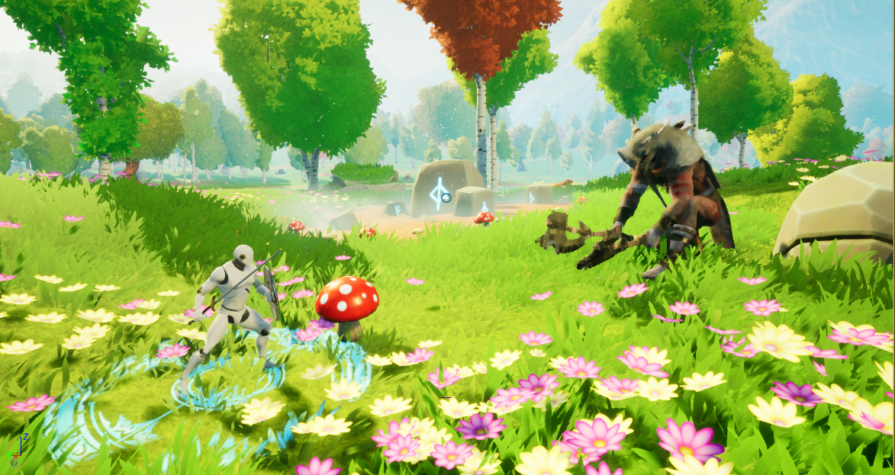](https://youtube.com)

- ## [개발일기](https://github.com/Goaway-1/Battle_Arena/blob/master/DevLog.md)

> ### **<h3>프로젝트 설명</h3>**
- MMORPG형식의 게임으로 초기 다크소울 느낌의 소울라이크 게임을 원했으나, 밸런스 등은 해결하지 않고 기능을 중심적으로 개발하는데 노력
- 게임의 재미와 기능 모두 완벽하게 하고 싶었지만 기능, 전투 시스템에만 중점으로 개발
- 무기를 구하고 몬스터들을 잡아 최종 보스를 처치하면 종료

> ### **<h3>프로젝트 시스템 구조</h3>**
- ※ 화살표는 __상속을__ 뜻하며, 점선은 클래스를 해당 클래스에 내에서 __인스턴스화__ 했다는 것을 의미
- 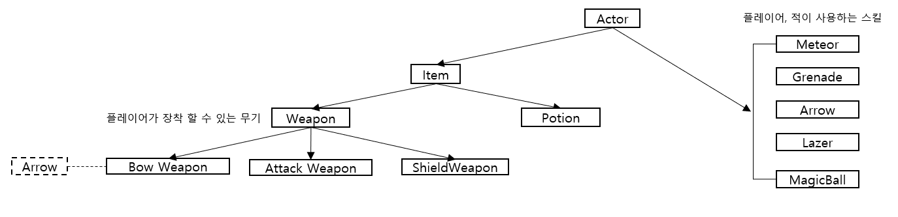
  
  - Item클래스는 플레이어와 상호작용하며, Potion은 효과를 부여하고 Weapon은 장착하여 사용
  - Meteor, Grenade등과 같은 클래스들은 플레이어나 적이 SkillFunction클래스에서 인스턴스화하여 사용
- 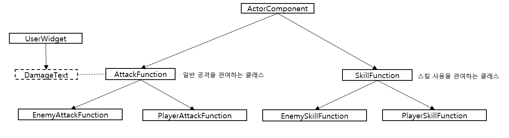
  
  - 플레이어와 적이 사용하는 Attack/SkillFunction클래스로 컴포넌트로 생성하여 사용
  - AttackFunction클래스는 공격하는 2가지 방식 중 외적을 사용하여 공격 하는 방식
  - SkillFunction클래스는 Meteor, Lazer등과 같이 클래스들을 인스턴스화하여 사용
- 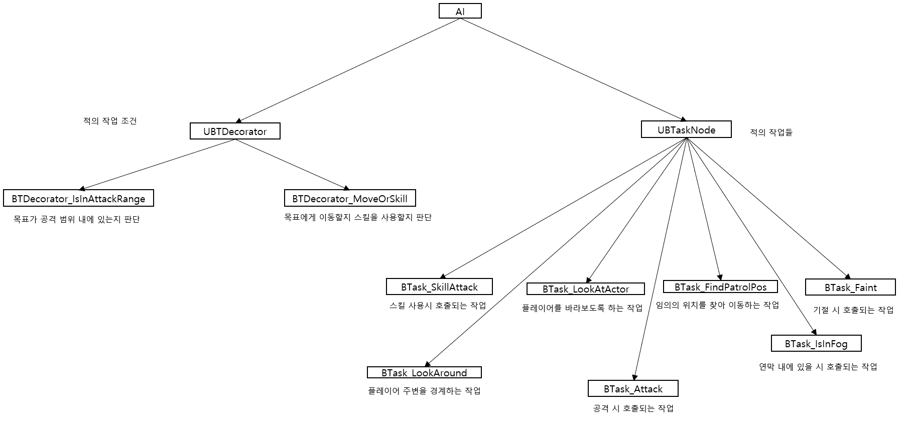

  - 비헤이비어트리(BehaviorTree)를 구성할때 사용하는 노드들로 UBTDecorator는 조건을 판단하고, UBTaskNode는 실제로 행동하는 노드
- 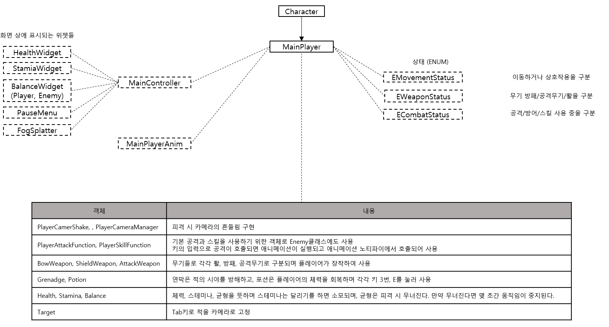
  
  - Character를 상속받은 클래스로 플레이어를 뜻하며 열거형(ENUM)을 사용하여 상태를 나타냄
  - Controller는 화면상에 표시하는 위젯들을 관리하고, Anim은 조건(속도, 방향)에 따른 애니메이션을 관리
- 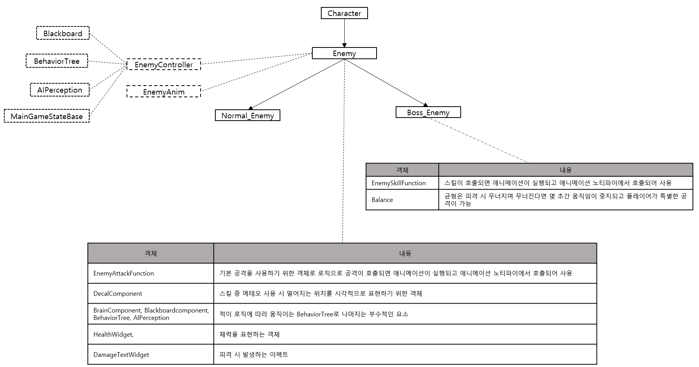

  - Character를 상속받은 클래스로 적을 뜻하며 이는 다시 Normal_Enemy와 Boss_Enemy로 구분
    - 가장 큰 차이점은 SkillFunction, Balance의 유무
  - 적의 EnemyController에서는 비헤이비어트리(BehaviorTree)와 BlackBoard, AIPerception..등을 사용하여 로직 구성
  - 나머지는 플레이어와 비슷하게 구성

TurnInPlace, 무기장착 로직, 공격 판정2가지, 콤보, 방패, SkillFunction..
> ### **<h3>주요기능</h3>**
## __1. TurnInPlace__
  - 
  - 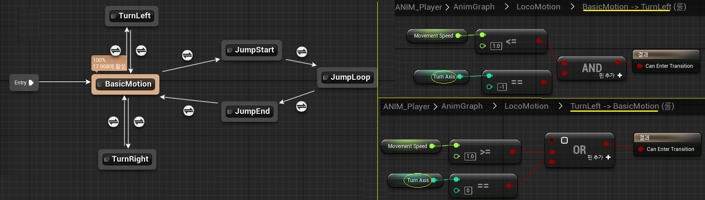
  - 설명 : 이동 속도와 카메라 회전 방향에 따른 플레이어의 회전으로
### __작업 내용__
- __메서드명__ : TurnInPlace(float value)
  - 설명 : 움직임이 없이 제자리에서 카메라를 이동했을때 플레이어가 자연스럽게 회전하는 애니메이션을 사용하는 메서드
  - 플레이어 컨트롤러에서 GetPlayerViewPoint()메서드를 사용하여 카메라의 Location, Rotation을 받아와 캐릭터의 Rotation과의 차이 값을 도출
  - 그 값이 0.5도 이내라면 회전하지 않고, 45도 이상 차이가 나고 속도가 없다면 TurnAxis의 값을 value에 따라 1, -1로 지정
  - 이때 value는 회전 방향 구분하며 Left(-1)/Idle(0)/Right(1)로 지정
  - TurnAxis의 값이 변경됨에 따라 MainPlayerAnim에서 애니메이션 실행 (위 그래프에서 확인)

- __메서드명__ : TurnMove()
  - 설명 : 플레이어가 움직일때 즉시 이동방향으로 회전하도록 하는 메서드
  - CharacterMovementComponent의 OrientRotationToMovement를 거짓으로 하여 캐릭터의 회전을 움직임과 동일하게 구현

### __호출 방식__
  - 마우스 좌우 이동 시 Turn()메서드가 실행되는데, 캐릭터 이동속도가 0.1이하면 TurnInPlace()메서드가 그렇지 않고 이동 중이라면 TurnMove()메서드 실행

### __참조 코드__

  <details><summary>Cpp File</summary> 

  ```c++
  //MainPlayer.cpp
  void AMainPlayer::Turn(float value) {
    if (GetMovementStatus() == EMovementStatus::EMS_Faint) return;
    AddControllerYawInput(value * CameraSpeed * GetWorld()->GetDeltaSeconds());

    /** 이동속도에 따른 메서드 실행 */
    if (GetVelocity().Size() <= 0.1f) TurnInPlace(value);
    else TurnMove();
  }
  void AMainPlayer::TurnInPlace(float value) {
    FVector ViewPoint;
    FRotator ViewRotation;
    float calculationY;
    
    PlayerController->GetPlayerViewPoint(ViewPoint, ViewRotation);
    calculationY = UKismetMathLibrary::Abs(ViewRotation.Yaw - GetActorRotation().Yaw);

    /** 카메라와 액터 사이의 회전 차이에 따른 구분 */
    if (calculationY <= 0.5f) {
      GetCharacterMovement()->bUseControllerDesiredRotation = false;
      TurnAxis = 0;
    }
    else if (calculationY >= 45.f || (DirX != 0 || DirY != 0)) {
      GetCharacterMovement()->bUseControllerDesiredRotation = true;
      if (GetVelocity().Size() == 0) {
        if (value > 0.1f) TurnAxis = 1;
        else if (value < -0.1f) TurnAxis = -1;
      }
    }
  }
  void AMainPlayer::TurnMove() {
    GetCharacterMovement()->bOrientRotationToMovement = false;	
    FRotator ViewRotation = CameraManager->GetCameraRotation();
    ViewRotation.Pitch = ViewRotation.Roll = 0;
    SetActorRotation(ViewRotation);
  }
  ```
  </details>
  <details><summary>Header File</summary> 

  ```c++
  //MainPlayer.h
  private:
    //애니메이션 실행을 위한 값
  	int TurnAxis = 0;	
  public:
    void Turn(float value);
    void TurnInPlace(float value);
    void TurnMove();
    FORCEINLINE int GetTurnAxis() { return TurnAxis; }
  ```
  </details>

---
## __2. 플레이어의 이동__
  - 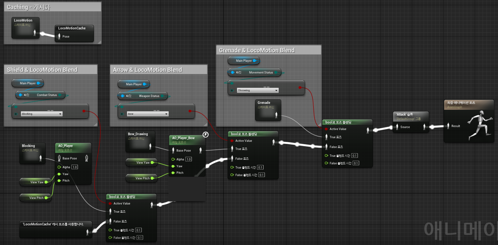
  - 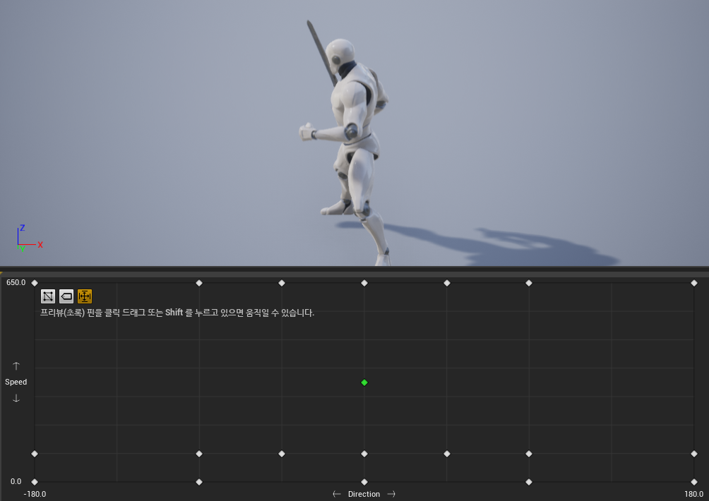
  - 설명 : 애니메이션을 관리하는 MainPlayerAnim클래스의 구조와 상하체를 구분하는 블랜딩
### __작업 내용__
  - BlendSpace를 사용하여 Axis Settings의 가로, 세로축을 각각 Dircection(방향)과 - Speed(속도)로 지정하여 Axis에 따라 애니메이션를 자연스럽게 변화
  - 이외의 점프나 Combat/Weapon/MovementStatus에 따른 애니메이션은 블랜드(Blennd Poses by bool : bool에 따른 구분)와 스테이트머신을 사용하여 위 그림과 같이 구현.
  - 블랜드는 상체와 하체를 구분하여 다양한 연출을 가능하도록 도와줌

---
## __3. 아이템 (무기, 포션)과의 상호 작용__
  - 
  - 설명 : 플레이어가 아이템과 상호작용하는 로직으로 Item클래스에 Overlap로직 구현
### __작업 내용__
- __클래스명__ : MainPlayer클래스의 De/ActiveInteraction(), ItemDrop/Equip()메서드
  - 설명 : 무기나 포션에 상호작용하는 로직
  - 아이템이 겹쳐진다면 MainPlayer에 __ActiveOverlappingItem을__ 해당 아이템으로 설정
  - 'E'키를 눌러 ActiveOverlappingItem이 null이 아니라면 ActiveInteraction(), ItemEquip()를 호출하며 해당 아이템의 ItemType이 EIT_Weapon(무기)일 경우 CurrentWeapon에 Weapon을 어태치하여 장착하고, EIT_Item(아이템)일 경우 사용
  - 'Q'키를 눌러 ItemDrop()을 호출하며 CurrentWeapon을 DetachFromActor()를 사용하여 사용자로 부터 제거, 기존에 무기가 존재할때 장착 시 자동으로 ItemDrop()호출

- __클래스명__ : Weapon클래스
  - 설명 : 플레이어에게 장착되어 사용
  - Weapon클래스에서는 EWeaponPos라는 UENUM클래스로 무기의 종류를 구분하며, Weapon을 상속받은 AttackWeapon클래스에서는 EWeaponName라는 ENUM클래스로 근접 무기의 종류를 구분
  - Weapon에 CollisionVolume을 설정하여 Overlap 된다면 MainPlayer에 ActiveOverlappingItem을 해당 Weapon으로 설정
  - Equip()메서드에서는 기존 무기가 있다면 해제하고 WeaponPos에 따라서 Attach하고 무기의 특성인 AttackRange,Damage...등과 같은 것을 플레이어에게 설정

- __클래스명__ : Potion클래스
  - 설명 : 플레이어와 상호작용 시 효과를 부여하는데, UseItem(float &Health)메서드를 통해 CurrentHealth를 증가 (주소로 받아 처리)

### __호출 방식__
  - 사용자와 Overlap되면 사용자가 E,Q키를 사용하여 상호작용

### __참조 코드__

  <details><summary>Cpp File</summary> 

  ```c++
  //MainPlayer.cpp
  void AMainPlayer::ActiveInteraction() {
    if(!IsCanMove()) return;

    /** Active SpecialAttack || Active Item, Weapon */
    float Inner = this->GetDotProductTo(BalanceTarget);
    if (Inner > 0.3f && bCanSpecialAttack && !bAttacking) ActiveSpecialAttack();
    else if (ActiveOverlappingItem != nullptr) ItemEquip();
  }
  void AMainPlayer::DeactiveInteraction() {
    if (GetWeaponStatus() != EWeaponStatus::EWS_Normal) ItemDrop();
  }
  void AMainPlayer::ItemEquip() {	
    /** 겹처진 아이템의 타입이 무기인 경우 무기 장착 */
    if (ActiveOverlappingItem->GetItemType() == EItemType::EIT_Weapon) {
      AWeapon* CurWeapon = Cast<AWeapon>(ActiveOverlappingItem);
      CurWeapon->Equip(this);

      AAttackWeapon* ACurWeapon = Cast<AAttackWeapon>(CurWeapon);
      if (ACurWeapon) ACurWeapon->SetAttackInit(PlayerController, this, PlayerDamageType);
    }
    /** 아이템인 경우 사용 */
    else if (ActiveOverlappingItem->GetItemType() == EItemType::EIT_Item) {
      APotion* Potion = Cast<APotion>(ActiveOverlappingItem);
      Potion->UseItem(CurrentHealth);
      SetHealthRatio();
    }
    SetActiveOverlappingItem(nullptr);
  }
  void AMainPlayer::ItemDrop() {
    /** 무기가 존재한다면 해제 */
    if (CurrentAttackWeapon != nullptr) {	
      CurrentAttackWeapon->UnEquip();
      CurrentAttackWeapon = nullptr;
      AttackDamage = DefaultDamage;
      AttackRange = DefaultAttackRange;
    }
    /** 방패가 존재한다면 해제 */
    else if (CurrentShieldWeapon != nullptr) {	
      CurrentShieldWeapon->UnEquip();
      CurrentShieldWeapon = nullptr;
    }
    if (CurrentAttackWeapon == nullptr) SetWeaponStatus(EWeaponStatus::EWS_Normal);
  }
  ```
  ```c++
  //Item.cpp
  void AItem::OnOverlapBegin(UPrimitiveComponent* OverlappedComponent, AActor* OtherActor, UPrimitiveComponent* OtherComp, int32 OtherBodyIndex, bool bFromSweep, const FHitResult& SweepResult) {
    if (OverlapParticle) UGameplayStatics::SpawnEmitterAtLocation(GetWorld(), OverlapParticle, GetActorLocation(), FRotator(0.f), true);
    if (OtherActor) {
      AMainPlayer* Player = Cast<AMainPlayer>(OtherActor);

      /** MainPlayer의 ActiveOverlappingItem을 this로 지정 */
      if (Player) Player->SetActiveOverlappingItem(this);
    }
  }
  void AItem::OnOverlapEnd(UPrimitiveComponent* OverlappedComponent, AActor* OtherActor, UPrimitiveComponent* OtherComp, int32 OtherBodyIndex) {
    if (OtherActor) {
      AMainPlayer* Player = Cast<AMainPlayer>(OtherActor);
      if (Player) Player->SetActiveOverlappingItem(nullptr);
    }
  }
  ```
  ```c++
  //AttackWeapon.cpp
  void AAttackWeapon::Equip(class AMainPlayer* Player) {
    Super::Equip(Player);

    if (Player) {
      if ((GetWeaponPos() == EWeaponPos::EWP_Shield && Player->GetShieldCurrentWeapon() != nullptr) || (GetWeaponPos() == EWeaponPos::EWP_Melee && Player->GetAttackCurrentWeapon() != nullptr)) {
        Player->ItemDrop();
      }

      /** WeaponPos에 따른 Attach */
      const USkeletalMeshSocket* HandSocket = nullptr;
      if (GetWeaponPos() == EWeaponPos::EWP_Melee) HandSocket = Player->GetMesh()->GetSocketByName("MeleeWeapon");
      else if (GetWeaponPos() == EWeaponPos::EWP_Shield) HandSocket = Player->GetMesh()->GetSocketByName("ShieldWeapon");
      else if (GetWeaponPos() == EWeaponPos::EWP_Bow) HandSocket = Player->GetMesh()->GetSocketByName("BowWeapon");

      if (HandSocket) {
        HandSocket->AttachActor(this, Player->GetMesh());
        Player->SetWeaponStatus(EWeaponStatus::EWS_Melee);

        /** InitalSetting */
        Player->SetAttackRange(GetAttackRange());		
        Player->SetAttackCurrentWeapon(this);
        Player->SetAttackDamage(GetDamage());	

        CollisionVolume->SetCollisionEnabled(ECollisionEnabled::NoCollision);
      }
    }
  }
  ```
  ```c++
  //Potion.cpp
  void APotion::UseItem(float &Health) {
    Health += 10.f;
    if (Health >= 100.f) Health = 100.f;
    if (UsedSound != nullptr) UGameplayStatics::PlaySound2D(this, UsedSound);
    if (OverlapParticle) UGameplayStatics::SpawnEmitterAtLocation(GetWorld(), OverlapParticle, GetActorLocation(), FRotator(0.f), true);
    Destroy();
  }
  ```
  </details>
  <details><summary>Header File</summary> 

  ```c++
  //MainPlayer.h
  private:
  	UPROPERTY(VisibleAnywhere, Category = "Active | Weapon")
    class AItem* ActiveOverlappingItem;   /** 현재 겹쳐진 아이템 */

    UPROPERTY(VisibleAnywhere, Category = "Active | Weapon")
    class AShieldWeapon* CurrentShieldWeapon;

    UPROPERTY(VisibleAnywhere, Category = "Active | Weapon")
    class AWeapon* CurrentAttackWeapon;
  public:
	  FORCEINLINE void SetActiveOverlappingItem(AItem* item) { ActiveOverlappingItem = item; }
  	FORCEINLINE AShieldWeapon* GetShieldCurrentWeapon() { return CurrentShieldWeapon; }
	  FORCEINLINE AWeapon* GetAttackCurrentWeapon() { return CurrentAttackWeapon; }
    void ItemEquip();
	  void ItemDrop();
  ```
  ```c++
  //Item.h
  /** 아이템의 타입 */
  UENUM(BlueprintType) 
  enum class EItemType : uint8 {
    EIT_Normal		UMETA(DisplayName = "Normal"),
    EIT_Weapon		UMETA(DisplayName = "Weapon"),
    EIT_Item		UMETA(DisplayName = "Item"),

    EIT_Default		UMETA(DisplayName = "Default")
  };

  /** 아이템의 장착 여부 */
  UENUM(BlueprintType)
  enum class EItemState : uint8
  {
    EIS_Normal	UMETA(DisplayName = "Normal"),
    EIS_Ground  UMETA(DisplayName = "Ground"),
    EIS_Equip	UMETA(DisplayName = "Equip"),

    EIS_Default	UMETA(DisplayName = "Default")
  };
  public:
  	UFUNCTION()
    virtual void OnOverlapBegin(UPrimitiveComponent* OverlappedComponent, AActor* OtherActor, UPrimitiveComponent* OtherComp, int32 OtherBodyIndex, bool bFromSweep, const FHitResult& SweepResult);

    UFUNCTION()
    virtual void OnOverlapEnd(UPrimitiveComponent* OverlappedComponent, AActor* OtherActor, UPrimitiveComponent* OtherComp, int32 OtherBodyIndex);
  ```
  ```c++
  //AttackWeapon.h
  /** 무기의 종류 */
  UENUM(BlueprintType)
  enum class EWeaponPos : uint8 {
    EWP_Empty		UMETA(DIsplayName = "Empty"),
    EWP_Shield		UMETA(DisplayName = "Shield"),
    EWP_Melee		UMETA(DisplayName = "Melee"),
    EWP_Bow			UMETA(DisplayName = "Bow"),
    EWP_Full		UMETA(DisplayName = "Full"),

    EWP_Default		UMETA(DisplayName = "Default")
  };

  private:
    UPROPERTY(EditAnywhere, Category = "Weapon", Meta = (AllowPrivateAccess = true))
    float AttackRange;

    UPROPERTY(EditAnyWhere, Category = "Weapon", Meta = (AllowPrivateAccess = true))
    float Damage;
  public:
	  virtual void Equip(class AMainPlayer* Player) override;
    FORCEINLINE float GetAttackRange() { return AttackRange; }
	  FORCEINLINE float GetDamage() { return Damage; }
  ```
  ```c++
  //Potion.h
  public:
	  void UseItem(float &Health);
  ```
  </details>

---
## __4. 공격판정 (무기)__
  - 
  - 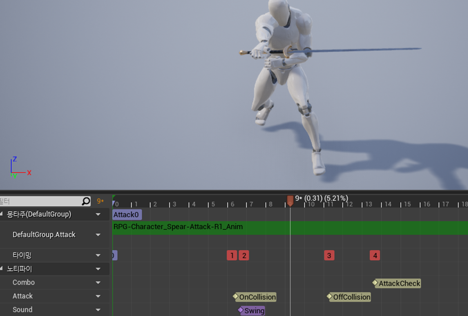
  - 설명 : 플레이어가 무기를 장착하고 하는 무기의 콜리전을 활용한 공격 판정 방법
### __작업 내용__
- __클래스명__ : AttackWeapon클래스
  - 설명 : AttackWeapon의 CapsuleComponent 콜리전을 On/Off하는 방식으로 Overlap되면 피격 판정
  - On/OffWeaponCollision()메서드를 애니메이션 노티파이에서 호출하여 Weapon의 콜리전을 비/활성화 
  - 필요한 정보를 무기를 착용할때 ItemEquip()메서드에서 SetAttackInit()메서드에서 넘겨 사용
  - 무기를 한번 휘두를 때 중첩되어 2번 이상 피해를 받는 오류가 발생할 수 있기에 공격 시 “공격자의 이름 + 무기의 이름 + 카운트 번호”로 CurrentAttack을 설정. 
  - AttakCnt를 매 차례 증가하여 위 로직에 도움이 되도록 설정 (MainPlayer의 Get/SetAttackCnt()메서드)
    ```c++
    void AMainPlayer::SetAttackCnt() {
      AttackCnt++;
      if(AttackCnt > 10) AttackCnt = 0;
    }
    ```
  - Enemy클래스의 CurrentAttack이름과 LastAttack이름을 비교하여 다를 시 TakeDamage()메서드 실행

### __호출 방식__
  - 사용자가 무기를 장착하고 마우스 왼쪽 버튼 클릭 시 호출 시 LMBDown()메서드 호출

### __참조 코드__

  <details><summary>Cpp File</summary> 

  ```c++
  //AttackWeapon.cpp
  /** AttackCollision의 Active여부 */
  void AAttackWeapon::SetAttackCollision(bool value) {	
    if(!value) AttackCollision->SetCollisionEnabled(ECollisionEnabled::NoCollision);
    else AttackCollision->SetCollisionEnabled(ECollisionEnabled::QueryOnly);
  }
  void AAttackWeapon::OnAttackOverlap(UPrimitiveComponent* OverlappedComponent, AActor* OtherActor, UPrimitiveComponent* OtherComp, int32 OtherBodyIndex, bool bFromSweep, const FHitResult& SweepResult) {
    if (OtherActor) {
      AEnemy* Enemy = Cast<AEnemy>(OtherActor);
      AMainPlayer* Player = Cast<AMainPlayer>(AtOwner);
      ABoss_Enemy* BEnemy = Cast<ABoss_Enemy>(Enemy);
      if (BEnemy) Player->GetPlayerController()->SetBalanceTarget(BEnemy);  //보스인 경우 Balance를 띄움
      if (Enemy) {  /** 적의 CurrentAttack정보를 갱신하고 ApplyDamage()메서드로 피격 처리 */
        Enemy->SetCurrentAttack(AtOwner->GetName() + this->GetName() + FString::FromInt(Player->GetAttackCnt()));
        UGameplayStatics::ApplyDamage(Enemy, Damage, AtController, AtOwner, AtDamageType);
      }
    }
  }
  ```
  ```c++
  //Enemy.cpp
  float AEnemy::TakeDamage(float DamageAmount, struct FDamageEvent const& DamageEvent, class AController* EventInstigator, AActor* DamageCauser) {
    if(CurrentHealth <= 0) return 0;
    else if (LastAttack != CurrentAttack ) LastAttack = CurrentAttack;      /** 마지막 피격과 최근 피격정보가 다른 경우 LastAttack을 갱신하고 피격처리 */
    else if (DamageEvent.DamageTypeClass != InternalDamageType) return 0;
    else return 0;
    ....
  }
  ```
  </details>
  <details><summary>Header File</summary> 

  ```c++
  //AttackWeapon.h
  private:
  	UPROPERTY(EditAnywhere, Category = "Weapon", Meta = (AllowPrivateAccess = true))
	  UCapsuleComponent* AttackCollision;
  public:
  	UFUNCTION()
    void OnAttackOverlap(UPrimitiveComponent* OverlappedComponent, AActor* OtherActor, UPrimitiveComponent* OtherComp, int32 OtherBodyIndex, bool bFromSweep, const FHitResult& SweepResult);
    
    void SetAttackCollision(bool value);
  ```
  ```c++
  //Enemy.h
  private:
    UPROPERTY(VisibleAnywhere, Category = "Attack", Meta = (AllowPrivateAccess = true))
    FString LastAttack = "";    /** 마지막 피격 정보 */

    UPROPERTY(VisibleAnywhere, Category = "Attack", Meta = (AllowPrivateAccess = true))
    FString CurrentAttack = "";  /** 지금 피격 정보 */
  public:
	  FORCEINLINE void SetCurrentAttack(FString Value) { CurrentAttack = Value; }
  ```
  </details>

---
## __5. 공격판정 (외적)__
  - 
  - 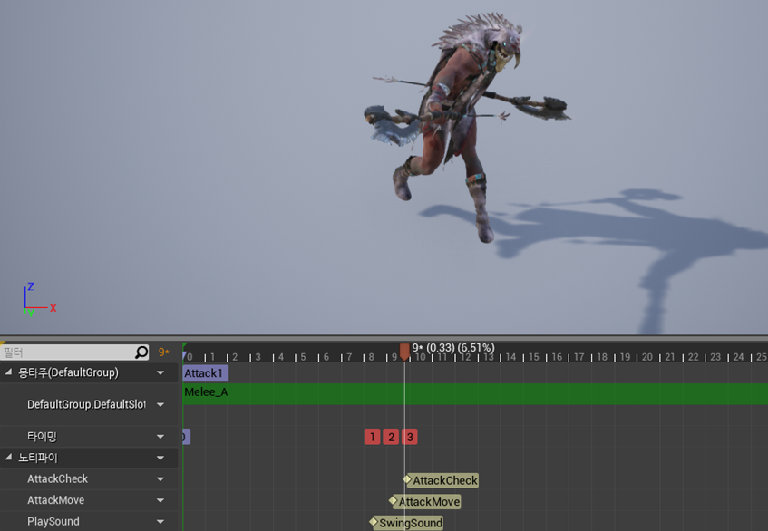
  - 설명 : 기존 무기의 콜리전 방식이 아닌 트레이스 채널과 외적을 사용한 공격 방식
### __작업 내용__
- __클래스명__ : AttackFunction클래스
  - 설명 :
  - AttackFunction클래스에 공격메서드를 추상화하여 구상
  - Owner의 타입을 Actor로 받았고, SetOwner()메서드에서 정의한다. 이는 클래스를 사용할 모든 객체에서 PossessedBy()에서 호출해야한다. (필수)
  - Owner의 타입이 Actor이기 때문에 Player나 Enemy객체가 AttackStart()메서드 실행 시 자동으로 값을 넘겨오지 못한다. 그렇기에 필요한 매개변수를 넘겨줘야한다.
  - 트레이스채널을 사용하여 플레이어로부터 구체를 그려 구체 내에 있는 모든 액터들을 판별하여 그 액터와 플레이어 간의 외적 값이 0.3보다 크다면 공격 판정
  - 이전 공격 방식과 동일하게 피격 시 CurrentAttack값 설정
  - ECollisionChannel의 타입 Player일때는 5번 채널을 Enemy일때는 4번 채널으로 선언했다

### __호출 방식__
  - BTTask_Attack()메서드에 의해 Attack()이 호출되며 이는 애니메이션 노티파이를 실행하고, 특정 타이밍에 AttackStart_Internal()메서드가 실행.

### __참조 코드__

  <details><summary>Cpp File</summary> 

  ```c++
  //AttackFunction.cpp
  void UAttackFunction::SetOwner(USkeletalMeshComponent* TakeMesh,AController* TakeController) {
    Owner = GetOwner();
    Mesh = TakeMesh;
    Controller = TakeController;
  }
  void UAttackFunction::SkillAttackStart(FVector Location, FVector Forward, TSubclassOf<UDamageType> DamageType,FString Type, UParticleSystem* HitParticle,float AttackRange,float Damage, int AttackCnt){
    TArray<TEnumAsByte<EObjectTypeQuery>> TraceObjectTypes;
    UClass* SeekClass = nullptr;
    TArray<AActor*> OutActors;
    TArray<AActor*> IgnoreActors;
    IgnoreActors.Init(Owner, 1);

    if (Type == "Player") {
      TraceObjectTypes.Add(UEngineTypes::ConvertToObjectType(ECollisionChannel::ECC_GameTraceChannel2));
      SeekClass = AEnemy::StaticClass();
    }
    else if (Type == "Enemy") {
      TraceObjectTypes.Add(UEngineTypes::ConvertToObjectType(ECollisionChannel::ECC_GameTraceChannel1));
      SeekClass = AMainPlayer::StaticClass();
    }

    bool bResult = UKismetSystemLibrary::SphereOverlapActors(GetWorld(), Owner->GetActorLocation(), AttackRange, TraceObjectTypes, SeekClass, IgnoreActors, OutActors);

    FColor DrawColor = FColor::Red;
    if (bResult) {
      for (auto& HitActor : OutActors) {
        float Inner = Owner->GetDotProductTo(HitActor);
        if (Inner > 0.3f) {
          if (Type == "Player") {
            auto EHited = Cast<AEnemy>(HitActor);
            EHited->SetCurrentAttack(Owner->GetName() + EHited->GetName() + FString::FromInt(AttackCnt));
            if (EHited) UGameplayStatics::ApplyDamage(EHited, Damage, Controller, Owner, DamageType);
          }
          else if (Type == "Enemy") {
            auto MHited = Cast<AMainPlayer>(HitActor);
            MHited->SetCurrentAttack(Owner->GetName() + MHited->GetName() + FString::FromInt(AttackCnt));
            if (MHited) UGameplayStatics::ApplyDamage(MHited, Damage, Controller, Owner, DamageType);
          }
          DrawColor = FColor::Green;
        }
      }
    }
    DrawDebugSphere(GetWorld(), Owner->GetActorLocation(), AttackRange, 12, DrawColor, false, 0.5f);
  }
  ```
  ```c++
  //Enemy.cpp
  void AEnemy::AttackStart_Internal() {
    FString Type = "Enemy";
    AttackFunction->SkillAttackStart(GetActorLocation(),GetActorForwardVector(),InternalDamageType, Type, GetHitParticle(),GetAttackRange(), AttackDamage, AttackCnt);

    AttackCnt++;
    if (AttackCnt > 2) AttackCnt = 0;
  }
  ```
  </details>
  <details><summary>Header File</summary> 

  ```c++
  //AttackFunction.h
  UCLASS(ClassGroup = (Custom), meta = (BlueprintSpawnableComponent))
  class COMBATARENA_API UAttackFunction : public UActorComponent{
  protected:
    UPROPERTY(VisibleAnywhere, BlueprintReadOnly, Category = "AttackFunction | Owner")
    class AActor* Owner;
    
    UPROPERTY(VisibleAnywhere, BlueprintReadOnly, Category = "AttackFunction | Owner")
    class AController* Controller;

    UPROPERTY(VisibleAnywhere, BlueprintReadOnly, Category = "AttackFunction | Owner")
    class USkeletalMeshComponent* Mesh;

  public:
    UFUNCTION()
    void SetOwner(USkeletalMeshComponent* TakeMesh, AController* TakeController);

    UFUNCTION(BlueprintCallable)
    virtual void SkillAttackStart(FVector Location, FVector Forward, TSubclassOf<UDamageType> DamageType, FString Type, UParticleSystem* HitParticle, float AttackRange, float Damage, int AttackCnt);
  }
  ```
  ```c++
  //Enemy.h
  private:
    class UEnemyAttackFunction* AttackFunction;
  ```
  </details>

---
## __6. 콤보 구현__
  - 
  - 설명 : 
### __작업 내용__
- __클래스명__ : Weapon클래스
  - 설명 :

### __호출 방식__
  - 

### __참조 코드__

  <details><summary>Cpp File</summary> 

  ```c++
  
  ```
  </details>
  <details><summary>Header File</summary> 

  ```c++
  ```
  </details>