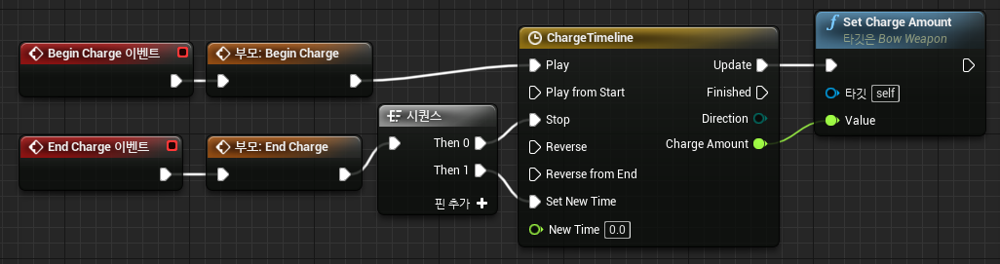
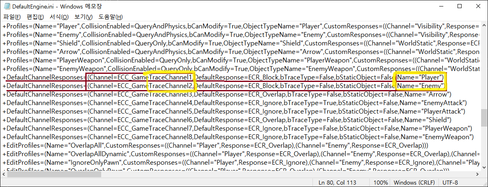
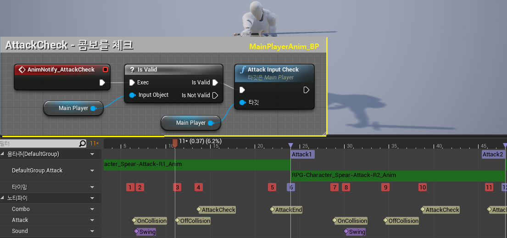
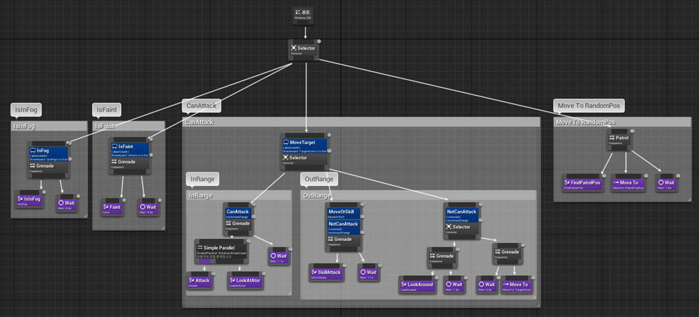
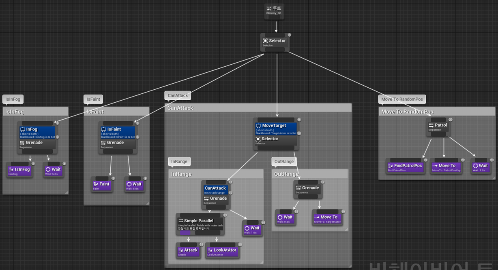
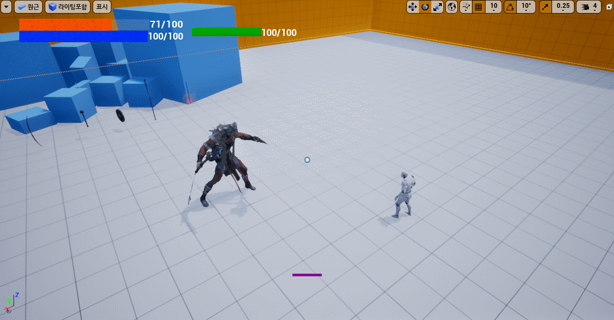
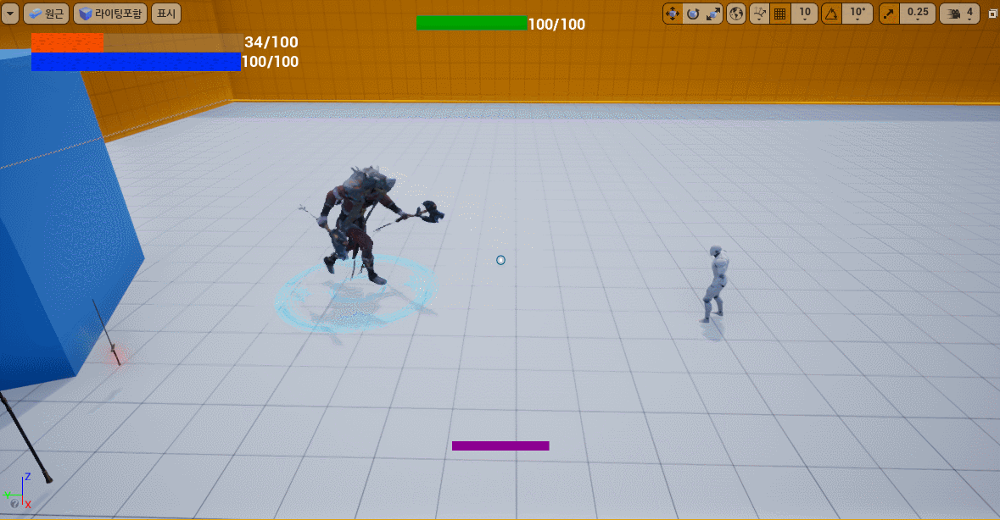

# Battle_Arena

|목록|내용|
|:--:|:--:|
|작업 기간|2021.07.26 ~ 2022.01.30 (실기간 2달)|
|인력 구성|1인 개발|
|프로젝트 목적|포트폴리오 & 기술 향상|
|프로젝트 내용|MMORPG 형식의 게임을 구상하고 시작했으나, 거대한 틀은 잡지 못하고 기능들만 구현|
|주요 업무|기획 및 개발|
|사용언어|C++|
|개발 환경|Visual Studio Code, Visual Studio 2019, Unreal Engine 4.26.2|
|참고 자료|Unreal Docs, Google|
|개발일지|[날짜별 기록이 남긴 일지](https://github.com/Goaway-1/Battle_Arena/blob/master/DevLog.md)|


> ### **<h3>목차</h3>**
1. [동영상 및 개발 일지](#동영상-및-개발-일지)
2. [프로젝트 설명](#프로젝트-설명)
3. [프로젝트 시스템 구조](#프로젝트-시스템-구조)
4. [주요 기능](#주요-기능)
5. [개선점](#개선점)

> ### **<h3>동영상 및 개발 일지</h3>**
- [](https://youtu.be/eJCbn4nPUEY)

- ## [개발일기](https://github.com/Goaway-1/Battle_Arena/blob/master/DevLog.md)

> ### **<h3>프로젝트 설명</h3>**
- MMORPG형식의 게임으로 초기 다크소울 느낌의 소울라이크 게임을 원했으나, 밸런스 등은 해결하지 않고 기능을 중심적으로 개발하는데 노력
- 게임의 재미와 기능 모두 완벽하게 하고 싶었지만 기능, 전투 시스템에만 중점으로 개발
- 무기를 구하고 몬스터들을 잡아 최종 보스를 처치하면 종료

> ### **<h3>프로젝트 시스템 구조</h3>**
- ※ 화살표는 __상속을__ 뜻하며, 점선은 클래스를 해당 클래스에 내에서 __인스턴스화__ 했다는 것을 의미
- 
  
  - Item클래스는 플레이어와 상호작용하며, Potion은 효과를 부여하고 Weapon은 장착하여 사용
  - Meteor, Grenade등과 같은 클래스들은 플레이어나 적이 SkillFunction클래스에서 인스턴스화하여 사용
- 
  
  - 플레이어와 적이 사용하는 Attack/SkillFunction클래스로 컴포넌트로 생성하여 사용
  - AttackFunction클래스는 공격하는 2가지 방식 중 내적을 사용하여 공격 하는 방식
  - SkillFunction클래스는 Meteor, Lazer등과 같이 클래스들을 인스턴스화하여 사용
- 

  - 비헤이비어트리(BehaviorTree)를 구성할때 사용하는 노드들로 UBTDecorator는 조건을 판단하고, UBTaskNode는 실제로 행동하는 노드
- 
  
  - Character를 상속받은 클래스로 플레이어를 뜻하며 열거형(ENUM)을 사용하여 상태를 나타냄
  - Controller는 화면상에 표시하는 위젯들을 관리하고, Anim은 조건(속도, 방향)에 따른 애니메이션을 관리
- 

  - Character를 상속받은 클래스로 적을 뜻하며 이는 다시 Normal_Enemy와 Boss_Enemy로 구분
    - 가장 큰 차이점은 SkillFunction, Balance의 유무
  - 적의 EnemyController에서는 비헤이비어트리(BehaviorTree)와 BlackBoard, AIPerception..등을 사용하여 로직 구성
  - 나머지는 플레이어와 비슷하게 구성

TurnInPlace, 무기장착 로직, 공격 판정2가지, 콤보, 방패, SkillFunction..
> ### **<h3>주요 기능</h3>**
|주요 기능|이동 링크|
|:--:|:--:|
|이동|[이동](#이동), [제자리 회전](#제자리-회전)|
|무기|[활과 화살](#활과-화살), [방패](#방패), [연막탄](#연막탄)|
|공격 판정|[콜리전 공격판정](#콜리전-공격판정), [내적 공격판정](#내적-공격판정), [콤보](#콤보), [데미지 로그](#데미지-로그)|
|상호작용|[균형](#균형), [특정 공격](#특정-공격), [아이템과의 상호 작용](#아이템과의-상호-작용), [타켓팅](#타켓팅)|
|적의 스킬|[AI 로직](#AI-로직), [메테오 공격](#메테오-공격), [마법 공 공격](#마법-공-공격), [레이저 공격](#레이저-공격), [돌진 공격](#돌진-공격)|
|그 외..|[카메라의 이동](#카메라의-이동), [배틀 사운드](#배틀-사운드)|


- ※ 내용에 적혀있는 코드는 일부만을 작성한 것으로 자세한 내용이나 구조는 개발일기나 소스파일을 참조
---

## <h1>이동</h1>
  - 
  - 
  - 설명 : 애니메이션을 관리하는 MainPlayerAnim클래스의 구조와 상하체를 구분하는 블랜딩
### __작업 내용__
  - BlendSpace를 사용하여 Axis Settings의 가로, 세로축을 각각 Dircection(방향)과 - Speed(속도)로 지정하여 Axis에 따라 애니메이션를 자연스럽게 변화
  - 이외의 점프나 Combat/Weapon/MovementStatus에 따른 애니메이션은 블랜드(Blennd Poses by bool : bool에 따른 구분)와 스테이트머신을 사용하여 위 그림과 같이 구현.
  - 블랜드는 상체와 하체를 구분하여 다양한 연출을 가능하도록 도와줌

---
## <h1>제자리 회전</h1>
  - 
  - 
  - 설명 : 이동 속도와 카메라 회전 방향에 따른 플레이어의 회전으로
### __작업 내용__
- __메서드명__ : TurnInPlace(float value)
  - 설명 : 움직임이 없이 제자리에서 카메라를 이동했을때 플레이어가 자연스럽게 회전하는 애니메이션을 사용하는 메서드
  - 플레이어 컨트롤러에서 GetPlayerViewPoint()메서드를 사용하여 카메라의 Location, Rotation을 받아와 캐릭터의 Rotation과의 차이 값을 도출
  - 그 값이 0.5도 이내라면 회전하지 않고, 45도 이상 차이가 나고 속도가 없다면 TurnAxis의 값을 value에 따라 1, -1로 지정
  - 이때 value는 회전 방향 구분하며 Left(-1)/Idle(0)/Right(1)로 지정
  - TurnAxis의 값이 변경됨에 따라 MainPlayerAnim에서 애니메이션 실행 (위 그래프에서 확인)

- __메서드명__ : TurnMove()
  - 설명 : 플레이어가 움직일때 즉시 이동방향으로 회전하도록 하는 메서드
  - CharacterMovementComponent의 OrientRotationToMovement를 거짓으로 하여 캐릭터의 회전을 움직임과 동일하게 구현

### __호출 방식__
  - 마우스 좌우 이동 시 Turn()메서드가 실행되는데, 캐릭터 이동속도가 0.1이하면 TurnInPlace()메서드가 그렇지 않고 이동 중이라면 TurnMove()메서드 실행

### __참조 코드__

  <details><summary>Cpp File</summary> 

  ```c++
  //MainPlayer.cpp
  void AMainPlayer::Turn(float value) {
    if (GetMovementStatus() == EMovementStatus::EMS_Faint) return;
    AddControllerYawInput(value * CameraSpeed * GetWorld()->GetDeltaSeconds());

    /** 이동속도에 따른 메서드 실행 */
    if (GetVelocity().Size() <= 0.1f) TurnInPlace(value);
    else TurnMove();
  }
  void AMainPlayer::TurnInPlace(float value) {
    FVector ViewPoint;
    FRotator ViewRotation;
    float calculationY;
    
    PlayerController->GetPlayerViewPoint(ViewPoint, ViewRotation);
    calculationY = UKismetMathLibrary::Abs(ViewRotation.Yaw - GetActorRotation().Yaw);

    /** 카메라와 액터 사이의 회전 차이에 따른 구분 */
    if (calculationY <= 0.5f) {
      GetCharacterMovement()->bUseControllerDesiredRotation = false;
      TurnAxis = 0;
    }
    else if (calculationY >= 45.f || (DirX != 0 || DirY != 0)) {
      GetCharacterMovement()->bUseControllerDesiredRotation = true;
      if (GetVelocity().Size() == 0) {
        if (value > 0.1f) TurnAxis = 1;
        else if (value < -0.1f) TurnAxis = -1;
      }
    }
  }
  void AMainPlayer::TurnMove() {
    GetCharacterMovement()->bOrientRotationToMovement = false;	
    FRotator ViewRotation = CameraManager->GetCameraRotation();
    ViewRotation.Pitch = ViewRotation.Roll = 0;
    SetActorRotation(ViewRotation);
  }
  ```
  </details>
  <details><summary>Header File</summary> 

  ```c++
  //MainPlayer.h
  private:
    //애니메이션 실행을 위한 값
  	int TurnAxis = 0;	
  public:
    void Turn(float value);
    void TurnInPlace(float value);
    void TurnMove();
    FORCEINLINE int GetTurnAxis() { return TurnAxis; }
  ```
  </details>

---
## <h1>활과 화살</h1>
  - 
  - 
  - 설명 : 공격 무기 중 하나로 활을 사용하여 화살을 발사한다. 위의 그림은 BowWeapon클래스의 Begin/EndCharge를 연장한 블루프린트 구조이다. 
### __작업 내용__
- __클래스명__ : BowWeapon 
  - Eqiup 방식은 기존 Weapon과 동일한 방식으로 진행되고 양손 무기이다.
  - enum타입인 EBowStatus를 제작하여 당기는 중인지 상태를 구분
  - Begin/EndCharge_Implementation()메서드와 TimeLine을 사용하여 ChargeAmount의 크기에 따라 활시위 애니메이션 진행 (블루프린트와 연계하기 위해 메서드를 BlueprintCallable로 설정) 
  - Fire()메서드는 화살을 발사하는 메서드로 Arrow클래스의 Fire를 ChargeAmount를 힘으로 하여 발사
  - Reload()메서드는 Arrow를 "arrow_attach_socket"의 소켓에 Attach하여 활시위 당길 때 같이 이동

- __클래스명__ : Arrow
  - 화살의 상태를 나타내기 위해서 enum타입인 EArrowStatus를 제작하여 상태를 구분. 
  - Fire() 는 활의 ChargeAmount를 받아 FirePower값을 설정. 이 값을 Lerp()를 사용하여 화살을 AddImpulse하여 발사한다. 또한 DetachFromActor()를 사용하여 사용자로 부터 해제하고 KeepWorldTransform으로 전환하고, 상태 또한 InArrow로 변환. 
  - Arrow클래스에서 Overlap을 위해 SphereComponent를 추가하고 Overlap시 피격처리 (이전 피격처리와 동일) 
  - 발사 시 Collsion의 이름은 Arrow로 설정하여 바꾸고 발사. (기존과 동일) 
  - Projectile로 제작할 수 있지만 학습을 위해서 AddImpulse로 진행

### __호출 방식__
  - MainPlayer클래스의 Begin/EndCharge()메서드를 마우스 오른쪽 클릭을 통해 호출되며 이때 Bow클래스의 Reload(), BeginCharge()가 호출되고 상태 변경 및 카메라를 스위칭한다.
  - 또한 LMBDown()메서드에서 현재 WeaponPos가 Bow라면 Bow클래스의 Fire()메서드 호출되면 화살을 발사

### __참조 코드__

  <details><summary>Cpp File</summary> 

  ```c++
  //BowWeapon.cpp
  void ABowWeapon::BeginCharge_Implementation() {
    if(!Arrow) return;
    if(DrowSound != nullptr) UGameplayStatics::PlaySound2D(this, DrowSound);
  }
  void ABowWeapon::EndCharge_Implementation() {
    if (Arrow) {
      Arrow->Destroy();
      Arrow = nullptr;
    }
  }
  void ABowWeapon::Fire(int Cnt) {
    if(!Arrow) return;

    /** 화살의 발사 */
    Arrow->Fire(ChargeAmount, Cnt);
    Arrow = nullptr;
    EndCharge();
  }
  void ABowWeapon::Reload() {
    FActorSpawnParameters SpawnParams;
    SpawnParams.Owner = this;
    SpawnParams.Instigator = GetInstigator();

    /** 화살이 현재 없다면 재생성하고 활에 Attach */
    if (!Arrow) {
      Arrow = GetWorld()->SpawnActor<AArrow>(ArrowClass, FVector(0.f), FRotator(0.f), SpawnParams);
      Arrow->AttachToComponent(GetSkeletalMesh(), FAttachmentTransformRules::SnapToTargetNotIncludingScale, FName("arrow_attach_socket"));
      Arrow->InitalArrow(BowOwner,BowController);
    }
  }
  ```
  ```c++
  //Arrow.cpp
  void AArrow::SetBowState() {
    switch (ArrowStatus)
    {
    case EArrowStatus::EAS_InBow:
      ArrowCollision->SetCollisionProfileName(FName("NoCollision"));
      ArrowCollision->SetSimulatePhysics(false);
      break;
    case EArrowStatus::EAS_InArrow:
      ArrowCollision->SetCollisionProfileName(FName("Arrow"));
      ArrowCollision->SetSimulatePhysics(true);
      /** 화살의 발사 */
      if(!bisFire){
        ArrowCollision->AddImpulse(GetActorForwardVector() * UKismetMathLibrary::Lerp(600, 15000, FirePower));
        bisFire = true;
      }
      break;
    default:
      break;
    }
  }
  void AArrow::Fire(float Amount,int Cnt) {
    /** 활로 부터 Detach하고 상태 변경 */
    DetachFromActor(FDetachmentTransformRules::KeepWorldTransform);
    SetArrowStatus(EArrowStatus::EAS_InArrow);
    FirePower = Amount;
    this->AttackCnt = Cnt;

    if(ShotSound != nullptr) UGameplayStatics::PlaySound2D(this, ShotSound);
  }
  ```
  </details>
  <details><summary>Header File</summary> 

  ```c++
  //BowWeapon.h
  UENUM(BlueprintType)
  enum class EBowStatus : uint8 {
    EBS_Normal		UMETA(DisplayName = "Normal"),
    EBS_Drawing		UMETA(DisplayName = "Drawing"),
    EBS_Default		UMETA(DisplayName = "Default")
  };
  private:
    UPROPERTY(EditDefaultsOnly, Category = "Weapon | Bow", Meta = (AllowPrivateAccess = true))
    class AArrow* Arrow;

    UPROPERTY(EditDefaultsOnly, Category = "Weapon | Bow", Meta = (AllowPrivateAccess = true))
    TSubclassOf<class AArrow> ArrowClass;

    AActor* BowOwner;
    AController* BowController;
  public:
    UPROPERTY(EditAnyWhere, BlueprintReadWrite, Category = "Arrow")
    float ChargeAmount;   //활을 당기고 있는 정도 

    UFUNCTION(BlueprintCallable)
    void SetChargeAmount(float value);

    UFUNCTION(BlueprintNativeEvent, BlueprintCallable)
    void BeginCharge();

    UFUNCTION(BlueprintNativeEvent, BlueprintCallable)
    void EndCharge();

    void Fire(int Cnt);   //화살을 발사
    void Reload();        //화살을 리로드
  ```
  ```c++
  //Arrow.h
  UENUM(BlueprintType)
  enum class EArrowStatus : uint8 {
    EAS_InBow		UMETA(DisplayName = "InBow"),
    EAS_InArrow		UMETA(DisplayName = "InArrow"),
    EAS_Destroy		UMETA(DisplayName = "Destroy")
  };
  private:
    UPROPERTY(VisibleAnywhere, BlueprintReadWrite, Category = "Arrow | Physic", Meta = (AllowPrivateAccess = true))
    class URadialForceComponent* RadiaForce;    //Destructible Mesh에 사용했던 힘컴포넌트, 현재 사용 X
    
    UPROPERTY(EditDefaultsOnly, Category = "Arrow | Damage", Meta = (AllowPrivateAccess = true))
    float Damage = 5.f;

    UPROPERTY(VisibleAnywhere, Category = "Arrow")
    bool bisFire = false;

    UPROPERTY(VisibleAnywhere, Category = "Arrow")
    float FirePower;

    UPROPERTY(VisibleAnywhere, Category = "Arrow")
    EArrowStatus ArrowStatus;
  public:
    UFUNCTION()
    void OnOverlapBegin(UPrimitiveComponent* OverlappedComponent, AActor* OtherActor, UPrimitiveComponent* OtherComp, int32 OtherBodyIndex, bool bFromSweep, const FHitResult& SweepResult);
    
    void Fire(float Amount,int Cnt);            //화살의 발사로 상태만 변경
    void SetArrowStatus(EArrowStatus Status);   //매 틱마다 호출되며 상태에 따른 행동
  ```
  </details>

---
## <h1>방패</h1>
  - 
  - 설명 : 적의 공격을 막는 방패
### __작업 내용__
- __클래스명__ : ShieldWeapon클래스
  - 기존 : 방패에 콜리전을 추가하여 피격 처리. 이때 적의 공격은 Sweep의 Single 채널로 이루어지기에 먼저 방패에 맞게 되면 공격의 취소 되며 대미지가 들어가지 않음.
  - 수정 : 플레이어의 상태와 적의 공격 방향을 기준으로 판단하여 일정 범위 이내라면 방어하는 방식 
  - ShieldWeapon에서 범위를 지정하는 float값인 ShiledMax/MinAngle과 방어했을 시 발생하는 ParticleSystem타입의 HitedParticle 지정.
  - MainPlayer클래스에서 TakeDamage()메서드를 수정하며 현재 상태가 Blocking이라면 막았는지의 대한 판정하며 막았다면 종료
  - 판정은 IsBlockingSuccess()메서드를 통해 진행하며 FindLookAtRotation()을 사용하여 플레이어와 공격한 적의 각도를 반환하고 NormalizedDeltaRotator를 통해 각도를 정규화, InRange_FloatFloat()메서드를 사용하여 BetweenRot이 일정 범위 내에 있는 지 확인. 반환값은 bool이다.
  - 공격한 적이 일정 범위 내에 있다면 방어하고 방패의 파티클을 생성하며, 일정 거리 뒤로 밀린다.

### __호출 방식__
  - 'B'키를 누르면 방패를 들게되며 이때 상태는 ECS_Blocking으로 전환

### __참조 코드__

  <details><summary>Cpp File</summary> 

  ```c++
  //ShieldWeapon.cpp
  AShieldWeapon::AShieldWeapon() {
    SetWeaponPosLoc(EWeaponPos::EWP_Shield);
    ShiledMinAngle = -40.f;   
    ShiledMaxAngle = 40.f;
  }
  ```
  ```c++
  //MainPlayer.cpp
  float AMainPlayer::TakeDamage(float DamageAmount, struct FDamageEvent const& DamageEvent, class AController* EventInstigator, AActor* DamageCauser) {
    ...
    /** 방패로 막았는지 체크 (상태와 내적) */
    if (GetCombatStatus() == ECombatStatus::ECS_Blocking) {
      if (IsBlockingSuccess(DamageCauser)) {
        Balance->SetCurrentBalance(10.f);
        return 0;
      }
    }
  }
  void AMainPlayer::Blocking() {
    if (!IsCanMove()) return;
    if (CurrentShieldWeapon != nullptr) {
      SetCombatStatus(ECombatStatus::ECS_Blocking);
    }
  }
  void AMainPlayer::UnBlocking() {
    if (CurrentShieldWeapon != nullptr) {
      SetCombatStatus(ECombatStatus::ECS_Normal);
    }
  }
  bool AMainPlayer::IsBlockingSuccess(AActor* DamageCauser) {
    /** 두 액터 사이의 각도를 구하고 정규화하여 범위내에 있다면 isShieldRange에 True를 지정 */
    FRotator BetweenRot = UKismetMathLibrary::FindLookAtRotation(GetActorLocation(), DamageCauser->GetActorLocation());
    BetweenRot = UKismetMathLibrary::NormalizedDeltaRotator(GetActorRotation(), BetweenRot);
    bool isShieldRange = UKismetMathLibrary::InRange_FloatFloat(BetweenRot.Yaw, CurrentShieldWeapon->GetMinAngle(), CurrentShieldWeapon->GetMaxAngle());

    /** 일정 각도 이내라면 뒤로 밀리면서 True를 반환 */
    if (isShieldRange && CurrentShieldWeapon->GetHitedParticle() && CurrentShieldWeapon->GetHitedSound()) {
      FVector Loc = GetActorForwardVector();
      Loc.Z = 0;
      LaunchCharacter(DamageCauser->GetActorForwardVector() * 500.f, true, true);
      UGameplayStatics::SpawnEmitterAtLocation(GetWorld(), CurrentShieldWeapon->GetHitedParticle(), GetActorLocation(), FRotator(0.f));
      UGameplayStatics::PlaySound2D(this, CurrentShieldWeapon->GetHitedSound());
      return true;
    }
    return false;
  }
  ```
  </details>
  <details><summary>Header File</summary> 

  ```c++
  //ShieldWeapon.h
  private:
    UPROPERTY(VisibleAnywhere, Category = "Weapon | Angle")
    float ShiledMinAngle;   //막을 수 있는 범위1

    UPROPERTY(VisibleAnywhere, Category = "Weapon | Angle")
    float ShiledMaxAngle;   //막을 수 있는 범위2
  public:
    FORCEINLINE float& GetMinAngle() { return ShiledMinAngle; }
    FORCEINLINE float& GetMaxAngle() { return ShiledMaxAngle; }
  ```
  ```c++
  //MainPlayer.h
  public:
  	void Blocking();      //상태 변화를 위한 메서드
	  void UnBlocking();    //상태 변화를 위한 메서드
	  bool IsBlockingSuccess(AActor* DamageCauser);   //막기 성공 여부를 반환
  ```
  </details>

---
## <h1>연막탄</h1>
  - 
  - 
  - 설명 : 연막안에 들어가면 플레이어의 시점은 흐려지고, 적은 방황하는 로직
### __작업 내용__
- __클래스명__ : Grenade클래스
  - Grenade클래스의 SetFire()는 Player가 클릭하여 던질때 활성화되며 이때 SimulationEnabled가 활성화되어 Projectile을 사용한다. (Projectile : 발사체를 사용할때 추가하는 컴포넌트로 일시적인 힘을 제공)
  - 던지고 일정 시간 후에 SpawnSmoke()메서드가 활성화되어 연기가 생성되고, 일정 시간 후에 IsGrowing이 True가 되어 Tick마다 연막의 범위가 넓어지다가 소멸된다.
  - 3번 키를 누르면 EMovementStatus를 Throwing로 변경하고 오른쪽 손에 Grenade를 인스턴스화 하고 다시 누르면 삭제하며, 이때 마우스 왼쪽 클릭 시 던진다.
  - 적 중첩 시 : 
    - TaskNode클래스인 UBTTask_IsInFog클래스는 Enemy가 Grenade에 영향을 받는다면 실행하는 로직 생성.
    - Enemy클래스의 De/ActiveFogEvent()메서드를 통해 애니메이션의 실행
  - 플레이어 중첩 시 :
    - MainController클래스와 연관되어 SetFogSplatter()메서드를 통해 위젯의 Visibility를 On/Off 하는 형식

### __호출 방식__
  - MainPlayer클래스의 Throw/StartThrow/Throwing/EndThrow()메서드에서 진행. (코드 생략)

### __참조 코드__

  <details><summary>Cpp File</summary> 

  ```c++
  //Grenade.cpp
  void AGrenade::Tick(float DeltaTime){
    Super::Tick(DeltaTime);

    /** 조건 만족 시 연막의 범위 증가 */
    if (isGrowing && Smoke) {
      float Csize = Collision->GetUnscaledSphereRadius();
      Csize += (DeltaTime * 100.0f);
      Collision->SetSphereRadius(Csize);

      FVector temp = Smoke->GetRelativeScale3D();
      temp += FVector(DeltaTime * 0.3f);
      Smoke->SetRelativeScale3D(temp);
      SmokeTime -= DeltaTime;

      /** 일정 범위 초과 및 시간 소요 시 파괴*/
      if(Csize > 700.f && SmokeTime <= 0) {
        isGrowing = false;
        GetWorldTimerManager().ClearTimer(SpawnSmokeHandle);
        GetWorldTimerManager().SetTimer(SpawnSmokeHandle, this, &AGrenade::DestorySmoke, SpawnSmokeTime, false);
      }
    }
  }
  void AGrenade::SetFire(FRotator Rot) {
    /** 플레이어로부터 Detach하고 방향 나아갈 방향 지정 */
    DetachFromActor(FDetachmentTransformRules::KeepWorldTransform);
    SetActorLocation(GetActorLocation());
    
    /** 회전과 Projectile을 사용한 발사 */
    Mesh->SetRelativeRotation(Rot);
    Projectile->SetVelocityInLocalSpace(FVector::ForwardVector * 8000);
    Projectile->Activate();

    /** SpawnSmokeTime 이후 연기 생성 */
    GetWorldTimerManager().SetTimer(SpawnSmokeHandle, this, &AGrenade::SpawnSmoke, SpawnSmokeTime, false);
  }
  void AGrenade::SpawnSmoke() {
    /** 연기 생성 */
    if(Smoke) {
      Collision->SetCollisionEnabled(ECollisionEnabled::QueryOnly);
      Smoke->SetVisibility(true);
      GetWorldTimerManager().ClearTimer(SpawnSmokeHandle);
      GetWorldTimerManager().SetTimer(SpawnSmokeHandle, this, &AGrenade::GrowingSmoke, SpawnSmokeTime, false);
    }
  }
  void AGrenade::OnOverlapBegin(UPrimitiveComponent* OverlappedComponent, AActor* OtherActor, UPrimitiveComponent* OtherComp, int32 OtherBodyIndex, bool bFromSweep, const FHitResult& SweepResult) {
    if (OtherActor) {
      AMainPlayer* Player = Cast<AMainPlayer>(OtherActor);
      AEnemy* Enemy = Cast<AEnemy>(OtherActor);
      if (Player) Player->SetFogSplatter();                 //플레이어의 시야 방해
      if (Enemy) Enemy->SetVisibleInFog(true, SmokeTime);   //적의 방황 애니메이션 실행 (SmokeTime동안)
    }
  }
  ```
  ```c++
  //MainPlayer.cpp
  void AMainPlayer::SetFogSplatter() {
    (PlayerController->GetFogSplatterVisible()) ? PlayerController->RemoveFogSplatter() : PlayerController->DisplayFogSplatter();
  }
  ```
  </details>
  <details><summary>Header File</summary> 

  ```c++
  //Grenade.h
  private:
    UPROPERTY(EditAnywhere, Category = "Grenade | Mesh", Meta = (AllowPrivateAccess = true))
    class UProjectileMovementComponent* Projectile;

    UPROPERTY(EditAnywhere, Category = "Grenade | Smoke", Meta = (AllowPrivateAccess = true))
    class UParticleSystemComponent* Smoke;

    bool isGrowing = false;
  public:
    void SpawnSmoke();
    void DestorySmoke();
    void SetFire(FRotator Rot);
  ```
  ```c++
  //MainPlayer.h
    void SetFogSplatter();	
  ```
  </details>

---
## <h1>콜리전 공격판정</h1>
  - 
  - 
  - 설명 : 플레이어가 무기를 장착하고 하는 무기의 콜리전을 활용한 공격 판정 방법
### __작업 내용__
- __클래스명__ : AttackWeapon클래스
  - 설명 : AttackWeapon의 CapsuleComponent 콜리전을 On/Off하는 방식으로 Overlap되면 피격 판정
  - On/OffWeaponCollision()메서드를 애니메이션 노티파이에서 호출하여 Weapon의 콜리전을 비/활성화 
  - 필요한 정보를 무기를 착용할때 ItemEquip()메서드에서 SetAttackInit()메서드에서 넘겨 사용
  - 무기를 한번 휘두를 때 중첩되어 2번 이상 피해를 받는 오류가 발생할 수 있기에 공격 시 “공격자의 이름 + 무기의 이름 + 카운트 번호”로 CurrentAttack을 설정. 
  - AttakCnt를 매 차례 증가하여 위 로직에 도움이 되도록 설정 (MainPlayer의 Get/SetAttackCnt()메서드)
    ```c++
    void AMainPlayer::SetAttackCnt() {
      AttackCnt++;
      if(AttackCnt > 10) AttackCnt = 0;
    }
    ```
  - Enemy클래스의 CurrentAttack이름과 LastAttack이름을 비교하여 다를 시 TakeDamage()메서드 실행

### __호출 방식__
  - 사용자가 무기를 장착하고 마우스 왼쪽 버튼 클릭 시 호출 시 LMBDown()메서드 호출

### __참조 코드__

  <details><summary>Cpp File</summary> 

  ```c++
  //AttackWeapon.cpp
  /** AttackCollision의 Active여부 */
  void AAttackWeapon::SetAttackCollision(bool value) {	
    if(!value) AttackCollision->SetCollisionEnabled(ECollisionEnabled::NoCollision);
    else AttackCollision->SetCollisionEnabled(ECollisionEnabled::QueryOnly);
  }
  void AAttackWeapon::OnAttackOverlap(UPrimitiveComponent* OverlappedComponent, AActor* OtherActor, UPrimitiveComponent* OtherComp, int32 OtherBodyIndex, bool bFromSweep, const FHitResult& SweepResult) {
    if (OtherActor) {
      AEnemy* Enemy = Cast<AEnemy>(OtherActor);
      AMainPlayer* Player = Cast<AMainPlayer>(AtOwner);
      ABoss_Enemy* BEnemy = Cast<ABoss_Enemy>(Enemy);
      if (BEnemy) Player->GetPlayerController()->SetBalanceTarget(BEnemy);  //보스인 경우 Balance를 띄움
      if (Enemy) {  /** 적의 CurrentAttack정보를 갱신하고 ApplyDamage()메서드로 피격 처리 */
        Enemy->SetCurrentAttack(AtOwner->GetName() + this->GetName() + FString::FromInt(Player->GetAttackCnt()));
        UGameplayStatics::ApplyDamage(Enemy, Damage, AtController, AtOwner, AtDamageType);
      }
    }
  }
  ```
  ```c++
  //Enemy.cpp
  float AEnemy::TakeDamage(float DamageAmount, struct FDamageEvent const& DamageEvent, class AController* EventInstigator, AActor* DamageCauser) {
    if(CurrentHealth <= 0) return 0;
    else if (LastAttack != CurrentAttack ) LastAttack = CurrentAttack;      /** 마지막 피격과 최근 피격정보가 다른 경우 LastAttack을 갱신하고 피격처리 */
    else if (DamageEvent.DamageTypeClass != InternalDamageType) return 0;
    else return 0;
    ....
  }
  ```
  </details>
  <details><summary>Header File</summary> 

  ```c++
  //AttackWeapon.h
  private:
  	UPROPERTY(EditAnywhere, Category = "Weapon", Meta = (AllowPrivateAccess = true))
	  UCapsuleComponent* AttackCollision;
  public:
  	UFUNCTION()
    void OnAttackOverlap(UPrimitiveComponent* OverlappedComponent, AActor* OtherActor, UPrimitiveComponent* OtherComp, int32 OtherBodyIndex, bool bFromSweep, const FHitResult& SweepResult);
    
    void SetAttackCollision(bool value);
  ```
  ```c++
  //Enemy.h
  private:
    UPROPERTY(VisibleAnywhere, Category = "Attack", Meta = (AllowPrivateAccess = true))
    FString LastAttack = "";    /** 마지막 피격 정보 */

    UPROPERTY(VisibleAnywhere, Category = "Attack", Meta = (AllowPrivateAccess = true))
    FString CurrentAttack = "";  /** 지금 피격 정보 */
  public:
	  FORCEINLINE void SetCurrentAttack(FString Value) { CurrentAttack = Value; }
  ```
  </details>

---
## <h1>내적 공격판정</h1>
  - 
  - 
  - 
  - 설명 : 기존 무기의 콜리전 방식이 아닌 트레이스 채널과 내적을 사용한 공격 방식
### __작업 내용__
- __클래스명__ : AttackFunction클래스
  - 설명 : SkillAttackStart()메서드에서 공격 판정을 진행
  - AttackFunction클래스에 공격메서드를 추상화하여 구상
  - SetOwner()메서드를 통해서 계산에 필요한 정보를 미리 넘긴다. 이는 클래스를 사용할 모든 객체에서 PossessedBy()에서 반드시 호출해야만함.
  - 트레이스채널, ECollisionChannel의 타입 Player일때는 2번(Enemy), Enemy일때는 1번(Player) 채널로 선언하고 __UKismetSystemLibrary::SphereOverlapActors()메서드를__ 사용하여 소유자 주변을 채널과 일치하는 타입의 액터를 찾아 두 액터 간 내적의 크기가 일정 범위내라면 피격처리
  - 이때 찾아낼 액터를 저장할 배열(OutActors), 트레이스 채널번호(TraceObjectTypes), 클래스(SeekClass)이 필요하고 무시할 액터를 저장한 배열(IgnoreActors)이 필요하며, 배열은 모두 Array를 사용
  - 위의 그림처럼 내적의 크기를 기준으로 피격을 판단하며 __장점은 공격타입에 따라 범위를 지정할 수 있다는 점이다.__

### __호출 방식__
  - BTTask_Attack()메서드에 의해 Attack()이 호출되며 이는 애니메이션 노티파이를 실행하고, 특정 타이밍에 AttackStart_Internal()메서드가 실행.
  - 적과 플레이어 모두 사용가능 하지만 적의 공격 방식은 이 내적 방식으로만 구현

### __참조 코드__

  <details><summary>Cpp File</summary> 

  ```c++
  //AttackFunction.cpp
  void UAttackFunction::SetOwner(USkeletalMeshComponent* TakeMesh,AController* TakeController) {
    Owner = GetOwner();
    Mesh = TakeMesh;
    Controller = TakeController;
  }
  void UAttackFunction::SkillAttackStart(TSubclassOf<UDamageType> DamageType,FString OwnerType, UParticleSystem* HitParticle,float AttackRange,float Damage, int AttackCnt){
    TArray<TEnumAsByte<EObjectTypeQuery>> TraceObjectTypes;
    UClass* SeekClass = nullptr;		//찾아낼 클래스
    TArray<AActor*> OutActors;			//찾아낼 액터들
    TArray<AActor*> IgnoreActors;		//무시할 액터들
    IgnoreActors.Init(Owner, 1);

    /** 찾아낼 클래스와 트레이스 채널 지정 */
    if (Type == "Player") {
      TraceObjectTypes.Add(UEngineTypes::ConvertToObjectType(ECollisionChannel::ECC_GameTraceChannel2));
      SeekClass = AEnemy::StaticClass();
    }
    else if (Type == "Enemy") {
      TraceObjectTypes.Add(UEngineTypes::ConvertToObjectType(ECollisionChannel::ECC_GameTraceChannel1));
      SeekClass = AMainPlayer::StaticClass();
    }

    /** 원하는 액터가 감지되었다면 True를 반환 */
    bool bResult = UKismetSystemLibrary::SphereOverlapActors(GetWorld(), Owner->GetActorLocation(), AttackRange, TraceObjectTypes, SeekClass, IgnoreActors, OutActors);

    FColor DrawColor = FColor::Red;
    if (bResult) {
      for (auto& HitActor : OutActors) {
        
        /** 내적 판단 */
        float Inner = Owner->GetDotProductTo(HitActor);	
        if (Inner > 0.3f) {
          if (Type == "Player") {
            auto EHited = Cast<AEnemy>(HitActor);
            EHited->SetCurrentAttack(Owner->GetName() + EHited->GetName() + FString::FromInt(AttackCnt));
            if (EHited) UGameplayStatics::ApplyDamage(EHited, Damage, Controller, Owner, DamageType);
          }
          else if (Type == "Enemy") {
            auto MHited = Cast<AMainPlayer>(HitActor);
            MHited->SetCurrentAttack(Owner->GetName() + MHited->GetName() + FString::FromInt(AttackCnt));
            if (MHited) UGameplayStatics::ApplyDamage(MHited, Damage, Controller, Owner, DamageType);
          }
          DrawColor = FColor::Green;
        }
      }
    }

    /** 피격 판정 시각화 용도 */
    DrawDebugSphere(GetWorld(), Owner->GetActorLocation(), AttackRange, 12, DrawColor, false, 0.5f);
  }
  ```
  ```c++
  //Enemy.cpp
  void AEnemy::AttackStart_Internal() {
    FString Type = "Enemy";
    /** 트레이스채널을 사용한 공격 호출 */
    AttackFunction->SkillAttackStart(InternalDamageType, Type, GetHitParticle(),GetAttackRange(), AttackDamage, AttackCnt);

    AttackCnt++;
    if (AttackCnt > 2) AttackCnt = 0;
  }
  ```
  </details>
  <details><summary>Header File</summary> 

  ```c++
  //AttackFunction.h
  UCLASS(ClassGroup = (Custom), meta = (BlueprintSpawnableComponent))
  class COMBATARENA_API UAttackFunction : public UActorComponent{
  protected:
    UPROPERTY(VisibleAnywhere, BlueprintReadOnly, Category = "AttackFunction | Owner")
    class AActor* Owner;
    
    UPROPERTY(VisibleAnywhere, BlueprintReadOnly, Category = "AttackFunction | Owner")
    class AController* Controller;

    UPROPERTY(VisibleAnywhere, BlueprintReadOnly, Category = "AttackFunction | Owner")
    class USkeletalMeshComponent* Mesh;

  public:
    UFUNCTION()
    void SetOwner(USkeletalMeshComponent* TakeMesh, AController* TakeController);

    UFUNCTION(BlueprintCallable)
    virtual void SkillAttackStart(TSubclassOf<UDamageType> DamageType, FString OwnerType, UParticleSystem* HitParticle, float AttackRange, float Damage, int AttackCnt);
  }
  ```
  ```c++
  //Enemy.h
  private:
    class UEnemyAttackFunction* AttackFunction;
  ```
  </details>

---
## <h1>콤보</h1>
  - 
  - 
  - 설명 : 연속공격을 구현한 로직
### __작업 내용__
- __함수명__ : AttackInputCheck()메서드
  - 연속 공격을 체크(AttackCheck)하는 노티파이를 MainPlayer클래스의 AttackInputCheck()와 연결
  - 그 시점에 AttackInputCheck()메서드가 실행되는데 이때 만약 bIsAttackCheck, 즉 공격이 가능하다면 콤보카운트를 증가 시키고 Attack()메서드 실행
  - Attack()메서드에서 기존 몽타주가 실행되고 있기다면 끊고 다음 몽타주를 실행 
  - GetAttackMontageSection(int32 Section)에서는 입력번호에 따라 FName이 반환되는데 이를 사용하여 콤보 몽타주를 1씩 증가하여 사용
  - 초기 설정시 콤보의 개수를 정하는 ComboMaxCount를 설정해줘야 하고, 반드시 공격 노티파이의 이름은 Attack으로 시작하며 시작번호는 0이다.

### __호출 방식__
  - 애니메이션 진행 중 노티파이에 의한 AttackInputCheck() 호출

### __참조 코드__

  <details><summary>Cpp File</summary> 

  ```c++
  //MainPlayer.cpp
  void AMainPlayer::Attack(bool bIsSpecial) {
    ...
    else if (AnimInstance && PlayMontage)	
    { 
      /** 기존 PlayMontage 애니메이션이 실행되지 않고 있을때 */
      if (!AnimInstance->Montage_IsPlaying(PlayMontage)) {
        AnimInstance->Montage_Play(PlayMontage);
        ComboCnt = 0;
      }
      /** 기존 PlayMontage 애니메이션이 실행 중일때 */
      else {													
        AnimInstance->Montage_Play(PlayMontage);
        AnimInstance->Montage_JumpToSection(GetAttackMontageSection("Attack", ComboCnt), PlayMontage);
      }
    }
  }
  void AMainPlayer::AttackInputCheck() {
    if (bIsAttackCheck) {
      ComboCnt++;
      if (ComboCnt >= ComboMaxCnt) ComboCnt = 0;
      bIsAttackCheck = false;
      Attack();
    }
  }
  /** 타입에 따른 다음 공격 모션을 반환 */
  FName AMainPlayer::GetAttackMontageSection(FString Type, int32 Section) {
    if (Type == "Attack") return FName(*FString::Printf(TEXT("Attack%d"), Section));
    else if (Type == "Dodge") return FName(*FString::Printf(TEXT("Dodge%d"), Section));
    else return "Error";
  }
  ```
  </details>
  <details><summary>Header File</summary> 

  ```c++
  //MainPlayer.h
  private:
	  bool bIsAttackCheck;  //콤보 체크 관련 변수
  public:
  	UFUNCTION(BlueprintCallable)
	  void AttackInputCheck();

  	void Attack(bool bIsSpecial = false);
	  FName GetAttackMontageSection(FString Type, int32 Section);
  ```
  </details>

---
## <h1>데미지 로그</h1>
  - 
  - 설명 : 플레이어 또는 적이 피격 시 플레이어에게 데미지의 크기를 화면상에 시각화하여 표현

### __작업 내용__
- __클래스명__ : DamageTextWidget 클래스
  - Text와 SizeBox를 지정하고 애니메이션를 생성하는데 이는 클래스 자체를 가상함수로 제작하여 Text와 Animation을 꼭 블루프린트에서 구현하도록 제작
  - 호출 되어 화면에 생성이 되면 Text 내용을 지정, 최종 목표지를 랜덤 값으로 지정하고 애니메이션을 실행 
  - 매 Tick에서는 Vector2DInterpTo()메서드와 SetPositionInViewport()메서드를 사용하여 텍스트를 목표지점으로 프레임당 이동.

- __클래스명__ : AttackFuction 클래스
  - SpawnDamageText()메서드에서는 DamageTextWidget의 초기 발생 위치를 3D 세계의 위치에서 2D로 전환하고 랜덤으로 전환한다.
  - 그 후 CreateWidget으로 DamageWidget을 인스턴스화하고 초기값 설정 후 AddToViewport()메서드를 통해 화면에 생성.
  - ProjectWorldToScreen()메서드는 월드의 3DVector 값을 2DVector값으로 전환해준다. 생성하기 위해 필요한 위치값, 데미지 크기, 위젯, 띄울 컨트롤러를 매개변수로 받는다

### __호출 방식__
  - MainPlayer와 Enemy에서는 TakeDamge()메서드에서 AttackFunction클래스를 통해서 호출

### __참조 코드__

  <details><summary>Cpp File</summary> 

  ```c++
  //DamageTextWidget.cpp
  void UDamageTextWidget::NativeTick(const FGeometry& MyGeometry, float InDeltaTime){
    Super::NativeTick(MyGeometry, InDeltaTime);

    /** DamageText의 위치 조정 */
    InintialScreenLocation = UKismetMathLibrary::Vector2DInterpTo(InintialScreenLocation,FinalScreenLocation,InDeltaTime,1.0f);
    SetPositionInViewport(InintialScreenLocation);
  }
  void UDamageTextWidget::SetInitialSetting(FVector2D& vec, float& name) {
    InintialScreenLocation = vec;
    DamageToDisplay = name;
    this->AddToViewport();
  }
  ```
  ```c++
  //AttackFunction.cpp
  void UAttackFunction::SpawnDamageText(FVector WorldLocation, float Damage, TSubclassOf<class UDamageTextWidget> DamageTextWidget, AController* DisplayController) {
    if(DamageTextWidget == nullptr) return;

    /** 3D에서 2D로 변경 */
    const APlayerController* DamageController = Cast<APlayerController>(DisplayController);
    WorldLocation.X += UKismetMathLibrary::RandomFloatInRange(-50.f, 50.f);
    WorldLocation.Y += UKismetMathLibrary::RandomFloatInRange(-50.f, 50.f);
    UGameplayStatics::ProjectWorldToScreen(DamageController, WorldLocation, DamageTextVec);

    /** 데미지 로그 생성 및 위치 지정 */
    DamageWidget = CreateWidget<UDamageTextWidget>(GetWorld(), DamageTextWidget);
    DamageWidget->SetInitialSetting(DamageTextVec, Damage);
  }
  ```
  ```c++
  //MainPlayer.cpp
  float AMainPlayer::TakeDamage(float DamageAmount, struct FDamageEvent const& DamageEvent, class AController* EventInstigator, AActor* DamageCauser) {
    ...
	  AttackFunction->SpawnDamageText(GetActorLocation(), DamageAmount, DamageTextWidget,GetController());
  }
  ```
  </details>
  <details><summary>Header File</summary> 

  ```c++
  //DamageTextWidget.h
  private:
    UPROPERTY(Meta = (BindWidget), Meta = (AllowPrivateAccess = true))
    class UTextBlock* DamageText;

    UPROPERTY(Meta = (BindWidgetAnim), Meta = (AllowPrivateAccess = true), Transient)	//직렬화
    class UWidgetAnimation* Fade;                     //실행될 애니메이션 (투명화)

    UPROPERTY(EditAnywhere, Category = "DamageText")
    FVector2D InintialScreenLocation;                 //현재 위치
    
    UPROPERTY(EditAnywhere, Category = "DamageText")
    FVector2D FinalScreenLocation;                    //목표 위치

    UPROPERTY(EditAnywhere, Category = "DamageText")
    float DamageToDisplay;
  public:
    void SetInitialSetting (FVector2D &vec, float &name);   //위젯 초기 설정
  ```
  ```c++
  //AttackFunction.h
  private:
  	UPROPERTY(EditAnywhere, BlueprintReadWrite, Category = "HUD")
    FVector2D DamageTextVec;                                      //DamageText 생성 위치

    UPROPERTY(EditAnywhere, BlueprintReadWrite, Category = "HUD")
    class UDamageTextWidget* DamageWidget;
  public:
  	UFUNCTION()
  	void SpawnDamageText(FVector WorldLocation, float Damage, TSubclassOf<UDamageTextWidget> DamageTextWidget, AController* DisplayController);
  ```
  </details>

---
## <h1>균형</h1>
  - 
  - 설명 : 하단에 뜨는 보라색 바가 플레이어의 균형(Balance)이고, 상단에 뜨는 파란색 바가 적의 균형.
  - '세키로'에 존재하는 균형시스템을 구현한 것으로 피격이 중첩되어 균형이 무너지면 액터는 일정 시간 동안 기절
### __작업 내용__
- __클래스명__ : MainPlayer클래스
  - 설명 : 공격을 막거나 피해를 받을 시 균형(Balance)가 흐트러지며 일정량 도달하면 기절
  - Player는 enum 클래스의 EMovementStatus에 EMS_Faint라는 기절 상태가 있는데 Lookup(),Turn()메서드에서 회전을 금지하였고, IsCanMove()메서드에도 조건을 추가하여 움직임을 금지.
  - 피격 시 균형이 흐트러지고, 일정량에 도달하면 BrokenBalance()메서드를 통해 기절 상태로 변경하고, 타이머를 활용하여 1.5초뒤에 RecoverBalance()메서드를 사용하여 기절 상태를 복구
  - 만약 일정량에 도달하지 않았다면 위와 비슷하세 타이머와 람다식을 사용하여 SetDecreaseBalance(true)로 균형을 되찾으며 계속해서 데미지를 받는다면 균형이 회복되지 않는다.
  - Enemy클래스에는 bool 타입인 bIsFainted을 추가하여 BTTask_Faint노드 실행

- __클래스명__ : Balance클래스
  - 균형을 담당하는 클래스로 BalancePercent()메서드는 TickComponent내에서 호출되며 외부에 의해 bIsDecreaseBalance가 True로 전환된다면 균형을 점차 회복

### __호출 방식__
  - 플레이어나 적이 피격 시 TakeDamage()메서드 내에서 호출

    <details><summary>Cpp File</summary> 

    ```c++
    //MainPlayer.cpp
    float AMainPlayer::TakeDamage(float DamageAmount, struct FDamageEvent const& DamageEvent, class AController* EventInstigator, AActor* DamageCauser) {
      ...
      /** Active Shield */
      if (GetCombatStatus() == ECombatStatus::ECS_Blocking) {
        if (IsBlockingSuccess(DamageCauser)) {
          Balance->SetCurrentBalance(10.f);
          return 0;
        }
      }
      ...
      /** Balance */
      Balance->SetCurrentBalance(20.f);
      Balance->SetDecreaseBalance(false);
      if (Balance->GetCurrentBalance() >= 100.f) {
        /** 균형이 무너지며 상태 변경 */
        BrokenBalance();
        return DamageAmount;
      }
      else {
        /** DecreaseBalanceTime동안 다시 피격되지 않는다면 Balance를 회복 */
        GetWorldTimerManager().ClearTimer(BalanceHandle);
        GetWorldTimerManager().SetTimer(BalanceHandle, FTimerDelegate::CreateLambda([&] { Balance->SetDecreaseBalance(true);}), DecreaseBalanceTime, false);
      }
      SetBalanceRatio();
      ...
    }
    ```
    </details>

### __참조 코드__

  <details><summary>Cpp File</summary> 

  ```c++
  //Balance.cpp
  void UBalance::TickComponent(float DeltaTime, ELevelTick TickType, FActorComponentTickFunction* ThisTickFunction){
    Super::TickComponent(DeltaTime, TickType, ThisTickFunction);
    BalancePercent(); //Balance를 점차 회복
  }

  void UBalance::BalancePercent() {
    if (bIsDecreaseBalance && Currentbalance > 0.f) {
      Currentbalance -= 0.1f;
      if (Currentbalance < 0.f) Currentbalance = 0.f;
    }
    BalanceRatio = Currentbalance / Maxbalance;
  }
  ```
  ```c++
  //MainPlayer.cpp
  void AMainPlayer::SetBalanceRatio() {
    if (Balance->GetCurrentBalance() > 0.f) {
      PlayerController->SetPlayerBalance();
    }
  }
  void AMainPlayer::BrokenBalance() {
    /** 상태 변경 및 RecoverBalance()메서드 타이머로 호출 */
    Balance->SetCurrentBalance(-100.f);
    SetMovementStatus(EMovementStatus::EMS_Faint); 
    GetWorldTimerManager().ClearTimer(BalanceHandle);
    GetWorldTimerManager().SetTimer(BalanceHandle, this, &AMainPlayer::RecoverBalance , 1.5f, false);
    
    /** Play Animation */
    if(!FaintMontage) return;
    AnimInstance->Montage_Play(FaintMontage);
    AnimInstance->Montage_JumpToSection("Faint", FaintMontage);
  }
  void AMainPlayer::RecoverBalance() {
    /** 상태 복구 */
    if(GetMovementStatus() != EMovementStatus::EMS_Faint) return;
    AnimInstance->Montage_Stop(0.1f);
    SetMovementStatus(EMovementStatus::EMS_Normal);
  }
  ```
  </details>
  <details><summary>Header File</summary> 

  ```c++
  //Balance.h
  private:
    UPROPERTY(VisibleAnywhere, Category = "BALANCE")
    float Currentbalance;

    UPROPERTY(VisibleAnywhere, Category = "BALANCE")
    float Maxbalance;

    UPROPERTY(VisibleAnywhere, Category = "BALANCE")
    float BalanceRatio;

    UPROPERTY(VisibleAnywhere, Category = "BALANCE")
    bool bIsDecreaseBalance;

  public:
    UFUNCTION()
    void BalancePercent();

    FORCEINLINE float GetMaxBalance() { return Maxbalance; }
    FORCEINLINE float GetCurrentBalance() { return Currentbalance; }
    FORCEINLINE float GetBalanceRatio() { return BalanceRatio; }
    FORCEINLINE void SetBalanceRatio(float value) { BalanceRatio = value; }
    FORCEINLINE void SetCurrentBalance(float value) { Currentbalance += value; }
    FORCEINLINE void SetDecreaseBalance(bool value) { bIsDecreaseBalance = value; }
  ```
  ```c++
  //MainPlayer.h
  private:
    class UBalance* Balance;
    FTimerHandle BalanceHandle;
    float DecreaseBalanceTime;
  public:
    void SetBalanceRatio();       //현재 Balance값을 계산
    void BrokenBalance();         //균형이 무너진 후 기절을 표현
    void RecoverBalance();        //기절 후 1.5초 뒤 실행되는 메서드

    FORCEINLINE UBalance* GetBalance() { return Balance; }
  ```
  </details>

---
## <h1>특정 공격</h1>
  - 
  - 설명 : 적의 균형이 무너졌을때 E를 사용하여 특별한 공격을 진행
### __작업 내용__
- __클래스명__ : MainPlayer클래스
  - MainPlayer에 새로운 SphereComponent(EnemyBalanceOverlap)를 추가하여 범위 이내의 적을 파악하고, 해당 적을 BalanceTarget으로 설정
  - 매 틱마다 BalanceTarget이 없거나, 있지만 기절 상태가 아닌 경우는 bCanSpecialAttack은 false, 있고 기절 상태인 경우에는 true로 설정
  - 적이 스턴상태일때 특정 키(E)를 사용하여 처리하며, Enemy클래스에는 SpecialHit()메서드를 제작하여 특별한 경우의 피격을 처리 (우선순위 : SpecialAttack -> EquipItem)
  - Attack()메서드에 매개변수에 따라 true인 경우 특정 공격을 처리 
  - ActiveSpecialAttack()메서드에서는 Attack()메서드의 매개변수가 true로 넘겨 특별한 공격을 하며 이때 ZoomInCam()메서드를 사용하여 카메라는 특정위치로 이동하고, 적의 애니메이션 실행

### __호출 방식__
  - E를 사용하여 조건에 적합하다면 특별한 공격을 진행

### __참조 코드__

  <details><summary>Cpp File</summary> 

  ```c++
  //MainPlayer.cpp
  void AMainPlayer::Attack(bool bIsSpecial) {
    ...
    if (bIsSpecial) {
      AnimInstance->Montage_Play(PlayMontage);
      AnimInstance->Montage_JumpToSection("SpecialAttack", PlayMontage);
      ZoomInCam(SpringArm_Attacking, FRotator(0.f, -60.f, 0.f));
    }
  }
  void AMainPlayer::ActiveInteraction() {
    if(!IsCanMove()) return;
    float Inner = this->GetDotProductTo(BalanceTarget);

    /** 조건을 만족한다면 특정 공격 실행 */
    if (Inner > 0.3f && bCanSpecialAttack && !bAttacking) ActiveSpecialAttack();
    else if (ActiveOverlappingItem != nullptr) ItemEquip();
  }
  void AMainPlayer::ActiveSpecialAttack() {
    BalanceTarget->SpecialHitMontage();
    Attack(true);   //매개변수 true를 넘겨 SpecailAttack 몽타주 실행
  }
  void AMainPlayer::CanSpeicalAttackToEnemy() {
    if(BalanceTarget == nullptr) bCanSpecialAttack = false;
    if (BalanceTarget) {
      if (BalanceTarget->GetIsFainted() && !bCanSpecialAttack) bCanSpecialAttack = true;
      else if(!BalanceTarget->GetIsFainted()) bCanSpecialAttack = false;
    }
  }
  ```
  </details>
  <details><summary>Header File</summary> 

  ```c++
  //MainPlayer.h
  private:
  	class ABoss_Enemy* BalanceTarget; 
	  USphereComponent* EnemyBalanceOverlap;
  public:
	  void CanSpeicalAttackToEnemy();	  //현재 적에게 특정 공격이 가능한지 체크
    void ZoomInCam(USpringArmComponent* Arm, FRotator Rot = FRotator(0.f));
	  void ZoomOutCam();
  ```
  </details>

---
## <h1>아이템과의 상호 작용</h1>
  - 
  - 설명 : 플레이어가 아이템과 상호작용하는 로직으로 Item클래스에 Overlap로직 구현
### __작업 내용__
- __클래스명__ : MainPlayer클래스의 De/ActiveInteraction(), ItemDrop/Equip()메서드
  - 설명 : 무기나 포션에 상호작용하는 로직
  - 아이템이 겹쳐진다면 MainPlayer에 __ActiveOverlappingItem을__ 해당 아이템으로 설정
  - 'E'키를 눌러 ActiveOverlappingItem이 null이 아니라면 ActiveInteraction(), ItemEquip()를 호출하며 해당 아이템의 ItemType이 EIT_Weapon(무기)일 경우 CurrentWeapon에 Weapon을 어태치하여 장착하고, EIT_Item(아이템)일 경우 사용
  - 'Q'키를 눌러 ItemDrop()을 호출하며 CurrentWeapon을 DetachFromActor()를 사용하여 사용자로 부터 제거, 기존에 무기가 존재할때 장착 시 자동으로 ItemDrop()호출

- __클래스명__ : Weapon클래스
  - 설명 : 플레이어에게 장착되어 사용
  - Weapon클래스에서는 EWeaponPos라는 UENUM클래스로 무기의 종류를 구분하며, Weapon을 상속받은 AttackWeapon클래스에서는 EWeaponName라는 ENUM클래스로 근접 무기의 종류를 구분
  - Weapon에 CollisionVolume을 설정하여 Overlap 된다면 MainPlayer에 ActiveOverlappingItem을 해당 Weapon으로 설정
  - Equip()메서드에서는 기존 무기가 있다면 해제하고 WeaponPos에 따라서 Attach하고 무기의 특성인 AttackRange,Damage...등과 같은 것을 플레이어에게 설정

- __클래스명__ : Potion클래스
  - 설명 : 플레이어와 상호작용 시 효과를 부여하는데, UseItem(float &Health)메서드를 통해 CurrentHealth를 증가 (주소로 받아 처리)

### __호출 방식__
  - 사용자와 Overlap되면 사용자가 E,Q키를 사용하여 상호작용

### __참조 코드__

  <details><summary>Cpp File</summary> 

  ```c++
  //MainPlayer.cpp
  void AMainPlayer::ActiveInteraction() {
    if(!IsCanMove()) return;

    /** Active SpecialAttack || Active Item, Weapon */
    float Inner = this->GetDotProductTo(BalanceTarget);
    if (Inner > 0.3f && bCanSpecialAttack && !bAttacking) ActiveSpecialAttack();
    else if (ActiveOverlappingItem != nullptr) ItemEquip();
  }
  void AMainPlayer::DeactiveInteraction() {
    if (GetWeaponStatus() != EWeaponStatus::EWS_Normal) ItemDrop();
  }
  void AMainPlayer::ItemEquip() {	
    /** 겹처진 아이템의 타입이 무기인 경우 무기 장착 */
    if (ActiveOverlappingItem->GetItemType() == EItemType::EIT_Weapon) {
      AWeapon* CurWeapon = Cast<AWeapon>(ActiveOverlappingItem);
      CurWeapon->Equip(this);

      AAttackWeapon* ACurWeapon = Cast<AAttackWeapon>(CurWeapon);
      if (ACurWeapon) ACurWeapon->SetAttackInit(PlayerController, this, PlayerDamageType);
    }
    /** 아이템인 경우 사용 */
    else if (ActiveOverlappingItem->GetItemType() == EItemType::EIT_Item) {
      APotion* Potion = Cast<APotion>(ActiveOverlappingItem);
      Potion->UseItem(CurrentHealth);
      SetHealthRatio();
    }
    SetActiveOverlappingItem(nullptr);
  }
  void AMainPlayer::ItemDrop() {
    /** 무기가 존재한다면 해제 */
    if (CurrentAttackWeapon != nullptr) {	
      CurrentAttackWeapon->UnEquip();
      CurrentAttackWeapon = nullptr;
      AttackDamage = DefaultDamage;
      AttackRange = DefaultAttackRange;
    }
    /** 방패가 존재한다면 해제 */
    else if (CurrentShieldWeapon != nullptr) {	
      CurrentShieldWeapon->UnEquip();
      CurrentShieldWeapon = nullptr;
    }
    if (CurrentAttackWeapon == nullptr) SetWeaponStatus(EWeaponStatus::EWS_Normal);
  }
  ```
  ```c++
  //Item.cpp
  void AItem::OnOverlapBegin(UPrimitiveComponent* OverlappedComponent, AActor* OtherActor, UPrimitiveComponent* OtherComp, int32 OtherBodyIndex, bool bFromSweep, const FHitResult& SweepResult) {
    if (OverlapParticle) UGameplayStatics::SpawnEmitterAtLocation(GetWorld(), OverlapParticle, GetActorLocation(), FRotator(0.f), true);
    if (OtherActor) {
      AMainPlayer* Player = Cast<AMainPlayer>(OtherActor);

      /** MainPlayer의 ActiveOverlappingItem을 this로 지정 */
      if (Player) Player->SetActiveOverlappingItem(this);
    }
  }
  void AItem::OnOverlapEnd(UPrimitiveComponent* OverlappedComponent, AActor* OtherActor, UPrimitiveComponent* OtherComp, int32 OtherBodyIndex) {
    if (OtherActor) {
      AMainPlayer* Player = Cast<AMainPlayer>(OtherActor);
      if (Player) Player->SetActiveOverlappingItem(nullptr);
    }
  }
  ```
  ```c++
  //AttackWeapon.cpp
  void AAttackWeapon::Equip(class AMainPlayer* Player) {
    Super::Equip(Player);

    if (Player) {
      if ((GetWeaponPos() == EWeaponPos::EWP_Shield && Player->GetShieldCurrentWeapon() != nullptr) || (GetWeaponPos() == EWeaponPos::EWP_Melee && Player->GetAttackCurrentWeapon() != nullptr)) {
        Player->ItemDrop();
      }

      /** WeaponPos에 따른 Attach */
      const USkeletalMeshSocket* HandSocket = nullptr;
      if (GetWeaponPos() == EWeaponPos::EWP_Melee) HandSocket = Player->GetMesh()->GetSocketByName("MeleeWeapon");
      else if (GetWeaponPos() == EWeaponPos::EWP_Shield) HandSocket = Player->GetMesh()->GetSocketByName("ShieldWeapon");
      else if (GetWeaponPos() == EWeaponPos::EWP_Bow) HandSocket = Player->GetMesh()->GetSocketByName("BowWeapon");

      if (HandSocket) {
        HandSocket->AttachActor(this, Player->GetMesh());
        Player->SetWeaponStatus(EWeaponStatus::EWS_Melee);

        /** InitalSetting */
        Player->SetAttackRange(GetAttackRange());		
        Player->SetAttackCurrentWeapon(this);
        Player->SetAttackDamage(GetDamage());	

        CollisionVolume->SetCollisionEnabled(ECollisionEnabled::NoCollision);
      }
    }
  }
  ```
  ```c++
  //Potion.cpp
  void APotion::UseItem(float &Health) {
    Health += 10.f;
    if (Health >= 100.f) Health = 100.f;
    if (UsedSound != nullptr) UGameplayStatics::PlaySound2D(this, UsedSound);
    if (OverlapParticle) UGameplayStatics::SpawnEmitterAtLocation(GetWorld(), OverlapParticle, GetActorLocation(), FRotator(0.f), true);
    Destroy();
  }
  ```
  </details>
  <details><summary>Header File</summary> 

  ```c++
  //MainPlayer.h
  private:
  	UPROPERTY(VisibleAnywhere, Category = "Active | Weapon")
    class AItem* ActiveOverlappingItem;   /** 현재 겹쳐진 아이템 */

    UPROPERTY(VisibleAnywhere, Category = "Active | Weapon")
    class AShieldWeapon* CurrentShieldWeapon;

    UPROPERTY(VisibleAnywhere, Category = "Active | Weapon")
    class AWeapon* CurrentAttackWeapon;
  public:
	  FORCEINLINE void SetActiveOverlappingItem(AItem* item) { ActiveOverlappingItem = item; }
  	FORCEINLINE AShieldWeapon* GetShieldCurrentWeapon() { return CurrentShieldWeapon; }
	  FORCEINLINE AWeapon* GetAttackCurrentWeapon() { return CurrentAttackWeapon; }
    void ItemEquip();
	  void ItemDrop();
  ```
  ```c++
  //Item.h
  /** 아이템의 타입 */
  UENUM(BlueprintType) 
  enum class EItemType : uint8 {
    EIT_Normal		UMETA(DisplayName = "Normal"),
    EIT_Weapon		UMETA(DisplayName = "Weapon"),
    EIT_Item		UMETA(DisplayName = "Item"),

    EIT_Default		UMETA(DisplayName = "Default")
  };

  /** 아이템의 장착 여부 */
  UENUM(BlueprintType)
  enum class EItemState : uint8
  {
    EIS_Normal	UMETA(DisplayName = "Normal"),
    EIS_Ground  UMETA(DisplayName = "Ground"),
    EIS_Equip	UMETA(DisplayName = "Equip"),

    EIS_Default	UMETA(DisplayName = "Default")
  };
  public:
  	UFUNCTION()
    virtual void OnOverlapBegin(UPrimitiveComponent* OverlappedComponent, AActor* OtherActor, UPrimitiveComponent* OtherComp, int32 OtherBodyIndex, bool bFromSweep, const FHitResult& SweepResult);

    UFUNCTION()
    virtual void OnOverlapEnd(UPrimitiveComponent* OverlappedComponent, AActor* OtherActor, UPrimitiveComponent* OtherComp, int32 OtherBodyIndex);
  ```
  ```c++
  //AttackWeapon.h
  /** 무기의 종류 */
  UENUM(BlueprintType)
  enum class EWeaponPos : uint8 {
    EWP_Empty		UMETA(DIsplayName = "Empty"),
    EWP_Shield		UMETA(DisplayName = "Shield"),
    EWP_Melee		UMETA(DisplayName = "Melee"),
    EWP_Bow			UMETA(DisplayName = "Bow"),
    EWP_Full		UMETA(DisplayName = "Full"),

    EWP_Default		UMETA(DisplayName = "Default")
  };

  private:
    UPROPERTY(EditAnywhere, Category = "Weapon", Meta = (AllowPrivateAccess = true))
    float AttackRange;

    UPROPERTY(EditAnyWhere, Category = "Weapon", Meta = (AllowPrivateAccess = true))
    float Damage;
  public:
	  virtual void Equip(class AMainPlayer* Player) override;
    FORCEINLINE float GetAttackRange() { return AttackRange; }
	  FORCEINLINE float GetDamage() { return Damage; }
  ```
  ```c++
  //Potion.h
  public:
	  void UseItem(float &Health);
  ```
  </details>

---
## <h1>타켓팅</h1>
  - 
  - 설명 : 카메라의 회전을 지정한 적에게 고정하여 중심에 유지함으로 편리성을 제공
### __작업 내용__
- __클래스명__ : MainPlayer클래스
  - 기존 : 직접 MainController클래스의 Rotation을 MainPlayer클래스의 Tick()메서드에서 UKismetMathLibrary::FindLookAtRotation()메서드를 사용하여 회전
  - 변경 : 기존 방식은 한번에 위치가 변경되어 자연스럽지 못했는데 RInterpTo()메서드라는 회전 보간 메서드를 사용하여 자연스러운 회전이 가능하며, Tick()메서드에서 호출
  - SetTargeting()메서드는 Tab키 활성화시 호출되며, On/OffTargeting()메서드를 호출하여 bool 타입인 bTargeting 변수를 수정.
  - OnEnemyHUD_OverlapBegin()메서드를 통해서 Collision내에 적이 있다면 CombatTarget을 지정.
  - 위 두 가지 조건이 모두 만족해야만 Targeting()메서드가 조건을 만족하고 Tick마다 호출되며 SetControlRotation(), RInterpTo()메서드를 사용하여 카메라를 회전.
    - 또한 적은 Show/HideEnemyTarget()메서드를 호출하여 Decal을 활성화 (시각적 효과)

### __호출 방식__
  - 플레이어가 'Tab'키를 눌렀을때 타켓팅 활성화

### __참조 코드__

  <details><summary>Cpp File</summary> 

  ```c++
  //MainPlayer.cpp
  void AMainPlayer::Tick(float DeltaTime){
    ...
	  Targeting();
  }
  void AMainPlayer::Targeting() {
    /** 조건을 만족한다면 카메라는 적의 위치로 자연스럽게 이동 */
	  if (bTargeting && CombatTarget != nullptr) {
      FRotator TargetRot = UKismetMathLibrary::FindLookAtRotation(GetActorLocation(), CombatTarget->GetActorLocation());
      TargetRot.Pitch -= 25.f;

      Controller->SetControlRotation(FMath::RInterpTo(GetControlRotation(), TargetRot, GetWorld()->GetDeltaSeconds(), 5.0f));
    }
  }
  void AMainPlayer::SetTargeting() {
    if (bTargeting) OffTargeting();
    else OnTargeting();
  }
  void AMainPlayer::OnTargeting() {
    /** 적의 Decal을 키고 카메라 설정.. */
    if (CombatTarget != nullptr) {
      bTargeting = true;
      bUseControllerRotationYaw = true;
      CombatTarget->ShowEnemyTarget();
    }
  }
  void AMainPlayer::OffTargeting() {
    /** 적의 Decal을 끄고 카메라 설정.. */
    if (CombatTarget != nullptr) {
      bTargeting = false;
      bUseControllerRotationYaw = false;
      CombatTarget->HideEnemyTarget();
    }
  }
  ```
  </details>
  <details><summary>Header File</summary> 

  ```c++
  //MainPlayer.h
  private:
    bool bTargeting;        //현재 타겟팅 중인지 체크

    UPROPERTY(VisibleAnywhere, Category = "HUD")
	  class AEnemy* CombatTarget;  
  public:
    void Targeting();       //매 Tick마다 호출되며 Controller의 회전 각도 수정
    void SetTargeting();    //'Tab'키를 누르면 호출되며 On/OffTargeting()메서드 교차되며 호출
    void OnTargeting();     //타겟이 있다면 bTargeting을 True로하고 타겟 하단에 Decal활성화
    void OffTargeting();    //OnTargeting()메서드와 반대
    FORCEINLINE bool GetTargeting() { return bTargeting; }
  ```
  </details>

---
## <h1>AI 로직</h1>
  - 
  - 
  - 설명 : AI를 기준에 따라 행동하게 하는 비헤이비어트리로 위는 보스, 아래는 일반 몬스터의 로직
  - BehaviorTree와 BlackBoard를 사용하여 AI를 행동하도록 구현
  - BlackBoard에는 변수들이 저장되어 있고 이 변수들의 값을 BehaviorTree에서 참조하여 행동

---
## <h1>메테오 공격</h1>
  - 
  - 설명 : 하늘에서 떨어지는 메테오로 플레이어에게 데미지를 입힘

### __작업 내용__
- __클래스명__ : Meteor 클래스
  - Meteor는 Physics 사용을 위해 BoxComponent를 SimulatePhysisc를 켜고, Collision을 PhysiscsOnly로 지정
  - 단순히 중력을 이용하여 아래로 떨어지며, 계속 매 Tick마다 지면 충돌을 검사
  - IsInGround()메서드에서 델리게이트를 사용하여 지면과 부딪히면 EnemySkillFunction의 ConfirmTargetAndContinue()메서드 실행
  - OverlapBegin을 사용하지 않고 LineTraceSingleByChannel()메서드를 사용
  - 기존 존재하는 EnemySkillFunction클래스에서는 DECLARE_DELEGATE인 FSkillEnd를 생성하여, 델리게이트 처리.

### __호출 방식__
  - 애니메이션에 의해 Attack(Skill)이 실행되고 GetAttackMontageSection()메서드로 SkillType이 지정되고, Boss_Enemy클래의 SkillAttack()메서드가 SkillFunction클래스의 GroundAttack()을 실행

### __참조 코드__

  <details><summary>Cpp File</summary> 

  ```c++
  //Meteor.cpp
  void AMeteor::Tick(float DeltaTime){
    Super::Tick(DeltaTime);

    /** 액터가 바닥에 닿았을때 실행 */
    IsInGround();
  }
  void AMeteor::IsInGround() {
    if (bIsEnd) return;

    FVector EndVec = GetActorLocation();
    EndVec.Z -= 20.f;

    /** 피격 상대들을 모아두는 HitResult */
    FHitResult HitResult;
    FCollisionQueryParams QueryParams(NAME_None, false, this);
    QueryParams.bTraceComplex = true;

    /** 트레이스 채널을 통해 bool을 반환 */
    bool TryTrace = GetWorld()->LineTraceSingleByChannel(HitResult, GetActorLocation(), EndVec, ECC_Visibility, QueryParams);
    if (TryTrace) {
      bIsEnd = true;
      SkillFunction->SkillDelegate.ExecuteIfBound();		//EnemySkillFunction Delegate인 FSkillEnd (SkillDelegate)를 호출
    }

    UGameplayStatics::SpawnEmitterAtLocation(GetWorld(), Impact_Particle, GetActorLocation() + Location_Offset_Impact_Particle, Rotate_Impact_Particle);
    Flying_Particle->Deactivate();
    GetWorldTimerManager().ClearTimer(handle);
    GetWorld()->GetTimerManager().SetTimer(handle, [this]() {
      if (this) {
        Flying_Particle->DestroyComponent();
        Destroy();
      }
    }, 1.5f, 1);
  }
  ```
  ```c++
  //EnemySkillFunction.cpp
  void UEnemySkillFunction::ConfirmTargetAndContinue() {
    TArray<FOverlapResult> Overlaps;
    TArray<TWeakObjectPtr<AMainPlayer>> OverlapedEnemy;   //겹쳐진 적들의 배열

    /** 콜리전 타입 */
    FCollisionQueryParams CollisionQueryParams;
    CollisionQueryParams.bTraceComplex = false;
    CollisionQueryParams.bReturnPhysicalMaterial = false;
    APawn* OwnerPawn = OwnerController->GetPawn();
    if (OwnerPawn) CollisionQueryParams.AddIgnoredActor(OwnerPawn->GetUniqueID());

    bool TryOverlap = GetWorld()->OverlapMultiByObjectType(Overlaps,
      out, FQuat::Identity, FCollisionObjectQueryParams(ECC_GameTraceChannel1),
      FCollisionShape::MakeSphere(200.f), CollisionQueryParams);

    /** 플레이어에게 데미지를 입힘 */
    if (TryOverlap) {
      if (MeteorSound.Num() > 0) UGameplayStatics::SpawnSoundAtLocation(this, MeteorSound[1], Meteor->GetActorLocation());
      for (auto i : Overlaps) {
        AMainPlayer* PlayerOverlaped = Cast<AMainPlayer>(i.GetActor());

        /** 플레이어들을 배열에 추가 */
        if (PlayerOverlaped && !OverlapedEnemy.Contains(PlayerOverlaped)) OverlapedEnemy.Add(PlayerOverlaped);
      }

      /** 플레이어들에게 피해를 입힘 */
      for (auto i : OverlapedEnemy) {
        AMainPlayer* PlayerOverlaped = Cast<AMainPlayer>(i);
        PlayerOverlaped->SetCurrentAttack(GetName() + "AttackMeteor" + FString::FromInt(HitCnt));
        UGameplayStatics::ApplyDamage(PlayerOverlaped, Meteor->GetDamage(), OwnerController,OwnerPawn, MeteorDamageType);
        SetHitCnt();
      }
    }
    Meteor = nullptr;
  }
  void UEnemySkillFunction::SpawnMeteor() {
    FActorSpawnParameters SpawnParams;
    SpawnParams.Owner = OwnerActor;
    SpawnParams.Instigator = OwnerInstigator;

    /** Spawn Location */
    FVector tmp = out;
    tmp.Z += 1000.f;

    Meteor = GetWorld()->SpawnActor<AMeteor>(MeteorClass, FVector(tmp), FRotator(0.f), SpawnParams);
    Meteor->SetInitial(this);
    if (MeteorSound.Num() > 0) UGameplayStatics::SpawnSoundAtLocation(this, MeteorSound[0], Meteor->GetActorLocation());
  }
  ```
  </details>
  <details><summary>Header File</summary> 

  ```c++
  //Meteor.h
  public:
	  void IsInGround();    //지면과 충돌했다면
  ```
  ```c++
  //EnemySkillFunction.h
  private:
  	UPROPERTY(VisibleAnywhere, Category = "Skill | Meteor")
	  class AMeteor* Meteor;

	  UPROPERTY(EditDefaultsOnly, Category = "Skill | Meteor")
	  TSubclassOf<class AMeteor> MeteorClass;
  public:
    FSkillEnd SkillDelegate;
    
  	virtual void ConfirmTargetAndContinue() override;   //SkillDelegate에 바인딩

	  UFUNCTION()
	  void SpawnMeteor();
  ```
  </details>

---
## <h1>마법 공 공격</h1>
  - 
  - 설명 : 플레이어 방향으로 마법 공을 발사하여 피해를 입힘

### __작업 내용__
- __클래스명__ : MagicBall 클래스
  - ProjectileMovement를 사용하여 이동하며 일시적인 발사속도를 지정하여 사용. OnConstruction은 에디터에 배치될때 호출되며 Particle을 변경
  - 충돌은 다른 것들과 마찬가지로 OverlapBegin()메서드를 사용하여 처리

### __호출 방식__
  - 이전 메테오와 유사한 방식으로 EnemySkillFunction클래스에서 MagicAttack으로 호출

### __참조 코드__

  <details><summary>Cpp File</summary> 

  ```c++
  //EnemySkillFunction.cpp
  void UEnemySkillFunction::MagicAttack() {
    FActorSpawnParameters SpawnParams;
    SpawnParams.Owner = OwnerActor;
    SpawnParams.Instigator = OwnerInstigator;

    FVector Loc = OwnerActor->GetActorLocation();
    FRotator Rot =  OwnerActor->GetActorRotation();
    Loc.X += 50.f;
    Rot.Pitch += 5.f;		

    /** MagicBall 생성 (동시에 발사) */
    Magic = GetWorld()->SpawnActor<AMagicBall>(MagicClass, Loc, Rot, SpawnParams);
    Magic->SetCnt(HitCnt);
    SetHitCnt();
  }
  ```
  ```c++
  //MagicBall.cpp
  AMagicBall::AMagicBall(){
    PrimaryActorTick.bCanEverTick = true;

    /** Projectile Component */
    Projectile = CreateDefaultSubobject<UProjectileMovementComponent>(TEXT("Projectile"));
    Projectile->InitialSpeed = 2000;
    Projectile->bRotationFollowsVelocity = true;
    ...
  }
  void AMagicBall::OnOverlapBegin(UPrimitiveComponent* OverlappedComponent, AActor* OtherActor, UPrimitiveComponent* OtherComp, int32 OtherBodyIndex, bool bFromSweep, const FHitResult& SweepResult) {
    UGameplayStatics::SpawnEmitterAtLocation(GetWorld(), Impact_Particle, GetActorLocation() + Location_Offset_Impact_Particle, Rotate_Impact_Particle);

    if (MagicSound) UGameplayStatics::SpawnSoundAtLocation(this, MagicSound, GetActorLocation());

    Flying_Particle->Deactivate();
    GetWorld()->GetTimerManager().ClearTimer(handle);
    GetWorld()->GetTimerManager().SetTimer(handle, [this]() {
      Flying_Particle->DestroyComponent();
      Destroy();
      }, 2.0f, false);

    /** 피격 처리 */
    if (OtherActor) {
      AMainPlayer* Player = Cast<AMainPlayer>(OtherActor);
      if (Player) {
        Player->SetCurrentAttack(GetName() + "AttackMagic" + FString::FromInt(HitCnt));
        UGameplayStatics::ApplyDamage(Player, Damage, Player->GetController(), this, MagicDamageType);
      }
    }
  }
  ```
  </details>
  <details><summary>Header File</summary> 

  ```c++
  //EnemySkillFunction.h
  private:
    UPROPERTY(VisibleAnywhere, Category = "Skill | Magic")
    class AMagicBall* Magic;

    UPROPERTY(EditAnywhere, Category = "Skill | Magic", Meta = (AllowPrivateAccess = true))
    TSubclassOf<class AActor> MagicClass;
  public:
  	UFUNCTION()
	  void MagicAttack();
  ```
  ```c++
  //MagicBall.h
  private:
    UPROPERTY(EditDefaultsOnly, Category = "MagicBall", Meta = (AllowPrivateAccess = true))
    class UProjectileMovementComponent* Projectile;
  public:
    UFUNCTION()
    void OnOverlapBegin(UPrimitiveComponent* OverlappedComponent, AActor* OtherActor, UPrimitiveComponent* OtherComp, int32 OtherBodyIndex, bool bFromSweep, const FHitResult& SweepResult);
  ```
  </details>

---
## <h1>레이저 공격</h1>
  - 
  - 설명 : 일정거리까지 닿는 레이저로 플레이어에게 데미지를 입힘

### __작업 내용__
- __클래스명__ : Lazer 클래스
  - 벽이나 물체에 닿으면 길이가 조절되는 레이저로 액터의 스켈레탈의 끝위치를 조정
    - Lazer Skeletal Animation을 생성하고, Transform (Modify) Bone을 사용하여 End위치 조정.
    - Lazer Actor를 생성하고 SpringArm, SphereComponent를 생성하고 Sphere는 SpringArm에 어태치.
    - 이때 SphereComponent는 물체의 충돌을 감지하며 레이저의 길이와 중첩을 관리. 
    - 초기 Lazer의 길이는 "Bone중 End의 위치 : 액터의 위치"이고, 추후의 길이는 "구의 위치 : 액터의 위치"이다
  - SphereComponent와 Player가 부딪히면 Overlap를 사용하여 데미지 처리하며, Player를 Tarray배열인 OverlapingEnemies에 Add하고 bContinueDealing이 True로 변환되어, Dealing()메서드를 실행
  - SkillFunction클래스의 Lazer객체를 TArray로 생성하고 EnemySkillFunction클래스에서는 최대 수, 위치, 회전값 변수를 생성 (Player에서도 사용했었기에..)
    - LazerAttack()메서드가 호출되었을때 만약 Lazer배열이 비어있다면 Lazer를 생성(Add)하여 월드에 배치
    - 배치 후 RandPos()메서드를 사용하여 랜덤한 위치를 받아오고 위치, 회전을 설정, Active관련 메서드를 모두 활성화
    - 종료 시 이는 파괴하지 않고 DeActive하여 비활성화만 진행하며, 기존 존재하는 Lazer 재사용

### __호출 방식__
  - 이전 메테오와 유사한 방식으로 EnemySkillFunction클래스에서 LazerAttack으로 호출

### __참조 코드__

  <details><summary>Cpp File</summary> 

  ```c++
  //Lazer.cpp
  void ALazer::BeginPlay(){
    /** 오버랩 판정 */
    LazerEndDetector->OnComponentBeginOverlap.AddDynamic(this, &ALazer::OverlapBeginActor);
    LazerEndDetector->OnComponentEndOverlap.AddDynamic(this, &ALazer::OverlapEndActor);
    ...
  }
  void ALazer::OverlapBeginActor(UPrimitiveComponent* OverlappedComponent, AActor* OtherActor, UPrimitiveComponent* OtherComp, int32 OtherBodyIndex, bool bFromSweep, const FHitResult& SweepResult) {
    if (OtherActor) {
      bContinueDealing = true;
      AMainPlayer* Player = Cast<AMainPlayer>(OtherActor);

      /** 겹쳐진 액터가 플레이어라면 Array에 추가 */
      if (Player) {
        HitedController = Player->GetController();
        OverlapingEnemies.Add(Player);
        Dealing();
      }
    }
  }
  void ALazer::OverlapEndActor(UPrimitiveComponent* OverlappedComponent, AActor* OtherActor, UPrimitiveComponent* OtherComp, int32 OtherBodyIndex) {
    /** 겹처진 액터가 벗어난다면 Array에서 제거 */
    if (OtherActor) {
      AMainPlayer* Player = Cast<AMainPlayer>(OtherActor);
      OverlapingEnemies.Remove(Player);

      bContinueDealing = false;
    }
  }
  void ALazer::Dealing() {
    if (bContinueDealing) {
      for (auto hited : OverlapingEnemies) {
        AMainPlayer* Player = Cast<AMainPlayer>(hited);
        if(!Player) return;
        Player->SetCurrentAttack(GetName() + "AttackLazer" + FString::FromInt(HitCnt));
        UGameplayStatics::ApplyDamage(Player, Damage, HitedController,this, LazerDamageType);
        if (++HitCnt > 2) HitCnt = 0;
      }
      /** 1초간 딜레이 후 다시 진행 */
      UKismetSystemLibrary::Delay(this, 1.0f, LatentInfo);
    }
  }
  ```
  ```c++
  //EnemySkillFunction.cpp
  void UEnemySkillFunction::LazerAttack() {
    /** Lazer가 없다면 생성 */
    if (Lazer.Num() == 0) {
      FActorSpawnParameters SpawnParams;
      SpawnParams.Owner = OwnerActor;
      SpawnParams.Instigator = OwnerInstigator;
      for (int i = 0; i < LazerCnt; i++) {
        Lazer.Add(GetWorld()->SpawnActor<AActor>(LazerClass, FVector::ZeroVector, FRotator::ZeroRotator, SpawnParams));
      }
    }

    /** Lazer를 랜덤한 위치로 옮기고 활성화 */
    for (int32 i = 0; i < Lazer.Num(); i++) {
      RandPos(LazerLoc, LazerRot);
      ALazer* laz = Cast<ALazer>(Lazer[i]);
      laz->SetActorLocationAndRotation(LazerLoc, LazerRot);
      
      laz->SetCnt(HitCnt);
      laz->SetActorHiddenInGame(false);
      laz->SetActorEnableCollision(true);
      laz->SetActorTickEnabled(true);

      if (LazerSound) UGameplayStatics::SpawnSoundAtLocation(this, LazerSound, laz->GetActorLocation());
    }
    SetHitCnt();
  }
  void UEnemySkillFunction::LazerEnd() {
    /** 활성화된 Lazer를 비활성화 */
    for (int32 i = 0; i < Lazer.Num(); i++){
      Lazer[i]->SetActorHiddenInGame(true);
      Lazer[i]->SetActorEnableCollision(false);
      Lazer[i]->SetActorTickEnabled(false);
    }
  }
  ```
  </details>
  <details><summary>Header File</summary> 

  ```c++
  //Lazer.h
  private:
  	UPROPERTY(VisibleAnywhere, Category = "Lazer | HitInfo")
	  Array<class AMainPlayer*> OverlapingEnemies;      //Overlap된 플레이어를 저장하는 배열
  public:
    UFUNCTION()
    void OverlapBeginActor(UPrimitiveComponent* OverlappedComponent, AActor* OtherActor, UPrimitiveComponent* OtherComp, int32 OtherBodyIndex, bool bFromSweep, const FHitResult& SweepResult);
    
    UFUNCTION()
    void OverlapEndActor(UPrimitiveComponent* OverlappedComponent, AActor* OtherActor, UPrimitiveComponent* OtherComp, int32 OtherBodyIndex);

    void Dealing();   //지속적으로 피격 처리를 위한 메서드
  ```
  ```c++
  //EnemySkillFunction.h
  private:
  	UPROPERTY(VisibleAnywhere, Category = "Skill | Lazer")
    FVector LazerLoc;

    UPROPERTY(VisibleAnywhere, Category = "Skill | Lazer")
    FRotator LazerRot;

    UPROPERTY(EditAnywhere, Category = "Skill | Lazer", Meta = (AllowPrivateAccess = true))
    int LazerCnt = 12;
  public:
  	virtual void LazerAttack() override;
	  virtual void LazerEnd() override;
  ```
  ```c++
  //SkillFunction.h
  private:
  	UPROPERTY(VisibleAnywhere, BlueprintReadOnly, Category = "Skill | Lazer")
    TArray<AActor*> Lazer;

    UPROPERTY(EditDefaultsOnly, Category = "Skill | Lazer")
    TSubclassOf<class AActor> LazerClass;
  ```
  </details>

---
## <h1>돌진 공격</h1>
  - 
  - 설명 : 플레이어를 향하여 일정거리를 돌진한 후 공격

### __작업 내용__
- __클래스명__ : BossEnemy 클래스의 DashSkill()메서드
  - 돌진하는 애니메이션과 돌진하며 공격하는 애니메이션을 혼합하여 돌진 공격을 구현
  - 애니메이션 돌진 1회는 약 350m 거리를 이동하고 이는 약 0.8초가 소요, 공격하며 돌진하는 애니메이션 또한 동일
  - 기존과 동일하게 SkillAtack()메서드를 호출하여, 위 정보를 활용 적과 플레이어와의 거리에 대해 일정값으로 나누어 그 값을 SetTimer와 연동하여 DashSkill()을 호출
  - EnemyController클래스의 블랙보드에서 TragetActor의 값을 가져와 Enemy클래스의 SkillAttack()에서 계산
  - 즉 돌진을 하다가 Settimer에 의해 DashSkill()이 호출되면서 돌진 공격

### __호출 방식__
  - EnemySkillFunction클래스에 관여하지 않고 애니메이션에 의존

### __참조 코드__

  <details><summary>Cpp File</summary> 

  ```c++
  //Boss_Enemy.cpp
  void ABoss_Enemy::SkillAttack() {
    if (bisSkill) return;
    bisSkill = true;

    /** Random */
    if (SkillType == "Meteor") ESkillFunction->GroundAttack();
    else if (SkillType == "Lazer") ESkillFunction->LazerAttack();
    else if (SkillType == "Rush") {
      /** 거리를 측정하여 애니메이션 실행 시간 결정 */
      float dis = GetDistanceTo(EnemyController->GetCurrentTarget()) / 1600.f;
      GetWorldTimerManager().ClearTimer(SKillCoolTimer);
      GetWorldTimerManager().SetTimer(SKillCoolTimer, this, &ABoss_Enemy::DashSkill, dis, false);
      return;
    }
    ...
  }
  void ABoss_Enemy::DashSkill() {
    Anim->Montage_JumpToSection("Attack5", SkillAttackMontage);
    GetWorldTimerManager().ClearTimer(SKillCoolTimer);
    GetWorldTimerManager().SetTimer(SKillCoolTimer, this, &ABoss_Enemy::SkillAttackEnd, 1.0f, false);
    return;
  }
  ```
  </details>
  <details><summary>Header File</summary> 

  ```c++
  public:
	  void DashSkill();
  ```
  </details>

---
## <h1>카메라의 이동</h1>
  - 
  - 설명 : 카메라를 특정 위치로 이동 (영상에서 첫번째는 기존 구현하려고 했던 스킬)
### __작업 내용__
- __함수명__ : ZoomInCam()
  - 특정 행동을 할 때 카메라의 위치가 이동하며 이를 통해 다양한 동적이고 자연스러운 카메라 이동 구현
  - SetArms()를 생성하고 이는 많은 SpringArm들을 초기화해주는 작업을 진행.
  - 기존 ZoomInCam(USpringArmComponent* Arm, FRotator Rot = FRotator(0.f))메서드에서 매개변수를 이동을 원하는 SpringArm과 회전 값 Rotator로 입력받아 카메라를 특정 SpringArm에 어태치 하고 자연스럽게 이동. 이때 Rotator는 기본 0.f로 고정.
  - ZoomOutCam()메서드에서는 기존 SpringArm으로 카메라를 Attach한다.

### __호출 방식__
  - 활의 발사, 스페설 공격, 달리기, 스킬등에서 사용하며 행동을 할 때 카메라의 위치가 이동

### __참조 코드__

  <details><summary>Cpp File</summary> 

  ```c++
  //MainPlayer.cpp
  void AMainPlayer::SetArms(USpringArmComponent* Arm) {
    Arm->SetupAttachment(SpringArmSence);
    Arm->bUsePawnControlRotation = true;
    Arm->bInheritPitch = true;
    Arm->bInheritRoll = true;
    Arm->bInheritYaw = true;
  }
  void AMainPlayer::ZoomInCam(USpringArmComponent* Arm,FRotator Rot) {
    /** 특정 SpringArm으로 어태치 */
    Camera->AttachToComponent(Arm, FAttachmentTransformRules(EAttachmentRule::KeepWorld, false));

    FLatentActionInfo LatentInfo;
    LatentInfo.CallbackTarget = this;
    UKismetSystemLibrary::MoveComponentTo(Camera, FVector(0.f), Rot,false,false,0.3f, true,EMoveComponentAction::Type::Move,LatentInfo);
  }
  void AMainPlayer::ZoomOutCam() {
    /** 기존 SpringArm으로 어태치 */
    Camera->AttachToComponent(SpringArm, FAttachmentTransformRules(EAttachmentRule::KeepWorld, false));

    FLatentActionInfo LatentInfo;
    LatentInfo.CallbackTarget = this;
    UKismetSystemLibrary::MoveComponentTo(Camera, FVector(0.f), FRotator(0.f), false, false, 0.4f, true, EMoveComponentAction::Type::Move, LatentInfo);
  }
  ```
  </details>
  <details><summary>Header File</summary> 

  ```c++
  //MainPlayer.h
  private:
  	UPROPERTY(VisibleAnywhere, Category = "Camera", Meta = (AllowPrivateAccess = true))
    class USpringArmComponent* SpringArm;

    UPROPERTY(VisibleAnywhere, Category = "Camera", Meta = (AllowPrivateAccess = true))
    class USpringArmComponent* SpringArm_Sprinting;
    
    UPROPERTY(VisibleAnywhere, Category = "Camera", Meta = (AllowPrivateAccess = true))
    class USpringArmComponent* SpringArm_Attacking;
    
    UPROPERTY(VisibleAnywhere, Category = "Camera", Meta = (AllowPrivateAccess = true))
    class USpringArmComponent* SpringArm_Drawing;
    
    UPROPERTY(VisibleAnywhere, Category = "Camera", Meta = (AllowPrivateAccess = true))
    class USpringArmComponent* SpringArm_Skilling;
  public:
  	void SetArms(USpringArmComponent* Arm);
  	void ZoomInCam(USpringArmComponent* Arm, FRotator Rot = FRotator(0.f));   //다른 SpringArm으로 이동
	  void ZoomOutCam();    //기존 SpringArm으로 이동
  ```
  </details>

---
## <h1>배틀 사운드</h1>
  - 설명 : 적과 플레이어가 전투를 할 때, 배틀 사운드 재생
  
### __작업 내용__
- __클래스명__ : MainGameStateBase 클래스
  - 적의 Sense를 통해 플레이어가 탐색되었다면 MainGameStateBase클래스의 StartBattleSound()메서드를 통해 사운드를 재생
  - 몇 명의 적이 플레이어를 공격하던 배경음악은 한번만 재생 되어야 하기 때문에 재생 시 관여하는 적의 수를 적어두고, 그 적의 수가 0명이 되면 배틀 사운드를 종료

### __호출 방식__
  - 적의 Sense를 통해 플레이어를 탐색했을 때 재생되고 멀어지거나 플레이어가 죽으면 중지

### __참조 코드__

  <details><summary>Cpp File</summary> 

  ```c++
  //MainPlayer.cpp
  void AMainPlayer::Death() {
    ...
    /** 배틀 사운드 실행 */
    GetWorld()->GetGameState<AMainGameStateBase>()->ForceEndBattleSound();
  }
  ```
  ```c++
  //EnemyController.cpp
  void AEnemyController::BeginPlay() {
    ...
    MyGameState = GetWorld()->GetGameState<AMainGameStateBase>();
  }
  void AEnemyController::Sense(AActor* Actor, FAIStimulus Stimulus) {
    if (Stimulus.WasSuccessfullySensed()) {
      AMainPlayer* Player = Cast<AMainPlayer>(Actor);
      if(Player == nullptr) return;
      Blackboard->SetValueAsObject(TargetActor, Actor);

      /** 플레이어가 감지되었다면 배틀 사운드 실행 */
      if(!bIsHaveTarget && MyGameState) MyGameState->StartBattleSound();
      bIsHaveTarget = true;
    }
    else {
      Blackboard->ClearValue(TargetActor);

      /** 플레이어가 감지되지 않았다면 배틀 사운드 중지 */
      if (bIsHaveTarget && MyGameState) MyGameState->EndBattleSound();
        bIsHaveTarget = false;
    }
  }
  ```
  ```c++
  //MainGameStateBase.cpp
  void AMainGameStateBase::StartBattleSound() {
    /** 현재 사운드가 생성되지 않았다면 사운드 생성 */
    if(!BattleAudio && BattleSound.Num() > 0) {
      int range = FMath::RandRange(0, BattleSound.Num() - 1);
      BattleAudio = UGameplayStatics::SpawnSound2D(this, BattleSound[range]);
    }

    /** 사운드 활성화 */
    if(BattleEnemyCnt++ == 0) BattleAudio->SetActive(true, true);
  }
  void AMainGameStateBase::EndBattleSound() {
    /** 사운드 Off */
    if(BattleAudio && --BattleEnemyCnt == 0) BattleAudio->ToggleActive();
  }
  void AMainGameStateBase::ForceEndBattleSound() {
    if (BattleAudio) BattleAudio->ToggleActive();
  }
  ```
  </details>
  <details><summary>Header File</summary> 

  ```c++
  //EnemyController.h
  private:
	  class AMainGameStateBase* MyGameState;
  public:
  	UFUNCTION()
	  void Sense(AActor* Actor, FAIStimulus Stimulus);
  ```
  ```c++
  //MainGameStateBase.h
  private:
    UPROPERTY(EditDefaultsOnly, Category = "Sound", Meta = (AllowPrivateAccess = true))
    TArray<class USoundBase*> BattleSound;

    class UAudioComponent* BattleAudio;

    UPROPERTY(EditDefaultsOnly, Category = "Sound")
    int BattleEnemyCnt;           //배틀 사운드에 관여하고 있는 적의 수
  public:
    void StartBattleSound();      //배틀 사운드 시작을 시도
    void EndBattleSound();        //배틀 사운드 종료를 시도
    void ForceEndBattleSound();   //강제로 배틀 사운드 종료
  ```
  </details>

---

> ### **<h3>개선점</h3>**
- 어려가지를 구현하다보니 정체성을 잃었고 학습차원에서 다양한 방식으로 구현하다 보니 통일성이 부족
- 사전 기획하지 않고 기능을 계속 추가하다보니 개발 시간만 길어지고 이도저도 아닌 게임이 되어버림
- MainPlayer클래스나 Enemy클래스에 공통된 기능 (체력, 피격...)을 따로 클래스로 지정하여 진행하지 못했기에 객체지향의 장점을 완전히 사용하지 못함
  - 물론 다른 균형이나 공격함수 클래스들은 유용하게 사용 및 개발
- AI에 아직 오류(TimeManager)가 발생하나 해결하지 못함
- 적의 스킬 중 돌진 공격은 단지 둘 사이의 거리를 시간으로 계산하여 구현했기에 다른 방식으로의 개선이 필요
- 콜리전 공격 판정에서 공격자의 정보를 넘기는데 이 또한 따로 클래스로 지정했다면 어땠을까를 생각