# Battle_Arena
- 포트폴리오 용도의 언리얼 프로젝트 

> **<h3>Input Keys</h3>**

|Mapping|key|info|
|:--:|:--:|:--:|
|Action|Space Bar|Jump|
|Action|Shift|Sprinting| 
|Action|LMB|Attack| 
|Action|Left Ctrl|Dodge // 4000.f| 
|Action|Left Tab|Targeting| 
|Action|E|Equip Item| 
|Action|Q|Drop Item| 
|Action|F|Kick (knock Back)| 
|Action|K|Kill (Lazer, Ground)| 
|Axis|Mouse_X|Camera LookUp| 
|Axis|Mouse_Y|Camera Turn|  
|Axis|S & W|Forward Move| 
|Axis|A & D|Right Move| 


|Character|Speed|Sprinting_Speed|AttackRange||
|:--:|:--:|:--:|:--:|:--:|
|Player|500.f|750.f|50.f||
|Enemy_1|300.f|300.f|100.f||
|Weapon_1|null|null|200.f||

> **<h3>응용 사이트</h3>**
 [오디오 변환기](https://online-audio-converter.com/ko/)
 [무료 소리](https://freesound.org/)
 [오디오 증폭기](https://www.mp3louder.com/ko/)
 [오디오 자르기](https://mp3cut.net/ko/)
 [카메라관련 유튜브](https://www.youtube.com/watch?v=u0MfT5BsH7Q)

> **추후 할일**
  1. Infinity Blade : fire Lands 를 사용하여 꾸미기
  2. 로마 관련 에셋
  3. 카오스 디스트럭션 툴을 사용하여 무너짐 표현
  6. 보스 패턴
  7. 던지기, 파쿠르

## **07.27**
> **<h3>Today Dev Story</h3>**
- ## <span style = "color:yellow;">기초적인 설정</span>
  - ### __GameMode & Character & PlayerController 제작__
    1. ### Character에 Camera,SpringArm 부착 및 설정 
    - 
    - GameMode에 PlayerController를 기본값을 지정 
      ```c++
        PlayerControllerClass = AMainController::StaticClass();
      ```
    - Character에 UCameraComponent, USpringArmComponent를 지정
      1. Camera는 SpringArm의 소켓에 Attach
      2. SpringArm은 bUsePawnControllRotaion 기능을 키고 플레이어가 조정이 가능하도록 지정. (Camera는 false)
      3. 카메라의 회전을 키기 위해서 SpringArm->bInheritPitch... = true;
      4. 카메라의 회전이 플레이어에게 영향을 받지 않도록 bUseControllerRotationPitch... = false;
      5. AddControllerYawInput를 사용하여 카메라의 회전
      <details><summary>C++ 코드</summary> 

        ```c++
        //MainPlayer.cpp
        AMainPlayer::AMainPlayer()
        {
          ...
          SpringArm = CreateDefaultSubobject<USpringArmComponent>(TEXT("SringArm"));
          SpringArm->SetupAttachment(GetRootComponent());
          SpringArm->bUsePawnControlRotation = true;	//플레이어가 컨트롤 할 수 있게 만들어줌
          
          //카메라 회전 On
          SpringArm->bInheritPitch = true;
          SpringArm->bInheritRoll = true;
          SpringArm->bInheritYaw = true;

          SpringArm->TargetArmLength = 450.f;

          Camera = CreateDefaultSubobject<UCameraComponent>(TEXT("Camera"));
          Camera->SetupAttachment(SpringArm, USpringArmComponent::SocketName);
          Camera->bUsePawnControlRotation = false;

          //회전해도 플레이어에게 영향 X
          bUseControllerRotationYaw = false; 
          bUseControllerRotationRoll = false; 
          bUseControllerRotationPitch = false; 
        }
        ...
        ...

        void AMainPlayer::SetupPlayerInputComponent(UInputComponent* PlayerInputComponent)
        {
          Super::SetupPlayerInputComponent(PlayerInputComponent);

          PlayerInputComponent->BindAxis(FName("Lookup"), this, &AMainPlayer::Lookup);
          PlayerInputComponent->BindAxis(FName("Turn"), this, &AMainPlayer::Turn);
        }
        ...
        ...
        void AMainPlayer::Lookup(float value) {
	        AddControllerYawInput(value * CameraSpeed* GetWorld()->GetDeltaSeconds());  //CameraSpeed 지정
        }

        void AMainPlayer::Turn(float value) {
          AddControllerPitchInput(value * CameraSpeed*GetWorld()->GetDeltaSeconds());
        }
        ```
      </details>
      <details><summary>h 코드</summary> 

        ```h
        //MainPlayer.h
        #pragma region CAMERA

          UPROPERTY(VisibleAnywhere, BlueprintReadWrite, Category = "Camera")
          class USpringArmComponent* SpringArm;

          UPROPERTY(VisibleAnywhere, BlueprintReadWrite, Category = "Camera")
          class UCameraComponent* Camera;

        private:

          UPROPERTY(EditDefaultsOnly, Category = "Camera", Meta = (AllowPrivateAccess = true))
          float CameraSpeed = 12.f;

        public:
          void Lookup(float value);

          void Turn(float value);

        #pragma endregion
        ```
      </details>

    2. ### 캐릭터의 이동을 위한 구현
      - 
      - AddMovementInput함수를 사용해 구현하며 __Camera의 시점을__ 기준으로 움직이도록 구현 (이동, 점프)
      - GetCharacterMovement함수를 사용해 각종 컨트롤 수정 (이동방향으로 캐릭터를 자동 회전, 회전 속도, 공중 컨트롤 퍼센트)  
        <details><summary>c++ 코드</summary> 

          ```c++
          AMainPlayer::AMainPlayer()
          {
            ...
            GetCharacterMovement()->bOrientRotationToMovement = true;	//이동방향 자동회전
            GetCharacterMovement()->RotationRate = FRotator(0.f,540.f,0.f);
            GetCharacterMovement()->JumpZVelocity = 600.f;	//점프 크기   
            GetCharacterMovement()->AirControl = 0.5f;      //공중 컨트롤
          }
          void AMainPlayer::MoveForward(float Value) {
            AddMovementInput(Camera->GetForwardVector(), Value);  //액터의 방향이 아닌 카메라의 방향으로
          }
          void AMainPlayer::MoveRight(float Value) {
            AddMovementInput(Camera->GetRightVector(), Value);
          }
          void AMainPlayer::Jump() {
            Super::Jump();
          }
          ```
        </details>

        <details><summary>h 코드</summary> 
        
        ```h
        #pragma region MOVEMENT
        public:
          void MoveForward(float Value);

          void MoveRight(float Value);

        private:
          UPROPERTY(EditDefaultsOnly, Category = "Movement", Meta = (AllowPrivateAccess = true))
          float MoveSpeed;

        #pragma endregion
        
        ```
        </details>

- ## <span style = "color:yellow;">달리기 (Sprinting)</span>
  - 
  - MainPlayer에 enum 클래스로 상태를 제작하여 뛰는 것과 걷는 것 구별 (속도에 차이를 두기 위함)
  - Shift키에 바인딩했으며 Switch_Sprinting 이라는 함수 하나만을 만들어 상태와 속도 전환
  - 실직적으로는 SetMovementStatus() 함수에서 들어오는 값에 따라 MaxWalkSpeed에 속도를 지정 (추후 추가예정)
    <details><summary>c++ 코드</summary> 

      ```c++
      void AMainPlayer::BeginPlay()
      {
        Super::BeginPlay();
        SetMovementStatus(EMovementStatus::EMS_Normal);
      }

      void AMainPlayer::SetupPlayerInputComponent(UInputComponent* PlayerInputComponent)
      {
        PlayerInputComponent->BindAction("Shift", EInputEvent::IE_Pressed, this, &AMainPlayer::Switch_Sprinting);
        PlayerInputComponent->BindAction("Shift", EInputEvent::IE_Released, this, &AMainPlayer::Switch_Sprinting);
      }
      ...
     void  AMainPlayer::SetMovementStatus(EMovementStatus Status) {
        MovementStatus = Status;
        if (MovementStatus == EMovementStatus::EMS_Sprinting) GetCharacterMovement()->MaxWalkSpeed = SprintingSpeed;
        else GetCharacterMovement()->MaxWalkSpeed = MoveSpeed;
      }
      void AMainPlayer::Switch_Sprinting() {
        if(MovementStatus != EMovementStatus::EMS_Sprinting) SetMovementStatus(EMovementStatus::EMS_Sprinting);
       else SetMovementStatus(EMovementStatus::EMS_Normal);
      }
      ```
    </details>

    <details><summary>h 코드</summary> 

    ```h
    UENUM(BlueprintType)
      enum class EMovementStatus : uint8 {
      EMS_Normal		UMETA(DisplayName = "Normal"),
      EMS_Sprinting	UMETA(DisplayName = "Sprinting"),
        
      EMS_Default		UMETA(DisplayName = "Default")
    };

    ...
      void Switch_Sprinting();
    private:
      UPROPERTY(EditDefaultsOnly, Category = "Movement", Meta = (AllowPrivateAccess = true))
      float SprintingSpeed;

      //현재 캐릭터의 상태를 표현 (스턴,러닝,정지,공격 등등)
      UPROPERTY(VisibleAnywhere, BlueprintReadWrite, Category = "Movement", Meta = (AllowPrivateAccess = true))
      EMovementStatus MovementStatus;	

      void SetMovementStatus(EMovementStatus Status);
    ```
    </details>

- ## <span style = "color:yellow;">Character Animation 제작 (Sprinting)</span>
  - 
  - 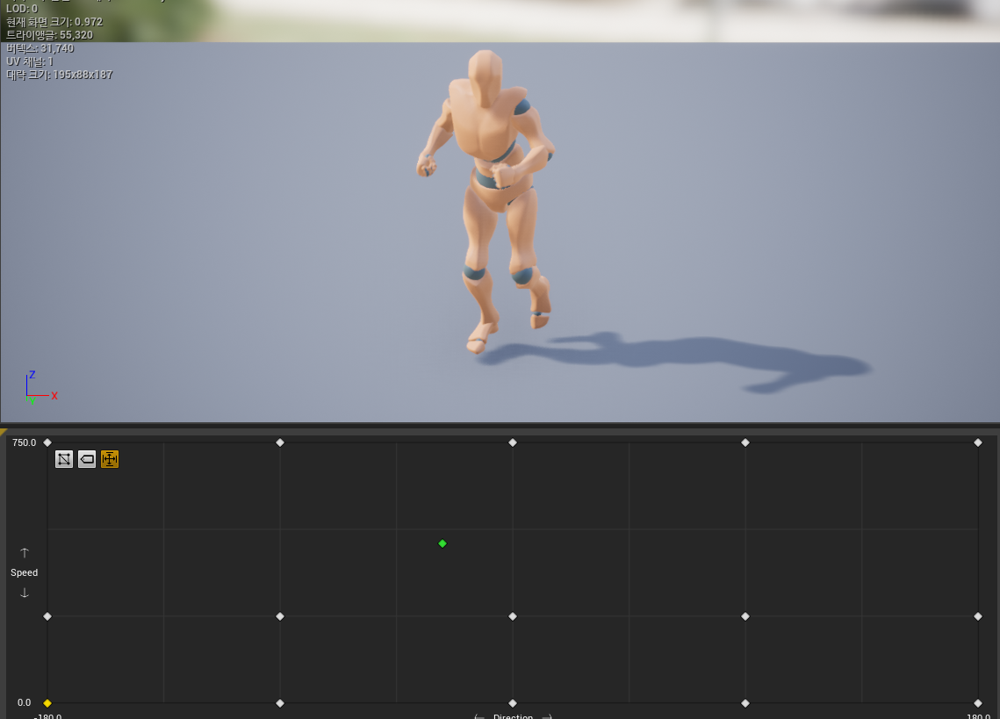
  - AnimInstance 클래스(MainPlayerAnim.cpp) 제작후 BP만들고 위 그림과 같은 Blend 제작
  - bUseControllerRotationYaw 만을 true로 전환하여 카메라 회전시 플레이어도 회전하도록 지정 (위와 같은 애니메이션 제작을 원하기에)
      - MainPalyer의 정보를 얻어와야 하기 때문에 헤더에 선언
      - Anim에서 'Update Animation 이벤트'에 내가 만든 UpdateAnimationProperties()함수를 연결하여 애니메이션에 필요한 데이터를 갱신한다. 
      - 필요한 데이터는 점프여부, 속도, 방향.
    
      <details><summary>c++ 코드</summary> 

      ```c++
      #include "MainPlayer.h"

      void UMainPlayerAnim::NativeInitializeAnimation() {
        if (!MainPlayer) MainPlayer = Cast<AMainPlayer>(TryGetPawnOwner());
      } 

      void UMainPlayerAnim::UpdateAnimationProperties() {
        if (!MainPlayer) MainPlayer = Cast<AMainPlayer>(TryGetPawnOwner());

        if (MainPlayer) {
          FVector Speed = MainPlayer->GetVelocity();
          FRotator Rotator = MainPlayer->GetActorRotation();
          FVector LateralSpeed = FVector(Speed.X, Speed.Y, 0.f);
          MovementSpeed = LateralSpeed.Size();
          DirectionSpeed = CalculateDirection(Speed, Rotator);

          bIsInAir = MainPlayer->GetMovementComponent()->IsFalling();
        }

      }
      ```
      </details>

      <details><summary>h 코드</summary> 

      ```h
      public:
        virtual void NativeInitializeAnimation() override;	//생성시 동작

        UFUNCTION(BlueprintCallable, Category = AnimationProperties)
        void UpdateAnimationProperties();					//틱마다 동작

        UPROPERTY(EditAnywhere, BlueprintReadOnly, Category="Movement")
        class AMainPlayer* MainPlayer;

        UPROPERTY(EditAnywhere, BlueprintReadOnly, Category = "Movement")
        bool bIsInAir;

        UPROPERTY(EditAnywhere, BlueprintReadOnly, Category = "Movement")
        float MovementSpeed;

        UPROPERTY(EditAnywhere, BlueprintReadOnly, Category = "Movement")
        float DirectionSpeed;
      ```
      </details>

> **<h3>Realization</h3>**
- GameMode->Character->Controller->AnimInstance->Blend

## **07.28**
> **<h3>Today Dev Story</h3>**
- ## <span style = "color:yellow;">Character 변경과 시점의 변화</span>
  - 
  - 블랜드는 이전과 동일하고 타켓팅을 활용해서 기존 제공하는 마네퀸 애니메이션을 가져옴
  - __움직임이 없는 Idle 상태일때는 카메라로 캐릭터의 얼굴을 볼 수 있도록 전환__
    - 기존 MovementStatus에 Walk상태를 추가, Tick에서 CheckIdle을 호출
    - CheckIdle에서는 캐릭터의 속도를 기준으로 Idle 또는 Walk로 상태 전환 
      <details><summary>c++ 코드</summary> 

      ```c++
      void AMainPlayer::Tick(float DeltaTime)
      {
        Super::Tick(DeltaTime);

        CheckIdle();
      }
      ...
      void AMainPlayer::CheckIdle() {
        float CurrentVelocity = GetVelocity().Size();

        if (CurrentVelocity == 0) {
          SetMovementStatus(EMovementStatus::EMS_Normal);
          bUseControllerRotationYaw = false;
        }
        else if (MovementStatus != EMovementStatus::EMS_Sprinting) {
          SetMovementStatus(EMovementStatus::EMS_Walk);
          bUseControllerRotationYaw = true;
        }
      }
      ```
      </details>

      <details><summary>h 코드</summary> 

      ```h
      UENUM(BlueprintType)
      enum class EMovementStatus : uint8 {
        EMS_Normal		UMETA(DisplayName = "Normal"),
        EMS_Walk		UMETA(DisplayName = "Walk"),
        ...
      };
      void CheckIdle();
      ```
      </details>

- ## <span style = "color:yellow;">Jump Animation 변경</span>
  - 
  - 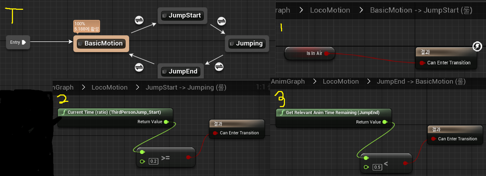
  - 위의 그림과 같이 점프 모션이 구성되어 있으며 JumpStart->Jumping 이나 JumpEnd->BasicMotion에서는 애니메이션 진행 시간의 비율과 남은 시간을 비율을 사용해서 처리


> **<h3>Realization</h3>**

## **07.29**
> **<h3>Today Dev Story</h3>**
- ## <span style = "color:yellow;">무기 장착</span>
  - 
  - 무기를 장착하기 위해서 캐릭터 스켈레톤에 소켓을 추가 (LeftWeapon, RightWeapon)
  - Item클래스 제작후 기본요소인 SphereComponent, Mesh, ParticleSystemComponent 추가 (장착시 임펙트 발생)
    - __OnComponentBegin(End)Overlap.AddDynamic을__ 사용하여 SphereComponent 오버랩시 OnoverlapBegin(end) 함수 적용. (virtual로 제작하여 상속받는 곳에서 Override)
    - Item클래스를 상속받는 Weapon 클래스 추가 하고 무기를 장착하는 Equip함수 생성
    - Weapon 클래스에 Engine/SkeletalMeshSocket.h 추가 및 __GetSocketByName()과 AttachActor를__ 사용하여 지정한 소켓에 어태치
      <details><summary>c++ 코드</summary> 

      ```c++
      //Item.cpp
      #include "Particles/ParticleSystemComponent.h"
      
      AItem::AItem()
      {
        PrimaryActorTick.bCanEverTick = true;

        CollisionVolume = CreateDefaultSubobject<USphereComponent>(TEXT("CollisionVolume"));
        RootComponent = CollisionVolume;

        CollisionVolume->OnComponentBeginOverlap.AddDynamic(this, &AItem::OnOverlapBegin);
        CollisionVolume->OnComponentEndOverlap.AddDynamic(this, &AItem::OnOverlapEnd);

        Mesh = CreateDefaultSubobject<UStaticMeshComponent>(TEXT("Mesh"));
        Mesh->SetupAttachment(GetRootComponent());

        IdleParticleComponent = CreateDefaultSubobject<UParticleSystemComponent>(TEXT("IdleParticleComponent"));
        IdleParticleComponent->SetupAttachment(GetRootComponent());
      }

      //Weapon
      #include "Engine/SkeletalMeshSocket.h"

      AWeapon::AWeapon() {
        SkeletalMesh = CreateDefaultSubobject<USkeletalMeshComponent>(TEXT("SkeletalMesh"));
        SkeletalMesh->SetupAttachment(GetRootComponent());

      }

      void AWeapon::OnOverlapBegin(UPrimitiveComponent* OverlappedComponent, AActor* OtherActor, UPrimitiveComponent* OtherComp, int32 OtherBodyIndex, bool bFromSweep, const FHitResult& SweepResult) {
        Super::OnOverlapBegin(OverlappedComponent, OtherActor, OtherComp, OtherBodyIndex, bFromSweep, SweepResult);
        if (OtherActor) {
          AMainPlayer* Player = Cast<AMainPlayer>(OtherActor);
          if (Player) Equip(Player);
        }
      }

      void AWeapon::OnOverlapEnd(UPrimitiveComponent* OverlappedComponent, AActor* OtherActor, UPrimitiveComponent* OtherComp, int32 OtherBodyIndex) {
        Super::OnOverlapEnd(OverlappedComponent, OtherActor, OtherComp, OtherBodyIndex);

      }

      void AWeapon::Equip(class AMainPlayer* Player) {
        if (Player) {
          const USkeletalMeshSocket* RightHandSocket = Player->GetMesh()->GetSocketByName("RightWeapon");
          if (RightHandSocket) RightHandSocket->AttachActor(this, Player->GetMesh());
        }
      }
      ```
      </details>
      <details><summary>h 코드</summary> 

      ```c++
      //Item.h
      public:	
        virtual void Tick(float DeltaTime) override;

        UPROPERTY(VisibleAnywhere, BlueprintReadWrite, Category = "Item | Collision")
        class USphereComponent* CollisionVolume;

        UPROPERTY(EditAnywhere, BlueprintReadWrite, Category = "Item | Mesh")
        class UStaticMeshComponent* Mesh;

        UPROPERTY(EditAnywhere, BlueprintReadWrite, Category = "Item | Particle")
        class UParticleSystemComponent* IdleParticleComponent;

        UFUNCTION()
        virtual void OnOverlapBegin(UPrimitiveComponent* OverlappedComponent, AActor* OtherActor, UPrimitiveComponent* OtherComp, int32 OtherBodyIndex, bool bFromSweep, const FHitResult& SweepResult);

        UFUNCTION()
        virtual void OnOverlapEnd(UPrimitiveComponent* OverlappedComponent, AActor* OtherActor, UPrimitiveComponent* OtherComp, int32 OtherBodyIndex);

      //Waepon.h
      public:
        AWeapon();

        UPROPERTY(VisibleAnywhere, BlueprintReadOnly, Category = "SkeltalMesh")
        class USkeletalMeshComponent* SkeletalMesh;

        void Equip(class AMainPlayer* Player);

        virtual void OnOverlapBegin(UPrimitiveComponent* OverlappedComponent, AActor* OtherActor, UPrimitiveComponent* OtherComp, int32 OtherBodyIndex, bool bFromSweep, const FHitResult& SweepResult) override;
        
        virtual void OnOverlapEnd(UPrimitiveComponent* OverlappedComponent, AActor* OtherActor, UPrimitiveComponent* OtherComp, int32 OtherBodyIndex) override;
      ```
      </details>

- ## <span style = "color:yellow;">공격 구현</span>
  - 
  - 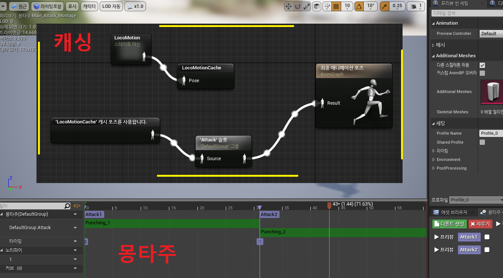
  - 공격 몽타주 제작
    - 캐시를 사용하기 때문에 AnimInstance에서 캐시 또한 연결 필수 (Montage에서 Attack 슬롯 제작)
    - 콤보 구현은 아직이며 왼쪽 마우스를 클릭하면 LBMDown함수가 실행되며 Motage_Play,JumpToSection()을 통해 몽타주가 실행된다.
      <details><summary>c++ 코드</summary> 

      ```c++
      void AMainPlayer::SetupPlayerInputComponent(UInputComponent* PlayerInputComponent)
      {
        ....
        //attack
        PlayerInputComponent->BindAction("LMB", EInputEvent::IE_Pressed, this, &AMainPlayer::LMBDown);
        PlayerInputComponent->BindAction("LMB", EInputEvent::IE_Released, this, &AMainPlayer::LMBUp);
      }

      void AMainPlayer::LMBDown() {
        UAnimInstance* AnimInstance = GetMesh()->GetAnimInstance();
        if (AnimInstance) {
          AnimInstance->Montage_Play(AttackMontage, 1.0f);
          AnimInstance->Montage_JumpToSection(FName("Attack1"), AttackMontage);
        }
      }
      void AMainPlayer::LMBUp() {

      }
      ```
      </details>
      <details><summary>h 코드</summary> 

      ```c++
      public:
        UPROPERTY(EditDefaultsOnly, BlueprintReadOnly, Category = "Anims")
        class UAnimMontage* AttackMontage;

        void LMBDown();
        void LMBUp();
      ```
      </details>
> **<h3>Realization</h3>**   

## **07.30**
> **<h3>Today Dev Story</h3>**
- ## <span style = "color:yellow;">콤보 구현</span> (추후 델리게이트 추가 및 무기별 다른 콤보값을 부여)
  -  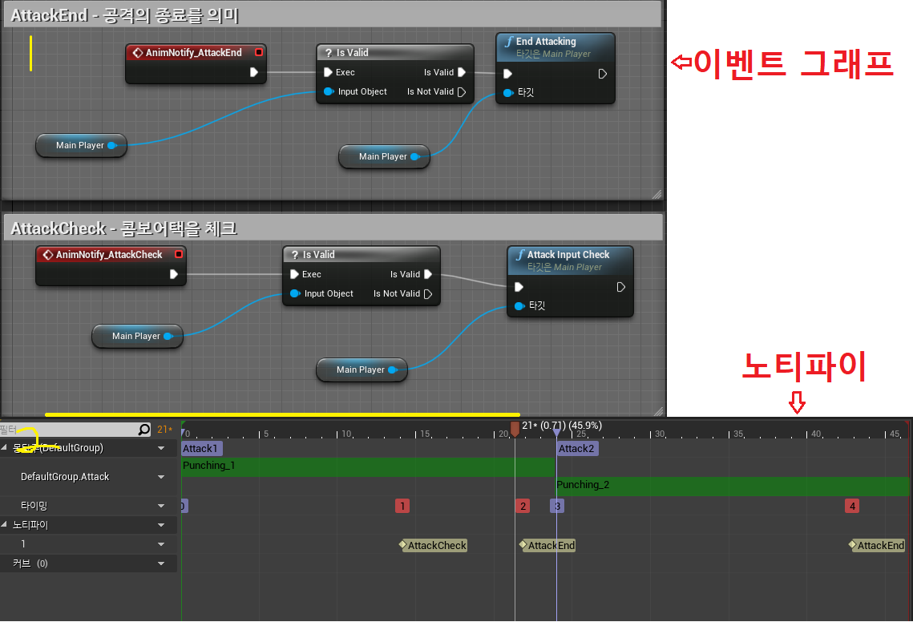
  - 몽타주에 공격의 종료(AttackEnd), 연속 공격의 체크(AttackCheck)하는 노티파이를 설정한다.
    - 해당 노티파이를 AnimInstance의 이벤트 그래프에서 미리 만들어둔 c++ 함수와 연결한다.
    - 마우스 왼쪽 버튼을 누르면 Attack함수와 연결 되는데 이때 공격중인 상태에서 클릭을 하게 되면 AttackInputCheck함수로 가서 몽타주 순서를 증가하고 다음 몽타주를 실행한다.
    - Attack에서는 몽타주가 플레이되고 있느냐에 따라 다음 몽타주 실행 여부가 갈린다.
    - GetAttackMontageSection(int32 Section)에서는 입력번호에 따라 FName이 반환된다.
    - 초기 설정시 콤보의 개수를 정하는 __ComboMaxCount를 설정해줘야 하고, 반드시 공격 노티파이의 이름은 Attack으로 시작하며 시작번호는 0이다.__
      <details><summary>c++ 코드</summary> 

      ```c++
      void AMainPlayer::LMBDown() {
        bLMBDown = true;

        if (!bAttacking) Attack();
        else bIsAttackCheck = true;
      }

      void AMainPlayer::Attack() {
        UAnimInstance* AnimInstance = GetMesh()->GetAnimInstance();
        bAttacking = true;

        if (AnimInstance && AttackMontage) {
          if (!AnimInstance->Montage_IsPlaying(AttackMontage)) {	//공격중이 아닐때 (처음 공격)
            ComboCnt = 0;
            AnimInstance->Montage_Play(AttackMontage);
          }
          else {													//공격중일때
            AnimInstance->Montage_Play(AttackMontage);
            AnimInstance->Montage_JumpToSection(GetAttackMontageSection(ComboCnt),AttackMontage);
          }
        }
      }

      void AMainPlayer::EndAttack() {
        bAttacking = false;
      }

      void AMainPlayer::AttackInputCheck() {
        if (bIsAttackCheck) {
          ComboCnt++;
          if (ComboCnt >= ComboMaxCnt) ComboCnt = 0;
          bIsAttackCheck = false;
          Attack();
        }
      }

      FName AMainPlayer::GetAttackMontageSection(int32 Section) {
        return FName(*FString::Printf(TEXT("Attack%d"), Section));
      }
      ```
      </details>
      <details><summary>h 코드</summary> 

      ```c++
      public:
        UPROPERTY(EditDefaultsOnly, BlueprintReadOnly, Category = "Anims")
        class UAnimMontage* AttackMontage;

        bool bLMBDown;			//공격 키가 눌렸는지 여부
        bool bAttacking;		//공격중인지 여부
        bool bIsAttackCheck;	//또 공격할 건지에 대한 여부
        int ComboCnt;			//현재 공격 횟수
        
        UPROPERTY(EditDefaultsOnly, BlueprintReadOnly, Category = "Anims")
        int ComboMaxCnt;		//최대 공격 횟수

        void Attack();

        UFUNCTION(BlueprintCallable)
        void EndAttack();

        UFUNCTION(BlueprintCallable)
        void AttackInputCheck();

        void LMBDown();
        FORCEINLINE void LMBUp() { bLMBDown = false; }

        FName GetAttackMontageSection(int32 Section);
      ```
      </details>

- ## <span style = "color:yellow;">구르기(대쉬) 구현</span> 
  -  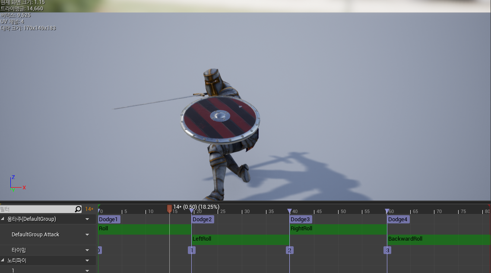
  - 기존 AttackMontage에서 제작했던 섹션이름을 불러오는 GetAttackMontageSection()함수를 Dodge에서 혼합하여 사용하였다.
    - 함수의 피연산자로는 FString과 int32을 받았고 FString에는 "Attack", "Dodge"와 같이 사용할 타입을 적어주면 된다.
  - 새로운 몽타주 Main_Dodge_Montage를 제작하고 4가지 방향으로 구분하여 제작. (AnimInstance의 빈도가 높아져 h에서 구현하고 BeginPlay에서 Attach하였다.)
  - 왼쪽 Ctrl키에 Dodge키를 바인딩 하고 이 상태일때는 데미지를 받지 않도록 한다. (추후)
    - MoveForward()와 MoveRight()의 value값을 DirX/Y에 저장해 두고 구르기 애니메이션을 실행할때 사용
    - 이 값을 AnimDodge()에서 값에 따라 몽타주에 있는 섹션으로 점프하여 애니메이션을 실행한다.
  - Dodge()에서는 이동방향이 존재하고 bCanDodge가 참일때 가능하며, BrakingFrictionFactor의 값을 0.f로 바꾸어 마찰계수를 0으로 둔다.
    - LaunchCharacter()와 GetLastMovementInputVector()를 사용하여 마지막으로 입력된 방향으로 한 Tick동안 시작속도를 DodgeSpeed로 전환한다. (구르기처럼 보인다.)
    - GetWorldTimerManager().SetTimer를 사용하여 DodgeStopTime만큼 기다렸다가 StopMovementImmediately()를 통해 이동을 멈추고 다시 시작속도를 기본값(2.f)로 전환한다.
    - 다시 SetTimer()를 사용하여 DodgeCoolDownTime이 지나면 다시 Dodge가 가능하도록 bCanDodge를 true로 바꿔준다.
      <details><summary>c++ 코드</summary> 

      ```c++
      //Dodge
      void AMainPlayer::SetupPlayerInputComponent(UInputComponent* PlayerInputComponent)
      {   
        ...
        PlayerInputComponent->BindAction("Dodge", EInputEvent::IE_Pressed, this, &AMainPlayer::Dodge);
      }
      ...
      void AMainPlayer::MoveForward(float Value) {
        AddMovementInput(Camera->GetForwardVector(), Value);
        DirX = Value;
      }
      void AMainPlayer::MoveRight(float Value) {
        AddMovementInput(Camera->GetRightVector(), Value);
        DirY = Value;
      }
      ...
      void AMainPlayer::Dodge() {
        if (bCanDodge && DirX !=0 || DirY != 0) {
          GetCharacterMovement()->BrakingFrictionFactor = 0.f;	//뭐에 닿아도 안느려짐
          AnimDodge();
          LaunchCharacter(FVector(GetLastMovementInputVector().X , GetLastMovementInputVector().Y, 0.f) * DodgeSpeed, true, true);	//입력 방향대로
          GetWorldTimerManager().SetTimer(DodgeHandle, this, &AMainPlayer::DodgeEnd, DodgeStopTime,false);
          bCanDodge = false;
        }
      }
      void AMainPlayer::DodgeEnd() {
        GetCharacterMovement()->StopMovementImmediately();
        GetWorldTimerManager().SetTimer(DodgeHandle, this, &AMainPlayer::ResetDodge, DodgeCoolDownTime, false);
        GetCharacterMovement()->BrakingFrictionFactor = 2.f;
      }
      void AMainPlayer::ResetDodge() {
        bCanDodge = true;
      }
      void AMainPlayer::AnimDodge() {
        int Value = 0;

        if (DirX > 0) Value = 1;
        else if (DirX < 0)  Value = 4;
        else if (DirY < 0)  Value = 2;
        else if (DirY > 0)  Value = 3;

        if(!AnimInstance) AnimInstance = GetMesh()->GetAnimInstance();
        if (AnimInstance && DodgeMontage) {
          AnimInstance->Montage_Play(DodgeMontage);
          AnimInstance->Montage_JumpToSection(GetAttackMontageSection("Dodge", Value), DodgeMontage);
        }
      }
      ....
      FName AMainPlayer::GetAttackMontageSection(FString Type, int32 Section) {
        if (Type == "Attack") return FName(*FString::Printf(TEXT("Attack%d"), Section));
        else if (Type == "Dodge") return FName(*FString::Printf(TEXT("Dodge%d"), Section));
        else return "Error";
      }
      ```
      </details>

      <details><summary>h 코드</summary> 

      ```c++
     	/** Dodge */
      public:
        UPROPERTY(EditDefaultsOnly, BlueprintReadOnly, Category = "Movement | Dodge")
        float DodgeSpeed;

        UPROPERTY(EditDefaultsOnly, BlueprintReadOnly, Category = "Movement | Dodge")
        float DodgeCoolDownTime;

        UPROPERTY(EditDefaultsOnly, BlueprintReadOnly, Category = "Movement | Dodge")
        float DodgeStopTime;

        UPROPERTY(EditDefaultsOnly, BlueprintReadOnly, Category = "Movement | Dodge")
        bool bCanDodge;

        //방향
        UPROPERTY(VisibleAnywhere, Category = "Movement | Dodge")
        float DirX;

        UPROPERTY(VisibleAnywhere ,Category = "Movement | Dodge")
        float DirY;

        UPROPERTY(EditDefaultsOnly, BlueprintReadOnly, Category = "Anims")
        UAnimMontage* DodgeMontage;

        UPROPERTY(EditDefaultsOnly, BlueprintReadOnly, Category = "Movement | Dodge")
        FTimerHandle DodgeHandle;

        UFUNCTION()
        void Dodge();

        UFUNCTION()
        void DodgeEnd();

        UFUNCTION()
        void ResetDodge();

        UFUNCTION()
        void AnimDodge();
      ```
      </details>

> **<h3>Realization</h3>** 
- 추후 콤보는 무기마다 다르게 할것이기 때문에 무기마다 다양한 경우의 수를 준비해야한다.
- 구르기할때 방향 지정에 있어 어려움을 겪었다. 
  - 카메라의 방향으로 하자니 앞으로만 구르기가 가능했고, 캐릭터의 ForwardVector()를 이용하기에는 코드가 복잡해졌다.
  - 결국 GetLastMovementInputVector를 사용하여 마지막으로 입력된 방향으로 구르기를 할 수 있게 제작하였다.
  - 과연 몽타주에 넣어서 관리하는 것이 옳은건지 의아하다.
  

## **08.01**
> **<h3>Today Dev Story</h3>**
- ## <span style = "color:yellow;">공격 중 이동을 금지</span>
  - 공격중일때는 움직이는 모든 상태를 정지하기 위해서 MoveForward(),MoveRight(),Jump(),Switch_Sprinting(),Dodge()에 아래 라인을 선언.
    ```c++
    if (bAttacking) return; //추가
    ```

- ## <span style = "color:yellow;">AI의 BehaviorTree</span>
  -  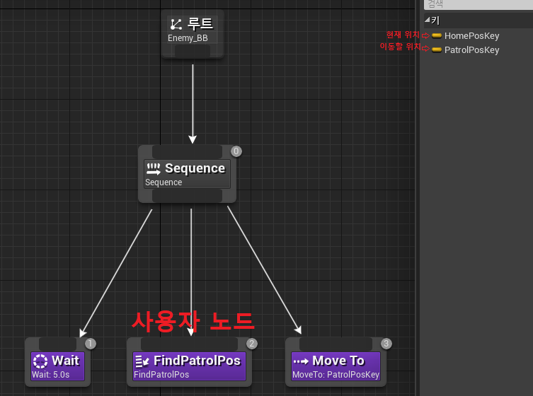
  - 적의 AI를 먼저 구현하기 위해서 Character클래스를 상속받는 Enemy, AIController클래스를 상속받는 EnemyController, BTTaskMode를 상속받는 BTTask_FindPatrolPos를 제작 (반드시 BTTask가 있어야 찾을 수 있다.)
    - BlackBoard에는 HomePosKey(현재 위치), PatrolPosKey(이동할 위치)가 Vector 타입으로 지정.
  - 지면에 Nav Mesh Bounds Volume을 생성하여 Enemy가 갈 수 있는 범위를 지정 (P를 사용하여 세부적으로 관찰 O)
    - Enemy 클래스에 EnemyController를 어태치해주고, EnemyController에 적의 두뇌가 될 BehaviorTree와 트리에 제공할 정보를 관리하는 BlackBoard를 제작.
    - FName으로 HomePosKey와 PatrolPosKey를 저장하여, 추후 SetValueAs~()함수 사용시 이름으로 변수를 찾아 데이터를 저장. BlackBoard와 BehaviorTree도 Controller에 저장
    - BeginPlay에서 UseBlackboard를 사용하여 ~ 하고, Blackboard->SetValueAsVector(HomePosKey,로케이션)함수를 사용하여 위에서 선언해둔 키를 사용하여 저장.
  - BTTaskMode는 BehaviorTree에서 실행하게 될 노드이며, __중요한 점은 "Build.cs"에 NavigationSystem, AIModule, GamePlayTasks를 추가해야만 함.__ 
    - NavigationSystem.h, BehaviorTree/BlackboardComponent.h 추가하여 사용.
    - EBTNodeResult::Type ExecuteTask(UBehaviorTreeComponent& OwnerComp, uint8* NodeMemory) 오버라이드하여 사용한다.
    - 반환값은 항상 성공의 여부이며, "EBTNodeResult::Succeeded, EBTNodeResult::Failed" 등이 있다.
    - 생성자 함수에서 NodeName을 통해 트리에서 사용자에게 보여줄 이름을 지정한다.
    - ExecuteTask()에서는 Enemy의 Pawn을 불러와 NavigationSystemV1을 생성하고, 이 네비게이션시스템의 GetRandomPointNavigableRadius()함수를 사용하여 지정한 범위 내의 Loaction을 사용하여 키값에 저장한다.

      <details><summary>c++ 코드</summary> 
        
      ```c++
      //BTTask_FindPatrolPos.cpp
      #include "BTTask_FindPatrolPos.h"
      #include "EnemyController.h"
      #include "NavigationSystem.h"
      #include "BehaviorTree/BlackboardComponent.h"

      UBTTask_FindPatrolPos::UBTTask_FindPatrolPos()
      {
        NodeName = TEXT("FindPatrolPos");   //트리에서 사용할 이름
      }

      EBTNodeResult::Type UBTTask_FindPatrolPos::ExecuteTask(UBehaviorTreeComponent& OwnerComp, uint8* NodeMemory)
      {
        EBTNodeResult::Type Result = Super::ExecuteTask(OwnerComp, NodeMemory);

        auto ControllingPawn = OwnerComp.GetAIOwner()->GetPawn();   //NavigationSystem을 사용하기 위해서 Enemy의 Pawn을 불러온다.
        if (nullptr == ControllingPawn)
          return EBTNodeResult::Failed; //항상 성공 여부를 반환해야 한다.

        UNavigationSystemV1* NavSystem = UNavigationSystemV1::GetNavigationSystem(ControllingPawn->GetWorld()); //NavigationSystem을 불러옴
        if (nullptr == NavSystem)
          return EBTNodeResult::Failed;

        //EnemyController의 BeginPlay에서 저장한 HomePosKey의 값을 가져와 추후 계산식에서 사용
        FVector Origin = OwnerComp.GetBlackboardComponent()->GetValueAsVector(AEnemyController::HomePosKey);    
      
        FNavLocation NextPatrol;

        //500 범위 내에서 갈 수 있는 곳의 좌표를 NetPatrol에 저장하고 SetValueAsVector로 키값에 데이터를 저장한다.
        if (NavSystem->GetRandomPointInNavigableRadius(FVector::ZeroVector, 500.0f, NextPatrol))
        {
            OwnerComp.GetBlackboardComponent()->SetValueAsVector(AEnemyController::PatrolPosKey, NextPatrol.Location);
            return EBTNodeResult::Succeeded;
        }
        return EBTNodeResult::Failed;
      }
      ```

      ```c++
      //EnemyController.cpp
      
      const FName AEnemyController::HomePosKey(TEXT("HomePosKey"));
      const FName AEnemyController::PatrolPosKey(TEXT("PatrolPosKey"));
      ...
      void AEnemyController::BeginPlay() {
        Super::BeginPlay();

        if (UseBlackboard(BData, Blackboard))
        {
          Blackboard->SetValueAsVector(HomePosKey, GetPawn()->GetActorLocation());	//Location을 HomePosKey에..
          UE_LOG(LogTemp, Warning, TEXT("%s"), *GetPawn()->GetActorLocation().ToString());
          if (!RunBehaviorTree(BTree)) return;    //수정
        }
      }
      ```

      </details>

      <details><summary>h 코드</summary> 

      ```c++
      //BTTask_FindPatrolPos
      UBTTask_FindPatrolPos(); 

      virtual  EBTNodeResult::Type ExecuteTask(UBehaviorTreeComponent& OwnerComp, uint8* NodeMemory) override;
      ```

      ```c++
      //EnemyController
      public:
        //BlackBoard의 키값을 이름으로 저장 -> 다른 코드에서 참조하기 편리하다.
        static const FName HomePosKey;
        static const FName PatrolPosKey;	

        UPROPERTY(EditAnyWhere, BlueprintReadOnly, Category = "AI")
        class UBehaviorTree* BTree;

        UPROPERTY(EditAnyWhere, BlueprintReadOnly, Category = "AI")
        class UBlackboardData* BData;	
      ```

      </details>
  

> **<h3>Realization</h3>** 
- ## <span style = "color:yellow;">Behavior Tree</span>
  - Task -> BlackBoard -> BehaviroTree -> Controller -> Pawn의 순서
  1. Behaviro Tree
    - 계층형 구조이며 노드로 구성되며 왼쪽 노드가 오른쪽 노드보다 우선순위가 높다.
    - 종료시 EBTNodeResult를 사용하여 성공여부를 반환해야한다.

  2. Black Board
    - 필수는 아니지만 하나의 AI에도 데이터를 적용할 수 있고, 다양한 AI에게도 적용이 가능하다. 
    - 키를 추가하여 변수를 설정하며, C++에서는 키의 이름으로 호출하여 데이터를 저장한다.
      ```c++
      Blackboard->SetValueAsVector(키의 이름, 값);	
      ```

## **08.02**
> **<h3>Today Dev Story</h3>**
- ## <span style = "color:yellow;">AI의 BehaviorTree_2 (센서)</span>
  -  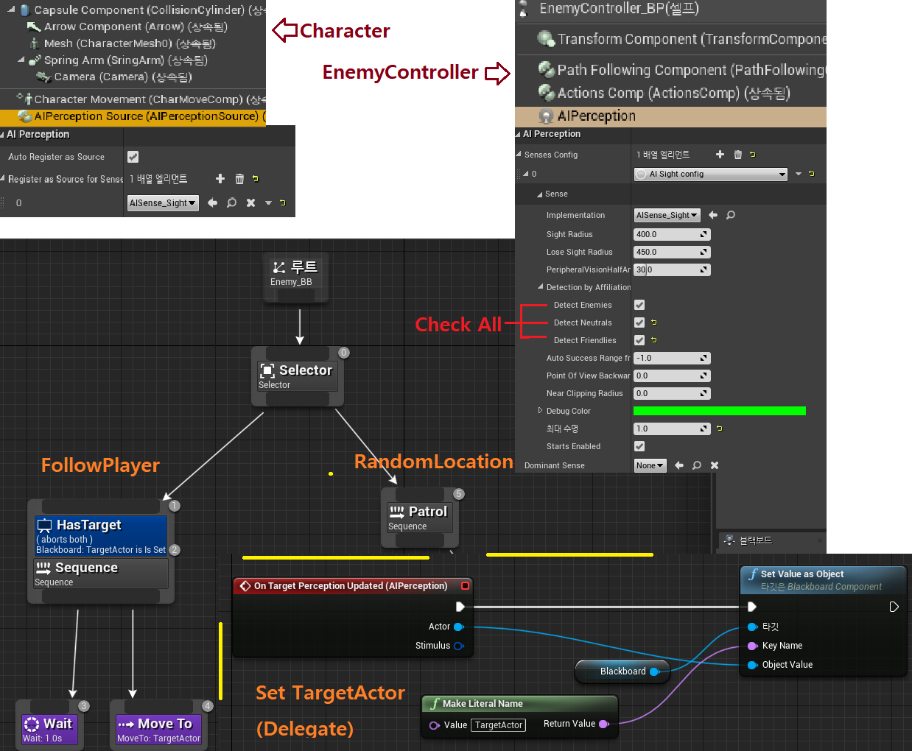  
  - AI의 시야에 있다면 MoveTo를 사용하기 위해서 AI Percoption System을 사용. ex) 소리, 히트, 시야 등... 
  - Object타입으로 TargetActor 키를 생성후 해당 키는 Player를 어태치
  - 왼쪽 시퀀스에 Blackboard를 추가하여 활성화 조건은 TargetActor값의 유무로 판단. (관찰자 중단을 Both로 지정하여 값이 생성되면 바로 전환)
    - 미리 만들어진 기능들을 활성화 하여 사용하며 __Controller.cpp에 UAIPerceptionComponent 컴포넌트와 #include "Perception/AIPerceptionComponent.h"추가__
    - AIPerception의 senses Config에 센서를 활성화 가능 (여러개가 가능하며 필자는 Sight만 사용)
    - 각도등 조정 가능하며 Detection by affiliation을 모두 활성화 하며 모두 감지하도록 전환
		- __Character에 UAIPerceptionStimuliSourceComponent와 #include "Perception/AIPerceptionStimuliSourceComponent.h" 추가__ (Auto Register as Source 활성화 후 Register as Source for Sense에 사용할 센스 추가)
    - ### AIPerception Delegate 수정완료
    - EnemyController는 아직 델리게이트의 개념에 대해서 확실히 배우지 못했기에 Blueprint개념에서 마무리 
  - DefaultGame.ini 아래 문장 추가하여 필요한 Pawn만이 탐지되도록 한정 (찾으려는 액터를 수동으로 찾기 위함. 해당 액터에 AiPerceptionStimulisource 추가해야함.)
		
    ```txt
    [/Script/AIModule.AISence_Sight]
		bAutoRegisterAllPawnsAsSources=false
    ```
  - Controller에 만들어 둔 Perception에 AddEvent/Add OnTagetPerceptionUpdated 델리게이트를 추가하여 이전과 같이 SetValueAsObject를 사용하여 키값에 값 대입.
  - 게임플레이 디버거에서 자세한 내용 확인가능하며 추후 인바이러먼트 쿼리 시스템을 사용하여 AI를 더욱 스마트하게 관리할 것.
      
    <details><summary>c++ 코드</summary> 

    ```c++
    //MainPlayer.cpp
    #include "Perception/AIPerceptionStimuliSourceComponent.h"
    AMainPlayer::AMainPlayer()
    {
      AIPerceptionSource = CreateDefaultSubobject<UAIPerceptionStimuliSourceComponent>(TEXT("AIPerceptionSource"));
      ...
    }
    ```
    </details>     
    
    <details><summary>h 코드</summary> 
    
    ```c++
    public:
      UPROPERTY(EditAnywhere,BlueprintReadOnly, Category = "AIPERCEPTION")
	    class UAIPerceptionStimuliSourceComponent* AIPerceptionSource; 
    ```
    </details>
    
- ## <span style = "color:yellow;">AI의 애니메이션</span>
  - AnimInstance클래스를 상속받는 EnemyAnimInstance를 생성하여 애니메이션에 반환할 Speed 선언하여 NativeUpdateAnimation()함수에서 업데이트
  - 이동을 구현할 BlendSpace인 Enemy_Movement_Blend를 생성하고 MainPlayer와 동일하게 Direction과 Speed 2차원으로 구성 (지금은 Speed만 사용)
      
    <details><summary>c++ 코드</summary> 

    ```c++
    #include "EnemyAnim.h"
    #include "Enemy.h"

    void UEnemyAnim::NativeInitializeAnimation() {
      if(!Enemy) Enemy = Cast<AEnemy>(TryGetPawnOwner());
    }

    void UEnemyAnim::NativeUpdateAnimation(float DeltaSeconds) {
      if (!Enemy) Enemy = Cast<AEnemy>(TryGetPawnOwner());

      if (Enemy) {
        FVector CurrentSpeed = Enemy->GetVelocity();
        Speed = FVector(CurrentSpeed.X, CurrentSpeed.Y, 0).Size();	//현재 속도
      }
    }
    ```
    </details>      
    <details><summary>h 코드</summary> 

    ```c++
    public:
      virtual void NativeInitializeAnimation() override;
      virtual void NativeUpdateAnimation(float DeltaSeconds) override;

      UPROPERTY(EditAnywhere, BlueprintReadOnly, Category = "Movement")
      class AEnemy* Enemy;

      UPROPERTY(EditAnywhere, BlueprintReadOnly, Category = "Movement")
      float Speed;
    ```
    </details>   
  
- ## <span style = "color:yellow;">AI의 공격_1</span>
  -  
  - BTDecorator를 상속받는 BTDecorator_IsInAttackRange생성. CalculateRawConditionValue 함수를 상속받아 조건 달성여부 파악 
    - BTDecorator는 BTTask와는 다르게 조건식을 나타내며, 반환값은 기존 bool을 사용하여서 반환한다.
    - 이전에 플레이어를 찾기 위해 사용했던 TargetActor에 따라 반환되는 값이 결정되며 이에 따라 공격을 진행할 것인지 이동을 진행할 것인지 나뉘게 된다.
    - TagetActor의 오브젝트를 가져와 GetDistanceTo() 함수를 사용하여 거리가 200.f이하로 떨어진다면 True를 반환해 공격으로 전환한다. (_2에서 구현)
    - 이는 각 Sequence에 조건에 어태치 해준다.

      <details><summary>c++ 코드</summary> 

      ```c++
      #include "BTDecorator_IsInAttackRange.h"
      #include "EnemyController.h"
      #include "MainPlayer.h"
      #include "BehaviorTree/BlackboardComponent.h"

      UBTDecorator_IsInAttackRange::UBTDecorator_IsInAttackRange()
      {
        NodeName = TEXT("CanAttack");	
      }

      bool UBTDecorator_IsInAttackRange::CalculateRawConditionValue(UBehaviorTreeComponent& OwnerComp, uint8* NodeMemory) const
      {
        bool bResult = Super::CalculateRawConditionValue(OwnerComp, NodeMemory);

        auto ControllingPawn = OwnerComp.GetAIOwner()->GetPawn();
        if (nullptr == ControllingPawn)	return false;

        auto Target = Cast<AMainPlayer>(OwnerComp.GetBlackboardComponent()->GetValueAsObject(AEnemyController::TargetActor));
        if (nullptr == Target) return false;

        bResult = (Target->GetDistanceTo(ControllingPawn) <= 200.0f);
        return bResult;
      }
      ```
      </details>      
      <details><summary>h 코드</summary> 

      ```c++
      protected:
        virtual bool CalculateRawConditionValue(UBehaviorTreeComponent& OwnerComp, uint8* NodeMemory) const override ;
      ```
      </details>     

- ## <span style = "color:yellow;">잡다한 것</span>
- MainPlayerAnim의 기존 업데이트를 함수를 만들고 Blueprint에서 Update함수와 연결했는데, 그냥 Blueprint를 사용하지 않고 virtual void NativeUpdateAnimation(float DetlaSecons); 로 교체
- 자동 회전을 위해 Enemy의 c++에 borientRorattioatnsd 설정하고 늦은 이동을 위해 300.f로 속도 지정
  <details><summary>c++ 코드</summary> 

  ```c++
  AEnemy::AEnemy()
  {
    PrimaryActorTick.bCanEverTick = true;
    GetCharacterMovement()->MaxWalkSpeed = 300.f;
    GetCharacterMovement()->bOrientRotationToMovement = true;
    GetCharacterMovement()->RotationRate = FRotator(0.f, 540.f, 0.f);
  }
  ```
  </details>    

> **<h3>Realization</h3>** 
- BTDecorator를 상속받는 BTDecorator_IsInAttackRange생성. CalculateRawConditionValue 함수를 상속받아 조건 달성여부 파악 
  - BTDecorator는 BTTask와는 다르게 조건식을 나타내며, 반환값은 기존 bool을 사용하여서 반환한다.

## **08.03**
> **<h3>Today Dev Story</h3>**
- ## <span style = "color:yellow;">OnTargetPerceptionUpdated 델리게이트 처리</span>
  - [이전구성](#AIPerception-Delegate-수정완료)
  - 이전에 EnemyController에서 구현했던 OnTargetPerceptionUpdated의 델리게이트를 c++에서 구현. (AIPerception 또한)
 
    <details><summary>c++ 코드</summary> 

    ```c++
    void AEnemyController::BeginPlay() {
    	Super::BeginPlay();

      //기존 존재하는 OnTargetPerceptionUpdated 델리게이트를 Controller가 아닌 C++에서 구현
      AIPerception->OnTargetPerceptionUpdated.AddDynamic(this, &AEnemyController::Sense);
      ...
    }
    ...
    void AEnemyController::Sense(AActor* Actor, FAIStimulus Stimulus) {
      if (Stimulus.WasSuccessfullySensed()) Blackboard->SetValueAsObject(TargetActor, Actor);
      else Blackboard->ClearValue(TargetActor);
    }
    ```
    </details>      
    <details><summary>h 코드</summary> 

    ```c++
    #include "Perception/AIPerceptionTypes.h"
    UPROPERTY(EditAnyWhere, BlueprintReadWrite, Category= "AI")
	  class UAIPerceptionComponent* AIPerception;

	  UFUNCTION()
	  void Sense(AActor* Actor, FAIStimulus Stimulus);
    ```
    </details>

- ## <span style = "color:yellow;">AI의 공격_2</span>
  -  
  - Task를 하나 만들어서 사용하며 이름은 BTTask_Attack으로 제작. 공격을 판단하기 위해 IsAttacking 변수와 TickTask를 활성화 하기 위해 bNotifyTick = true로 전환.
    - 공격 모션을 취하기 위해서 Attack_Montage생성 및 Enemy에 추가 및 AnimInstance에 캐싱작업 진행
    - BTTask_Attack의 ExceuteTask되면 Enemy의 Attack()함수를 호출. 이때 반환값은 Failed, InProgress로만 한정하여 Succeeded는 TickTask에서 진행. (몽타주가 끝나야 되서)
      - Enemy에서 DECLARE_MULTICAST_DELEGATE(FOnAttackEndDelegate) 델리게이트를 OnAttackEnd로 선언	
      - OnAttackMontageEnded(), Attack()함수 선언. OnAttackMontageEnded()가 종료되면 Task_Attack의 OnAttackEnd와 연결.
      - 몽타주의 종료를 뜻하는 델리게이트(기본제공) OnMontageEnded를 OnAttackMontageEnded와 연결.

      <details><summary>c++ 코드</summary> 

      ```c++
      //BTTask_Attack.cpp
      UBTTask_Attack::UBTTask_Attack() {
        NodeName = "Attack";

        bNotifyTick = true;	//tick 사용
        IsAttacking = false;
      }

      EBTNodeResult::Type UBTTask_Attack::ExecuteTask(UBehaviorTreeComponent& OwnerComp, uint8* NodeMemory) {

        Super::ExecuteTask(OwnerComp, NodeMemory);

        auto Enemy = Cast<AEnemy>(OwnerComp.GetAIOwner()->GetPawn());
        if (!Enemy)	return EBTNodeResult::Failed;

        Enemy->Attack();
        IsAttacking = true;
        Enemy->OnAttackEnd.AddLambda([this]()-> void
        {
          IsAttacking = false;
        });

        return EBTNodeResult::InProgress;
      }

      void UBTTask_Attack::TickTask(UBehaviorTreeComponent& OwnerComp, uint8* NodeMemory, float DeltaSeconds){
        Super::TickTask(OwnerComp, NodeMemory, DeltaSeconds);

        //여기서 테스크 종료
        if (!IsAttacking) {
          FinishLatentTask(OwnerComp, EBTNodeResult::Succeeded);
        }
      }
      ```

      ```c++
      //Enemy.cpp
      void AEnemy::PostInitializeComponents()
      {
        Super::PostInitializeComponents();
        if(!Anim) Anim = Cast<UEnemyAnim>(GetMesh()->GetAnimInstance());

        //행동이 끝나면 다른 함수에게 알려준다. ->OnMontageEnded는 델리게이트 
        Anim->OnMontageEnded.AddDynamic(this, &AEnemy::OnAttackMontageEnded);
      }
      ...
      void AEnemy::Attack() {
        if(!Anim) Anim = Cast<UEnemyAnim>(GetMesh()->GetAnimInstance());

        if (AttackMontage && Anim) {
          Anim->Montage_Play(AttackMontage);
          Anim->Montage_JumpToSection("Attack1", AttackMontage);
        }
      }

      void AEnemy::OnAttackMontageEnded(UAnimMontage* Montage, bool bInterrupted)
      {
        if (IsAttacking) return;
        IsAttacking = false;
        OnAttackEnd.Broadcast();
      }
      ```
      </details>  
          
      <details><summary>h 코드</summary> 

      ```c++
      //BTTask_Attack.h
      public:
        UBTTask_Attack();

        virtual EBTNodeResult::Type ExecuteTask(UBehaviorTreeComponent& OwnerComp, uint8* NodeMemory) override;

      protected:
        virtual void TickTask(UBehaviorTreeComponent& OwnerComp, uint8* NodeMemory,float DeltaSeconds) override;

        bool IsAttacking = false;
      ```

      ```c++
      //Enemy.h
        UPROPERTY()
        class UEnemyAnim* Anim;

      #pragma region ATTACK
        bool IsAttacking = false;

        FOnAttackEndDelegate OnAttackEnd;

        UPROPERTY(EditDefaultsOnly, BlueprintReadOnly, Category = "Anims")
        class UAnimMontage* AttackMontage;

        UFUNCTION()
        void OnAttackMontageEnded(UAnimMontage* Montage, bool bInterrupted);

        UFUNCTION()
        void Attack();
      ```
      </details>

- ## <span style = "color:yellow;">무기에 따른 애니메이션</span>
  -  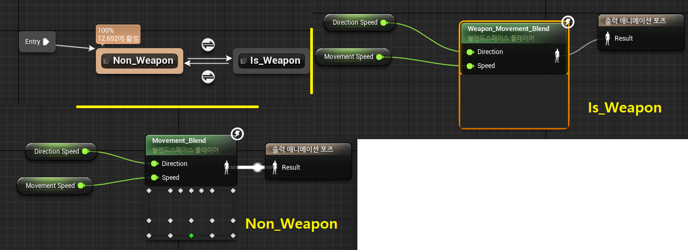 
  - 무기장착여부에 따른 애니메이션(공격, 이동)을 구현하기 위해서 상태 UENUM(EWeaponStatus)을 추가. 
  - 공격 몽타주와 이동 블랜드 스페이스 추가하고, AnimInstance에서 상태에 따른 블랜드 스페이스 실행.
    - 기본은 Normal, 장착시 Weapon으로 구성되며 추후 다양해 질때 수정.
    - MainPlayer에 기존 몽타주인 AttackMontage외에 WeaponMontage 추가
    - Attack에서 무기 여부의 상태에 따라서 몽타주 전환 (추후 콤보횟수 관련 컨트롤. 현재 3개로 제한)
  - 무기 장착시 Weapon에서 SetWeaponStatus함수 호출하여 상태를 전환.
    
    <details><summary>c++ 코드</summary> 
    
    ```c++
    //MainPlaye.cpp
    void AMainPlayer::Attack() {
      UAnimMontage* PlayMontage = nullptr;

      if (GetWeaponStatus() == EWeaponStatus::EWS_Normal) PlayMontage = AttackMontage;
      else if (GetWeaponStatus() == EWeaponStatus::EWS_Weapon) PlayMontage = WeaponAttackMontage;

      bAttacking = true;
      if (!AnimInstance) AnimInstance = GetMesh()->GetAnimInstance();
      if (AnimInstance && PlayMontage) {
        if (!AnimInstance->Montage_IsPlaying(PlayMontage)) {	//공격중이 아닐때 (처음 공격)
          ComboCnt = 0;
          AnimInstance->Montage_Play(PlayMontage);
        }
        else {													//공격중일때
          AnimInstance->Montage_Play(PlayMontage);
          AnimInstance->Montage_JumpToSection(GetAttackMontageSection("Attack", ComboCnt), PlayMontage);
        }
      }
    }
    ```

    ```c++
    //Weapon.cpp
    void AWeapon::Equip(class AMainPlayer* Player) {
      if (Player) {
        const USkeletalMeshSocket* RightHandSocket = Player->GetMesh()->GetSocketByName("RightWeapon");
        if (RightHandSocket) {
          RightHandSocket->AttachActor(this, Player->GetMesh());
          Player->SetWeaponStatus(EWeaponStatus::EWS_Weapon);
        }
      }
    }
    ```
    </details>  
        
    <details><summary>h 코드</summary> 

    ```c++
    //MainPlayer.h
    UENUM(BlueprintType)
    enum class EWeaponStatus : uint8 {
      EWS_Normal		UMETA(DisplayName = "Normal"),
      EWS_Weapon		UMETA(DisplayName = "Weapon"),

      EWS_Default		UMETA(DisplayName = "Default")
    };
    ...
    UPROPERTY(EditDefaultsOnly, BlueprintReadOnly, Category = "Anims")
    class UAnimMontage* WeaponAttackMontage;
    ...
    UPROPERTY(VisibleAnywhere, BlueprintReadWrite, Category = "CurrenWeaponStatus")
    EWeaponStatus WeaponStatus;

    FORCEINLINE void SetWeaponStatus(EWeaponStatus Status) { WeaponStatus = Status; }

    UFUNCTION()
    FORCEINLINE EWeaponStatus GetWeaponStatus() { return WeaponStatus; }
    ```
    </details>

> **<h3>Realization</h3>** 
- 델리게이트 사용 방법 및 개념
  - 기존 포인터는 런타임에 지정이 가능하고 가리키는 메모미 주소를 바꿀 수 있어 유용하지만 표준타입 외의 함수를 지정할 때 안전하지 않다.
  - 그렇기에 델리데이트를 사용하면 안전하다. 어떤 함수가 할당되어 있는지 알지 못하고 호출시 알기 때문에 유연.
    ```c++
    DECLARE_DELEGATE (FStandDelegate)   //선언
    FStandDelegate MyDelegate;          //멤버 추가

    //함수 할당
    MyDelegate.BindUObject(this, 함수); 
    MyDelegate.AddDynamic(this, 함수);

    //실행
    MyDelegate.ExecuteIfBound();  
    MyDelegate.Broadcast();

    //해제
    MyDelegate.Unbind();
    ```

## **08.04**
> **<h3>Today Dev Story</h3>**
- ## <span style = "color:yellow;">무기의 장착과 해제</span>
  -  
  - 이전에는 가까워지면 바로 장착을 했지만, 이번에는 Equip 키를 E로 지정하고 Drop 키를 Q로 지정하여 무기를 줍고 버리는 과정을 진행.
    - Weapon과 Overlap 된다면 ActiveOverlappingItem을 Weapon으로 설정. 이때만 줍기가 가능.
    - Weapon클래스의 Eqiup()은 기존과 동일하며 MainPlayer의 CurrentWeapon에 Weapon을 어태치하고, 본인 스스로의 Overlap을 종료. (다른 물체와 상호작용을 위함)
    - AMainPlayer의 ItemEquip()는 기존과 동일하지만 현재 무기가 있다면 ItemDrop()을 통해 삭제하고 장착
    - AMainPlayer의 ItemDrop()은 CurrentWeapon을 DetachFromActor()를 사용하여 사용자로 부터 제거하고, Destory()를 통해 아에 삭제 후 모든 값 기본값으로
      <details><summary>c++ 코드</summary> 

      ```c++
      //MainPlayer.cpp
      void AMainPlayer::ItemEquip() {
        if (ActiveOverlappingItem != nullptr) {
          AWeapon* CurWeapon = Cast<AWeapon>(ActiveOverlappingItem);

          if (nullptr != CurrentWeapon) ItemDrop();
          
          CurWeapon->Equip(this);
          SetActiveOverlappingItem(nullptr);
        }
      }
      void AMainPlayer::ItemDrop() {
        if (GetWeaponStatus() == EWeaponStatus::EWS_Weapon) {
          CurrentWeapon->DetachFromActor(FDetachmentTransformRules::KeepWorldTransform);
          CurrentWeapon->Destroy();
          CurrentWeapon = nullptr;
          SetWeaponStatus(EWeaponStatus::EWS_Normal);
        }
      }
      ```

      ```c++
      //Weapon.cpp
      void AWeapon::OnOverlapBegin(UPrimitiveComponent* OverlappedComponent, AActor* OtherActor, UPrimitiveComponent* OtherComp, int32 OtherBodyIndex, bool bFromSweep, const FHitResult& SweepResult) {
        Super::OnOverlapBegin(OverlappedComponent, OtherActor, OtherComp, OtherBodyIndex, bFromSweep, SweepResult);
        if (OtherActor) {
          AMainPlayer* Player = Cast<AMainPlayer>(OtherActor);
          if(Player) Player->SetActiveOverlappingItem(this);
        }
      }

      void AWeapon::Equip(class AMainPlayer* Player) {
        if (Player) {
          const USkeletalMeshSocket* RightHandSocket = Player->GetMesh()->GetSocketByName("RightWeapon");
          if (RightHandSocket) {
            RightHandSocket->AttachActor(this, Player->GetMesh());
            Player->SetWeaponStatus(EWeaponStatus::EWS_Weapon);
            Player->SetCurrentWeapon(this);
            
            CollisionVolume->OnComponentBeginOverlap.Clear();	//설정된 콜리전 해제
          }
        }
      }
      ```
      </details>

      <details><summary>h 코드</summary> 

      ```c++
      //MainPlayer.h

      //현재 겹친 아이템
      UPROPERTY(VisibleAnywhere, BlueprintReadOnly, Category ="Acitve")
      class AItem* ActiveOverlappingItem;

      FORCEINLINE void SetActiveOverlappingItem(AItem* item) { ActiveOverlappingItem = item; }

      //현재 장착중인 무기
      UPROPERTY(VisibleAnywhere, Category = "Weapon")
      class AWeapon* CurrentWeapon;

      FORCEINLINE void SetCurrentWeapon(AWeapon* Weapon) { CurrentWeapon = Weapon; }
      FORCEINLINE AWeapon* GetCurrentWeapon() { return CurrentWeapon; }

      UFUNCTION()
      void ItemEquip();

      UFUNCTION()
      void ItemDrop();
      ```
      </details>
      
- ## <span style = "color:yellow;">Enemy 공격의 방향</span>
  -  
  - Enemy가 Player를 공격할 때 회전하지 않는 오류 수정.
    - BTTask_LookAtActor라는 새로운 Task 타입을 생성하여 Enemy를 회전. Tree에서는 Simple Parallel을 통해 동시에 진행.
    - 방향 벡터를 알기 위해서 "Player의 Location - Enemy의 Location" 진행해 주고. FRotationMatrix::MakeFromX()함수를 사용하여 목표의 위치가 얼마나 회전되어야 하는지 탐색.
    - FMath::RInterpTo()를 사용하여 초마다 Enemy의 Rotation을 수정.

      <details><summary>c++ 코드</summary> 

      ```c++
      #include "BTTask_LookAtActor.h"
      #include "Enemy.h"
      #include "AIController.h"
      #include "EnemyController.h"
      #include "MainPlayer.h"
      #include "BehaviorTree/BlackboardComponent.h"

      UBTTask_LookAtActor::UBTTask_LookAtActor() {
        NodeName = TEXT("LookAtAtor");
      }

      EBTNodeResult::Type UBTTask_LookAtActor::ExecuteTask(UBehaviorTreeComponent& OwnerComp, uint8* NodeMemory) {
        Super::ExecuteTask(OwnerComp, NodeMemory);

        AEnemy* Enemy = Cast<AEnemy>(OwnerComp.GetAIOwner()->GetPawn());
        if (!Enemy) return EBTNodeResult::Failed;

        AMainPlayer* Target = Cast<AMainPlayer>(OwnerComp.GetBlackboardComponent()->GetValueAsObject(AEnemyController::TargetActor));
        if (!Target) return EBTNodeResult::Failed;

        FVector LookVec = Target->GetActorLocation() - Enemy->GetActorLocation();
        LookVec.Z = 0;
        FRotator LookRot = FRotationMatrix::MakeFromX(LookVec).Rotator();
        Enemy->SetActorRotation(FMath::RInterpTo(Enemy->GetActorRotation(), LookRot, GetWorld()->GetDeltaSeconds(), 2.0f));
        return EBTNodeResult::Succeeded;
      }
      ```
      </details>

- ## <span style = "color:yellow;">잡다한 것</span>
  - 카메라가 적을 통과하지 못하기에 카메라에 대한 적의 Collsion을 Ignore로 변경.
    <details><summary>c++ 코드</summary> 

    ```c++
    //Enemy.cpp
    void AEnemy::BeginPlay()
    {
      Super::BeginPlay();

      GetMesh()->SetCollisionResponseToChannel(ECollisionChannel::ECC_Camera, ECollisionResponse::ECR_Ignore);
      GetCapsuleComponent()->SetCollisionResponseToChannel(ECollisionChannel::ECC_Camera, ECollisionResponse::ECR_Ignore);
      ...
    }
    ```
    </details>

> **<h3>Realization</h3>** 
- FRotationMatrix는 회전 행렬과 관련
  - FRotationMatrix::MakeFromX() -> X축으로 얼마나의 회전이 필요한지.
- UKismetMathLibrary::FindLookAtRotation()을 통해서 자동으로 Rotation 반환
- FMath::RInterpTo()을 사용해서 방향 전환

## **08.05**
> **<h3>Today Dev Story</h3>**
- ## <span style = "color:yellow;">무기의 콜리전</span>
  -  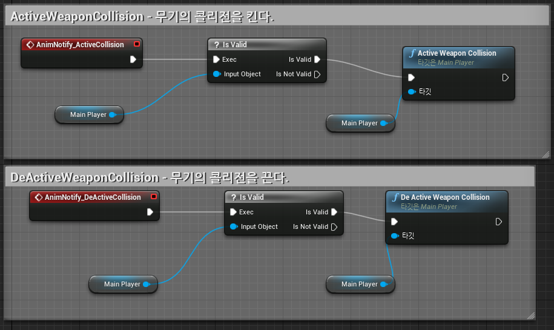 
  - Weapon클래스에 BoxComponent를 추가하고 OnComponentBeginOverlap 또한 추가. __SetCollisionEnabled()함수 사용__
    - BeginPlay에서 Overlap 설정 및 AttackBox의 콜리전을 끈상태로 구현.
    - De/ActiveOnCollision()함수를 통해서 BoxComponent의 콜리전을 끄고 키는 기능 구현. (MainPlayer가 호출하여 사용.)
    - Weapon_Attack_Montage에 Collision노티파이 추가.
    - MainPlayer의 De/ActiveWeaponCollision()에서 Weapon의 ActiveOnCollision()을 호출하며 Weapon_Attack_Montage에 Collision노티파이와 연관하여 사용.
  - 현재는 맞았다는 로그만 띄우고 데미지는 추후 구현
  - 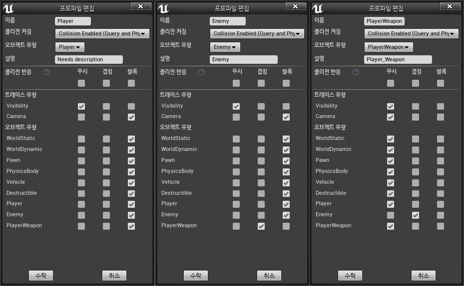 
  - 각 Actor 마다 전용 콜리전 채널을 생성하기 위해서 프로젝트세팅 > 콜리전에서 Object채널과 Preset 채널을 추가하여 구현.
    - Player, Enemy, Player_Weapon 3가지를 구현했으며 트레이스 채널 번호는 DefaultEngine.ini에 존재
    - Player_Weapon은 오직 Enemy와 Overlap. 나머지는 Block or Ignore으로 적용.
    - 각 생성자 함수에서 Player와 Enemy는 GetCapsuleComponent()에 대해, Weapon은 AttackBox에 대해 SetCollisionProfileName() 으로 콜리전 설정
      
      <details><summary>c++ 코드</summary> 

      ```c++
      //Weapon.cpp
      void AWeapon::BeginPlay() {
        Super::BeginPlay();

        AttackBox->OnComponentBeginOverlap.AddDynamic(this, &AWeapon::OnAttackBoxOverlapBegin);
        AttackBox->OnComponentEndOverlap.AddDynamic(this, &AWeapon::OnAttackBoxOverlapEnd);
        AttackBox->SetCollisionEnabled(ECollisionEnabled::NoCollision);	//원래 꺼있는 상탱
      }
      ...
      void AWeapon::OnAttackBoxOverlapBegin(UPrimitiveComponent* OverlappedComponent, AActor* OtherActor, UPrimitiveComponent* OtherComp, int32 OtherBodyIndex, bool bFromSweep, const FHitResult& SweepResult) {	
        if (OtherActor) {
          AEnemy* Enemy = Cast<AEnemy>(OtherActor);
          
          if(Enemy) UE_LOG(LogTemp, Warning, TEXT("Hit!"));
        }
      }

      void AWeapon::OnAttackBoxOverlapEnd(UPrimitiveComponent* OverlappedComponent, AActor* OtherActor, UPrimitiveComponent* OtherComp, int32 OtherBodyIndex) {

      }

      void AWeapon::ActiveOnCollision() {
        AttackBox->SetCollisionEnabled(ECollisionEnabled::QueryOnly);
        UE_LOG(LogTemp, Warning, TEXT("CollisionON"));
      }
      void AWeapon::DeActiveOnCollision() {
        AttackBox->SetCollisionEnabled(ECollisionEnabled::NoCollision);
        UE_LOG(LogTemp, Warning, TEXT("CollisionOff"));
      }
      ```

      ```c++
      //MainPlayer.cpp
      void AMainPlayer::ActiveWeaponCollision() {
        GetCurrentWeapon()->ActiveOnCollision();
      }
      void AMainPlayer::DeActiveWeaponCollision() {
        GetCurrentWeapon()->DeActiveOnCollision();
      }
      ```
      </details>

      <details><summary>h 코드</summary> 

      ```c++
      //weapon.h
      //공격 피직스담당
      UPROPERTY(VisibleAnywhere, BlueprintReadOnly,Category = "Attack")
      class UBoxComponent* AttackBox;

      UFUNCTION()
      void OnAttackBoxOverlapBegin(UPrimitiveComponent* OverlappedComponent, AActor* OtherActor, UPrimitiveComponent* OtherComp, int32 OtherBodyIndex, bool bFromSweep, const FHitResult& SweepResult);

      UFUNCTION()
      void OnAttackBoxOverlapEnd(UPrimitiveComponent* OverlappedComponent, AActor* OtherActor, UPrimitiveComponent* OtherComp, int32 OtherBodyIndex);


      UFUNCTION()	//WeaponBox의 콜리전을 키고 끄는 기능 (Main에게 호출 되어 사용)
      void ActiveOnCollision();

      UFUNCTION()	//WeaponBox의 콜리전을 키고 끄는 기능 (Main에게 호출 되어 사용)
      void DeActiveOnCollision();
      ```

      ```c++
      //MainPlayer.h
      UFUNCTION(BlueprintCallable)	//Weapon의 콜리전을 키고 끄는 기능
      void ActiveWeaponCollision();

      UFUNCTION(BlueprintCallable)	//Weapon의 콜리전을 키고 끄는 기능
      void DeActiveWeaponCollision();
      ```
      </details>

- ## <span style = "color:yellow;">플레이어가 적에게 주는 데미지</span>
  - 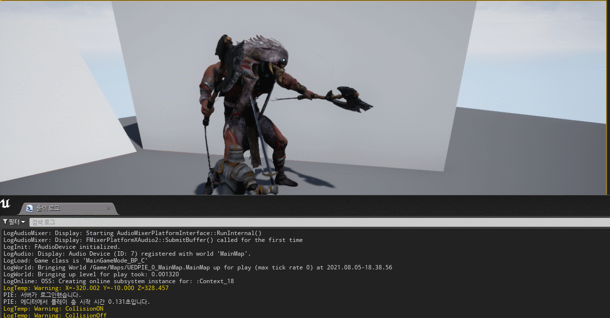 
  - #### 데미지를 주는 방법
  - API로 제공되는 UGameplayStatics::ApplyDamge() 메서드와 Actor에 제공되는 TakeDamage() 메서드를 이용하여 구성.
    - 데미지를 받는 Enemy 클래스에 TakeDamage()를 오버라이드하여 구성하고, Weapon 클래스에서 데미지를 주기 때문에 OnAttackBoxOverlapBegin()에서 ApplyDamage()함수 실행.
    - 이때 데미지를 주는 클래스, 데미지 값, 현재 컨트롤러, 데미지 타입등이 피연산자로 필요. (데미지 타입은 BP에서 )
    - 아직 다 구현하지 않아서 데미지를 입는다면 로그로 적의 현재 체력 표시.
      <details><summary>c++ 코드</summary> 

      ```c++
      //Weapon.cpp
      void AWeapon::OnAttackBoxOverlapBegin(UPrimitiveComponent* OverlappedComponent, AActor* OtherActor, UPrimitiveComponent* OtherComp, int32 OtherBodyIndex, bool bFromSweep, const FHitResult& SweepResult) {	
        if (OtherActor) {
          AEnemy* Enemy = Cast<AEnemy>(OtherActor);

          //적의 TakeDamage와 연결되어 Damage만큼 체력 감소
          if (Enemy) UGameplayStatics::ApplyDamage(Enemy, Damage, WeaponInstigator, this, DamageTypeClass);
        }
      }
      ```

      ```c++
      //Enemy.cpp
      float AEnemy::TakeDamage(float DamageAmount, struct FDamageEvent const& DamageEvent, class AController* EventInstigator, AActor* DamageCauser) {
        CurrentHealth -= DamageAmount;
        if(CurrentHealth < 0.f) {
          CurrentHealth = 0;
          Die();
        }
        UE_LOG(LogTemp, Warning, TEXT("Health : %f"), CurrentHealth);

        return DamageAmount;
      }
      ```
      </details>

      <details><summary>h 코드</summary> 

      ```c++
      //Weapon.h
      UPROPERTY(EditAnyWhere, BlueprintReadWrite, Category = "Combat")
      float Damage;

      UPROPERTY(EditAnywhere, BlueprintReadWrite, Category = "Combat")
      TSubclassOf<UDamageType> DamageTypeClass;   //데미지 타입을 지정. (3가지 존재)

      UPROPERTY(VisibleAnywhere, BlueprintReadOnly, Category = "Combat")
      AController* WeaponInstigator;		//메인의 컨트롤러를 가져와 피연산값에서 사용.

      FORCEINLINE void SetInstigator(AController* Inst) { WeaponInstigator = Inst; }
      ```
      ```c++
      //Enemy.h
      UPROPERTY(VisibleAnywhere, BlueprintReadOnly, Category = "Health")
      float MaxHealth;

      UPROPERTY(VisibleAnywhere, BlueprintReadOnly, Category = "Health")
      float CurrentHealth;

      virtual float TakeDamage(float DamageAmount,struct FDamageEvent const& DamageEvent,class AController* EventInstigator,AActor* DamageCauser) override;
      ```
      </details>

- ## <span style = "color:yellow;">잡다한 것</span>
  1. Weapon의 Equip에서 기존 사용되었던 줍기에 사용 되는 콜리전을 끈다.
  - 이전에는 Overlaping을 파괴하는 방식. 
    ```c++
    void AWeapon::Equip(class AMainPlayer* Player) {
      CollisionVolume->SetCollisionEnabled(ECollisionEnabled::NoCollision); //줍기에 사용 되는 콜리전을 끈다.
    }
    ```

> **<h3>Realization</h3>** 
- TakeDamage와 ApplyDamage 메서드를 사용하여 데미지를 입히는 것이 가능하며 직접 구현해도 어렵지 않다.
  - ApplyDamage메서드 사용시 데미지 타입이라는 피연산자 값이 존재하는데 이 타입을 지정함에 따라 지속적인 체력 감소등을 구현가능.

## **08.06**
> **<h3>Today Dev Story</h3>**
- ## <span style = "color:yellow;">적의 사망 처리</span>
  - 
  - #### Player도 같은 방식으로처리
  - 적의 체력이 0이하로 내려가면 애니메이션처리(DeathEnd)과 파괴 처리(DestoryEnemy).
  - DeathEnd() 메서드는 체력이 0이하로 내려갔을때 호출되며 AttackMontage에 있는 Death노드가 실행되고 컨트롤러의 비헤이비어트리를 정지하고 콜리전을 끔
    - BehaviorTree를 정지하기 위해서 EnemyController 클래스에 StopBeTree() 메서드를 생성.
    - 기존 존재하는 BrainComponent를 BehaviorTreeComponent로 캐스팅 후 StopTree() 메서드 진행하여 트리를 정지.
    - 이때 BrainComponent는 내가 정의한 BehaviorTreeComponent를 동적으로 적용하는 공간. (내부적으로 뒤져봤을 때는 그렇다.)
  - DestoryEnemy() 메서드는 애니메이션 종료시점에 노티파이를 지정해 두었는데 이때 실행되며 애니메이션과 움직임의 변화를 끄고 파괴.
    
    <details><summary>c++ 코드</summary> 

    ```c++
    //Enemy.cpp
    void AEnemy::DeathEnd() {
      if (!Anim) Anim = Cast<UEnemyAnim>(GetMesh()->GetAnimInstance());
      if (AttackMontage && Anim) {
        Anim->Montage_Play(AttackMontage);
        Anim->Montage_JumpToSection("Death", AttackMontage);
      }

      Cast<AEnemyController>(GetController())->StopBeTree();	//비헤이비어 트리 정지 (내가 만듬)
      GetCapsuleComponent()->SetCollisionEnabled(ECollisionEnabled::NoCollision);
    }

    void AEnemy::DestroyEnemy() {
      GetMesh()->bPauseAnims = true;          //애니메이션 정지
      GetMesh()->bNoSkeletonUpdate = true;    //움직임 정지
      Destroy();
    }
    ```
    ```c++
    //EnemyController.cpp
    void AEnemyController::StopBeTree() {
      UBehaviorTreeComponent* BTComp = Cast<UBehaviorTreeComponent>(BrainComponent);
      BTComp->StopTree(); 
    }
    ``` 
      
    </details>
    <details><summary>h 코드</summary> 

    ```c++
    //Enemy.h
    UFUNCTION()
    void DeathEnd();

    UFUNCTION(BlueprintCallable)
    void DestroyEnemy();
    ```
    ```c++
    //EnemyController.h
    UFUNCTION()           //트리를 정지. (Enemy 사망시)
    void StopBeTree();
    ```
    </details>
    
- ## <span style = "color:yellow;">피격효과</span>
  - 
  - #### Player도 동일하게 구현
  - 무기의 스켈레탈 메쉬에 소켓(ParticleSpawn)을 추가하고 피격시 사용할 ParticleSystem을 Enemy에 추가.
  - 피격효과는 OnAttackBoxOverlapBegin() 메서드, 즉 피격성공시 SpawnEmitterAtLocation() 메서드를 사용하여 호출.
    <details><summary>c++ 코드</summary> 

    ```c++
    //Weapon.c++
    void AWeapon::OnAttackBoxOverlapBegin(UPrimitiveComponent* OverlappedComponent, AActor* OtherActor, UPrimitiveComponent* OtherComp, int32 OtherBodyIndex, bool bFromSweep, const FHitResult& SweepResult) {	
      if (OtherActor) {
        AEnemy* Enemy = Cast<AEnemy>(OtherActor);
        if (!Enemy) return;

        UGameplayStatics::ApplyDamage(Enemy, Damage, WeaponInstigator, this, DamageTypeClass);

        const USkeletalMeshSocket* HitSocket = SkeletalMesh->GetSocketByName("ParticleSpawn");
        if (HitSocket && Enemy->GetHitParticle()) {
          FVector ParticleSpawnLocation = HitSocket->GetSocketLocation(SkeletalMesh);
          UGameplayStatics::SpawnEmitterAtLocation(GetWorld(), Enemy->GetHitParticle(), ParticleSpawnLocation, FRotator(0.f));
        }
      }
    }
    ``` 
    
    </details>
    <details><summary>h 코드</summary> 

    ```c++
    //Enemy.h
    UPROPERTY(EditAnywhere, BlueprintReadWrite, Category = "Particle")
    class UParticleSystem* HitParticle;

    FORCEINLINE UParticleSystem* GetHitParticle() { return HitParticle; }
    ```
    </details>

> **<h3>Realization</h3>** 
- BehaviorTree를 중지하기 위해서 BrainComponent를 사용해서 StopTree() 메서드를 사용한다.

## **08.08**
> **<h3>Today Dev Story</h3>**
- ## <span style = "color:yellow;">적의 HUD와 연결</span>
  - 
  - CombatArena.Build.cs에서 PrivateDependencyModuleNames.AddRange(new string[] { "Slate", "SlateCore" }) 추가. 이는 UI 플레임워크를 사용하기 위함.
  - Enemy_Health_Widget이라는 위젯 블루프린트를 생성하여 디자인. 이는 적의 머리위에 표시 (단점 : 거리에 따라 같은 위젯의 크기.)
  - MainPlayer에 SphereComponent를 추가하고 overlap되면 Controller의 Show/HideEnemyHUD()메서드 실행.
  - MainPlayerController의 Beginplay에서 UUserWidget을 CreateWidget(), AddToViewport() 메서드를 사용하여 생성 후 화면에 배치
    - Tick에서 Widget이 존재한다면 적의 위치를 화면상의 위치로 전환하여 postionInViewport()를 수정.
    - ShowEnemyHUD(), HideEnemyHUD() 메서드를 사용하여 SetVisiblility()를 Visible과 Hidden으로 전환. 이는 MainPlayer의 오버랩되면 호출.
    - #### Stamina도 동일하게 구현
    
      <details><summary>c++ 코드</summary> 

      ```c++
      //MianPlayer.cpp
      void AMainPlayer::PossessedBy(AController* NewController) {
        Super::PossessedBy(NewController);

        PlayerController = Cast<AMainController>(GetController());
      }
      ...
      void AMainPlayer::OnEnemyHUD_OverlapBegin(UPrimitiveComponent* OverlappedComponent, AActor* OtherActor, UPrimitiveComponent* OtherComp, int32 OtherBodyIndex, bool bFromSweep, const FHitResult& SweepResult) {
        if (OtherActor) {
          CombatTarget = Cast<AEnemy>(OtherActor);
          if (CombatTarget) {
            PlayerController->ShowEnemyHUD();
          }
        }
      }

      void AMainPlayer::OnEnemyHUD_OverlapEnd(UPrimitiveComponent* OverlappedComponent, AActor* OtherActor, UPrimitiveComponent* OtherComp, int32 OtherBodyIndex) {
        if (OtherActor) {
          CombatTarget = Cast<AEnemy>(OtherActor);
          if (CombatTarget) {
            PlayerController->HideEnemyHUD();
            CombatTarget = nullptr;
          }
        }
      }
      ``` 
      ```c++
      //MainController.cpp
      #include "Components/WidgetComponent.h"
      #include "Blueprint/UserWidget.h"

      AMainController::AMainController() {
          SizeInViewport = FVector2D(300.f, 30.f);
      }

      void AMainController::BeginPlay() {
        if (WEnemyHealth) {
          EnemyHealthWidget = CreateWidget<UUserWidget>(this, WEnemyHealth);
          if (EnemyHealthWidget) {
            EnemyHealthWidget->AddToViewport();
            EnemyHealthWidget->SetVisibility(ESlateVisibility::Hidden);
          }
        }
      }
      if (EnemyHealthWidget) {	//적의 위치 얻고 화면의 위치로 변환
        ProjectWorldLocationToScreen(EnemyLocation, PositionInViewport);
        PositionInViewport.Y -= 170.f;
        PositionInViewport.X -= 100.f;

        EnemyHealthWidget->SetPositionInViewport(PositionInViewport);	//위치
        EnemyHealthWidget->SetDesiredSizeInViewport(SizeInViewport);	//사이즈
      }

      void AMainController::ShowEnemyHUD() {
        EnemyHealthWidget->SetVisibility(ESlateVisibility::Visible);
      }

      void AMainController::HideEnemyHUD() {
        EnemyHealthWidget->SetVisibility(ESlateVisibility::Hidden);
      }
      ``` 
      
      </details>
      <details><summary>h 코드</summary> 

      ```c++
      //MainPlayer.h
      virtual void PossessedBy(AController* NewController) override;
      class AMainController* PlayerController;		//GetController and Save
      
      ...

      UPROPERTY(VisibleAnywhere, BlueprintReadOnly, Category = "HUD")
      class AEnemy* CombatTarget;

      UPROPERTY(EditAnywhere, BlueprintReadWrite, Category= "HUD")
      USphereComponent* EnemyHUDOverlap;

      UFUNCTION()
      void OnEnemyHUD_OverlapBegin(UPrimitiveComponent* OverlappedComponent, AActor* OtherActor, UPrimitiveComponent* OtherComp, int32 OtherBodyIndex, bool bFromSweep, const FHitResult& SweepResult);

      UFUNCTION()
      void OnEnemyHUD_OverlapEnd(UPrimitiveComponent* OverlappedComponent, AActor* OtherActor, UPrimitiveComponent* OtherComp, int32 OtherBodyIndex);
      ```
      ```c++
      //MainController.h
      UPROPERTY(VisibleAnywhere, Category = "Widget | EnemyWidget")
      FVector2D PositionInViewport;		//적의 위치를 2D상으로 표시

      UPROPERTY(EditAnywhere, BlueprintReadWrite, Category = "Widget | EnemyWidget")
      FVector2D SizeInViewport;			//위젯의 사이즈

      UPROPERTY(VisibleAnywhere, Category = "Widget | EnemyWidget")
      class UUserWidget* EnemyHealthWidget;

      UPROPERTY(EditAnywhere, BlueprintReadWrite, Category = "Widget | EnemyWidget")
      TSubclassOf<class UUserWidget> WEnemyHealth;

      UPROPERTY(VisibleAnywhere, BlueprintReadOnly, Category = "Widget | EnemyWidget")
      FVector EnemyLocation;

      FORCEINLINE void SetEnemyLocation(FVector Pos) { EnemyLocation = Pos; }

      UFUNCTION()
      void ShowEnemyHUD();

      UFUNCTION()
      void HideEnemyHUD();
      ```
      </details>

- ## <span style = "color:yellow;">Player Status HUD</span>
  - 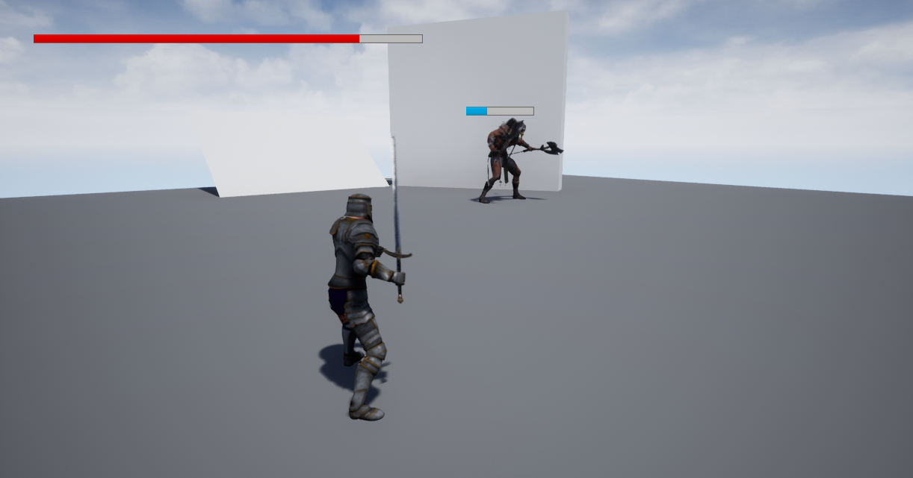
  - #### UserWidget 사용
  - 이전에 구현했던 방식은 크기에 대한 변형이 없는 PlayerStatus에서 표현. 아직 데이터의 연결은 못한 상태
  - UserWidget만을 받아 단순히 CreateWidget() 메서드로 생성 후 AddToViewport() 메서드로 화면상에 배치.
    <details><summary>c++ 코드</summary> 

    ```c++
    //MainController.cpp
    void AMainController::BeginPlay() {
      if (WPlayerMainHealth) {
        PlayerWidget = CreateWidget<UUserWidget>(this, WPlayerMainHealth);
        if (PlayerWidget) {
          PlayerWidget->AddToViewport();
          PlayerWidget->SetVisibility(ESlateVisibility::Visible);
        }
      }
    }
    ```
    
    </details>
    <details><summary>h 코드</summary> 

    ```c++
    //MainPlayer.h
    UPROPERTY(VisibleAnywhere, Category = "Widget | EnemyWidget")
    class UUserWidget* PlayerWidget;

    UPROPERTY(EditAnywhere, BlueprintReadWrite, Category = "Widget | EnemyWidget")
    TSubclassOf<class UUserWidget> WPlayerMainHealth;
    ```
    </details>

- ## <span style = "color:yellow;">적의 HUD와 연결_2</span>
  - 
  - #### UserComponent 사용
  - 이전에 구현했던 적의 HUD는 플레이어와 적의 거리가 멀어져도 크기가 일정하기에 수정이 필요.
  - 호출하는 방식은 전과 동일하게 EnemyHUDOverlap이라는 SphereComponent에 Overlap 되면 Visible을 전환하는 방식으로 처리.
  - 이전 방식은 UUserWidget을 바로 생성했다면 이 방식은 UWidgetComponent를 객체 인스턴스화 한 후 위치와 시점을 설정.
    - BeginPlay() 메서드 호출 시 TSubclassOf로 미리 설정한 UUserWidget을 UWidgetComponent에 어태치.
    - SetDrawSize() 메서드를 사용하여 위젯의 크기 지정 후 SetVisibility를 false로 시각적 요소 종료.
      <details><summary>c++ 코드</summary> 

      ```c++
      //Enemy.cpp
      AEnemy::AEnemy()
      {
        ...
        //HUD
        HealthWidget = CreateDefaultSubobject<UWidgetComponent>(TEXT("HealthWidget"));
        HealthWidget->SetupAttachment(GetMesh());
        HealthWidget->SetRelativeLocation(FVector(0.f, 0.f, 200.f));
        HealthWidget->SetWidgetSpace(EWidgetSpace::Screen);
      }
      void AEnemy::BeginPlay()
      {
        ...
        //HUD
        if (WEnemyHealth) {
          HealthWidget->SetWidgetClass(WEnemyHealth);
          HealthWidget->SetDrawSize(FVector2D(150.f, 20.f));
          HealthWidget->SetVisibility(false);       // 생성은 하지만 시각은 제거
        }
      }
      ...
      void AEnemy::ShowEnemyHealth() {
        HealthWidget->SetVisibility(true);
      }

      void AEnemy::HideEnemyHealth() {

        HealthWidget->SetVisibility(false);
      }
      ```
      ```c++
      //MainPlayer.cpp
      void AMainPlayer::OnEnemyHUD_OverlapBegin(UPrimitiveComponent* OverlappedComponent, AActor* OtherActor, UPrimitiveComponent* OtherComp, int32 OtherBodyIndex, bool bFromSweep, const FHitResult& SweepResult) {
        if (OtherActor) {
          CombatTarget = Cast<AEnemy>(OtherActor);
          if (CombatTarget) {
            CombatTarget->ShowEnemyHealth();
          }
        }
      }

      void AMainPlayer::OnEnemyHUD_OverlapEnd(UPrimitiveComponent* OverlappedComponent, AActor* OtherActor, UPrimitiveComponent* OtherComp, int32 OtherBodyIndex) {
        if (OtherActor) {
          CombatTarget = Cast<AEnemy>(OtherActor);
          if (CombatTarget) {
            CombatTarget->HideEnemyHealth();
            CombatTarget = nullptr;
          }
        }
      }
      ```
      
      </details>
      <details><summary>h 코드</summary> 

      ```c++
      //Enemy.h
      UPROPERTY(VisibleAnywhere, Category = "Widget | EnemyWidget")
      class UWidgetComponent* HealthWidget;

      UPROPERTY(EditAnywhere, BlueprintReadWrite, Category = "Widget | EnemyWidget")
      TSubclassOf<class UUserWidget> WEnemyHealth;
      
      //Call at MainPlayer
      UFUNCTION()
      void ShowEnemyHealth();
      
      UFUNCTION()
      void HideEnemyHealth();
      ```
      </details>

> **<h3>Realization</h3>** 
- 위젯 구현시
  1. UserWidget을 바로 인스턴스화 하여 화면에 CreateWidget()후 AddToViewport()로 진행하는 경우 [경우](#UserWidget-사용)
    - Screen 상의 위치를 알아내야 하기 때문에 번거롭다.
    - 고정된 UI 구현시 유용하며, 동적으로 변화가 필요한 UI에는 부적합.
      - 지속적으로 타겟의 위치를 받아와야 하기에 메모리 활용에서 비효율적.
  2. UserWidgetComponent를 거쳐 UserWidget을 할당하여 사용하는 [경우](#UserComponent-사용)
    - 위의 방식과는 다르게 객체에 완전히 어태치하여서 사용하기에 실용적.
    - 동적으로 사용할 때 유용.

- 위젯을 한 곳에서 팩토리패턴으로 관리할 수 있는 방법 생각해보기.


## **08.10**
> **<h3>Today Dev Story</h3>**
- ## <span style = "color:yellow;">HUD의 값 변경</span>
  - 
  - UUserWidget클래스를 상속받은 UHealthWidget클래스를 생성 __(추상클래스)__
    - 추상클래스로 선언했기에 꼭 BP로 만들어줘야만 한다. (Abstract)
    - ProgressBar, TextBlock을 만들고 meta = BindWidget을 해줘야만 C++ 위젯 클래스를 기반으로 BP를 만들 수 있다.
    - TWeakObjectPtr, 약결합을 사용하여 위젯의 주인을 가져와 저장. Set 메서드 사용. (소유권이 필요하지 않는 상황에서 사용.)
  - Enemy클래스에서 Ratio를 지정하는 메서드와 위에서 만든 UHealthWidget 클래스 생성.
    - BeginPlay에서 HealthWidget을 캐스팅하고 GetUserWidgetObject()메서드를 통해 Widget의 주인을 저장.
    - Enemy의 TakeDamage에서 SetHealthRatio() 메서드 지정.

      <details><summary>c++ 코드</summary> 

      ```c++
      //HealthWidget.cpp
      #include "HealthWidget.h"
      #include "Enemy.h"
      #include "Components/ProgressBar.h"
      #include "Components/TextBlock.h"

      void UHealthWidget::SetOwnerHealth() {
        if (!OwnerEnemy.IsValid()) return;

        HealthBar->SetPercent(OwnerEnemy->GetHealthRatio());

        FNumberFormattingOptions Opts;
        Opts.SetMaximumFractionalDigits(0);
        CurrentHealthLabel->SetText(FText::AsNumber(OwnerEnemy->CurrentHealth,&Opts));
        CurrentHealthLabel->SetText(FText::AsNumber(OwnerEnemy->MaxHealth,&Opts));
      }

      void UHealthWidget::SetOwnerEnemy(AEnemy* Enemy) {
        OwnerEnemy = Enemy;
      }
      ```
      
      ```c++
      //Enemy.cpp
      void AEnemy::BeginPlay()
      {
        ...
        //HealthBar
        HealthBar = Cast<UHealthWidget>(HealthWidget->GetUserWidgetObject());
        HealthBar->SetOwnerEnemy(this);
        HealthBar->SetOwnerHealth();
      }
      float AEnemy::TakeDamage(float DamageAmount, struct FDamageEvent const& DamageEvent, class AController* EventInstigator, AActor* DamageCauser) {
        ...
        if(CurrentHealth <= 0) {
          CurrentHealth = 0;
          DeathEnd();
        }
        HealthBar->SetOwnerHealth();
        return DamageAmount;
      }
      void AEnemy::ShowEnemyHealth() {
        HealthWidget->SetVisibility(true);
      }

      void AEnemy::HideEnemyHealth() {

        HealthWidget->SetVisibility(false);
      }

      void AEnemy::SetHealthRatio() {
        HealthRatio = CurrentHealth / MaxHealth;
      }
      ```
      
      </details>
      <details><summary>h 코드</summary> 

      ```c++
      //HealthWidget.h
      UCLASS(Abstract)		//추상화 개념
      class COMBATARENA_API UHealthWidget : public UUserWidget
      {
        GENERATED_BODY()
      public:
        UFUNCTION()
        void SetOwnerEnemy(AEnemy* Enemy);

        UFUNCTION()
        void SetOwnerHealth();
      protected:

        UPROPERTY()
        TWeakObjectPtr<AEnemy> OwnerEnemy;

        UPROPERTY(meta = (BindWidget))
        class UProgressBar* HealthBar;

        UPROPERTY(meta = (BindWidget))
        class UTextBlock* CurrentHealthLabel;

        UPROPERTY(meta = (BindWidget))
        class UTextBlock* MaxHealthLabel;
      };
      ```
      ```c++
      //Enemy.h
        UPROPERTY()
        class UHealthWidget* HealthBar;

        UPROPERTY()
        float HealthRatio = 0.f;

        UFUNCTION(BlueprintCallable)
        void SetHealthRatio();

        UFUNCTION(BlueprintCallable)
        FORCEINLINE float GetHealthRatio() { return HealthRatio; }
      ```
      </details>

- ## <span style = "color:yellow;">Player Damaged</span>
  - 
  - [기존방식](#데미지를-주는-방법)과 동일하며 Enemy에서 왼쪽 무기와 오른쪽 무기의 소켓(Left/Right_Weapon)을 생성하고 여기에 박스 콜리전을 부착.
  - MainPlayer 클래스에서 TakeDamage() 메서드를 재정의하고, MaxHealth와 CurrentHealth 재정의.
  - Enemy 클래스의 무기박스에서 사용할 콜리전을(EnemyWeapon) 제작하고 SetCollisionProfileName()지정.
    - OnComponentBeginOverlap를 두가지의 무기박스에 정의.
    - ActiveOnCollision()메서드를 추가하고 애니메이션 노티파이와 연결하여 사용.
    <details><summary>c++ 코드</summary> 

    ```c++
    //Enemy.cpp
    AEnemy::AEnemy()
    {
      ...
      AttackBox_Left = CreateDefaultSubobject<UBoxComponent>(TEXT("AttackBox_Left"));
      AttackBox_Left->SetupAttachment(GetMesh(), FName("Left_Weapon"));

      AttackBox_Right = CreateDefaultSubobject<UBoxComponent>(TEXT("AttackBox_Right"));
      AttackBox_Right->SetupAttachment(GetMesh(), FName("Rigth_Weapon"));

      AttackBox_Left->SetCollisionProfileName(TEXT("EnemyWeapon"));
	    AttackBox_Right->SetCollisionProfileName(TEXT("EnemyWeapon"));
      ...
    }
    void AEnemy::PossessedBy(AController* NewController) {
      Super::PossessedBy(NewController);

      //ApplyDamage를 사용하기 위해 컨트롤러를 받아옴.
      EnemyController = NewController;    
    }
    void AEnemy::BeginPlay()
    {
      ...
      AttackBox_Left->OnComponentBeginOverlap.AddDynamic(this, &AEnemy::OnAttackBoxOverlapBegin);
      AttackBox_Left->OnComponentBeginOverlap.AddDynamic(this, &AEnemy::OnAttackBoxOverlapBegin);
      AttackBox_Right->OnComponentBeginOverlap.AddDynamic(this, &AEnemy::OnAttackBoxOverlapBegin);
      AttackBox_Right->OnComponentBeginOverlap.AddDynamic(this, &AEnemy::OnAttackBoxOverlapBegin);

      AttackBox_Left->SetCollisionEnabled(ECollisionEnabled::QueryOnly);
      AttackBox_Right->SetCollisionEnabled(ECollisionEnabled::QueryOnly);
    }
    void AEnemy::OnAttackBoxOverlapBegin(UPrimitiveComponent* OverlappedComponent, AActor* OtherActor, UPrimitiveComponent* OtherComp, int32 OtherBodyIndex, bool bFromSweep, const FHitResult& SweepResult) {
      if (OtherActor) {
        AMainPlayer* Player = Cast<AMainPlayer>(OtherActor);
        if (Player) {
          UE_LOG(LogTemp, Warning, TEXT("ENEMYATTACK"));
          UGameplayStatics::ApplyDamage(Player, 10.f, EnemyController,this, EnemyDamageType);
        }
      }
    }

    void AEnemy::OnAttackBoxOverlapEnd(UPrimitiveComponent* OverlappedComponent, AActor* OtherActor, UPrimitiveComponent* OtherComp, int32 OtherBodyIndex) {

    }
    void AEnemy::ActiveOnCollision() {
      AttackBox_Left->SetCollisionEnabled(ECollisionEnabled::QueryOnly);
      AttackBox_Right->SetCollisionEnabled(ECollisionEnabled::QueryOnly);
    }
    void AEnemy::DeActiveOnCollision() {
      AttackBox_Left->SetCollisionEnabled(ECollisionEnabled::NoCollision);
      AttackBox_Right->SetCollisionEnabled(ECollisionEnabled::NoCollision);
    }
    ```
    ```c++
    //MainPlayer.cpp
    AMainPlayer::AMainPlayer()
    {
    	MaxHealth = 100.f;
      CurrentHealth = MaxHealth;
    }
    ...
    float AMainPlayer::TakeDamage(float DamageAmount, struct FDamageEvent const& DamageEvent, class AController* EventInstigator, AActor* DamageCauser) {
      Super::TakeDamage(DamageAmount, DamageEvent, EventInstigator, DamageCauser);

      if (CurrentHealth <= 0) return 0.f;

      CurrentHealth -= DamageAmount;
      if (CurrentHealth <= 0) {
        CurrentHealth = 0;
      }

      UE_LOG(LogTemp, Warning,TEXT("CurrentHealth : %f"),CurrentHealth)
      return DamageAmount;
    }
    ```
    
    </details>
    <details><summary>h 코드</summary> 

    ```c++
    //Enemy.h
      virtual void PossessedBy(AController* NewController) override;

      UPROPERTY()
      AController* EnemyController;

      UPROPERTY(EditAnywhere, BlueprintReadWrite,Category ="Attack")
      class UBoxComponent* AttackBox_Left;

      UPROPERTY(EditAnywhere, BlueprintReadWrite, Category = "Attack")
      class UBoxComponent* AttackBox_Right;
      
      UPROPERTY(EditAnywhere, BlueprintReadWrite, Category = "Attack")
      TSubclassOf<UDamageType> EnemyDamageType;

      UFUNCTION()
      void OnAttackBoxOverlapBegin(UPrimitiveComponent* OverlappedComponent, AActor* OtherActor, UPrimitiveComponent* OtherComp, int32 OtherBodyIndex, bool bFromSweep, const FHitResult& SweepResult);

      UFUNCTION()
      void OnAttackBoxOverlapEnd(UPrimitiveComponent* OverlappedComponent, AActor* OtherActor, UPrimitiveComponent* OtherComp, int32 OtherBodyIndex);

      UFUNCTION(BlueprintCallable)
      void ActiveOnCollision();
      
      UFUNCTION(BlueprintCallable)
      void DeActiveOnCollision();
    ```
    ```c++
    //MainPlayer.h
    	UPROPERTY(VisibleAnywhere, BlueprintReadOnly, Category = "Health")
      float MaxHealth;

      UPROPERTY(VisibleAnywhere, BlueprintReadOnly, Category = "Health")
      float CurrentHealth;

      virtual float TakeDamage(float DamageAmount, struct FDamageEvent const& DamageEvent, class AController* EventInstigator, AActor* DamageCauser) override;
    ```
    </details>

> **<h3>Realization</h3>** 
 - null

## **08.11**
> **<h3>Today Dev Story</h3>**
- ## <span style = "color:yellow;">Player HealthBar Decreased</span>
  - 
  - HealthWidget에서 위젯의 주인인 PlayerController와 Enemy객체를 저장 할 수 있게 지정. 저장방식은 다르나 위젯의 적용방식과 메서드는 동일하도록 수정.
  - MainPlayer클래스에서 SetHealthRatio()메서드와 HealthRatio변수 지정.
    - TakeDamage()메서드에서 SetHealthRatio()메서드를 통해 PlayerHealth의 값을 HUD상에 표시하며 __이는 MainController와 연결.__
  - Maincontroller클래스의 BeginPlay()메서드에서 PlayerWidget의 Tree의 FindWidget()메서드를 사용하여 위젯의 내부 위젯(HealthWidget타입)을 찾는다.
    - 타입을 찾고 SetPlayerOwner()메서드를 통해서 주인을 MainController로 지정. Enemy는 SetEnemyOwner()메서드를 사용.
      <details><summary>c++ 코드</summary> 

      ```c++
      //Enemy.cpp
      float AMainPlayer::TakeDamage(float DamageAmount, struct FDamageEvent const& DamageEvent, class AController* EventInstigator, AActor* DamageCauser) {
        ...
        SetHealthRatio();

        return DamageAmount;
      }
      void AMainPlayer::SetHealthRatio() {
        HealthRatio = CurrentHealth / MaxHealth;
        PlayerController->SetPlayerHealth();
      }
      ```
      ```c++
      //MainController.cpp
      void AMainController::BeginPlay() {
        if (WPlayerMainHealth) {
          ...
          if (PlayerWidget) {
            ...
            //UHealthWidget을 찾는 부분
            HealthBarOutLine = PlayerWidget->WidgetTree->FindWidget<UHealthWidget>("PlayerHealth_BP");
            if (!HealthBarOutLine) return;

            HealthBarOutLine->SetPlayerOwner(this);
            SetPlayerHealth();
          }
        }
      }

      void AMainController::SetPlayerHealth() {
        HealthBarOutLine->SetOwnerHealth(MainPlayer->GetHealthRatio(), MainPlayer->MaxHealth, MainPlayer->CurrentHealth);
      }
      ```
      ```c++
      //HealthWidget.cpp
      void UHealthWidget::SetOwnerHealth(float Ratio,float Max,float Current) {
        if (!Enemy.IsValid() && !PlayerController.IsValid()) return;

        FNumberFormattingOptions Opts;
        Opts.SetMaximumFractionalDigits(0);

        if (Enemy.IsValid()) {
          HealthBar->SetPercent(Ratio);
          CurrentHealthLabel->SetText(FText::AsNumber(Current, &Opts));
          MaxHealthLabel->SetText(FText::AsNumber(Max, &Opts));
        }
        else if (PlayerController.IsValid()) {
          HealthBar->SetPercent(Ratio);
          CurrentHealthLabel->SetText(FText::AsNumber(Current, &Opts));
          MaxHealthLabel->SetText(FText::AsNumber(Max, &Opts));
        }
      }

      void UHealthWidget::SetEnemyOwner(AEnemy* OtherActor) {
        Enemy = OtherActor;
      }
      void UHealthWidget::SetPlayerOwner(AController* OtherActor) {
        PlayerController = Cast<APlayerController>(OtherActor);
      }
      ```
      
      </details>
      <details><summary>h 코드</summary> 

      ```c++
      //MainPlayer.h
      UPROPERTY()
      float HealthRatio = 0.f;

      UFUNCTION(BlueprintCallable)
      void SetHealthRatio();

      UFUNCTION(BlueprintCallable)
      FORCEINLINE float GetHealthRatio() { return HealthRatio; }
      ```
      ```c++
      //MainController.h
      UPROPERTY(VisibleAnywhere, Category = "Widget | EnemyWidget")
      class UHealthWidget* HealthBarOutLine;

      UPROPERTY(VisibleAnywhere, Category = "Widget | EnemyWidget")
      class AMainPlayer* MainPlayer;
      
      UFUNCTION()
      void SetPlayerHealth();       //Player의 체력 UI 지정. MainPlayer에서 호출
      ```
      ```c++
      //HealthWidget.h
      public:
        UFUNCTION()
        void SetEnemyOwner(AEnemy* OtherActor);
        
        UFUNCTION()
        void SetPlayerOwner(AController* OtherActor);

        UFUNCTION()
        void SetOwnerHealth(float Ratio, float Max, float Current);
      protected:

        UPROPERTY()
        TWeakObjectPtr<AEnemy> Enemy;	
        
        UPROPERTY()
        TWeakObjectPtr<APlayerController> PlayerController;
      ```
      </details>
      
- ## <span style = "color:yellow;">잡다한 것</span>
  - 
  1. Player Damaged Particle
      - 플레이어 피격시 파티클 추가되며 [Enemy방식](#Player도-동일하게-구현)과 동일.
  2. Player Death Animation
      - EMovementStatus에 EMS_Death라는 상태값을 추가. [Enemy방식](#Player도-같은-방식으로처리)과 동일.
      - 플레이어의 체력이 0이하로 내려갈때 Death()메서드가 실행되며, 이때 상태를 EMS_Death로 전환하고 DeathMontage의 애니메이션을 실행한다.
      - 노티파이를 설정하여 DeathAnimation이 종료되면 DeathEnd()메서드가 실행되어 Player 파괴.
      - 상태가 Death라면 움직임을 중지하기 위해서 bool을 반환하는 IsCanMove()메서드를 생성하고 모든 움직임에서 사용.
      - 사망시 무기도 같이 사라지도록 추후 처리

> **<h3>Realization</h3>** 
- Widget에서 사용되는 WidgetTree란 Widget의 상하관계에 대한 구조를 Tree형태로 관리하는 클래스.

## **08.12**
> **<h3>Today Dev Story</h3>**
- ## <span style = "color:yellow;">Enemy Knock Back</span>
  - 
  - 적이 뒤로 밀리는 모션 구현. 기존 컴포넌트를 추가하여 Overlap의 여부를 확인하는 것이 아닌 전면에 구를 생성하여 Overlap 확인. 
  - 새로운 TraceCannel kick을 생성하고, Enemy와만 Block으로 처리하고 Kick을 K키에 바인딩. 또한 Main_Attack_Montage에 Kick이라는 섹션과 KickStart, kickEnd 노티파이 추가.
  - MainPlayer클래스에 __헤더"DrawDebugHelpers.h"를__ 추가하여 사용. K키 Impressed시 Kick()메서드가 호출되며 몽타주 실행.
    - 몽타주 실행중 발이 앞으로 뻗을때 KickStart()메서드에서 __SweepSingleByChannel()메서드를 통해 구를 생성하며 DrawDebugShpere()메서드를 통해 시각적으로 구 생성.__ (이때 Kick 채널을 사용.)
    - 이 구에 닿은 객체가 있다면 bReslut에 값이 넣어지며, 만약 Enemy일때 Enemy클래스의 KnockBack()메서드 실행.
    - 닿았을때는 녹색으로 닿지 않았을때는 붉은색으로 표현.
  - Enemy클래스에 KnockBack()메서드를 정의하며 이는 Dodge에서 사용했던 LaunchCharacter()메서드를 사용하여 시점으로부터 뒤로 밀려남.
    <details><summary>c++ 코드</summary> 

    ```c++
    //MainPlayer.cpp
    AMainPlayer::AMainPlayer()
    { 
      ...
    	KickRange = 120.f;
      KickRadius = 30.f;
      bKicking = false;
      bCanKick = true;
    }
    void AMainPlayer::Kick() {
      if (!bCanKick) return;

      bCanKick = false;
      bKicking = true;
      if (!AnimInstance) AnimInstance = GetMesh()->GetAnimInstance();
      if (AnimInstance && AttackMontage) {
        AnimInstance->Montage_Play(AttackMontage);
        AnimInstance->Montage_JumpToSection("Kick", AttackMontage);
      }
    }
    void AMainPlayer::KickStart() {
      	FHitResult HitResult; //맞은 정보를 저장

        //탐색방법에 대한 설정 값을 모은 구조체
        //이름, 추적 복잡성 여부,
        FCollisionQueryParams Params(NAME_None, false, this);	
        bool bReslut = GetWorld()->SweepSingleByChannel(
          HitResult,
          GetActorLocation(),
          GetActorLocation() + GetActorForwardVector() * KickRange,
          FQuat::Identity,		//회전없음.
          ECollisionChannel::ECC_GameTraceChannel5,	//Kick의 채널 번호
          FCollisionShape::MakeSphere(KickRadius),
          Params);

        //구의 정보 (생략가능)
        FVector TraceVec = GetActorForwardVector() * KickRange;
        FVector Center = GetActorLocation() + TraceVec * 0.5f;
        float HalfHeight = KickRange * 0.5f + KickRadius;
        FQuat CapsuleRot = FRotationMatrix::MakeFromZ(TraceVec).ToQuat();
        FColor DrawColor = bReslut ? FColor::Green : FColor::Red;
        float DebugLifeTime = 0.5f;

        DrawDebugCapsule(GetWorld(), Center, HalfHeight, KickRadius, CapsuleRot, DrawColor, false, DebugLifeTime);

      //넉백을 시키는 실질적인 부분.
      if (bReslut) {
        if (HitResult.Actor.IsValid()) {
          AEnemy* KnockBackEnemy = Cast<AEnemy>(HitResult.Actor);
          if(KnockBackEnemy) KnockBackEnemy->KnockBack();
        }
      }
    }

    void AMainPlayer::KickEnd() {
      bKicking = false;
      bCanKick = true;
    }
    ```

    ```c++
    //Enemy.cpp
    void AEnemy::BeginPlay()
    {
      ...
      KnockBackPower = -1000.f;
    }
    ...
    void AEnemy::KnockBack() {
      LaunchCharacter(FVector(GetActorForwardVector().X, GetActorForwardVector().Y, 0.f) * KnockBackPower, true, true);	//입력 방향대로
    }
    ```
    
    </details>
    <details><summary>h 코드</summary> 

    ```c++
    //MainPlayer.h
    UPROPERTY(EditAnywhere, BlueprintReadOnly, Category = "Attack | Kick")
    float KickRange;

    UPROPERTY(EditAnywhere, BlueprintReadOnly, Category = "Attack | Kick")
    float KickRadius;

    UPROPERTY(VisibleAnywhere,BlueprintReadOnly, Category = "Attack | Kick")
    bool bKicking;    //현재 Kick 중인지
    
    UPROPERTY(VisibleAnywhere, BlueprintReadOnly, Category = "Attack | Kick")
    bool bCanKick;    //Kick이 가능한지

    UFUNCTION()
    void Kick();

    UFUNCTION(BlueprintCallable)
    void KickStart();

    UFUNCTION(BlueprintCallable)
    void KickEnd();
    ```

    ```c++
    //Enemy.h
    UPROPERTY()
    float KnockBackPower;

    UFUNCTION()
    void KnockBack();
    ```
    </details>
- ## <span style = "color:yellow;">Camera Shake</span>
  - 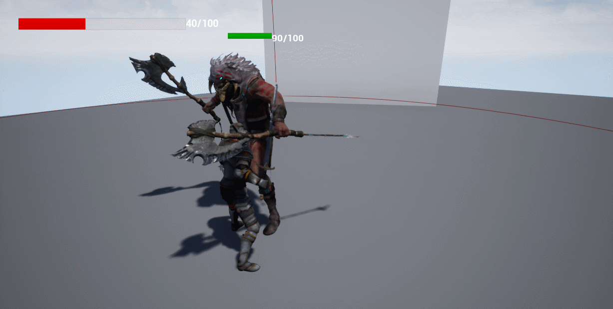
  - 피격시 카메라의 흔들림을 구현하기 위해서 UMatineeCameraShake 클래스를 상속 받은 PlayerCameraShake 클래스 생성.
    - 진동의 시간, 진동이 강해/약해지는 시간, 진폭과 빈도를 설정
  - 이 클래스를 MainPlayer에서 인스턴스화 한 후 TakeDamage()메서드에서 PlayerController에 있는 카메라 매니저를 통해 PlayerCameraShake()메서르를 사용.
    <details><summary>c++ 코드</summary> 

    ```c++
    //PlayerCameraShake.cpp
    UPlayerCameraShake::UPlayerCameraShake() {
      OscillationDuration = 0.1f;
      OscillationBlendInTime = 0.05f;
      OscillationBlendOutTime = 0.05f;

      RotOscillation.Pitch.Amplitude = FMath::RandRange(0.7f, 1.0f);
      RotOscillation.Pitch.Frequency = FMath::RandRange(12.0f, 20.0f);

      RotOscillation.Yaw.Amplitude = FMath::RandRange(0.7f, 1.0f);
      RotOscillation.Yaw.Frequency = FMath::RandRange(12.0f, 20.0f);
    }
    ```
    ```c++
    //MainPlayer.cpp
    #include "Camera/PlayerCameraManager.h"
    float AMainPlayer::TakeDamage(float DamageAmount, struct FDamageEvent const& DamageEvent, class AController* EventInstigator, AActor* DamageCauser) {
      Super::TakeDamage(DamageAmount, DamageEvent, EventInstigator, DamageCauser);
      ...
      PlayerController->PlayerCameraManager->PlayCameraShake(CamShake, 1.f);

      return DamageAmount;
    }
    ```
    
    </details>
    <details><summary>h 코드</summary> 

    ```c++
    //PlayerCameraShake.h
    public:
	    UPlayerCameraShake();
    ```
    ```c++
    //MainPlayer.h	
    public:
      UPROPERTY(EditAnywhere, BlueprintReadWrite, Category = "Camera")
      TSubclassOf<UMatineeCameraShake> CamShake;
    ```
    </details>


> **<h3>Realization</h3>** 
- 공격시 여러번 피격되는 경우가 있기에 추후 구체를 그리는 방식으로 수정.

## **08.14**
> **<h3>Today Dev Story</h3>**
- ## <span style = "color:yellow;">Enemy Knock Back (수정)</span>
  - 
  - 기존 넉백시 플레이어의 시점의 기준이 아닌 적의 뒤로만 향했는데, 이렇게 되면 발로 차는 방향이 어디든 적의 뒤로 가는 문제 발생.
  - MianPlayer.cpp의 KickStart() 메서드에서 Enemy의 KnockBack()메서드 호출 시 플레이어의 시점을 전달.
    - Enemy의 KnockBack()메서드는 FVector를 인자값으로 받아 적용.
      <details><summary>cpp 코드</summary> 

      ```c++
      //MainPlayer.cpp
      void AMainPlayer::KickStart() {
        ...
        if (bReslut) {
          if (HitResult.Actor.IsValid()) {
            AEnemy* KnockBackEnemy = Cast<AEnemy>(HitResult.Actor);
            if (KnockBackEnemy) {		
              FVector VectorToBack = FVector(GetActorForwardVector().X, GetActorForwardVector().Y, 0);
              KnockBackEnemy->KnockBack(VectorToBack);
            }
          }
        }
      }

      ```
      ```c++
      //Enemy.cpp
      void AEnemy::KnockBack(FVector Backward) {
        LaunchCharacter(Backward * KnockBackPower, true, true);	//입력 방향대로
      }
      ```
      </details>
      <details><summary>h 코드</summary> 

      ```c++
      //Enemy.h
      UFUNCTION()
      void KnockBack(FVector Backward);
      ```
      </details>

- ## <span style = "color:yellow;">적과 플레이어의 공격방법 수정.</span>
  - ActorComponent클래스를 상속받은 AttackFucntion클래스를 생성하고 하위 클래스로 Enemy와 Player의 공격을 담당하는 PlayerAttackFunction, EnemyAttackFuncion클래스로 나눔
    - 해당 클래스의 공통 부분을 상위 클래스에 추상 메서드로 구현하고 오바라이딩하여 하위에서 추가로 구현하고 싶은데 Enemy와 Player의 타입이 다르다 보니 구현에 어려움이 있다. Template을 사용하려도 해봤고, 다형성을 도전해봤지만 무용지물이였다.
    - 일단 구현만 해보기 위해서 PlayerAttackFunction클래스에서는 Kick()메서드만 구현해보았고, EnemyAttackFunction클래스에서는 공격 판정만을 구현해 보았다.
  - EnemyAttackFunction클래스에서 기존 Enemy의 공격은 BoxComponent를 이용하여 overlap판정으로 공격을 진행했지만, Player의 Kick()메서드와 동일한 방식으로 구현했다. 
    - 기존 ObjectChannel에 있던 EnemyWeapon을 삭제하고 TraceChannel에 EnemyAttack으로 구현했다. (Player와만 Block 처리 // 번호 : 4번)
    - 기존 BoxComponent 삭제 및 관련된 함수 삭제.
    - 나머지는 Kick 메서드와 동일.
     
      <details><summary>cpp 코드</summary> 

      ```c++
      //PlayerAttackFunction.cpp
      UPlayerAttackFunction::UPlayerAttackFunction() {

        KickRange = 120.f;
        KickRadius = 30.f;
        bKicking = false;
        bCanKick = true;
      }

      void UPlayerAttackFunction::BeginPlay() {
        Super::BeginPlay();
        Owner = Cast<AMainPlayer>(GetOwner());
      }

      void UPlayerAttackFunction::Kick(UAnimInstance* Anim, UAnimMontage* Montage) {
        if (!bCanKick) return;

        bCanKick = false;
        bKicking = true;
        if (Anim && Montage) {
          Anim->Montage_Play(Montage);
          Anim->Montage_JumpToSection("Kick", Montage);
        }
      }
      ```
      ```c++
      //EnemyAttackFunction.cpp
      void UEnemyAttackFunction::BeginPlay() {
        Super::BeginPlay();
        Owner = Cast<AEnemy>(GetOwner());
      }

      void UEnemyAttackFunction::AttackStart() {
        FHitResult HitResult; //맞은 정보를 저장

        FCollisionQueryParams Params(NAME_None, false, Owner);

        bool bReslut = GetWorld()->SweepSingleByChannel(HitResult, Owner->GetActorLocation(), Owner->GetActorLocation() + Owner->GetActorForwardVector() * 100.f,
          FQuat::Identity, ECollisionChannel::ECC_GameTraceChannel4,FCollisionShape::MakeSphere(200.f), Params);

        //구의 정보 (생략가능)
        FVector TraceVec = Owner->GetActorForwardVector() * 200.f;
        FVector Center = Owner->GetActorLocation() + TraceVec * 0.5f;
        float HalfHeight = 200.f * 0.5f + 30.f;
        FQuat CapsuleRot = FRotationMatrix::MakeFromZ(TraceVec).ToQuat();
        FColor DrawColor = bReslut ? FColor::Green : FColor::Red;
        float DebugLifeTime = 0.5f;

        DrawDebugCapsule(GetWorld(), Center, HalfHeight, 30.f, CapsuleRot, DrawColor, false, DebugLifeTime);

        if (bReslut) {
          if (HitResult.Actor.IsValid()) {
            AMainPlayer* HitedPlayer = Cast<AMainPlayer>(HitResult.Actor);
            if (HitedPlayer) {
              UGameplayStatics::ApplyDamage(HitedPlayer, 10.f, Owner->EnemyController, Owner, Owner->EnemyDamageType);
              const USkeletalMeshSocket* R_HitSocket = Owner->GetMesh()->GetSocketByName("Right_Weapon");
              const USkeletalMeshSocket* L_HitSocket = Owner->GetMesh()->GetSocketByName("Left_Weapon");
              if (R_HitSocket && L_HitSocket && HitedPlayer->GetHitParticle()) {
                FVector R_ParticleSpawnLocation = R_HitSocket->GetSocketLocation(Owner->GetMesh());
                UGameplayStatics::SpawnEmitterAtLocation(GetWorld(), HitedPlayer->GetHitParticle(), R_ParticleSpawnLocation, FRotator(0.f));

                FVector L_ParticleSpawnLocation = L_HitSocket->GetSocketLocation(Owner->GetMesh());
                UGameplayStatics::SpawnEmitterAtLocation(GetWorld(), HitedPlayer->GetHitParticle(), L_ParticleSpawnLocation, FRotator(0.f));
              }
            }
          }
        }
      }
      ```
      </details>
      <details><summary>h 코드</summary> 

      ```c++
      //PlayerAttackFunction.h
      public:
        UPROPERTY(VisibleAnywhere, BlueprintReadOnly, Category = "Owner")
        class AMainPlayer* Owner;

        UPROPERTY(VisibleAnywhere, BlueprintReadOnly, Category = "Owner")
        class UAnimInstance* OwnerAnimInstance;

        UPROPERTY(EditAnywhere, BlueprintReadOnly, Category = "Attack | Kick")
        float KickRange;

        UPROPERTY(EditAnywhere, BlueprintReadOnly, Category = "Attack | Kick")
        float KickRadius;

        UPROPERTY(VisibleAnywhere, BlueprintReadOnly, Category = "Attack | Kick")
        bool bKicking;			//현재 Kick 중인지

        UPROPERTY(VisibleAnywhere, BlueprintReadOnly, Category = "Attack | Kick")
        bool bCanKick;			//Kick이 가능한지

        UFUNCTION()
        void Kick(UAnimInstance* Anim, UAnimMontage* Montage);

        UFUNCTION(BlueprintCallable)
        void KickStart();

        UFUNCTION(BlueprintCallable)
        void KickEnd();
      ```
      ```c++
      //EnemyAttackFunction.h
      public:
        UPROPERTY(VisibleAnywhere, BlueprintReadOnly, Category = "Owner")
        class AEnemy* Owner;

        UPROPERTY(VisibleAnywhere, BlueprintReadOnly, Category = "Owner")
        class UAnimInstance* OwnerAnimInstance;

        UFUNCTION()
        void AttackStart();
      ```
      </details>

> **<h3>Realization</h3>** 
- ActorComponent를 추가하여 비슷한 기능을 서로 공유하여 사용가능. (has - a 의 개념)

## **08.15**
> **<h3>Today Dev Story</h3>**
- ## <span style = "color:yellow;">AttackFunction 추상화</span>
  - 
  - AttackFunction클래스에 공격메서드를 추상화하여 구상하고, 아래 클래스에서 호출하여 사용. (공통되는 기능)
    - Owner의 타입을 Actor로 받았고, SetOwner()메서드에서 정의한다. __이는 클래스를 사용할 모든 객체에서 PossessedBy()에서 호출해야한다. (필수)__
      - Mesh, Controller, Owner를 정의.
    - Owner의 타입이 Actor이기 때문에 Player나 Enemy객체가 AttackStart()메서드 실행 시 자동으로 값을 넘겨오지 못한다. 그렇기에 필요한 매개변수를 넘겨줘야한다.
    - 도중 ECollisionChannel의 타입은 넘기는 방법을 몰라서 임시 방편으로 FString형식을 인자값으로 받아 Player일때는 5번 채널을 Enemy일때는 4번 채널으로 선언했다.
    - Player의 기존 공격, 무기에 콜리전을 부착하여 사용하는 방식은 제거하고 Damage타입을 새로 정의해주었고 AttackCheck()메서드에서 AttackFunction->AttackStart()메서드를 호출하여 사용. (임시 - 추후수정)

      <details><summary>cpp 코드</summary> 

      ```c++
      //AttackFunction.cpp
      void UAttackFunction::SetOwner(USkeletalMeshComponent* TakeMesh,AController* TakeController ) {
        Owner = GetOwner();
        Mesh = TakeMesh;
        Controller = TakeController;
      }

      void UAttackFunction::AttackStart(FVector Location, FVector Forward,TSubclassOf<UDamageType> DamageType, FString Type)
      {
        ECollisionChannel AttackChanel;

        if (Type == "Player") {
          Hited = Cast<AEnemy>(Hited);
          AttackChanel = ECollisionChannel::ECC_GameTraceChannel5;
        }
        else if (Type == "Enemy") {
          Hited = Cast<AMainPlayer>(Hited);
          AttackChanel = ECollisionChannel::ECC_GameTraceChannel4;
        }

        FHitResult HitResult; //맞은 정보를 저장

        FCollisionQueryParams Params(NAME_None, false, Owner);

        bool bReslut = GetWorld()->SweepSingleByChannel(HitResult, Location, Location + Forward * 100.f,
          FQuat::Identity, AttackChanel, FCollisionShape::MakeSphere(200.f), Params);

        //구의 정보 (생략가능)
        FVector TraceVec = Forward * 200.f;
        FVector Center = Location + TraceVec * 0.5f;
        float HalfHeight = 200.f * 0.5f + 30.f;
        FQuat CapsuleRot = FRotationMatrix::MakeFromZ(TraceVec).ToQuat();
        FColor DrawColor = bReslut ? FColor::Green : FColor::Red;
        float DebugLifeTime = 0.5f;

        DrawDebugCapsule(GetWorld(), Center, HalfHeight, 30.f, CapsuleRot, DrawColor, false, DebugLifeTime);

        if (bReslut) {
          if (HitResult.Actor.IsValid()) {
            if (Type == "Player") Hited = Cast<AEnemy>(HitResult.Actor);
            else if (Type == "Enemy") Hited = Cast<AMainPlayer>(HitResult.Actor);
            if (Hited) {
              UGameplayStatics::ApplyDamage(Hited, 10.f, Controller, Owner, DamageType);
              const USkeletalMeshSocket* R_HitSocket = Mesh->GetSocketByName("Right_Weapon");
              const USkeletalMeshSocket* L_HitSocket = Mesh->GetSocketByName("Left_Weapon");
              /*if (R_HitSocket && L_HitSocket && Hited->GetHitParticle()) {
                FVector R_ParticleSpawnLocation = R_HitSocket->GetSocketLocation(Mesh);
                UGameplayStatics::SpawnEmitterAtLocation(GetWorld(), HitedPlayer->GetHitParticle(), R_ParticleSpawnLocation, FRotator(0.f));

                FVector L_ParticleSpawnLocation = L_HitSocket->GetSocketLocation(Mesh);
                UGameplayStatics::SpawnEmitterAtLocation(GetWorld(), HitedPlayer->GetHitParticle(), L_ParticleSpawnLocation, FRotator(0.f));
              }*/
            }
          }
        }
      }
      ```
      ```c++
      //MainPlayer.cpp
      void AMainPlayer::PossessedBy(AController* NewController) {
        Super::PossessedBy(NewController);

        ...
        AttackFunction->SetOwner(GetMesh(),PlayerController);
      }
      ...
      void AMainPlayer::AttackInputCheck() {
        //여기서 공격 발동 (임시)
        FString Type = "Player";
        AttackFunction->AttackStart(GetActorLocation(), GetActorForwardVector(), PlayerDamageType,Type);

        if (bIsAttackCheck) {
          ComboCnt++;
          if (ComboCnt >= ComboMaxCnt) ComboCnt = 0;
          bIsAttackCheck = false;
          Attack();
        }
      }
      ```
      </details>

      <details><summary>h 코드</summary> 

      ```c++
      //AttackFunction.h
      protected:
        UPROPERTY(VisibleAnywhere, BlueprintReadOnly, Category = "Owner")
        class AActor* Owner;

        UPROPERTY(VisibleAnywhere, BlueprintReadOnly, Category = "Owner")
        class UAnimInstance* OwnerAnimInstance;

        UPROPERTY(VisibleAnywhere, BlueprintReadOnly, Category = "Owner")
        class ACharacter* Hited = nullptr;

        UPROPERTY(VisibleAnywhere, BlueprintReadOnly, Category = "Owner")
        class AController* Controller;

        UPROPERTY(VisibleAnywhere, BlueprintReadOnly, Category = "Owner")
        class USkeletalMeshComponent* Mesh;
      public:
        UFUNCTION()
	      void SetOwner(USkeletalMeshComponent* TakeMesh, AController* TakeController);

        UFUNCTION(BlueprintCallable)
        virtual void AttackStart(FVector Location, FVector Forward, TSubclassOf<UDamageType> DamageType, FString Type);
      ```
      ```c++
      //MainPlayer.h
      public:
        UPROPERTY(EditAnywhere, BlueprintReadWrite, Category = "Combat")
        TSubclassOf<UDamageType> PlayerDamageType;
      ```
      </details>

- ## <span style = "color:yellow;">Weapon PutDown</span>
  - 
  - 기존에는 무기를 해제할때 DetachFromActor()메서드를 사용하여 소켓에서 내려놓고 파괴했지만 SetActorLocation()메서드를 통해 내려놓고, 콜리전을 QueryOnly로 전환하여 다시 줍기가 가능하도록 수정.
  - Weapon클래스의 UnEquip()메서드를 생성하고 이 메서드를 MainPlayer클래스의 ItemDrop()메서드에서 호출
    <details><summary>cpp 코드</summary> 

    ```c++
    //Weapon.cpp
    void AWeapon::UnEquip() {
      DetachFromActor(FDetachmentTransformRules::KeepWorldTransform);
      CollisionVolume->SetCollisionEnabled(ECollisionEnabled::QueryOnly);
      SetActorLocation(GetActorLocation());
    }
    ```
    ```c++
    //MainPlayer.cpp
    void AMainPlayer::ItemDrop() {
      if (GetWeaponStatus() == EWeaponStatus::EWS_Weapon) {
        CurrentWeapon->UnEquip();

        CurrentWeapon = nullptr;
        SetWeaponStatus(EWeaponStatus::EWS_Normal);
      }
    }
    ```
    </details>

    <details><summary>h 코드</summary> 

    ```c++
    //Weapon.h
    public:
      UFUNCTION()
      void UnEquip();
    ```
    </details>

- ## <span style = "color:yellow;">Hited Particle Location</span>
  - 
  - 기존에는 피격시 소켓 위치에 Particle을 SpawnEmitterAtLocation()메서드를 사용하여 ParticleSystem을 생성했는데, 기능을 분리하다보니 Particle을 매개변수로 넘기고 맞은 정보가 저장되는 HitResult의 Location에 생성.
    - 단점은 상대의 Particle을 가져오지 못했다는 점. (단점을 장점으로 승화하여 추후 무기마다 다른 Particle을 추가.)  
      <details><summary>cpp 코드</summary> 

      ```c++
      //Weapon.cpp
      void UAttackFunction::AttackStart(FVector Location, FVector Forward, TSubclassOf<UDamageType> DamageType,FString Type, UParticleSystem* HitParticle)
      {
        ...
        if (bResult) {
          if (HitResult.Actor.IsValid()) {
            if (Type == "Player") Hited = Cast<AEnemy>(HitResult.Actor);
            else if (Type == "Enemy") Hited = Cast<AMainPlayer>(HitResult.Actor);
            if (Hited) {
              UGameplayStatics::ApplyDamage(Hited, 10.f, Controller, Owner, DamageType);
              UGameplayStatics::SpawnEmitterAtLocation(GetWorld(), HitParticle, HitResult.GetActor()->GetActorLocation(), FRotator(0.f));
            }
          }
        }
      }
      ```
      </details>

- ## <span style = "color:yellow;">Attack Range</span>
  - 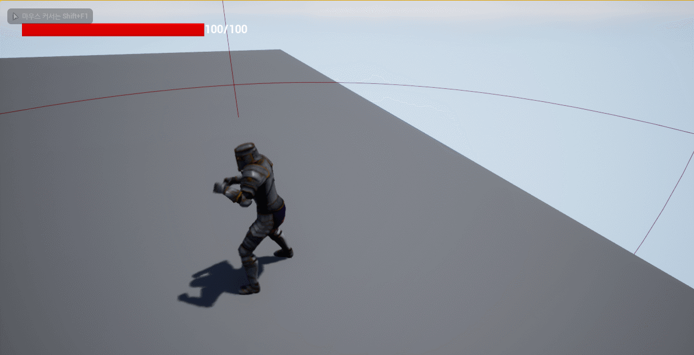
  - Enemy, MainPlayer, Weapon클래스에 각각 float 타입의 AttackRange와 Getter()메서드 구현. MainPlayer는 무기에 따라 범위가 달라지기에 DefaultAttackRange도 구현.
    - AttackFunction클래스의 AttackStart()메서드의 매개변수 AttackRange가 추가되며 이를 통해 범위 지정.
    - MainPlayer의 경우 무기를 장착하지 않았을 경우 DefaultAttackRange, 장착시 ItemEquip(),ItemDrop()메서드에서 범위를 수정.
    - 아래에서는 MainPlayer만 적어놨고 나머지 Enemy와 Weapon은 방식이 MainPlayer와 동일.
      <details><summary>cpp 코드</summary> 

      ```c++
      //MainPlayer.cpp
      AMainPlayer::AMainPlayer()
      {
        PrimaryActorTick.bCanEverTick = true;
        ...
        DefaultAttackRange = 50.f;
        AttackRange = DefaultAttackRange;
      }
      void AMainPlayer::ItemEquip() {
        if (ActiveOverlappingItem != nullptr) {
          AWeapon* CurWeapon = Cast<AWeapon>(ActiveOverlappingItem);
          if (nullptr != CurrentWeapon) ItemDrop();
          
          CurWeapon->Equip(this);
          AttackRange = CurWeapon->GetAttackRange();		//공격 범위 조절
          SetActiveOverlappingItem(nullptr);
        }
      }
      void AMainPlayer::ItemDrop() {
        if (GetWeaponStatus() == EWeaponStatus::EWS_Weapon) {
          CurrentWeapon->UnEquip();

          CurrentWeapon = nullptr;
          AttackRange = DefaultAttackRange;				//공격 범위 조절
          SetWeaponStatus(EWeaponStatus::EWS_Normal);
        }
      }
      ```
      </details>

      <details><summary>h 코드</summary> 

      ```c++
      //MainPlayer.h
      public:
        UPROPERTY(EditAnywhere, BlueprintReadWrite, Category = "Attack")
        float AttackRange;

        FORCEINLINE float GetAttackRange() { return AttackRange; }
      ```
      ```c++
      //AttackFunction.h
      public:
        UFUNCTION(BlueprintCallable)
        virtual void AttackStart(FVector Location, FVector Forward, TSubclassOf<UDamageType> DamageType, FString Type, UParticleSystem* HitParticle,float AttackRange);
      ```
      </details>

> **<h3>Realization</h3>** 
- ActorComponent를 정말 유용하게 활용하는 중.
- 최근 잡다한 수정이 많은편

## **08.16**
> **<h3>Today Dev Story</h3>**
- ## <span style = "color:yellow;">Targeting System</span>
  - 
  - MainPlayer클래스의 Tick()메서드에서 Targeting()메서드를 실행. (bTargeting 활성화시에만 호출.)
    - UKismetMathLibrary::FindLookAtRotation()메서드를 사용하여 Controller의 Rotation을 수정하며 Pitch를 추가로 수정. (내일 줌 아웃으로 변경 예정.)
    - SetTarget()메서드는 Tab키 활성화시 호출되며, Tab을 한번 누르면 bTarget이 true, 또 누르면 false로 전환.
    - 추가로 OnEnemyHUD_OverlapEnd()메서드 호출시 자동으로 bTargeting 변수를 false로 전환.
      <details><summary>cpp 코드</summary> 

      ```c++
      //MainPlayer.cpp
      void AMainPlayer::Tick(float DeltaTime)
      {
        ...
        Targeting();
      }
      void AMainPlayer::SetupPlayerInputComponent(UInputComponent* PlayerInputComponent)
      {
        ...
        PlayerInputComponent->BindAction("Tab", EInputEvent::IE_Pressed, this, &AMainPlayer::SetTargeting);
      }
      void AMainPlayer::Targeting() {
        if (bTargeting && CombatTarget != nullptr) {
          FRotator AA = UKismetMathLibrary::FindLookAtRotation(GetActorLocation(), CombatTarget->GetActorLocation());
          AA.Pitch -= 30.f;

          Controller->SetControlRotation(AA);
        }
      }
      void AMainPlayer::SetTargeting() {
        bTargeting = (!bTargeting) ? true : false; 
      }
      void AMainPlayer::OnEnemyHUD_OverlapEnd(UPrimitiveComponent* OverlappedComponent, AActor* OtherActor, UPrimitiveComponent* OtherComp, int32 OtherBodyIndex) {
        if (OtherActor) {
          CombatTarget = Cast<AEnemy>(OtherActor);
          if (CombatTarget) {
            CombatTarget->HideEnemyHealth();
            CombatTarget = nullptr;
            
            bTargeting = false;
          }
        }
      }
      ```
      </details>

      <details><summary>h 코드</summary> 

      ```c++
      //MainPlayer.h
      public:
        /** Target 관련 */
        UPROPERTY(VisibleAnywhere, BlueprintReadOnly, Category = "Tageting")
        bool bTargeting;

        UFUNCTION()
        void Targeting();

        UFUNCTION()
        void SetTargeting();
      ```
      </details>

- ## <span style = "color:yellow;">잡다한 것</span>
  1. MainPlayer의 공격 수정.
    - 이전에 임시로 AttakCheck()메서드에서 AttackFunction->AttackStart()메서드를 호출하여 데미지를 입혔는데 모든 AttackMontage에 새로운 노티파이 "AttackStart"를 생성하고 MainPlayer클래스에 StartAttack()메서드를 생성하고 연결.
      <details><summary>cpp 코드</summary> 

      ```c++
      //MainPlayer.cpp
      void AMainPlayer::StartAttack() {
        FString Type = "Player";
        AttackFunction->AttackStart(GetActorLocation(), GetActorForwardVector(), PlayerDamageType, Type, GetHitParticle(), GetAttackRange());
      }
      ```
      </details>

      <details><summary>h 코드</summary> 

      ```c++
      //MainPlayer.h
      public:
        UFUNCTION(BlueprintCallable)
        void StartAttack();
      ```
      </details>

> **<h3>Realization</h3>** 
- 시점 변환시 사용하는 메서드
  - Controller->SetViewTargetWithBlend()메서드 사용. 
  - 카메라가 Target으로 이동. (다양한 시점 추가시 유용하며 박스와 연계하여 사용.)
- __시점 변환시 항상 Controller를 변화시켜야 한다.__

## **08.17**
> **<h3>Today Dev Story</h3>**
- ## <span style = "color:yellow;">Equip Weapon Full</span>
  -    
  - 좌우 무기를 장착하고 해제하는 로직 생성.
  - MainPlayer클래스는 기존과 매우 유사하며 무기가 아에 없을 때만 WeaponStatus를 Normal로 변경.
    - 기존의 CurrentWeapon을 2개로 분리하여 CurrentLeftWeapon과 CurrentRightWeapon으로 구분.
    - get,set 메서드들은 String 값에 따라 좌우를 구분하며, 오른쪽 무기 드랍시에만 기본 범위로 지정.
  - Weapon클래스에 새로운 enum인 EWeaponPos생성. 이는 무기가 플레이어에게 배치되는 위치를 나타냄.
    - ItemDrop()시 __오른쪽 무기가 우선으로 드랍.__
    - 무기 장착시 오른쪽에 장착된다면 주무기로 판단하여 공격범위가 증가.
      <details><summary>cpp 코드</summary> 

      ```c++
      //Weapon.cpp
      void AWeapon::Equip(class AMainPlayer* Player) {
        if (Player) {
          if ((GetWeaponPos() == EWeaponPos::EWP_Left && Player->GetCurrentWeapon("Left") != nullptr) || (GetWeaponPos() == EWeaponPos::EWP_Right && Player->GetCurrentWeapon("Right") != nullptr)) {
            Player->ItemDrop();
          }

          /** 장착 로직 */
          const USkeletalMeshSocket* HandSocket = nullptr;
          if(GetWeaponPos() == EWeaponPos::EWP_Right) HandSocket = Player->GetMesh()->GetSocketByName("RightWeapon");
          else HandSocket = Player->GetMesh()->GetSocketByName("LeftWeapon");

          SetInstigator(Player->GetController());
          if (HandSocket) {
            HandSocket->AttachActor(this, Player->GetMesh());
            Player->SetWeaponStatus(EWeaponStatus::EWS_Weapon);

            if (GetWeaponPos() == EWeaponPos::EWP_Right) {
              Player->AttackRange = GetAttackRange();   //오른쪽 무기만 거리 지정
              Player->SetCurrentWeapon(this, "Right");    
            }
            else if(GetWeaponPos() == EWeaponPos::EWP_Left)	Player->SetCurrentWeapon(this, "Left");

            CollisionVolume->SetCollisionEnabled(ECollisionEnabled::NoCollision);
          }
        }
      }
      void AWeapon::UnEquip() {
        /** 해제 로직 */
        DetachFromActor(FDetachmentTransformRules::KeepWorldTransform);
        CollisionVolume->SetCollisionEnabled(ECollisionEnabled::QueryOnly);
        SetActorLocation(GetActorLocation());
      }
      ```
      ```c++
      //MainPlayer.cpp
      void AMainPlayer::ItemEquip() {
        if (ActiveOverlappingItem != nullptr) {
          AWeapon* CurWeapon = Cast<AWeapon>(ActiveOverlappingItem);

          CurWeapon->Equip(this);
          SetActiveOverlappingItem(nullptr);
        }
      }
      void AMainPlayer::ItemDrop() {
        if (GetWeaponStatus() == EWeaponStatus::EWS_Weapon) {
          if (CurrentRightWeapon != nullptr) {
            CurrentRightWeapon->UnEquip();
            CurrentRightWeapon = nullptr;		
            AttackRange = DefaultAttackRange;				//공격 범위 조절
            if (CurrentLeftWeapon == nullptr) SetWeaponStatus(EWeaponStatus::EWS_Normal);
          }
          else if (CurrentLeftWeapon != nullptr) {
            CurrentLeftWeapon->UnEquip();
            CurrentLeftWeapon = nullptr;
            if(CurrentRightWeapon == nullptr) SetWeaponStatus(EWeaponStatus::EWS_Normal);
          }
        }
      }

      void AMainPlayer::SetCurrentWeapon(AWeapon* Weapon, FString Type) {
        if(Type == "Right") CurrentRightWeapon = Weapon;
        else CurrentLeftWeapon = Weapon;
      }
      AWeapon* AMainPlayer::GetCurrentWeapon(FString Type) {
        if (Type == "Right") return CurrentRightWeapon;
        else return CurrentLeftWeapon;
      }
      ```
      </details>

      <details><summary>h 코드</summary> 

      ```c++
      //Weapon.h
      public:
        //부착될 Pos 지정 
        UPROPERTY(EditAnywhere, BlueprintReadWrite, Category = "Pos")
        EWeaponPos WeaponPos;

        FORCEINLINE void SetWeaponPosLoc(EWeaponPos Pos) { WeaponPos = Pos; }

        FORCEINLINE EWeaponPos GetWeaponPos() { return WeaponPos; }
      ```
      ```c++
      //MainPlayer.h
      public:
        UPROPERTY(VisibleAnywhere, BlueprintReadOnly,Category = "Weapon")
        class AWeapon* CurrentLeftWeapon;

        UPROPERTY(VisibleAnywhere, BlueprintReadOnly, Category = "Weapon")
        class AWeapon* CurrentRightWeapon;

        void SetCurrentWeapon(AWeapon* Weapon,FString Type);
        AWeapon* GetCurrentWeapon(FString Type);
      ```
      </details>

- ## <span style = "color:yellow;">Add FootStep Sound</span>
  - 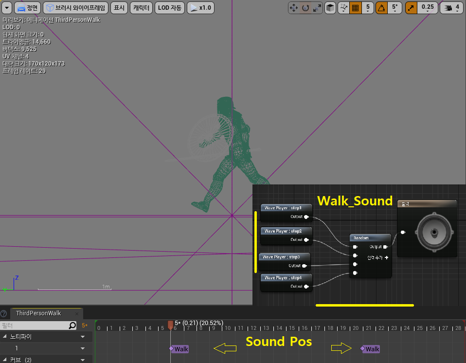   
  - 발걸음마다 사운드를 나게 하기 위해서 모든 애니메이션에 PlaySound 노티파이를 추가하여 사운드큐와 어태치
    - 사운드큐의 이름을 Walk라고 지정하고, 자연스러움을 추가하기 위해서 4개의 소리를 받아 Random으로 발생하도록 사운드 큐 생성.

- ## <span style = "color:yellow;">잡다한 것</span>
  1. 공격 모션 수정.
    - 기존 공격 모션의 선택 여부를 Attack()메서드의 GetWeaponStatus()메서드의 반환값으로 지정했지만 왼쪽의 보조무기를 장착했을때도 새로운 모션을 사용.
    - 이를 수정하기 위해서 아래와 같이 수정. __주무기의 장착여부에 따른 공격 모션으로 수정.__
      ```c++
      //MainPlayer.cpp
      void AMainPlayer::Attack() {
        ...
        if (GetCurrentWeapon("Right") == nullptr) PlayMontage = AttackMontage;
        else PlayMontage = WeaponAttackMontage;
        ...
      }
      ```
  2. root 모션의 적응을 위해서 mixamo에서 받은 Paladin.fbx외의 모든 애니메이션에 root 추가
    - Blend를 사용하여 모든 파일에 root를 추가한 채로 빌드. 많은 시간 소요
    - 공격시 앞으로 자연스럽게 가는거.

> **<h3>Realization</h3>** 
- runsound 수정하기

## **08.18**
> **<h3>Today Dev Story</h3>**
- ## <span style = "color:yellow;">Shield의 구현</span>
  -    
  - ShieldWeapon클래스는 새로운 BoxComponent를 생성하고 공격을 막는다.
    - 기존 공격시 사용하는 Sweepsinglebychannel은 먼저 Hited된 하나의 결과값만 도출되기 때문에 BoxComponent에 맞게되면 데미지를 입지 않는다.
    - 다중 피해값을 받기 위해서는 multi를 사용해야한다.
    - 부가적인 처리는 후에 하고, 콜리전 채널 Shield를 만들고 Shield의 BoxComponent에 오버랩을 추가한다. 
    - __해당 콜리전 채널은 EnemyAttack에만 Block처리__

      <details><summary>cpp 코드</summary> 

      ```c++
      //ShieldWeapon.cpp
      AShieldWeapon::AShieldWeapon() {
        ShieldBox = CreateDefaultSubobject<UBoxComponent>(TEXT("ShieldBox"));

        ShieldBox->OnComponentBeginOverlap.AddDynamic(this, &AShieldWeapon::OnShieldOverlapStart);
        ShieldBox->OnComponentEndOverlap.AddDynamic(this, &AShieldWeapon::OnShieldOverlapEnd);
        ShieldBox->SetCollisionEnabled(ECollisionEnabled::QueryOnly);
        ShieldBox->SetRelativeLocation(FVector(0.f));
      }
      void AShieldWeapon::BeginPlay() {
        Super::BeginPlay();
      }

      void AShieldWeapon::Equip(class AMainPlayer* Player) {
        Super::Equip(Player);

        if (Player) {
          if ((GetWeaponPos() == EWeaponPos::EWP_Left && Player->GetLeftCurrentWeapon() != nullptr)) {
            Player->ItemDrop();
          }

          /** 장착 로직 */
          const USkeletalMeshSocket* HandSocket = nullptr;
          HandSocket = Player->GetMesh()->GetSocketByName("LeftWeapon");

          if (HandSocket) {
            HandSocket->AttachActor(this, Player->GetMesh());
            Player->SetWeaponStatus(EWeaponStatus::EWS_Weapon);
            Player->SetLeftCurrentWeapon(this);

            CollisionVolume->SetCollisionEnabled(ECollisionEnabled::NoCollision);
          }
        }
      }

      void AShieldWeapon::OnShieldOverlapStart(UPrimitiveComponent* OverlappedComponent, AActor* OtherActor, UPrimitiveComponent* OtherComp, int32 OtherBodyIndex, bool bFromSweep, const FHitResult& SweepResult){
        UE_LOG(LogTemp, Warning, TEXT("Overlap"));
      }
      void AShieldWeapon::OnShieldOverlapEnd(UPrimitiveComponent* OverlappedComponent, AActor* OtherActor, UPrimitiveComponent* OtherComp, int32 OtherBodyIndex) {
        UE_LOG(LogTemp, Warning, TEXT("OverlapEnd"));
      }
      ```
      </details>

      <details><summary>h 코드</summary> 

      ```c++
      //Weapon.h
      public:
        AShieldWeapon();

        virtual void BeginPlay() override;
        virtual void Equip(class AMainPlayer* Player) override;

        UPROPERTY(EditAnywhere, BlueprintReadWrite, Category = "Physical")
        class UBoxComponent* ShieldBox;
        
        UFUNCTION()
        void OnShieldOverlapStart(UPrimitiveComponent* OverlappedComponent, AActor* OtherActor, UPrimitiveComponent* OtherComp, int32 OtherBodyIndex, bool bFromSweep, const FHitResult& SweepResult);
        
        UFUNCTION()
        void OnShieldOverlapEnd(UPrimitiveComponent* OverlappedComponent, AActor* OtherActor, UPrimitiveComponent* OtherComp, int32 OtherBodyIndex);
      ```
      </details>

- ## <span style = "color:yellow;">잡다한 것</span>
  1. Weapon에도 무기와 방패와 같이 분야가 나뉘기 때문에 Weapon클래스를 상속받은 AttackWeapon, ShieldWeapon으로 구분.
    - AttackWeapon에는 주무기가 ShieldWeapon에는 말 그대로 방패가 적용된다.
    - AttackWeapon클래스는 항상 오른쪽에 어태치되며, ShieldWeapon은 항상 왼쪽에 어태치된다.

> **<h3>Realization</h3>** 
- Sweepsinglebychannel은 하나의 HitResult만 반환.
  - 이를 사용하여 Block의 구현.
- SweepMultibychannel은 다중의 HitResult만 반환.

## **08.19**
> **<h3>Today Dev Story</h3>**
- ## <span style = "color:yellow;">Shield의 구현_2</span>
  -  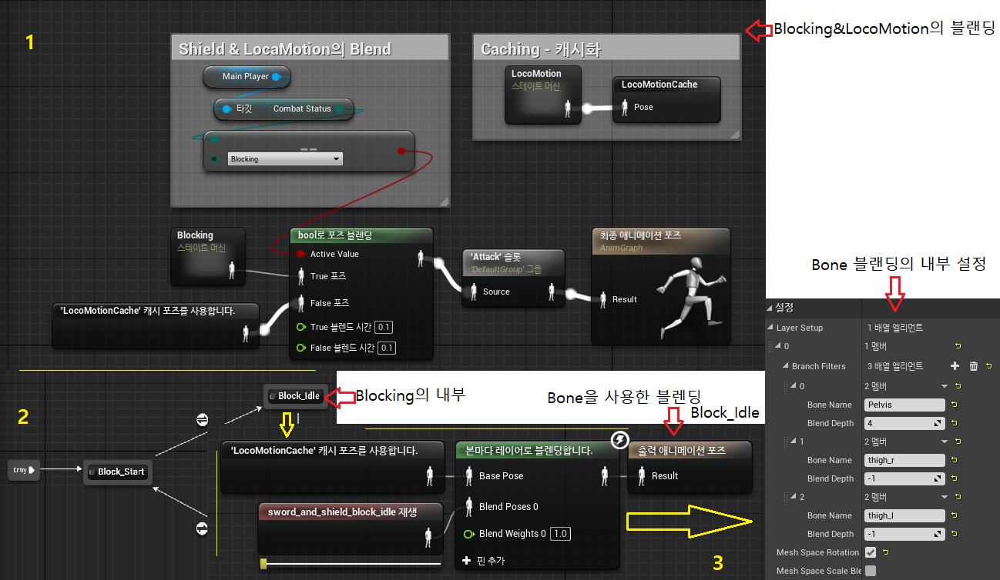 
  - Shield의 모션을 LocoMotion과 블랜딩하여 움직이면서 방어모션 구현.
  - 먼저 상태를 구분하기 위해서 ECombatStatus라는 Enum클래스를 만들고 이값에 따라 방어 판정을 한다.
    - 새로운 스테이트머신 Blocking을 생성하고, Block_start, Block_Idle, Block_End의 순서대로 구현한다.
    - 내부의 모든 스테이트 구현시 기존 LocoMotion의 Cache와 적용할 애니메이션을 Layered blend per bone을 사용하여 뼈마다 레이어로 블렌딩을 진행한다.
    - 블렌딩 진행시 BasePos는 기존값으로, Blend Poses 0은 Block의 애니메이션으로 지정하며, LayerSetup을 3가지(허리(Pelvis),좌우 허벅지(Thigh_r/l))를 설정한다. (이름은 Bone과 동일해야 한다.)
  - 이제 애님그래프에서 MainPlayer의 상태 중 CombatStatus가 Blocking이라면 Blocking과 LocoMotion캐시를 Blend Poses by bool(bool로 포즈 블렌딩)하여 구분한다.
    
    <details><summary>cpp 코드</summary> 

    ```c++
    //MainPlayer.cpp
    void AMainPlayer::SetupPlayerInputComponent(UInputComponent* PlayerInputComponent)
    {
      ...
      //Block
      PlayerInputComponent->BindAction("Block", EInputEvent::IE_Pressed, this, &AMainPlayer::Blocking);
      PlayerInputComponent->BindAction("Block", EInputEvent::IE_Released, this, &AMainPlayer::UnBlocking);
    }
    void AMainPlayer::Blocking() {
      if (CurrentLeftWeapon != nullptr) {
        SetCombatStatus(ECombatStatus::ECS_Blocking);
      }
    }

    void AMainPlayer::UnBlocking() {
      if (CurrentLeftWeapon != nullptr) {
        SetCombatStatus(ECombatStatus::ECS_Normal);
      }
    }
    ```
    </details>

    <details><summary>h 코드</summary> 

    ```c++
    //MainPlayer.h
    /** Shield의 상태 여부 (방어여부) */
    UENUM(BlueprintType)
    enum class ECombatStatus : uint8 {
      ECS_Normal			UMETA(DisplayName = "Normal"),
      ECS_Attacking		UMETA(DisplayName = "Attacking"),
      ECS_Blocking		UMETA(DisplayName = "Blocking"),

      ECS_Default			UMETA(DisplayName = "Default")
    };

    public:
    	UPROPERTY(VisibleAnywhere, BlueprintReadOnly, Category = "Combat")
      ECombatStatus CombatStatus;

      FORCEINLINE void SetCombatStatus(ECombatStatus State) { CombatStatus = State;}
      FORCEINLINE ECombatStatus GetCombatStatus() { return CombatStatus; }

      UFUNCTION()
      void Blocking();

      UFUNCTION()
      void UnBlocking();
    ```
    </details>

- ## <span style = "color:yellow;">Shield의 구현_3</span>
  -  
  - 기존 방어 판정에 있어 오류가 발생, 피격시 막아지는 경우도 존재하지만 그렇지 못하는 경우도 존재. (아마 첫번째로 Hit되는 경우를 기준으로 판정해서 생긴 오류)
  - 그렇기에 기존에 존재했던 ShieldWeapon클래스의 콜리전은 모두 제거하고 새로운 방식으로 진행.
    - 적이 플레이어를 피격시 플레이어의 상태와 공격의 방향을 체크하여 일정 범위 이내라면 데미지를 받는 않는 방식.
    - ShieldWeapon에서 범위를 지정하는 float값인 ShiledMax(Min)Angle과 방어했을 시 발생하는 ParticleSystem타입의 HitedParticle 지정.
  - MainPlayer클래스에서 TakeDamage()메서드를 수정하며 현재 상태가 Blocking이라면 막았는지의 대한 판정시작.
    - 판정은 IsBlockingSuccess()메서드를 통해 진행하며 반환값 boolean에 따라 종료.
    - FindLookAtRotation()을 사용하여 플레이어와 공격한 적의 각도를 반환하고 NormalizedDeltaRotator를 통해 각도를 정규화.
    - InRange_FloatFloat()메서드를 사용하여 BetweenRot이 일정 범위 내에 있는 지 확인.
    - 일정 범위 내에 있다면 방어하고 방패의 파티클을 생성하며, 일정 거리 뒤로 밀린다.

      <details><summary>cpp 코드</summary> 

      ```c++
      //MainPlayer.cpp
      float AMainPlayer::TakeDamage(float DamageAmount, struct FDamageEvent const& DamageEvent, class AController* EventInstigator, AActor* DamageCauser) {
        Super::TakeDamage(DamageAmount, DamageEvent, EventInstigator, DamageCauser);

        // 방어 성공시 
        if (GetCombatStatus() == ECombatStatus::ECS_Blocking) {
          if (IsBlockingSuccess(DamageCauser)) return 0;
        }

        if (CurrentHealth <= 0) return 0.f;
        CurrentHealth -= DamageAmount;
        if (CurrentHealth <= 0) {
          CurrentHealth = 0;
          Death();
        }
        SetHealthRatio();

        //CameraShake
        if (PlayerController) PlayerController->PlayerCameraManager->StartCameraShake(CamShake, 1.f);
        FVector Loc = GetActorForwardVector();
        Loc.Z = 0;
        LaunchCharacter(GetActorForwardVector() * -2000.f, true, true);
        UGameplayStatics::SpawnEmitterAtLocation(GetWorld(), HitParticle, GetActorLocation(), FRotator(0.f));

        return DamageAmount;
      }
      bool AMainPlayer::IsBlockingSuccess(AActor* DamageCauser) {
        FRotator BetweenRot = UKismetMathLibrary::FindLookAtRotation(GetActorLocation(), DamageCauser->GetActorLocation());
        BetweenRot = UKismetMathLibrary::NormalizedDeltaRotator(GetActorRotation(), BetweenRot);
        bool isShieldRange = UKismetMathLibrary::InRange_FloatFloat(BetweenRot.Yaw, -40, 40);

        if (isShieldRange && CurrentLeftWeapon->HitedParticle) {
          FVector Loc = GetActorForwardVector();
          Loc.Z = 0;
          LaunchCharacter(Loc * -500.f, true, true);
          UGameplayStatics::SpawnEmitterAtLocation(GetWorld(), CurrentLeftWeapon->HitedParticle, GetActorLocation(), FRotator(0.f));
          return true;
        }
        return false;
      }
      ```
      ```c++
      //ShieldWeapon.cpp
      AShieldWeapon::AShieldWeapon() {
        WeaponPos = EWeaponPos::EWP_Left;
        ShiledMinAngle = -40.f;
        ShiledMaxAngle = 40.f;
      }
      ```
      </details>

      <details><summary>h 코드</summary> 

      ```c++
      //MainPlayer.h
      public:
        UFUNCTION()
        bool IsBlockingSuccess(AActor* DamageCauser);
      ```
      ```c++
      //ShieldWeapon.h
      public:
        UPROPERTY(VisibleAnywhere, BlueprintReadWrite, Category = "Angle")
        float ShiledMinAngle;

        UPROPERTY(VisibleAnywhere, BlueprintReadWrite, Category = "Angle")
        float ShiledMaxAngle;
        
        UPROPERTY(EditAnywhere, BlueprintReadWrite, Category = "Paticle")
        class UParticleSystem* HitedParticle;
      ```
      </details>

> **<h3>Realization</h3>** 
- Layered blend per bone
  - 스켈레톤의 특정 본 부분집합에만 영향을 끼치는 마스크 블렌딩을 한다. 캐릭터의 상하를 구분하여 적용시 사용.

- Blend Poses by bool
  - 노드는 부울 값을 키로 사용하여 두 포즈를 시간에 따라 블렌딩하는 노드이며, boolean값이 True인 경우 True입력에 연결된 포즈가, False인 경우 False입력에 연결된 포즈가 사용된다.

- UKismetMathLibrary의 함수들
  1. FindLockAtRotation() : Location위치 현재위치와 대상을 비교하여 회전값(Rotation)을 구한다. //FRotator 반환
  2. NormalizedDeltaRotator() : Rotator의 값을 정규화한다. (방향은 유지하며 크기를 1로 만듬) // FRotator 반환
  3. InRange_FloatFloat() : 특정한 값이 범위내에 있는지 검사. // boolean타입을 반환

## **08.20**
> **<h3>Today Dev Story</h3>**
- ## <span style = "color:yellow;">잡다한 것</span>
  1. 적이 뒤로 밀려날때 애니메이션 추가.
    - 단순하게 HitedMontage를 추가 후 플레이어의 Kick이 닿을때 몽타주를 실행하며 처리.
    - 적의 공격이 종료되며, 가끔 오류로 멀리 날라감. (추후 수정 필요.)
  2. 구르기 Root Motion방식을 사용하지 않고 기존 방식으로 이어서 진행.
  3. 기존 Sprinting방식 수정.
    - 기존에는 하나의 메서드를 통해서 Sprinting과 idle, walking을 구분했는데 가끔 중첩으로 인한 오류로 메서드를 2개로 나눔(OnSprinting/OffSprinting)

> **<h3>Realization</h3>** 

## **08.21**
> **<h3>Today Dev Story</h3>**
- ## <span style = "color:yellow;">카메라 변동</span>
  - 
  - 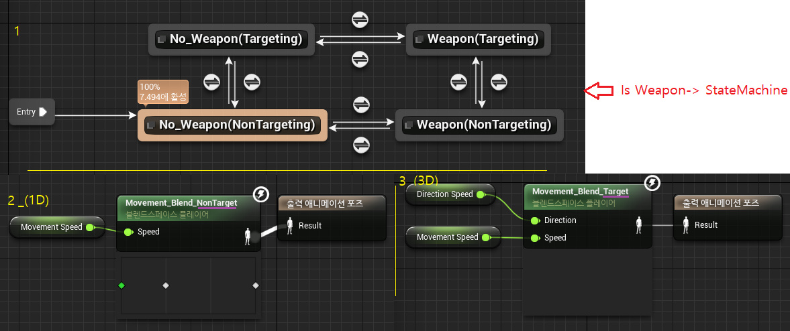
  - 기존 이동시 카메라의 회전방향에 따라 캐릭터를 회전했지만, 수정하여 타겟을 고정했을때만 적용되며 평상시에는 어떤 방향이든 직접회전하여 이동.
  - MainPlayerAnim클래스에 조건 bTargetOn을 추가하고 이를 GetTargeting()메서드와 연결. 이 조건에 따라 애니메이션과 카메라&캐릭터 관계 수정.
  - 새로운 애니메이션 블랜드 스페이스 1D 2개를 생성하며 Speed에만 영향을 받으며 타겟팅이 되어있지 않을때 활성화
    - 기존 MainPlayer클래스에 존재하던 CheckIdle()메서드 삭제, 카메라 매니저 생성하여 PossessedBy에서 연결하고 최대 각도 지정.
    - SetTargeting()메서드를 수정하며 MainPlayerAnim클래스에서 호출하여 사용할 GetTargeting()메서드 생성.

      <details><summary>cpp 코드</summary> 

      ```c++
      //MainPlayer.cpp
      AMainPlayer::AMainPlayer()
      { 
        ...
        bUseControllerRotationYaw = false; 
        bUseControllerRotationRoll = false;
        bUseControllerRotationPitch = false;
      }
      void AMainPlayer::PossessedBy(AController* NewController) {
        Super::PossessedBy(NewController);

        ...
        CameraManager = PlayerController->PlayerCameraManager;	//카메라 매니저 호출
        
        //카메라 각도 조정.
        CameraManager->ViewPitchMax = 50.f;
        CameraManager->ViewPitchMin = -70.f;
      }
      void AMainPlayer::Targeting() {
        if (bTargeting && CombatTarget != nullptr) {
          FRotator AA = UKismetMathLibrary::FindLookAtRotation(GetActorLocation(), CombatTarget->GetActorLocation());
          AA.Pitch -= 30.f;

          Controller->SetControlRotation(AA);

          //회전 정의
          bUseControllerRotationYaw = true;   
        }
      }
      void AMainPlayer::SetTargeting() {
        if (bTargeting) OffTargeting();
        else OnTargeting();
      }
      void AMainPlayer::OnTargeting() {
        bTargeting = true;
        bUseControllerRotationYaw = true;
      }
      void AMainPlayer::OffTargeting() {
        bTargeting = false;
        bUseControllerRotationYaw = false;
      }
      void AMainPlayer::OnEnemyHUD_OverlapEnd(UPrimitiveComponent* OverlappedComponent, AActor* OtherActor, UPrimitiveComponent* OtherComp, int32 OtherBodyIndex) {
        if (OtherActor) {
          CombatTarget = Cast<AEnemy>(OtherActor);
          if (CombatTarget) {
            CombatTarget->HideEnemyHealth();
            CombatTarget = nullptr;
            
            OffTargeting();
          }
        }
      }
      ```
      ```c++
      //MainPlayerAnim.cpp
      void UMainPlayerAnim::NativeUpdateAnimation(float DeltaSeconds){
        Super::NativeUpdateAnimation(DeltaSeconds);
        ...
        bTargetOn = MainPlayer->GetTargeting();		
      }
      ```
      </details>

      <details><summary>h 코드</summary> 

      ```c++
      //MainPlayer.cpp
      public:
        UPROPERTY(EditAnywhere, BlueprintReadWrite, Category = "Camera")
        class APlayerCameraManager* CameraManager;

        UFUNCTION()
        void OnTargeting();

        UFUNCTION()
        void OffTargeting();

        UFUNCTION()
        bool GetTargeting() { return bTargeting; }
      ```
      ```c++
      //MainPlayerAnim.h
      public:
        UPROPERTY(EditAnywhere, BlueprintReadOnly, Category = "Movement")
        bool bTargetOn;
      ```
      </details>

- ## <span style = "color:yellow;">Targeting 방법 전환</span>
  -  
  - 기존 방식은 직접 Controller의 Rotation을 설정했으나 이번 방식은 바로 적용하는 것이 아닌 RInterpTo()메서드를 사용
  - 이 메서드는 __회전보간메서드이며__ 사용하면 자연스러운 회전이 가능하며, Tick()메서드에서 호출해야 한다.
    
    <details><summary>cpp 코드</summary> 

    ```c++
    //MainPlayer.cpp
    void AMainPlayer::Targeting() {
      if (bTargeting && CombatTarget != nullptr) {
        FRotator TargetRot = UKismetMathLibrary::FindLookAtRotation(GetActorLocation(), CombatTarget->GetActorLocation());
        TargetRot.Pitch -= 30.f;
        Controller->SetControlRotation(FMath::RInterpTo(GetControlRotation(), TargetRot, GetWorld()->GetDeltaSeconds(), 5.0f));
      }
    }
    ```
    </details>

- ## <span style = "color:yellow;">카메라의 랙</span>
  -  
  - SpringArm의 __Lag 기능을__ 사용하면 카메라가 시간차를 두고 따를 수 있도록 한다.
  - 하드코딩을 위해서 BP에서 수정이 아닌 c++에서 수정을 진행.
    
    <details><summary>cpp 코드</summary> 

    ```c++
    AMainPlayer::AMainPlayer()
    {
      ...
    	//LagSpeed
      SpringArm->bEnableCameraLag = true;
      SpringArm->bEnableCameraRotationLag = true;
      SpringArm->CameraLagSpeed = 7.0f;				//이동
      SpringArm->CameraRotationLagSpeed = 7.0f;		//회전
    }
    ```
    </details>

> **<h3>Realization</h3>** 
- 점프 공격을 구현하려 했으나 소울게임풍에 맞지 않는다고 생각하여 제거.
- 무기별 공격 방식에 힘쓰려 생각.
- 상대방으로 고정시에만 뒤로 갈때의 모션이 실행되도록 수정하고 일반적일때는 뒤로 돌수있게 수정.
- SpringArm의 Lag 기능을 사용하면 카메라의 지연을 구현 가능.

## **08.22**
> **<h3>Today Dev Story</h3>**
- ## <span style = "color:yellow;">Health Potion</span>
  - 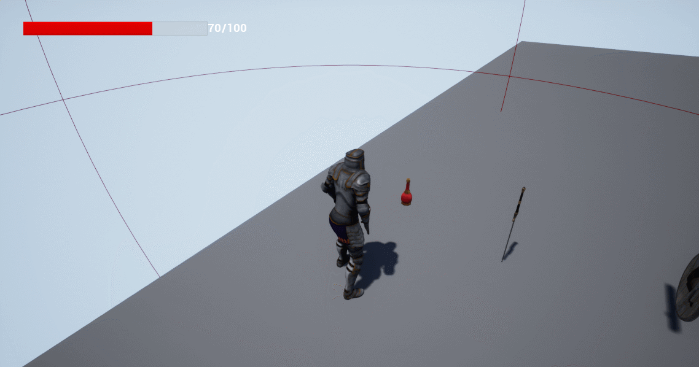
  - 기존 Item 클래스를 상속받은 Potion클래스를 제작
    - Item 클래스는 Waepon클래스와 Potion클래스가 상속하여 사용하고, 아이템 장착이나 상호작용의 키는 E로 지정되어 있기에 Item클래스의 Enum을 사용하여 타입을 지정.
    - EItemType으로 지정하고 타입은 GetItemType()메서드를 사용하여 반환.
    - MainPlayer클래스의 ItemEquip()메서드에서 GetItemType() 메서드를 사용하여 Item의 타입을 측정한뒤, 포션인경우 Potion클래스의 UseItem을 사용한다.
    - UseItem()메서드에서 체력을 감소한다.

      <details><summary>cpp 코드</summary> 

      ```c++
      //MainPlayer.cpp
      #include "Potion.h"
      ...
      void AMainPlayer::ItemEquip() {	
        if (ActiveOverlappingItem != nullptr) {
          if (ActiveOverlappingItem->GetItemType() == EItemType::EIT_Weapon) {
            AWeapon* CurWeapon = Cast<AWeapon>(ActiveOverlappingItem);
            CurWeapon->Equip(this);
          }
          else if(ActiveOverlappingItem->GetItemType() == EItemType::EIT_Item) {
            APotion* Potion = Cast<APotion>(ActiveOverlappingItem);
            CurrentHealth = Potion->UseItem(CurrentHealth);
            SetHealthRatio();
          }
          SetActiveOverlappingItem(nullptr);
        }
      }
      ```
      ```c++
      //Potion.cpp
      float APotion::UseItem(float Health) {
        Health += 10.f;
        if (Health >= 100.f) Health = 100.f;
        if (OverlapParticle) UGameplayStatics::SpawnEmitterAtLocation(GetWorld(), OverlapParticle, GetActorLocation(), FRotator(0.f), true);
        Destroy();
        return Health;
      }
      ```
      </details>

      <details><summary>h 코드</summary> 

      ```c++
      //Potion.h
      public:
        UFUNCTION()
        float UseItem(float Health);
      ```
      ```c++
      //Item.h
      UENUM(BlueprintType)
      enum class EItemType : uint8 {
        EIT_Normal		UMETA(DisplayName = "Normal"),
        EIT_Weapon		UMETA(DisplayName = "Weapon"),
        EIT_Item		UMETA(DisplayName = "Item"),

        EIT_Default		UMETA(DisplayName = "Default")
      };
      ...

      public:
        UFUNCTION()
        FORCEINLINE EItemType GetItemType() { return ItemType; }
      ```
      </details>

- ## <span style = "color:yellow;">잡다한 것</span>
  1. 무기에 따른 데미지 연동. 
    - 기존 AttackFunction클래스의 AttackStart()메서드에서는 고정된 값으로 데미지를 입혔지만 매개변수값으로 Damage를 받아 처리.
    - 캐릭터의 기본 공격력(DefaultDamage)은 5로 지정, 무기를 장착할때 Weapon클래스의 Damage 변수의 값을 MainPlayer 클래스의 SetAttackDamage()메서드를 사용하여 적용.
    - 무기를 해제할때는 다시 기본 DefaultDamage로 변경. // ItemEquip, ItemDrop 메서드를 활용.


> **<h3>Realization</h3>** 
  - null
  
## **08.23**
> **<h3>Today Dev Story</h3>**
- ## <span style = "color:yellow;">Targeting Widget(Decal)</span>
  - 
  - 타켓팅된 적을 표시하기 위해서 Widget이 아닌 Decal을 사용해서 적의 하단에 표시.
  - Enemy클래스의 Show/HideEnemyHealth메서드 이름을 Show/HideEnemyHUD로 변경 후 체력과 타겟위젝을 보여주는 메서드로 확장.
    - DecalComponent객체를 생성하여 사용하며, SetVisibility을 사용해 HealthWidget과 동시에 컨트롤.
  - MainPlayer클래스의 On/OffTargeting()메서드를 사용하여 HUD를 관리하며, 전에는 Player의 HUD구에 Enemy가 중첩되면 HUD를 표시. 
    - 수정 후 범위내에 Enemy가 있을때 플레이어가 Tab키를 눌러야만 HUD가 활성화

      <details><summary>cpp 코드</summary> 

      ```c++
      //AEnemy.cpp
      AEnemy::AEnemy()
      {
        ...
        //Targeting 
        TargetingDecal = CreateDefaultSubobject<UDecalComponent>(TEXT("TargetingDecal"));
        TargetingDecal->SetRelativeLocation(FVector(0.f, 0.f, -150.f));
        TargetingDecal->SetRelativeScale3D(FVector(0.6f, 0.6f, 0.05f));
        TargetingDecal->DecalSize = FVector(128.f, 128.f, 256.f);
        TargetingDecal->SetVisibility(false); 
      }  
      void AEnemy::ShowEnemyHUD() {
        if (!HealthWidget && !TargetingDecal) return;
        HealthWidget->SetVisibility(true);
        TargetingDecal->SetVisibility(true);
      }

      void AEnemy::HideEnemyHUD() {
        if (!HealthWidget && !TargetingDecal) return;
        HealthWidget->SetVisibility(false);
        TargetingDecal->SetVisibility(false);
      }
      ```
      ```c++
      //MainPlayer.cpp
      void AMainPlayer::OnTargeting() {
        if (CombatTarget != nullptr) {
          bTargeting = true;
          bUseControllerRotationYaw = true;
          CombatTarget->ShowEnemyHUD();
        }
      }
      void AMainPlayer::OffTargeting() {
        if (CombatTarget != nullptr) {
          bTargeting = false;
          bUseControllerRotationYaw = false;
          CombatTarget->HideEnemyHUD();
        }
      }
      void AMainPlayer::OnEnemyHUD_OverlapBegin(UPrimitiveComponent* OverlappedComponent, AActor* OtherActor, UPrimitiveComponent* OtherComp, int32 OtherBodyIndex, bool bFromSweep, const FHitResult& SweepResult) {
        if (OtherActor) {
          CombatTarget = Cast<AEnemy>(OtherActor);
        }
      }
      void AMainPlayer::OnEnemyHUD_OverlapEnd(UPrimitiveComponent* OverlappedComponent, AActor* OtherActor, UPrimitiveComponent* OtherComp, int32 OtherBodyIndex) {
        if (OtherActor) {
          CombatTarget = Cast<AEnemy>(OtherActor);
          if (CombatTarget) {
            OffTargeting();
            CombatTarget = nullptr;
          }
        }
      }
      ```
      </details>

      <details><summary>h 코드</summary> 

      ```c++
      //AEnemy.h
      public:
        UPROPERTY(EditAnywhere, BlueprintReadWrite, Category = "Widget | TargetWidget")
        class UDecalComponent* TargetingDecal;
      ```
      </details>

> **<h3>Realization</h3>** 
- DecalComponent 
  - 라이팅을 재계산하지 않고 사용할 수 있어 선택된 영역에 박스를 렌더링하는 방식. (메티리얼) 
  - 다수의 데칼도 큰 퍼포먼스 저하 없이 한번에 렌더링 가능. 
  - 투영방향이 정해져있으며 (X축 기준) 거리가 멀어질수록 희미해진다.
  - 지오메트리에 피가 튄 자국, 먼지 또는 총알 구멍을 동적으로 추가하는 데 사용. //젖은 레이어

## **08.26**
> **<h3>Today Dev Story</h3>**
- ## <span style = "color:yellow;">달리기 효과</span>
  - 
  - 역동감을 주기 위해서 Sprinting시 카메라를 줌인하고 위아래로 흔들리는 효과를 제작. (제작하는데 고생한 부분.)
  - MainPlayer클래스의 Tick()메서드에서 상태값을 확인하여 Sprinting 상태일때 카메라 쉐이크. (RunCamShake()메서드)
    - Sprinting 상태시 __UKismetSystemLibrary::MoveComponentTo()메서드를__ 사용하여 카메라의 위치를 이동하는 메서드 생성. (ZoomIn/OutCam() 메서드)
    - 잠복성의 타겟을 MainPlayer로 설정하여 몇초뒤 돌아옴

      <details><summary>cpp 코드</summary> 

      ```c++
      //Mainplayer.cpp
      void AMainPlayer::Tick(float DeltaTime)
      {
        Super::Tick(DeltaTime);
        /** if Run and then Shake Cam*/
        RunCamShake();
        /** Targeting Check */
        Targeting();
      }
      void AMainPlayer::OnSprinting() {
        if (!IsCanMove()) return;
        if (MovementStatus != EMovementStatus::EMS_Sprinting && DirX != 0 || DirY != 0) {
          SetMovementStatus(EMovementStatus::EMS_Sprinting);
          ZoomInCam();
        }
      }
      void AMainPlayer::OffSprinting() {
        if (!IsCanMove()) return;
        if (MovementStatus != EMovementStatus::EMS_Walk){
          if (GetVelocity().Size() == 0) SetMovementStatus(EMovementStatus::EMS_Normal);
          else  SetMovementStatus(EMovementStatus::EMS_Walk);
          ZoomOutCam();
        }
      }
      void AMainPlayer::ZoomInCam() {
        FLatentActionInfo LatentInfo;
        LatentInfo.CallbackTarget = this;
        UKismetSystemLibrary::MoveComponentTo(Camera, FVector(150.f,0.f,0.f),FRotator(0.f),false,false,0.3f,false,EMoveComponentAction::Type::Move,LatentInfo);
      }
      void AMainPlayer::ZoomOutCam() {
        FLatentActionInfo LatentInfo;
        LatentInfo.CallbackTarget = this;
        UKismetSystemLibrary::MoveComponentTo(Camera, FVector(0.f), FRotator(0.f), false, false, 0.4f, false, EMoveComponentAction::Type::Move, LatentInfo);
      }
      void AMainPlayer::RunCamShake() {
        if (GetMovementStatus() == EMovementStatus::EMS_Sprinting) {
          CameraManager->StartCameraShake(RunShake, 1.f);
        }
      }
      ```
      </details>

      <details><summary>h 코드</summary> 

      ```c++
      //Mainplayer.h
      public:
        UFUNCTION()
        void ZoomInCam();

        UFUNCTION()
        void ZoomOutCam();

        UPROPERTY(EditAnywhere, BlueprintReadWrite, Category = "Camera")
        TSubclassOf<UMatineeCameraShake> RunShake;

        UFUNCTION()
        void RunCamShake();
      ```
      </details>

- ## <span style = "color:yellow;">공격 효과</span>
  - 
  - 공격중 마지막 피격시 몰입감을 위해 이벤트로 카메라의 시점이 변경.
  - 기존 ZoomInCam()메서드에 매개변수값 추가하여 진행.
  - 위의 구현 방식과 비슷하게 MoveComponentTo()메서드를 사용하며, SetInitialLocationAndRotation()메서드를 통해 컨트롤러의 위치를 초기화 한 후 사용.
    
    <details><summary>cpp 코드</summary> 

    ```c++
    //Mainplayer.cpp
    void AMainPlayer::Attack() {
      ...
      if (AnimInstance && PlayMontage) {
        ...
        else {													
          ...
          /** Combo Event */
          if (ComboCnt == 2) {
            GetController()->SetInitialLocationAndRotation(FVector(0.f),GetActorRotation());
            ZoomInCam(FVector(300.f, 120.f, -30.f), FRotator(0.f, -40.f, 0.f));
          }
        }
      }
    }
    void AMainPlayer::ZoomInCam(FVector Pos,FRotator Rot) {
      FLatentActionInfo LatentInfo;
      LatentInfo.CallbackTarget = this;
      UKismetSystemLibrary::MoveComponentTo(Camera, Pos, Rot,false,false,0.3f, true,EMoveComponentAction::Type::Move,LatentInfo);
    }
    ```
    </details>

    <details><summary>h 코드</summary> 

    ```c++
    //MainPlayer.h
    public:
    	UFUNCTION()
	    void ZoomInCam(FVector Pos, FRotator Rot = FRotator(0.f));
    ```
    </details>

> **<h3>Realization</h3>**
- Latent (잠복성)
  - 네트워크 호출과 같은 비동기 작동에 적합하다.

## **08.27**
> **<h3>Today Dev Story</h3>**
- ## <span style = "color:yellow;">발차기 수정</span>
  -  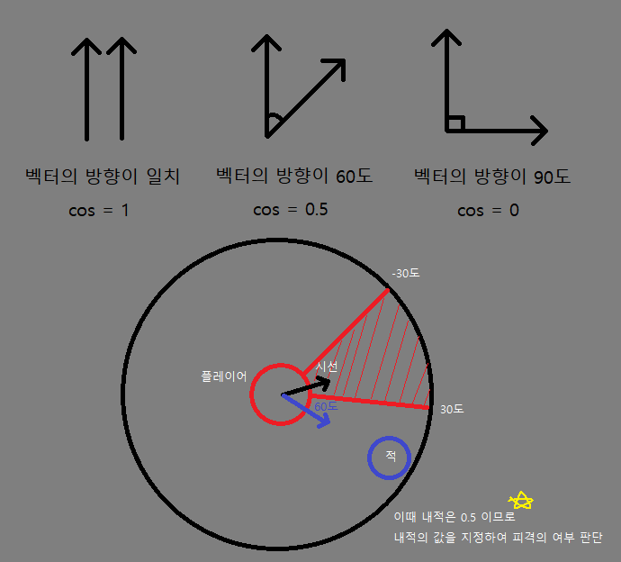
  - 기존 발차기는 SweepSingleByChannel()메서드를 사용하여 처음으로 닿는 액터에게 KnockBack() 효과를 주었지만 내적을 사용한 방식으로 변경.
  - __UKismetSystemLibrary::SphereOverlapActors()메서드를__ 사용하여 플레이어 주변의 모든 액터를 받아 그 액터와 플레이어의 내적의 크기가 일정 범위내라면 KnockBack()메서드가 실행되는 방식.
    - 찾아낼 액터를 저장할 배열(OutActors), 트레이스 채널번호(TraceObjectTypes), 타입(SeekClass)이 필요하고 무시할 액터를 저장한 배열(IgnoreActors)이 필요하다. 
    - 메서드를 사용하여 액터들을 모두 OutActors의 배열에 담고 for구문을 통해서 모두 확인하는데 플레이어와 액터의 내적 크기를 GetDotProductTo()메서드를 사용하여 도출. (단위는 1)
    - 위의 그림처럼 내적의 크기를 기준으로 피격을 판단하며 __장점은 공격타입에 따라 범위를 지정할 수 있다.__
    
      <details><summary>cpp 코드</summary> 

      ```c++
      //PlayerAttackFunction.cpp
      void UPlayerAttackFunction::KickStart(FVector Location, FVector Forward) {
        //찾아낼 액터의 트레이스 채널
        TArray<TEnumAsByte<EObjectTypeQuery>> TraceObjectTypes;		
        TraceObjectTypes.Add(UEngineTypes::ConvertToObjectType(ECollisionChannel::ECC_GameTraceChannel2));

        //찾아낼 액터의 타입
        UClass* SeekClass = AEnemy::StaticClass();

        //무시될 액터의 배열
        TArray<AActor*> IgnoreActors;	
        IgnoreActors.Init(Owner, 1);	

        //찾아낸 액터를 저장할 배열
        TArray<AActor*> OutActors;		

        bool bResult= UKismetSystemLibrary::SphereOverlapActors(GetWorld(), Owner->GetActorLocation(), 200.f, TraceObjectTypes, SeekClass, IgnoreActors, OutActors);

        /** Draw Image */
        FColor DrawColor = bResult ? FColor::Green : FColor::Red;
        DrawDebugSphere(GetWorld(), Owner->GetActorLocation(), 200.f, 12, DrawColor, true, -0.5f);

        /** 실질적인 알고리즘 */
        if (bResult) {
          for (auto& HitActor : OutActors)
          {
            // 내적의 크기
            float Inner = Owner->GetDotProductTo(HitActor);
            if (Inner > 0.5f) {
              AEnemy* KnockBackEnemy = Cast<AEnemy>(HitActor);
              if (KnockBackEnemy) {
                FVector VectorToBack = FVector(Forward.X, Forward.Y, 0);
                KnockBackEnemy->KnockBack(VectorToBack);
              }
            }
          }
        }
      }
      ```
      </details>
- ## <span style = "color:yellow;">넉백 수정</span>
  - 기존 LaunchCharacter()메서드를 사용해서 넉백을 지정했지만 이 메서드는 물리적인 요소에 영향을 받기 때문에 AddActorWorldOffset()메서드 사용.
  - Tick()에서 IsKnockBack()메서드를 실행하여 판단하며, 이 외에는 핸들러을 사용한다. 추가로 0.2초 내에는 다시 밀리지 않는다.
    - bIsBack변수가 true이면 Tick()에서 Tick만큼 0.2초간 밀린다.
      <details><summary>cpp 코드</summary> 

      ```c++
      //Enemy.cpp
      void AEnemy::Tick(float DeltaTime)
      {
        Super::Tick(DeltaTime);

        IsKnockBack();
      }
      void AEnemy::KnockBack(FVector Backward) {
        if (!bIsback) {
          if (HitedMontage != nullptr) Anim->Montage_Play(HitedMontage);
          bIsback = true;
          BackVector = Backward;
          GetWorldTimerManager().SetTimer(backHandle, this, &AEnemy::knockBackEnd, 0.2f);
        }
      }

      void AEnemy::knockBackEnd() {
        bIsback = false;
      }
      void AEnemy::IsKnockBack() {
        if (bIsback) {
          AddActorWorldOffset(BackVector * KnockBackPower * GetWorld()->GetDeltaSeconds(), false);
        }
      }

      ```
      </details>

      <details><summary>h 코드</summary> 

      ```c++
      //Enemy.h
      public:
        UPROPERTY(VisibleAnywhere, BlueprintReadOnly, Category = "KnockBack")
        bool bIsback;

        UPROPERTY(VisibleAnywhere, BlueprintReadOnly, Category = "KnockBack")
        FVector BackVector;

        UPROPERTY(VisibleAnywhere, BlueprintReadOnly, Category = "KnockBack")
        FTimerHandle backHandle;

        UFUNCTION()
        void KnockBack(FVector Backward);

        UFUNCTION()
        void knockBackEnd();

        UFUNCTION()
        void IsKnockBack();
      ```
      </details>

> **<h3>Realization</h3>**
- ## 물리적 거리 : 물리적인 계산을 통해서 움직이는 메서드 
  1. AddForce 
    - 추가 힘. 지속 기간 내에 호출되어야 함. (매Tick마다)
    - 모든 프레임이라고 부르기 위해 의도된 대로 현재 fps에 따라 조절.
  2. AddImpulse
    - 즉시 물체에 총 1초의 추가 힘 속도를 부여한다. (1tick)
  
  - Addforce 60번 == AddImpulse 1번 (fps에 따라 다름)

- ## 일정거리 : 물리적인 계산은 하지 않고 움직이는 메서드 (고정된 거리)
  1. SetActorLocation 
  2. AddActorWorldOffset

- ## 포스트 프로세스 
  - 전체 화면 필터 및 효과를 화면에 표시하기 전에 카메라의 이미지 버퍼에 적용하는 프로세스.
  - 렌즈 플레어, 화면 색조 및 블러링같은 효과를 낼 수도 있고, 볼륨끼리 또는 플레이어와의 상호작용 방식을 정의
  - 기존에 렌더링 된 씬에 씬에 렌더링 효과를 더하는 작업, 포스트 프로세싱의 효과는 일반적으로 씬 뷰에 따라 달라지거나, 최종 렌더링 결과물을 생성하기 전에 렌더링 되는 씬 위에 겹쳐서 표시.
  - 카메라의 효과를 정의한다고 생각하면 쉽다.

## **08.29**
> **<h3>Today Dev Story</h3>**
- ## <span style = "color:yellow;">아이템의 회전</span>
  - 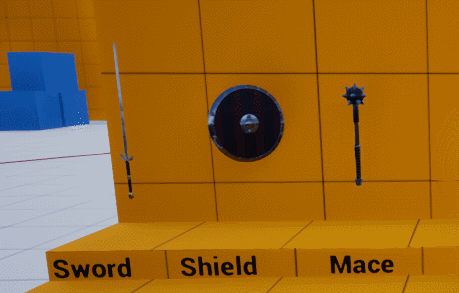 
  - Item클래스에 새로운 상태인 EItemState를 제작하여 상태가 Ground일때 Item이 회전하는 기능을 추가.
  - 상태의 변화는 Weapon의 Un/Equip()메서드에서 구성했으며, 실제 회전의 구현은 Item클래스의 Tick()에서 SetSpinItem()메서드를 호출하여 사용.
    <details><summary>cpp 코드</summary> 

    ```c++
    //Item.cpp
    AItem::AItem()
    {
      //Spin Item
      SpinSpeed = 45.f;
      SetItemState(EItemState::EIS_Ground);
    } 
    void AItem::Tick(float DeltaTime)
    {
      Super::Tick(DeltaTime);
      SetSpinItem();
    }
    void AItem::SetSpinItem() {
      if (GetItemState() == EItemState::EIS_Ground) {
        FRotator Rot = GetActorRotation();
        Rot.Yaw += GetWorld()->GetDeltaSeconds() * SpinSpeed;
        SetActorRotation(Rot);
      }
    }
    ```
    ```c++
    //Weapon.cpp
    void AWeapon::Equip(class AMainPlayer* Player) {
      SetItemState(EItemState::EIS_Equip);      //상태지정.
      SetActorRotation(FRotator(0.f));
    }
    void AWeapon::UnEquip() {
      SetItemState(EItemState::EIS_Ground);     //상태지정.
      DetachFromActor(FDetachmentTransformRules::KeepWorldTransform);
      CollisionVolume->SetCollisionEnabled(ECollisionEnabled::QueryOnly);
      SetActorLocationAndRotation(GetActorLocation(), FRotator(180.f,0.f, 0.f));
    }
    ```
    </details>

    <details><summary>h 코드</summary> 

    ```c++
    //Item.h
    UENUM(BlueprintType)
    enum class EItemState : uint8
    {
      EIS_Normal	UMETA(DisplayName = "Normal"),
      EIS_Ground  UMETA(DisplayName = "Ground"),
      EIS_Equip	UMETA(DisplayName = "Equip"),

      EIS_Default	UMETA(DisplayName = "Default")
    };
    protected:
      /** ItemState */
      UPROPERTY(VisibleAnywhere, BlueprintReadOnly, Category = "Item", Meta = (AllowPrivateAccess = true))
      EItemState ItemState;

      UPROPERTY(VisibleAnywhere, BlueprintReadOnly, Category = "Item", Meta = (AllowPrivateAccess = true))
      float SpinSpeed;

      FORCEINLINE void SetItemState(EItemState State) { ItemState = State; }
      FORCEINLINE EItemState GetItemState() { return ItemState; }

      UFUNCTION()
	    void SetSpinItem();
    ```
    </details>

- ## <span style = "color:yellow;">잡다한 것</span>
  1. 공격방식을 발차기와 같은 방식으로 수정.
  2. 적의 체력바는 플레이어의 구와 적이 Overlap되면 표시하도록 수정.

> **<h3>Realization</h3>**
- GroundFriction : 땅과의 마찰력. 

## **08.30**
> **<h3>Today Dev Story</h3>**
- ## <span style = "color:yellow;">Damage Log(Widget)</span>
  -  
  - UUserWidget클래스를 상속받은 DamageTextWidget클래스 생성후 Text와 SizeBox생성 후 지정하고 애니메이션(Fade)를 생성.
    - 가상함수로 제작하여 Text와 Animation을 꼭 만들도록 만듦. 이때 Animation은 직렬화하고 이외에도 자연스럽게 움직이도록 FVector2D 타입의 Location 변수 지정.
    - 생성시 종료지점 FinalScreenLocation을 랜덤으로 지정하고 Fade Animation을 실행. (점점 Opercity를 줄여서 불투명하게된다.)
    - 매 Tick에서는 Vector2DInterpTo()메서드와 SetPositionInViewport()메서드를 사용하여 목표지점으로 프레임당 이동.
  - MainPlayer클래스에서는 TakeDamge()메서드, 즉 데미지를 받을때 SpawnDamageText()메서드를 실행.
    - 해당 메서드에서는 DamageTextWidget클래스를 CreateWidget으로 생성하고 초기값 설정 후 AddToViewport()메서드를 통해 화면에 생성.
    - ProjectWorldToScreen()메서드는 월드의 3DVector 값을 2DVector값으로 전환해준다.
      <details><summary>cpp 코드</summary> 

      ```c++
      //DamageTextWidget.cpp
      #include "Kismet/KismetMathLibrary.h"
      #include "Kismet/KismetTextLibrary.h"
      #include "Components/TextBlock.h"

      void UDamageTextWidget::NativeConstruct() {
        Super::NativeConstruct();

        SetPositionInViewport(InintialScreenLocation);

        FinalScreenLocation.X = InintialScreenLocation.X + UKismetMathLibrary::RandomFloatInRange(-150.f,150.f);
        FinalScreenLocation.Y = InintialScreenLocation.Y + UKismetMathLibrary::RandomFloatInRange(-300.f,-150.f);
        
        TEnumAsByte<ERoundingMode> Mode;

        DamageText->SetText(UKismetTextLibrary::Conv_FloatToText(DamageToDisplay, Mode));
        PlayAnimation(Fade);
      }

      void UDamageTextWidget::NativeTick(const FGeometry& MyGeometry, float InDeltaTime){
        Super::NativeTick(MyGeometry, InDeltaTime);

        InintialScreenLocation = UKismetMathLibrary::Vector2DInterpTo(InintialScreenLocation,FinalScreenLocation,InDeltaTime,1.0f);
        SetPositionInViewport(InintialScreenLocation);
      }
      ```
      ```c++
      //MainPlayer.cpp
      float AMainPlayer::TakeDamage(float DamageAmount, struct FDamageEvent const& DamageEvent, class AController* EventInstigator, AActor* DamageCauser) {
        /** ShowDamageText */
        SpawnDamageText(GetActorLocation(), DamageAmount);
      }

      void AMainPlayer::SpawnDamageText(FVector WorldLocation, float Damage) {
        WorldLocation.X += UKismetMathLibrary::RandomFloatInRange(-50.f,50.f);
        WorldLocation.Y += UKismetMathLibrary::RandomFloatInRange(-50.f,50.f);
        UGameplayStatics::ProjectWorldToScreen(PlayerController, WorldLocation, DamageTextVec);
        DamageWidget = CreateWidget<UDamageTextWidget>(PlayerController, DamageTextWidget);
        DamageWidget->InintialScreenLocation = DamageTextVec;
        DamageWidget->DamageToDisplay = Damage;
        DamageWidget->AddToViewport();
      }
      ```
      </details>

      <details><summary>h 코드</summary> 

      ```c++
      //DamageTextWidget.h
      UCLASS(Abstract)
      class COMBATARENA_API UDamageTextWidget : public UUserWidget
      {
        GENERATED_BODY()

      public:
        virtual void NativeConstruct() override;

        virtual void NativeTick(const FGeometry& MyGeometry, float InDeltaTime);
      private:
        UPROPERTY(Meta = (BindWidget), Meta = (AllowPrivateAccess = true))
        class UTextBlock* DamageText;

        UPROPERTY(Meta = (BindWidgetAnim), Meta = (AllowPrivateAccess = true), Transient)	//직렬화
        class UWidgetAnimation* Fade;

      public:
        UPROPERTY(EditAnywhere, BlueprintReadWrite, Category = "Variables")
        FVector2D InintialScreenLocation;
        
        UPROPERTY(EditAnywhere, BlueprintReadWrite, Category = "Variables")
        FVector2D FinalScreenLocation;

        UPROPERTY(EditAnywhere, BlueprintReadWrite, Category = "Variables")
        float DamageToDisplay;
      };
      ```
      ```c++
      //MainPlayer.h
      public:
        UPROPERTY(EditAnywhere, BlueprintReadWrite, Category = "HUD")
        FVector2D DamageTextVec;

        UPROPERTY(EditAnywhere, BlueprintReadWrite,Category="HUD")
        TSubclassOf<class UDamageTextWidget> DamageTextWidget;

        UPROPERTY(EditAnywhere, BlueprintReadWrite, Category = "HUD")
        class UDamageTextWidget* DamageWidget;

        UFUNCTION()
        void SpawnDamageText(FVector WorldLocation, float Damage);
      ```
      </details>

> **<h3>Realization</h3>**

## **09.03**
> **<h3>Today Dev Story</h3>**
- ## <span style = "color:yellow;">Damage Log_2</span>
  - 
  - 기존 데미지 위젯을 AttackFunction클래스로 이동하여 Enemy클래스와 Player클래스 모두에서 사용가능 하도록 구현.
  - 구현 방식은 이전 방식과 동일하게 구현하였고, Player와 Enemy에서 호출 시 넘기는 Controller의 값은 항상 Player의 Controller 값으로 지정.
  - 그렇게 해야만 Player의 HUD 상에 표시.
    <details><summary>cpp 코드</summary> 

    ```c++
    //AttackFunction.cpp
    #include "DamageTextWidget.h"	
    #include "MainController.h"	
    #include "Blueprint/UserWidget.h"
    #include "Kismet/GameplayStatics.h"
    #include "Kismet/KismetMathLibrary.h"

    void UAttackFunction::SpawnDamageText(FVector WorldLocation, float Damage, TSubclassOf<class UDamageTextWidget> DamageTextWidget, AController* DisplayController) {
      if(DamageTextWidget == nullptr) return;

      const APlayerController* DamageController = Cast<APlayerController>(DisplayController);
      WorldLocation.X += UKismetMathLibrary::RandomFloatInRange(-50.f, 50.f);
      WorldLocation.Y += UKismetMathLibrary::RandomFloatInRange(-50.f, 50.f);
      UGameplayStatics::ProjectWorldToScreen(DamageController, WorldLocation, DamageTextVec);
      DamageWidget = CreateWidget<UDamageTextWidget>(GetWorld(), DamageTextWidget);
      DamageWidget->InintialScreenLocation = DamageTextVec;
      DamageWidget->DamageToDisplay = Damage;
      DamageWidget->AddToViewport();
    }
    ```
    ```c++
    //MainPlayer.cpp
    float AMainPlayer::TakeDamage(float DamageAmount, struct FDamageEvent const& DamageEvent, class AController* EventInstigator, AActor* DamageCauser) {
      /** ShowDamageText */
      AttackFunction->SpawnDamageText(GetActorLocation(), DamageAmount, DamageTextWidget,GetController());

      return DamageAmount;
    }
    //Enemy.cpp
    float AEnemy::TakeDamage(float DamageAmount, struct FDamageEvent const& DamageEvent, class AController* EventInstigator, AActor* DamageCauser) {
      /** ShowDamageText */
      AttackFunction->SpawnDamageText(GetActorLocation(), DamageAmount, DamageTextWidget, EventInstigator);

      return DamageAmount;
    }
    ```
    </details>

    <details><summary>h 코드</summary> 

    ```c++
    //AttackFunction.h
    public:
      UPROPERTY(EditAnywhere, BlueprintReadWrite, Category = "HUD")
      FVector2D DamageTextVec;

      UPROPERTY(EditAnywhere, BlueprintReadWrite, Category = "HUD")
      class UDamageTextWidget* DamageWidget;

      UFUNCTION()
      void SpawnDamageText(FVector WorldLocation, float Damage, TSubclassOf<UDamageTextWidget> DamageTextWidget, AController* DisplayController);
    ```
    </details>

## **09.08**
> **<h3>Today Dev Story</h3>**
- ## <span style = "color:yellow;">Stamia Bar</span>
  - 
  - 이전에 [HealthWidget 구현방식](#Stamina도-동일하게-구현)과 동일하게 구현.
  - 추상클래스로 UUserWidget상속받은 StaminaWidget클래스를 생성하고 SetOwnerStamina()를 MainPlayer클래스에서 매 Tick마다 호출하여 사용.
    - 또한 Ratio가 0.3보다 작아지면 ProgressBar의 Color를 변경.
    - 이 클래스 또한 MainController클래스의 PlayerWidget의 패널에 넣어서 사용.
  - MainPlayer클래스의 Tick메서드에서 SetStaminaRatio()메서드를 실행하여 현재의 상태 (GetMovementStatus())에 따라서 CurrentStamina의 값을 증감.
    - Stamina가 없다면 더 이상 뛸 수 없으며, 0.3f 값보다 아래에 있을때는 뛰는 것이 불가능하도록 설정.
      <details><summary>cpp 코드</summary> 

      ```c++
      //StaminaWidget.cpp
      #include "StaminaWidget.h"
      #include "MainPlayer.h"
      #include "Components/ProgressBar.h"
      #include "Components/TextBlock.h"

      void UStaminaWidget::SetOwnerStamina(float Ratio, float Max, float Current) {
        if (!PlayerController.IsValid()) return;

        FLinearColor BarColor;
        FNumberFormattingOptions Opts;
        Opts.SetMaximumFractionalDigits(0);

        StaminaBar->SetPercent(Ratio);
        CurrentStaminaLabel->SetText(FText::AsNumber(Current, &Opts));
        MaxStaminaLabel->SetText(FText::AsNumber(Max, &Opts));

        /** Set StaminaBar Color */
        if (Ratio <= 0.3f) BarColor = FLinearColor::Green;
        else BarColor = FLinearColor(1.0f, 1.0f, 1.0f, 0.25f);

        StaminaBar->SetFillColorAndOpacity(BarColor);
      }

      void UStaminaWidget::SetOwner(AController* OtherActor) {
        PlayerController = Cast<APlayerController>(OtherActor);
      }
      ```
      ```c++
      //MainPlayer.cpp
      //Stamina
      AMainPlayer::AMainPlayer()
      {
        MaxStamina = 100.f;
        CurrentStamina = MaxStamina;
        CoolDownStamina = 30.f;
        CoolUpStamina = 10.f;
      }
      void AMainPlayer::Tick(float DeltaTime)
      {
        /** Set StaminaRatio Widget */
        SetStaminaRatio();
      }
      void AMainPlayer::OnSprinting() {
        if (!IsCanMove() || GetStaminaRatio() <= 0.3f) return;
        if (MovementStatus != EMovementStatus::EMS_Sprinting && DirX != 0 || DirY != 0) {
          SetMovementStatus(EMovementStatus::EMS_Sprinting);
          ZoomInCam(FVector(150.f, 0.f, 0.f));
        }
      }
      void AMainPlayer::SetStaminaRatio() {
        if (GetMovementStatus() == EMovementStatus::EMS_Sprinting) {
          CurrentStamina -= GetWorld()->GetDeltaSeconds() * CoolDownStamina;
          if (CurrentStamina <= 0.f) {
            CurrentStamina = 0;
            OffSprinting();
          }
        }
        else {
          if (CurrentStamina >= MaxStamina) CurrentStamina = MaxStamina;
          else CurrentStamina += GetWorld()->GetDeltaSeconds() * CoolUpStamina;
        }
        StaminaRatio = CurrentStamina / MaxStamina;
        PlayerController->SetPlayerStamina();
      }
      ```
      ```c++
      //MainController.cpp
      #include "StaminaWidget.h"
      void AMainController::BeginPlay() {
        if (WPlayerMainHealth) {
          ...
          if (PlayerWidget) {
            ...
            //Health,Stamina의 Progress를 찾는 부분
            HealthBarOutLine = PlayerWidget->WidgetTree->FindWidget<UHealthWidget>("PlayerHealth_BP");
            StaminaBarOutLine = PlayerWidget->WidgetTree->FindWidget<UStaminaWidget>("PlayerStanima_BP");

            HealthBarOutLine->SetPlayerOwner(this);
            StaminaBarOutLine->SetOwner(this);

            SetPlayerHealth();
            SetPlayerStamina();
          }
        }
      }
      void AMainController::SetPlayerStamina() {
        StaminaBarOutLine->SetOwnerStamina(MainPlayer->GetStaminaRatio(), MainPlayer->MaxStamina, MainPlayer->CurrentStamina);
      }
      ```
      </details>

      <details><summary>h 코드</summary> 

      ```c++
      //StaminaWidget.h
      UCLASS(Abstract)
      class COMBATARENA_API UStaminaWidget : public UUserWidget
      {
        GENERATED_BODY()

      public:
        UFUNCTION()
        void SetOwner(AController* OtherActor);

        UFUNCTION()
        void SetOwnerStamina(float Ratio, float Max, float Current);

      protected:
        UPROPERTY()
        TWeakObjectPtr<APlayerController> PlayerController;

        UPROPERTY(meta = (BindWidget))
        class UProgressBar* StaminaBar;

        UPROPERTY(meta = (BindWidget))
        class UTextBlock* CurrentStaminaLabel;

        UPROPERTY(meta = (BindWidget))
        class UTextBlock* MaxStaminaLabel;
      };
      ```
      ```c++
      //MainPlayer.h
      public:
        UPROPERTY(VisibleAnywhere, BlueprintReadOnly, Category = "Stamina")
        float MaxStamina;

        UPROPERTY(VisibleAnywhere, BlueprintReadOnly, Category = "Stamina")
        float CurrentStamina;

        UPROPERTY(VisibleAnywhere, BlueprintReadOnly, Category = "Stamina")
        float CoolUpStamina; 
        
        UPROPERTY(VisibleAnywhere, BlueprintReadOnly, Category = "Stamina")
        float CoolDownStamina;

        UPROPERTY()		
        float StaminaRatio = 0.f;

        UFUNCTION()
        void SetStaminaRatio();

        UFUNCTION()
        FORCEINLINE float GetStaminaRatio() { return StaminaRatio; }
      ```
      ```c++
      //MainController.h
      public:
        UPROPERTY(VisibleAnywhere, Category = "Widget | PlayerWidget")
        class UStaminaWidget* StaminaBarOutLine;

        UFUNCTION()
        void SetPlayerStamina();	
      ```
      </details>
- ## <span style = "color:yellow;">잡다한 것들</span>
  1. KnockBack시 플레이어의 뒤방향으로 밀리는 것을 적의 공격 방향으로 밀리도록 수정.

> **<h3>Realization</h3>**
  - null

## **09.12**
> **<h3>Today Dev Story</h3>**
- ## <span style = "color:yellow;">Lazer Length</span>
  -  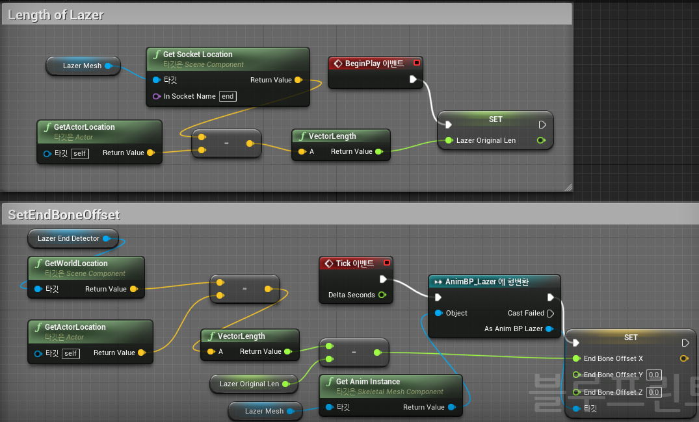
  - 벽이나 물체에 닿으면 길이가 조절되는 레이저 액터를 생성. 스켈레탈의 End위치를 조정하는 방식.
    - Lazer Skeletal Animation을 생성하고, Transform (Modify) Bone을 사용하여 End위치 조정.
  - Lazer Actor를 생성하고 SpringArm, SphereComponent를 생성하고 Sphere는 SpringArm에 어태치.
    - 이때 SphereComponent는 물체의 충돌을 감지하며 레이저의 길이와 중첩을 관리.
    - SpringArm의 길이를 4500.f로 길게 늘리고, Sphere의 크기도 키운다. 그냥 카메라의 원리라고 생각하면 편리하다. 
    - 벽이나 물체에 닿으면 카메라의 길이가 짧아지는 것을 상상하면된다.
  - 초기 Lazer의 길이는 "Bone중 End의 위치 - 액터의 위치"이고, 추후의 길이는 "구의 위치 - 액터의 위치"이다. 
    - 이 추후의 길이에서 원래의 길이를 빼서 End Bone의 X길이를 지정
    - AnimInstance의 변수를 가져오는 방법을 몰라서 블루프린트로 구현.
  
      <details><summary>cpp 코드</summary> 
      
      ```c++
      //Lazer.cpp
      ALazer::ALazer()
      {
        PrimaryActorTick.bCanEverTick = true;

        DefaultSceneRoot = CreateDefaultSubobject<USceneComponent>(TEXT("DefaultSceneRoot"));
        LazerMesh = CreateDefaultSubobject<USkeletalMeshComponent>(TEXT("LazerMesh"));
        LazerArm = CreateDefaultSubobject<USpringArmComponent>(TEXT("LazerArm"));
        LazerEndDetector = CreateDefaultSubobject<USphereComponent>(TEXT("LazerEndDetector"));

        SetRootComponent(DefaultSceneRoot);
        LazerMesh->SetupAttachment(GetRootComponent());
        LazerArm->SetupAttachment(GetRootComponent());
        LazerEndDetector->SetupAttachment(LazerArm);

        LazerArm->TargetArmLength = 4500.f;
        LazerEndDetector->SetSphereRadius(52.f);
      }
      ```
      ```c++
      //MainPlayer.cpp
      void AMainPlayer::SetupPlayerInputComponent(UInputComponent* PlayerInputComponent)
      {
        Super::SetupPlayerInputComponent(PlayerInputComponent);

        //lazer
        PlayerInputComponent->BindAction("Lazer",EInputEvent::IE_Pressed,this,&AMainPlayer::LazerAttack);
        PlayerInputComponent->BindAction("Lazer",EInputEvent::IE_Released,this,&AMainPlayer::LazerEnd);
      }
      void AMainPlayer::LazerAttack() {
        FActorSpawnParameters SpawnParams; 
        SpawnParams.Owner = this; 
        SpawnParams.Instigator = GetInstigator();
        Lazer = GetWorld()->SpawnActor<AActor>(LazerClass,FVector(0.f),FRotator(0.f),SpawnParams);

        Lazer->AttachToComponent(GetMesh(), FAttachmentTransformRules(EAttachmentRule::SnapToTarget,false), FName("LazerPos"));
      }

      void AMainPlayer::LazerEnd() {
        if (Lazer) {
          Lazer->Destroy();
        }
      }
      ```
      </details>
      <details><summary>h 코드</summary> 
      
      ```c++
      //Lazer.h
      public:
        UPROPERTY(EditAnywhere, BlueprintReadWrite)
        USceneComponent* DefaultSceneRoot; 
        
        UPROPERTY(EditAnywhere, BlueprintReadWrite)
        USkeletalMeshComponent* LazerMesh;

        UPROPERTY(EditAnywhere, BlueprintReadWrite)
        USpringArmComponent* LazerArm;
        
        UPROPERTY(EditAnywhere, BlueprintReadWrite)
        USphereComponent* LazerEndDetector;
      ```
      ```c++
      //MainPlayer.h
      public:
        UPROPERTY(VisibleAnywhere,BlueprintReadOnly, Category = "Skill | Lazer")
        AActor* Lazer;

        UPROPERTY(EditDefaultsOnly, Category = "Skill | Lazer")
        TSubclassOf<class AActor> LazerClass;

        UFUNCTION()
        void LazerAttack();

        UFUNCTION()
        void LazerEnd();
      ```
      </details>

- ## <span style = "color:yellow;">Lazer Damage</span>
  -  
  - SphereComponent와 Player가 부딪히면 Overlap메서드(OverlapBegin/EndActor)를 사용하여 데미지 처리.
  - Overlap되면 bContinueDealing이 True로 변환되여 ApplyDamage()메서드를 실행하며, 데미지 타입은 기본으로 설정.
    - TArray로 Overlap된 배열들을 받아 저장하고, FLatentActionInfo의 ExecutionFunction를 Dealing()메서드로 지정하여 지정한 초마다 반복.
    - UKismetSystemLibrary::Delay()메서드와 FLatentActionInfo를 사용하여, Dealing()메서드를 반복한다.
      <details><summary>cpp 코드</summary> 
      
      ```c++
      //Lazer.cpp
      #include "Kismet/KismetSystemLibrary.h"
      #include "PlayerAttackFunction.h"
      ALazer::ALazer()
      {
        bContinueDealing = false;
      }
      void ALazer::BeginPlay()
      {
        Super::BeginPlay();

        /** Dealing */
        LazerEndDetector->OnComponentBeginOverlap.AddDynamic(this, &ALazer::OverlapBeginActor);
        LazerEndDetector->OnComponentEndOverlap.AddDynamic(this, &ALazer::OverlapEndActor);

        LatentInfo.CallbackTarget = this;
        LatentInfo.ExecutionFunction = "Dealing";    
        LatentInfo.UUID = 123;
        LatentInfo.Linkage = 1;
      }
      void ALazer::OverlapBeginActor(UPrimitiveComponent* OverlappedComponent, AActor* OtherActor, UPrimitiveComponent* OtherComp, int32 OtherBodyIndex, bool bFromSweep, const FHitResult& SweepResult) {
        if (OtherActor) {
          bContinueDealing = true;
          AMainPlayer* Player = Cast<AMainPlayer>(OtherActor);

          SpawnController = Player->GetController();
          OverlapingEnemies.Add(Player);
          Dealing();
        }
      }

      void ALazer::OverlapEndActor(UPrimitiveComponent* OverlappedComponent, AActor* OtherActor, UPrimitiveComponent* OtherComp, int32 OtherBodyIndex) {
        if (OtherActor) {
          AMainPlayer* Player = Cast<AMainPlayer>(OtherActor);
          OverlapingEnemies.Remove(Player);

          bContinueDealing = false;
        }
      }

      void ALazer::Dealing() {
        if (bContinueDealing) {
          for (auto i : OverlapingEnemies) {
            AMainPlayer* player = Cast<AMainPlayer>(i);
            UGameplayStatics::ApplyDamage(player,20.f, SpawnController,this, LazerDamageType);
          }
          UKismetSystemLibrary::Delay(this, 1.0f, LatentInfo);
        }
      }
      ```
      </details>
      <details><summary>h 코드</summary> 
      
      ```c++
      //Lazer.h
      public:
        /** Overlap & Dealing */
        UPROPERTY(VisibleAnywhere, BlueprintReadOnly, Category = "Array | Enemy")
        TArray<class AMainPlayer*> OverlapingEnemies;

        UPROPERTY(VisibleAnywhere, BlueprintReadOnly, Category = "Area")
        bool bContinueDealing;

        UPROPERTY(VisibleAnywhere, BlueprintReadOnly, Category = "Area")
        FLatentActionInfo LatentInfo;

        UPROPERTY(EditAnywhere, BlueprintReadWrite, Category = "Combat")
        TSubclassOf<UDamageType> LazerDamageType;

        UPROPERTY(EditAnywhere, BlueprintReadWrite, Category = "Combat")
        AController* SpawnController;

        UFUNCTION()
        void OverlapBeginActor(UPrimitiveComponent* OverlappedComponent, AActor* OtherActor, UPrimitiveComponent* OtherComp, int32 OtherBodyIndex, bool bFromSweep, const FHitResult& SweepResult);
        
        UFUNCTION()
        void OverlapEndActor(UPrimitiveComponent* OverlappedComponent, AActor* OtherActor, UPrimitiveComponent* OtherComp, int32 OtherBodyIndex);

        UFUNCTION()
        void Dealing();
      ```
      </details>

- ## <span style = "color:yellow;">Save&Load Data</span>
  - Savegame 클래스를 부모로 하는 PlayerSaveGame클래스 제작
    - 생성자 클래스와 저장할 변수들을 저장하며 __되도록이면 PlayerName, Index변수를 꼭 선언. (추후 SaveGameToSlot()메서드 사용시 필요.)__
    - Health와 Stamina와 같은 데이터들은 묶어서 Struct의 형태로 저장.
  - MainPlayer클래스에 새로운 메서드인 Save/LoadData()를 생성하고 정의.
    - 해당 메서드는 PlayerSaveGame클래스의 데이터를 저장하고 불러오는 역할. (.sav파일이 Saved폴더에 생성)
      
      <details><summary>cpp 코드</summary> 
    
      ```c++
      //PlayerSaveGame.cpp
      #include "PlayerSaveGame.h"

      UPlayerSaveGame::UPlayerSaveGame() {
        PlayerName = TEXT("Default");
        UserIndex = 0;
      }
      ```
      ```c++
      //Mainplayer.cpp
      #include "PlayerSaveGame.h"	
      void AMainPlayer::SaveData() {
        UPlayerSaveGame* SaveGameInstance = Cast<UPlayerSaveGame>(UGameplayStatics::CreateSaveGameObject(UPlayerSaveGame::StaticClass()));

        SaveGameInstance->CharacterStats.Health = CurrentHealth;
        SaveGameInstance->CharacterStats.MaxHealth = MaxHealth;
        SaveGameInstance->CharacterStats.Stamina	= CurrentStamina;
        SaveGameInstance->CharacterStats.MaxStamina = MaxStamina;
        SaveGameInstance->CharacterStats.Location = GetActorLocation();

        UGameplayStatics::SaveGameToSlot(SaveGameInstance,SaveGameInstance->PlayerName,SaveGameInstance->UserIndex);
      }

      void AMainPlayer::LoadData() {
        UPlayerSaveGame* LoadGameInstance = Cast<UPlayerSaveGame>(UGameplayStatics::CreateSaveGameObject(UPlayerSaveGame::StaticClass()));

        LoadGameInstance = Cast<UPlayerSaveGame>(UGameplayStatics::LoadGameFromSlot(LoadGameInstance->PlayerName,LoadGameInstance->UserIndex));
        
        CurrentHealth = LoadGameInstance->CharacterStats.Health;
        MaxHealth = LoadGameInstance->CharacterStats.MaxHealth;
        CurrentStamina = LoadGameInstance->CharacterStats.Stamina;
        MaxStamina = LoadGameInstance->CharacterStats.MaxStamina;
        SetActorLocation(LoadGameInstance->CharacterStats.Location);
      }
      ```
      </details>
      <details><summary>h 코드</summary> 
      
      ```c++
      //PlayerSaveGame.h
      USTRUCT(BlueprintType)
      struct FCharacterStats
      {
        GENERATED_BODY()

        UPROPERTY(VisibleAnywhere, Category = "SaveGameData")
        float Health;

        UPROPERTY(VisibleAnywhere, Category = "SaveGameData")
        float MaxHealth;

        UPROPERTY(VisibleAnywhere, Category = "SaveGameData")
        float MaxStamina;

        UPROPERTY(VisibleAnywhere, Category = "SaveGameData")
        float Stamina;

        UPROPERTY(VisibleAnywhere, Category = "SaveGameData")
        FVector Location;
      };

      UCLASS()
      class COMBATARENA_API UPlayerSaveGame : public USaveGame
      {
        GENERATED_BODY()
      public:
        UPlayerSaveGame();

        UPROPERTY(VisibleAnywhere, Category = "DefaultData")
        FString PlayerName;

        UPROPERTY(VisibleAnywhere, Category = "DefaultData")
        uint32 UserIndex;

        UPROPERTY(VisibleAnywhere, Category = "DefaultData")
        FCharacterStats CharacterStats;
      };
      ```
      ```c++
      //MainPlayer.h
      public:
        UFUNCTION(BlueprintCallable)
        void SaveData();

        UFUNCTION(BlueprintCallable)
        void LoadData();
      ```
      </details>

- ## <span style = "color:yellow;">Save&Load Data</span>
  - 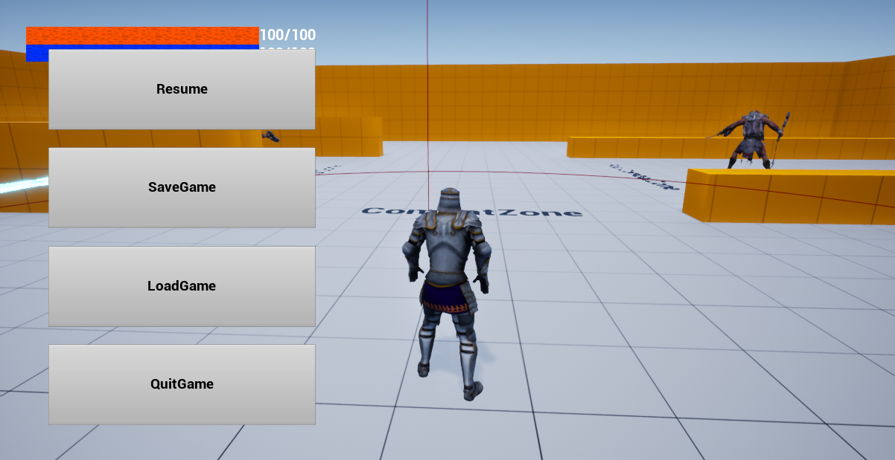 
  - 종료 버튼을 위해서 Q와 ESC버튼을 통해서 PauseMenu를 표시. [이전방식](#Stamina도-동일하게-구현)과 동일.
    
    <details><summary>cpp 코드</summary> 
    
    ```c++
    //MainController.cpp
    void AMainController::BeginPlay() {
      if (WPauseMenu) {	
        PauseMenu = CreateWidget<UUserWidget>(this, WPauseMenu);
        if (PauseMenu) {
          PauseMenu->AddToViewport();
          PauseMenu->SetVisibility(ESlateVisibility::Hidden);
        }
      }
    }
    void AMainController::DisplayPauseMenu() {
      if (PauseMenu) {
        bPauseMenuVisible = true;
        PauseMenu->SetVisibility(ESlateVisibility::Visible);
      }
    }
    void AMainController::RemovePauseMenu() {
      if (PauseMenu) {
        bPauseMenuVisible = false;
        PauseMenu->SetVisibility(ESlateVisibility::Hidden);
      }
    }
    void AMainController::TogglePauseMenu() {
      return bPauseMenuVisible ? RemovePauseMenu() : DisplayPauseMenu();
    }
    ```
    ```c++
    //MainPlayer.cpp
    void AMainPlayer::SetupPlayerInputComponent(UInputComponent* PlayerInputComponent)
    {
    	/** Pause Menu */
      PlayerInputComponent->BindAction("Quit", EInputEvent::IE_Pressed, this, &AMainPlayer::ESCDown);
      PlayerInputComponent->BindAction("Quit", EInputEvent::IE_Released, this, &AMainPlayer::ESCUp);
    }
    void AMainPlayer::ESCUp() {
      bESCDown = false;
    }

    void AMainPlayer::ESCDown(){
      bESCDown = true;
      if (PlayerController) {
        PlayerController->TogglePauseMenu();
      }
    }
    ```
    </details>
    <details><summary>h 코드</summary> 
    
    ```c++
    //MainController.h
    public:
    	UPROPERTY(EditAnywhere, BlueprintReadWrite, Category = "HUD")
      TSubclassOf<UUserWidget> WPauseMenu;

      UPROPERTY(EditAnywhere, BlueprintReadWrite, Category = "HUD")
      UUserWidget* PauseMenu;

      bool bPauseMenuVisible;

      void DisplayPauseMenu();
      void RemovePauseMenu();
      void TogglePauseMenu();
    ```
    ```c++
    //MainPlayer.h
    public:
    	UPROPERTY(VisibleAnywhere,BlueprintReadOnly,Category = "HUD")
    	bool bESCDown;

      UFUNCTION()
      void ESCUp();
      
      UFUNCTION()
      void ESCDown();
    ```
    </details>

> **<h3>Realization</h3>**
- ApplyDamage는 특별한 처리 없이 데미지를 전달
  - ApplyPointDamage는 어떤 방향에서 Actor의 어디 부분에 맞았더니 데미지를 전달
  - ApplyRadialDamage는 특정 지역에 발생한 폴발때문에 데미지를 입었다를 전달
  - c++에서는 TakeDamage의 FDamageEvent의 자식인 FPointDamageEvent, FRadialDamageEvent를 사용하여 파라미터에 넣어준다.
- UKismetSystemLibrart::Delay()
  - 다시 실행할 메서드와 시간을 정의하면 반복하는 메서드이며, 반복한 메서드안에 정의하여 사용.
- SaveGame클래스
  - 정의된 클래스의 데이터를 저장하고 불러오는 역할. (.sav파일이 Saved폴더에 생성)
    ```c++
    UPlayerSaveGame* LoadGameInstance = Cast<UPlayerSaveGame>(UGameplayStatics::CreateSaveGameObject(UPlayerSaveGame::StaticClass()));  //정의

    UGameplayStatics::SaveGameToSlot(SaveGameInstance,SaveGameInstance->PlayerName,SaveGameInstance->UserIndex);      //저장.
    LoadGameInstance = Cast<UPlayerSaveGame>(UGameplayStatics::LoadGameFromSlot(LoadGameInstance->PlayerName,LoadGameInstance->UserIndex)); //호출
    ```

## **09.13**
> **<h3>Today Dev Story</h3>**
- ## <span style = "color:yellow;">Pause Menu Animaion</span>
  - 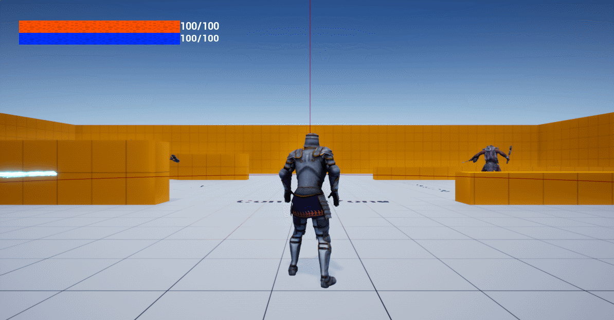 
  - 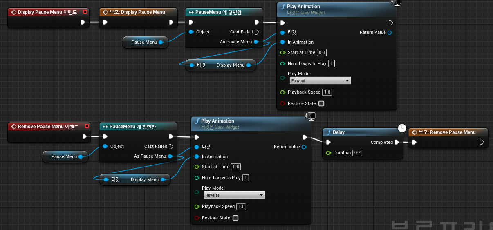 
  - PauseMenu의 Animation을 진행하기 위해서 기존메서드(Display/RemovePauseMenu)를 Implementation타입으로 변경하여 Blueprint와 혼합하여 사용.
    - __기존 메서드 선언 시 BlueprintNativeEvent로 처리하고 구현부에도 메서드명 뒤에 _Implementation을 추가로 작성.__
    - c++내에서 호출시에는 기존 메서드명으로 호출. (위는 Blueprint에서도 구현가능하다는 것을 알림.)
  - Blueprint에서는 Display할때 기존 메서드 실행 후 Animation을 진행하고, Remove의 경우 Animation을 진행하고 기존 메서드를 수행.
    <details><summary>cpp 코드</summary> 
          
    ```c++
    //MainController.cpp
    void AMainController::DisplayPauseMenu_Implementation() {
      ...
    }
    void AMainController::RemovePauseMenu_Implementation() {
      ...
    }
    void AMainController::TogglePauseMenu() {
      return bPauseMenuVisible ? RemovePauseMenu() : DisplayPauseMenu();
    }
    ```
    </details>
    <details><summary>h 코드</summary> 
        
    ```c++
    //MainController.h
    public:
      UFUNCTION(BlueprintNativeEvent,BlueprintCallable, Category= "HUD")
      void DisplayPauseMenu();
      
      UFUNCTION(BlueprintNativeEvent, BlueprintCallable,Category = "HUD")
      void RemovePauseMenu();
    ```
    </details>

- ## <span style = "color:yellow;">잡다한 것</span> 
  1. PauseMenu을 호출 시 InputMode 설정하여 마우스 사용가능하도록 전환.
    - FInputMode~를 선언하고 SetInputMode()메서드를 사용하여 UI 클릭 및 게임진행 상태 가능
    - bShowMouseCursor의 참/거짓여부를 통해서 마우스를 화면에 보여지도록 설정 가능.
      <details><summary>cpp 코드</summary> 

      ```c++
      void AMainController::DisplayPauseMenu_Implementation() {
        if (PauseMenu) {
          /** InputMode */
          FInputModeUIOnly InputModeUIOnly;
          SetInputMode(InputModeUIOnly);
          bShowMouseCursor = true;
        }
      }
      void AMainController::RemovePauseMenu_Implementation() {
        if (PauseMenu) {
          /** InputMode */
          FInputModeGameOnly InputModeGame;
          SetInputMode(InputModeGame);
          bShowMouseCursor = false;
        }
      }
      ```
      </details>
  2. PauseMenu에 있는 각각의 Button 활성화.
    - 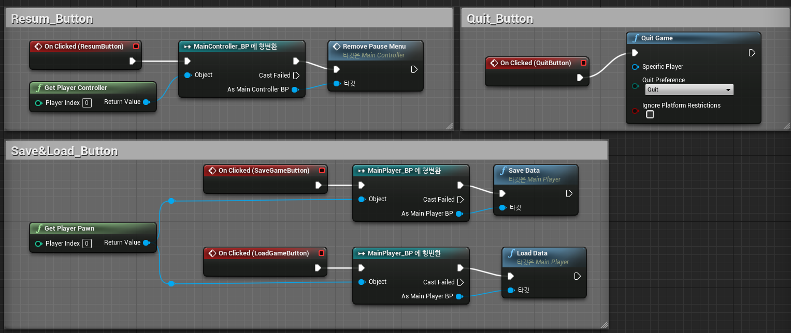 
    - Pause Menu의 Button의 각각에 OnClicked메서드를 처리하여 이벤트 처리.

> **<h3>Realization</h3>**
- BlueprintNativeEvent타입 
  - 이 타입을 사용하여 Blueprint와 C++둘 모두 동시에 메서드 구성이 가능.
  - C++에 있는 정보 호출시 부모를 호출하면되며 약간 부모와 자식개념.
  - 기존 메서드 선언 시 BlueprintNativeEvent로 처리하고 구현부에도 메서드명 뒤에 _Implementation을 추가로 작성.

## **09.19**
> **<h3>Today Dev Story</h3>**
- ## <span style = "color:yellow;">Player View Point</span>
  -  
  - 플레이어가 마법과 같은 스킬을 사용할때 위치를 설정할 수 있어야하는데 그 위치를 설정하기 위한 로직.
  - MainPlayer클래스에서 작성했으며, 연막물약과 같은 것에 활용할 예정. (Enemy도 사용할 예정)
    - SetSkillLocation()메서드에서 시점을 정의하며 GetPlayerViewPoint()메서드를 사용하여 시점으로부터 직선으로 맞는 곳에 표시.
    - QueryParams.AddIgnoredActor()를 사용하여 사용자는 통과하도록 설정.

      <details><summary>cpp 코드</summary> 

      ```c++
      //AMainPlayer.cpp
      void AMainPlayer::Tick(float DeltaTime)
      {
        /** Targeting On Ground */
        SetSkillLocation();
      }
      void AMainPlayer::SkillBegin() {
        //LazerAttack();	//Lazer
        GroundAttack();
      }
      void AMainPlayer::SkillEnd() {
        //LazerEnd();		//Lazer
        GroundEnd();
      }
      void AMainPlayer::SetSkillLocation() {
        if(!bGround) return;

        FVector ViewPoint;
        FRotator ViewRotation;
        PlayerController->GetPlayerViewPoint(ViewPoint, ViewRotation);
        FHitResult HitResult;
        FCollisionQueryParams QueryParams(NAME_None, false, this);
        QueryParams.bTraceComplex = true;
        APawn* OwnerPawn = Controller->GetPawn();

        if (OwnerPawn) QueryParams.AddIgnoredActor(OwnerPawn->GetUniqueID());	//주인은 무시

        //플레이어의 시점에 있는 곳
        bool TryTrace = GetWorld()->LineTraceSingleByChannel(HitResult, ViewPoint, ViewPoint + ViewRotation.Vector() * 10000.f, ECC_Visibility, QueryParams);
        if (TryTrace) {
          out = HitResult.ImpactPoint;
          DrawDebugSphere(GetWorld(), out, 200.f, 12, FColor::Red, false, -1, 0, 5.f);
        }
        else out = FVector();
      }
      ```
      </details>
      <details><summary>h 코드</summary> 

      ```c++
      //AMainPlayer.h
      public:
        UPROPERTY(VisibleAnywhere, BlueprintReadOnly, Category = "Skill | Ground")
        bool bGround;

        UPROPERTY(VisibleAnywhere, BlueprintReadOnly, Category = "Skill | Ground")
        FVector out;

        FORCEINLINE void GroundAttack() { bGround = true; }

        FORCEINLINE void GroundEnd() { bGround = false; }

        UFUNCTION()
        void SetSkillLocation();
      ```
      </details>

- ## <span style = "color:yellow;">Player View Point (Camera Pos)</span>
-  
  - 기존 사용했던 메서드 ZoomInCam을 사용하여 카메라의 시점 변경.
    
    <details><summary>cpp 코드</summary> 

    ```c++
    void AMainPlayer::GroundAttack() {
      bGround = true; 

      //Camera Pos (수정 필요.)
      GetController()->SetInitialLocationAndRotation(FVector(0.f), GetActorRotation());
      ZoomInCam(FVector(100.f, 0.f, 800.f), FRotator(-70.f, 0.f, 0.f));
      CameraManager->ViewPitchMax = 90.f;
      CameraManager->ViewPitchMin = 0.f;
    }

    void AMainPlayer::GroundEnd() { 
      bGround = false; 

      //Camera Pos (수정 필요.)
      ZoomOutCam();
      CameraManager->ViewPitchMax = 50.f;
      CameraManager->ViewPitchMin = -70.f;
    }
    ```
    </details>

> **<h3>Realization</h3>**
- Controller->GetPlayerViewPoint()
  - 컨트롤러를 사용하여 Player의 시점과 회전도를 알수있는 메서드.

## **09.20**
> **<h3>Today Dev Story</h3>**
- ## <span style = "color:yellow;">Player View Point (Launch Enemy to the Sky)</span>
  -  
  - 범위내의 적들을 공중에 띄우는 스킬로 K키를 눌러 범위를 지정한 후 기본공격과 동일한 키인 마우스 왼쪽버튼을 통해 실현.
  - MainPlayer클래스에 새로운 ConfirmTargetAndContinue()메서드 제작. (모션 추가)
    - OverlapMultiByObjectType()메서드와 Enemy트레이스채널을 사용하여 해당 범위 내에 있는 모든 Enemy액터를 TArray인 OverlapedEnemy에 Add
    - OverlapedEnemy를 for문으로 돌며 Enemy클래스에 있는 LaunchSky()호출하여 공중에 띄움.
  - Enemy클래스에 LaunchSky()메서드 제작후. MainPlayer의 ConfirmTargetAndContinue()로 호출.
    - 해당 메서드 내에는 LaunchCharacter()메서드 사용하여 일시적으로 힘을 가함.

    <details><summary>cpp 코드</summary> 

    ```c++
    //MainPlayer.cpp
    void AMainPlayer::Attack() {
      UAnimMontage* PlayMontage = nullptr;
      
      if(bGround) PlayMontage = SkillAttackMontage;
      else if (GetRightCurrentWeapon() == nullptr) PlayMontage = AttackMontage;
      else PlayMontage = WeaponAttackMontage;

      if (!AnimInstance) AnimInstance = GetMesh()->GetAnimInstance();

      /** USEING SKILL */
      if (AnimInstance && bGround && PlayMontage) {
        AnimInstance->Montage_Play(PlayMontage);
        AnimInstance->Montage_JumpToSection("SkillEmpact", PlayMontage);
        ConfirmTargetAndContinue();
      }
      /** NOMAL ATTACK */
      else if (AnimInstance && PlayMontage) {
       ...
      }
    }
    void AMainPlayer::ConfirmTargetAndContinue() {
      TArray<FOverlapResult> Overlaps;
      TArray<TWeakObjectPtr<AEnemy>> OverlapedEnemy;
      bool TraceComplex = false;

      FCollisionQueryParams CollisionQueryParams;
      CollisionQueryParams.bTraceComplex = TraceComplex;
      CollisionQueryParams.bReturnPhysicalMaterial = false;
      APawn* OwnerPawn = Controller->GetPawn();
      if(OwnerPawn) CollisionQueryParams.AddIgnoredActor(OwnerPawn->GetUniqueID());

      bool TryOverlap = GetWorld()->OverlapMultiByObjectType(Overlaps,
        out, FQuat::Identity, FCollisionObjectQueryParams(ECC_GameTraceChannel2),
        FCollisionShape::MakeSphere(200.f), CollisionQueryParams);
      
      if (TryOverlap) {
        for (auto i : Overlaps) {
          AEnemy* EnemyOverlaped = Cast<AEnemy>(i.GetActor());
          if(EnemyOverlaped && !OverlapedEnemy.Contains(EnemyOverlaped)) OverlapedEnemy.Add(EnemyOverlaped);
        }
        for (auto i : OverlapedEnemy) {
          AEnemy* EnemyOverlaped = Cast<AEnemy>(i);
          i->LaunchSky(FVector(0.f,0.f,700.f));
          UE_LOG(LogTemp, Warning, TEXT("Overlap Actor : %s"), *i->GetName());
        }
      }
      GroundAttack();
    }
    ```
    ```c++
    //Enemy.cpp
    void AEnemy::LaunchSky(FVector Pos) {
      LaunchCharacter(Pos,false,false);
    }
    ```
    
    </details> 

    <details><summary>h 코드</summary> 

    ```c++
    //MainPlayer.h
    public:
      UPROPERTY(EditDefaultsOnly, BlueprintReadOnly, Category = "Anims")
	    class UAnimMontage* SkillAttackMontage;

      UFUNCTION()
      void ConfirmTargetAndContinue();
    ```
    ```c++
    //Enemy.h
    public:
      UFUNCTION()
      void LaunchSky(FVector Pos);
    ```
    </details>

- ## <span style = "color:yellow;">Player View Point (Decal)</span>
  -  
  - Skill위치에 Decal사용을 위해 제작 후 SetVisibility(true)를 사용하여 가시성 설정.
    <details><summary>cpp 코드</summary> 

    ```c++
    //MainPlayer.cpp    
    #include "Components/DecalComponent.h"

    AMainPlayer::AMainPlayer()
    {
      SkillDecal = CreateDefaultSubobject<UDecalComponent>("SkillDecal");
      SkillDecal->SetupAttachment(GetRootComponent());
      SkillDecal->DecalSize = FVector(10.f,200.f,200.f);

      bGround = false;
    }
    void AMainPlayer::GroundAttack() {
      if (!bGround) {
        ...
        SkillDecal->SetVisibility(true);
      }
      else {
        ...
        SkillDecal->SetVisibility(false);
      }
    }
    ```
    </details> 
    <details><summary>h 코드</summary> 

    ```c++
    //MainPlayer.h
    public:
      UPROPERTY(EditAnywhere, BlueprintReadWrite, Category = "Skill | Decal")
      class UDecalComponent* SkillDecal;
    ```
    </details>

> **<h3>Realization</h3>**
- ### FCollisionQueryParams
  - 충돌 함수에 전달된 매개 변수를 정의하는 구조 //탐색방법에 대한 설정 값을 모은 구조체 
  1. bTraceComplex
    - 복잡한 충돌에 대항하여 추적해야 하는지 여부
  2. bReturnPhysicalMaterial
    - 결과에 물리적 재료를 포함시킬지 여부
  3. AddIgnoredActor
    - 탐색방법에 대한 설정 값을 모은 구조체이며, 이름, 추적 복잡성, 무시할 액터를 설정가능

## **09.22**
> **<h3>Today Dev Story</h3>**
- ## <span style = "color:yellow;">Enemy의 공격 로직 강화</span>
  -  
  - Attack의 모션 추가을 몽타주에 추가 및 랜덤값을 사용하여 몽타주 재생.
  - 즉 랜덤값을 통해 근접 공격의 다양화. 추가로 데미지 지정.
    - 추후 DamageType을 사용하여 스턴과 같은 추가 요소 추가예정.

    <details><summary>cpp 코드</summary> 

    ```c++
    //Enemy.cpp
    void AEnemy::AttackReady() {
      LaunchCharacter(GetActorForwardVector() * 700.f, true, true);
    }
    FName AEnemy::GetAttackMontageSection(FString Type) {
      if (Type == "Attack") {
        int range = FMath::RandRange(1,2);
		    AttackDamage = (range == 1) ? 10.f : 20.f;
        return FName(*FString::Printf(TEXT("Attack%d"), range));
      }
      else return "Error";
    }
    ```
    </details> 
    <details><summary>h 코드</summary> 

    ```c++
    //Enemy.h
    public:
    	/** If Attack Ready and go forward a little bit */
      UFUNCTION(BlueprintCallable)
      void AttackReady();

      UFUNCTION()
      FName GetAttackMontageSection(FString Type);
    ```
    </details>

- ## <span style = "color:yellow;">잡다한 것</span>
  1. Dummy 추가
    - 과녁을 추가하여 구현된 기능을 볼 수 있도록 추가.
  2. SkillFunction 로직 생성
    - 기존 Player에게 만들었던 Skill 메서드들을 옮겨 작성하기 위해 ActorComponent클래스를 상속받은 SkillFunction클래스를 생성.

> **<h3>Realization</h3>**

## **09.23**
> **<h3>Today Dev Story</h3>**
- ## <span style = "color:yellow;">SkillFunction클래스 생성</span>
  - MainPlayer클래스에 만들었던 Skill관련 메서드들을 옮겨 작성하기 위해 ActorComponent클래스를 상속받은 SkillFunction클래스를 생성.
  - 기존 MainPlayer에는 SkillBegin/End 메서드만을 두고, SkillFunction을 변수로 받아 사용.
    - SkillFunction의 메서드들을 호출하여 사용.
  - SkillFunction클래스에서는 기존과 동일하되 SetInitial()메서드를 통해서 Skeletal,Instigator,Controller, Actor등을 초기 설정.  

    <details><summary>cpp 코드</summary> 

    ```c++
    //MainPlayer.cpp
    #include "SkillFunction.h"
    AMainPlayer::AMainPlayer()
    {
      ...
      SkillFunction = CreateDefaultSubobject<USkillFunction>("SkillFunction");
    }
    void AMainPlayer::Attack() {
      UAnimMontage* PlayMontage = nullptr;
      
      if(SkillFunction->bGround) PlayMontage = SkillFunction->SkillAttackMontage;
      else if (GetRightCurrentWeapon() == nullptr) PlayMontage = AttackMontage;
      else PlayMontage = WeaponAttackMontage;

      if (!AnimInstance) AnimInstance = GetMesh()->GetAnimInstance();

      /** USEING SKILL */
      if (AnimInstance && SkillFunction->bGround && PlayMontage) {
        AnimInstance->Montage_Play(PlayMontage);
        AnimInstance->Montage_JumpToSection("SkillEmpact", PlayMontage);
        SkillFunction->ConfirmTargetAndContinue();
      }
      /** NOMAL ATTACK */
      else if (AnimInstance && PlayMontage) {
        bAttacking = true;
        if (!AnimInstance->Montage_IsPlaying(PlayMontage)) {	//공격중이 아닐때 (처음 공격)
          ComboCnt = 0;
          AnimInstance->Montage_Play(PlayMontage);
        }
        else {													//공격중일때 2타 3타
          AnimInstance->Montage_Play(PlayMontage);
          AnimInstance->Montage_JumpToSection(GetAttackMontageSection("Attack", ComboCnt), PlayMontage);

          /** Combo Event */
          if (ComboCnt == 2) {
            GetController()->SetInitialLocationAndRotation(FVector(0.f),GetActorRotation());
            ZoomInCam(FVector(300.f, 120.f, -30.f), FRotator(0.f, -40.f, 0.f));
          }
        }
      }
    }
    void AMainPlayer::SkillBegin() {
      //SkillFunction->LazerAttack();	//Lazer
      SkillFunction->GroundAttack();
    }

    void AMainPlayer::SkillEnd() {
      //SkillFunction->LazerEnd();		//Lazer
      SkillFunction->GroundAttack();
    }
    ```
    ```c++
    //SkillFunction.cpp
    #include "SkillFunction.h"
    #include "Components/DecalComponent.h"
    #include "Enemy.h"

    USkillFunction::USkillFunction()
    {
      PrimaryComponentTick.bCanEverTick = true;

      SkillDecal = CreateDefaultSubobject<UDecalComponent>("SkillDecal");
      SkillDecal->DecalSize = FVector(10.f, 200.f, 200.f);
      SkillDecal->SetVisibility(false);

      bGround = false;
    }

    void USkillFunction::BeginPlay()
    {
      Super::BeginPlay();
      
    }

    void USkillFunction::TickComponent(float DeltaTime, ELevelTick TickType, FActorComponentTickFunction* ThisTickFunction)
    {
      Super::TickComponent(DeltaTime, TickType, ThisTickFunction);

      /** Targeting On Ground */
      SetSkillLocation();
    }

    void USkillFunction::SetInitial(APawn* P, USkeletalMeshComponent* S, AController* C,AActor* A) {
      OwnerInstigator = P;
      OwnerSkeletal = S;
      OwnerController = C;
      OwnerActor = A;

      /** Setting (기존 생성자함수에서는 적용이 안되는 오류)*/
      SkillDecal->SetRelativeRotation(FRotator(90.f, 0.f, 0.f));
      SkillDecal->SetDecalMaterial(DecalMaterial);
    }

    void USkillFunction::LazerAttack() {
      FActorSpawnParameters SpawnParams;
      SpawnParams.Owner = OwnerActor;
      SpawnParams.Instigator = OwnerInstigator;
      Lazer = GetWorld()->SpawnActor<AActor>(LazerClass, FVector(0.f), FRotator(0.f), SpawnParams);

      Lazer->AttachToComponent(OwnerSkeletal, FAttachmentTransformRules(EAttachmentRule::SnapToTarget, false), FName("LazerPos"));
    }
    void USkillFunction::LazerEnd() {
      if (Lazer) {
        Lazer->Destroy();
      }
    }
    void USkillFunction::GroundAttack() {
      if (!bGround) {
        bGround = true;

        //Camera Pos 
        OwnerController->SetInitialLocationAndRotation(FVector(0.f), FRotator(0.f));
        //ZoomInCam(FVector(-200.f, 0.f, 400.f), FRotator(-30.f, 0.f, 0.f));
        SkillDecal->SetVisibility(true);
      }
      else {
        bGround = false;

        //Camera Pos
        OwnerController->SetControlRotation(FRotator(0.f));
        //ZoomOutCam();
        SkillDecal->SetVisibility(false);
      }
    }
    void USkillFunction::SetSkillLocation() {
      if (!bGround) return;

      FVector ViewPoint;
      FRotator ViewRotation;
      OwnerController->GetPlayerViewPoint(ViewPoint, ViewRotation);
      FHitResult HitResult;
      FCollisionQueryParams QueryParams(NAME_None, false, OwnerActor);
      QueryParams.bTraceComplex = true;
      APawn* OwnerPawn = OwnerController->GetPawn();

      if (OwnerPawn) QueryParams.AddIgnoredActor(OwnerPawn->GetUniqueID());	//주인은 무시

      //플레이어의 시점에 있는 곳
      bool TryTrace = GetWorld()->LineTraceSingleByChannel(HitResult, ViewPoint, ViewPoint + ViewRotation.Vector() * 10000.f, ECC_Visibility, QueryParams);
      if (TryTrace) {
        out = HitResult.ImpactPoint;
        SkillDecal->SetWorldLocation(out);
      }
      else out = FVector();
    }
    void USkillFunction::ConfirmTargetAndContinue() {
      TArray<FOverlapResult> Overlaps;
      TArray<TWeakObjectPtr<AEnemy>> OverlapedEnemy;

      FCollisionQueryParams CollisionQueryParams;
      CollisionQueryParams.bTraceComplex = false;
      CollisionQueryParams.bReturnPhysicalMaterial = false;
      APawn* OwnerPawn = OwnerController->GetPawn();
      if (OwnerPawn) CollisionQueryParams.AddIgnoredActor(OwnerPawn->GetUniqueID());

      bool TryOverlap = GetWorld()->OverlapMultiByObjectType(Overlaps,
        out, FQuat::Identity, FCollisionObjectQueryParams(ECC_GameTraceChannel2),
        FCollisionShape::MakeSphere(200.f), CollisionQueryParams);

      if (TryOverlap) {
        for (auto i : Overlaps) {
          AEnemy* EnemyOverlaped = Cast<AEnemy>(i.GetActor());
          if (EnemyOverlaped && !OverlapedEnemy.Contains(EnemyOverlaped)) OverlapedEnemy.Add(EnemyOverlaped);
        }
        for (auto i : OverlapedEnemy) {
          AEnemy* EnemyOverlaped = Cast<AEnemy>(i);
          i->LaunchSky(FVector(0.f, 0.f, 700.f));
        }
      }
      GroundAttack();
    }
    ```
    </details> 
    <details><summary>h 코드</summary> 

    ```c++
    //MainPlayer.h
    public:
    	UFUNCTION()
      void SkillBegin();

      UFUNCTION()
      void SkillEnd();

      UPROPERTY(VisibleAnywhere, BlueprintReadOnly, Category = "Skill")
      class USkillFunction* SkillFunction;
    ```
    ```c++
    //SkillFunction.h
    public:
    	UPROPERTY(EditDefaultsOnly, BlueprintReadOnly, Category = "Anims")
      class UAnimMontage* SkillAttackMontage;

      UPROPERTY(EditAnywhere, BlueprintReadWrite, Category = "Skill | Decal")
      class UDecalComponent* SkillDecal;

      UFUNCTION()
      void SetInitial(APawn* P, USkeletalMeshComponent* S, AController* C, AActor* A);

      APawn* OwnerInstigator;
      USkeletalMeshComponent* OwnerSkeletal;
      AController* OwnerController;
      AActor* OwnerActor;

      UPROPERTY(EditAnywhere, BlueprintReadWrite, Category = "Skill")
      class UMaterialInterface* DecalMaterial;

      //Lazer
      UPROPERTY(VisibleAnywhere, BlueprintReadOnly, Category = "Skill | Lazer")
      AActor* Lazer;

      UPROPERTY(EditDefaultsOnly, Category = "Skill | Lazer")
      TSubclassOf<class AActor> LazerClass;

      UFUNCTION()
      void LazerAttack();

      UFUNCTION()
      void LazerEnd();

      /** Targeting On Ground */
      UPROPERTY(VisibleAnywhere, BlueprintReadOnly, Category = "Skill | Ground")
      bool bGround;

      UPROPERTY(VisibleAnywhere, BlueprintReadOnly, Category = "Skill | Ground")
      FVector out;

      UFUNCTION()
      void GroundAttack();

      UFUNCTION()
      void SetSkillLocation();

      UFUNCTION()
      void ConfirmTargetAndContinue();
    ```
    </details>

> **<h3>Realization</h3>**

## **09.25**
> **<h3>Today Dev Story</h3>**
- ## <span style = "color:yellow;">SkillFunction클래스 분할</span>
  - SkillFunction을 할당받은 PlaterFunction과 EnemyFunction 클래스 제작.
    
    <details><summary>cpp 코드</summary> 

    ```c++
    //PlayerSkillFunction.cpp
    void UPlayerSkillFunction::GroundAttack() {
      if (!bGround) {
        bGround = true;

        //Camera Pos 
        OwnerController->SetInitialLocationAndRotation(FVector(0.f), FRotator(0.f));
        //ZoomInCam(FVector(-200.f, 0.f, 400.f), FRotator(-30.f, 0.f, 0.f));
        SkillDecal->SetVisibility(true);
      }
      else {
        bGround = false;

        //Camera Pos
        OwnerController->SetControlRotation(FRotator(0.f));
        //ZoomOutCam();
        SkillDecal->SetVisibility(false);
      }
    }
    void UPlayerSkillFunction::SetSkillLocation() {
      if (!bGround) return;

      FVector ViewPoint;
      FRotator ViewRotation;
      OwnerController->GetPlayerViewPoint(ViewPoint, ViewRotation);
      FHitResult HitResult;
      FCollisionQueryParams QueryParams(NAME_None, false, OwnerActor);
      QueryParams.bTraceComplex = true;
      APawn* OwnerPawn = OwnerController->GetPawn();

      if (OwnerPawn) QueryParams.AddIgnoredActor(OwnerPawn->GetUniqueID());	//주인은 무시

      //플레이어의 시점에 있는 곳
      bool TryTrace = GetWorld()->LineTraceSingleByChannel(HitResult, ViewPoint, ViewPoint + ViewRotation.Vector() * 10000.f, ECC_Visibility, QueryParams);
      if (TryTrace) {
        out = HitResult.ImpactPoint;
        SkillDecal->SetWorldLocation(out);
      }
      else out = FVector();
    }
    void UPlayerSkillFunction::ConfirmTargetAndContinue() {
      TArray<FOverlapResult> Overlaps;
      TArray<TWeakObjectPtr<AEnemy>> OverlapedEnemy;

      FCollisionQueryParams CollisionQueryParams;
      CollisionQueryParams.bTraceComplex = false;
      CollisionQueryParams.bReturnPhysicalMaterial = false;
      APawn* OwnerPawn = OwnerController->GetPawn();
      if (OwnerPawn) CollisionQueryParams.AddIgnoredActor(OwnerPawn->GetUniqueID());

      bool TryOverlap = GetWorld()->OverlapMultiByObjectType(Overlaps,
        out, FQuat::Identity, FCollisionObjectQueryParams(ECC_GameTraceChannel2),
        FCollisionShape::MakeSphere(200.f), CollisionQueryParams);

      if (TryOverlap) {
        for (auto i : Overlaps) {
          AEnemy* EnemyOverlaped = Cast<AEnemy>(i.GetActor());
          if (EnemyOverlaped && !OverlapedEnemy.Contains(EnemyOverlaped)) OverlapedEnemy.Add(EnemyOverlaped);
        }
        for (auto i : OverlapedEnemy) {
          AEnemy* EnemyOverlaped = Cast<AEnemy>(i);
          i->LaunchSky(FVector(0.f, 0.f, 700.f));
        }
      }
      GroundAttack();
    }
    ```
    ```c++
    //EnemySkillFunction.cpp
    void UEnemySkillFunction::TickComponent(float DeltaTime, ELevelTick TickType, FActorComponentTickFunction* ThisTickFunction) {
      Super::TickComponent(DeltaTime, TickType, ThisTickFunction);

    }
    void UEnemySkillFunction::GroundAttack() {
      if (!bGround) {
        bGround = true;
        SkillDecal->SetVisibility(true);
      }
      else {
        bGround = false;
        ConfirmTargetAndContinue();
        SkillDecal->SetVisibility(false);
      }
    }

    void UEnemySkillFunction::SetSkillLocation() {
      if (!bGround) return;

      AEnemyController* Con = Cast<AEnemyController>(OwnerController);
      out = Con->GetTargetVec();
      SkillDecal->SetWorldLocation(out);	//적의 위치
    }

    void UEnemySkillFunction::ConfirmTargetAndContinue() {
      TArray<FOverlapResult> Overlaps;
      TArray<TWeakObjectPtr<AMainPlayer>> OverlapedEnemy;

      FCollisionQueryParams CollisionQueryParams;
      CollisionQueryParams.bTraceComplex = false;
      CollisionQueryParams.bReturnPhysicalMaterial = false;
      APawn* OwnerPawn = OwnerController->GetPawn();
      if (OwnerPawn) CollisionQueryParams.AddIgnoredActor(OwnerPawn->GetUniqueID());

      bool TryOverlap = GetWorld()->OverlapMultiByObjectType(Overlaps,
        out, FQuat::Identity, FCollisionObjectQueryParams(ECC_GameTraceChannel1),
        FCollisionShape::MakeSphere(200.f), CollisionQueryParams);

      if (TryOverlap) {
        for (auto i : Overlaps) {
          AMainPlayer* PlayerOverlaped = Cast<AMainPlayer>(i.GetActor());
          if (PlayerOverlaped && !OverlapedEnemy.Contains(PlayerOverlaped)) OverlapedEnemy.Add(PlayerOverlaped);
        }
        for (auto i : OverlapedEnemy) {
          AMainPlayer* PlayerOverlaped = Cast<AMainPlayer>(i);
          UE_LOG(LogTemp,Warning,TEXT("Overlaped"));
        }
      }
      GroundAttack();
    }
    ```
    </details>
    <details><summary>h 코드</summary> 

    ```c++
    //PlayerSkillFunction.h
    public:
      virtual void TickComponent(float DeltaTime, ELevelTick TickType, FActorComponentTickFunction* ThisTickFunction) override;

      /** Ground */
      virtual void GroundAttack() override;

      virtual void SetSkillLocation() override;

      virtual void ConfirmTargetAndContinue() override;
    ```
    ```c++
    //EnemySkillFunction.h
    public:
      virtual void TickComponent(float DeltaTime, ELevelTick TickType, FActorComponentTickFunction* ThisTickFunction) override;

      /** Ground */
      virtual void GroundAttack() override;

      virtual void SetSkillLocation() override;

      virtual void ConfirmTargetAndContinue() override;
    ```
    </details>

- ## <span style = "color:yellow;">Enemy의 Skill 구현_1</span>
  - NotCanAttack, 즉 공격 범위에 있지 않을때 Enemy의 공격은 2가지로 나뉜다. (돌진, 마법)
  - 일단 Target의 위치를 얻기 위해서 AEnemyController클래스에서 Behaviour Tree의 속성값을 가져와 위치를 반환하는 메서드(GetTargetVec())를 생성.
  - BTTask에서 Enemy의 Attack을 호출할때 Skill과 Melee을 구분하기 위해서 Attack(FString)을 매개변수로 받아 공격 판단.
  - Skill 공격을 위해서 BTTask_SkillAttack클래스 생성.
    - 기존 BTTask_Attack클래스와 비슷하며 타겟을 향해 미리 회전한다는 차이존재
  - Enemy클래스에서는 전에 만든 EnemySkillFunction클래스를 인스턴스화하여 사용.
    - PossessedBy()메서드에서 SetInitial()메서드를 호출하여 기본 설정을 하며, SkillAttack/End()메서드를 사용하여 스킬 사용.(미완)
    <details><summary>cpp 코드</summary> 

    ```c++
    //EnemyController.cpp
    FVector AEnemyController::GetTargetVec() {
      MainPlayer* Player = Cast<AMainPlayer>(Blackboard->GetValueAsObject(TargetActor));
      if(Player) {
        FVector Vec =  Player->GetActorLocation();
        Vec.Z -= 86.f;      //바닥에 타겟 표현 위함.
          return Vec; 
      }
      else return FVector(0.f);
    }
    ```
    ```c++
    //Enemy.cpp	
    #include "EnemySkillFunction.h"
    AEnemy::AEnemy()
    {
      SkillFunction = CreateDefaultSubobject<UEnemySkillFunction>(TEXT("SkillFunction"));
    }
    void AEnemy::PossessedBy(AController* NewController) {
      Super::PossessedBy(NewController);

      SkillFunction->SetInitial(GetController()->GetPawn(), GetMesh(), GetController(), this);
    }
    void AEnemy::Attack(FString type) {
      if(!Anim) Anim = Cast<UEnemyAnim>(GetMesh()->GetAnimInstance());

      if (AttackMontage && Anim) {
        IsAttacking = true;
        if (type == "Melee") {
          Anim->Montage_Play(AttackMontage);
          Anim->Montage_JumpToSection(GetAttackMontageSection("Attack"), AttackMontage);
        }
        else if(type == "Skill" && !bisSkill) {
          Anim->Montage_Play(SkillAttackMontage);
          Anim->Montage_JumpToSection("Attack", SkillAttackMontage);
        }
      }
    }
    void AEnemy::SkillAttack() {
      //Skill 불러오기
      if(bisSkill) return;
      bisSkill = true;
      SkillFunction->GroundAttack();
      
      GetWorldTimerManager().SetTimer(SKillCoolTimer,this,&AEnemy::SkillAttackEnd,0.4f,false);
    }
    void AEnemy::SkillAttackEnd() {
      bisSkill = false;
      SkillFunction->GroundAttack();
    }
    ```
    ```c++
    //BTTask_SkillAttack.cpp
    UBTTask_SkillAttack::UBTTask_SkillAttack() {
      NodeName = "SkillAttack";

      bNotifyTick = true;	//tick 사용
      IsAttacking = false;
    }

    EBTNodeResult::Type UBTTask_SkillAttack::ExecuteTask(UBehaviorTreeComponent& OwnerComp, uint8* NodeMemory) {

      Super::ExecuteTask(OwnerComp, NodeMemory);

      auto Enemy = Cast<AEnemy>(OwnerComp.GetAIOwner()->GetPawn());
      if (!Enemy)	return EBTNodeResult::Failed;

      AMainPlayer* Target = Cast<AMainPlayer>(OwnerComp.GetBlackboardComponent()->GetValueAsObject(AEnemyController::TargetActor));
      if (!Target) return EBTNodeResult::Failed;

      FVector LookVec = Target->GetActorLocation() - Enemy->GetActorLocation();
      LookVec.Z = 0;
      FRotator LookRot = FRotationMatrix::MakeFromX(LookVec).Rotator();
      Enemy->SetActorRotation(LookRot);

      Enemy->Attack("Skill");
      IsAttacking = true;
      Enemy->OnAttackEnd.AddLambda([this]()-> void
        {
          IsAttacking = false;
        });

      return EBTNodeResult::InProgress;
    }

    void UBTTask_SkillAttack::TickTask(UBehaviorTreeComponent& OwnerComp, uint8* NodeMemory, float DeltaSeconds) {
      Super::TickTask(OwnerComp, NodeMemory, DeltaSeconds);

      //여기서 테스크 종료
      if (!IsAttacking) {
        FinishLatentTask(OwnerComp, EBTNodeResult::Succeeded);
      }
    }
    ```
    </details>
    <details><summary>h 코드</summary> 

    ```c++
    //EnemyController.h
    public:
    	UFUNCTION()
	    FVector GetTargetVec();
    ```
    ```c++
    //Enemy.h
    public:
    	UPROPERTY(EditDefaultsOnly, BlueprintReadOnly, Category = "Montage")
      class UAnimMontage* SkillAttackMontage;

      UFUNCTION(BlueprintCallable)
      void SkillAttack();

      UFUNCTION(BlueprintCallable)
      void SkillAttackEnd();

      UPROPERTY(VisibleAnywhere, BlueprintReadOnly, Category = "Skill")
      class UEnemySkillFunction* SkillFunction;

      bool bisSkill = false;

      UPROPERTY(VisibleAnywhere, BlueprintReadOnly, Category = "Skill")
      FTimerHandle SKillCoolTimer;
    ```
    ```c++
    //BTTask_SkillAttack.h
    public:
      UBTTask_SkillAttack();
      virtual EBTNodeResult::Type ExecuteTask(UBehaviorTreeComponent& OwnerComp, uint8* NodeMemory) override;
    protected:
      virtual void TickTask(UBehaviorTreeComponent& OwnerComp, uint8* NodeMemory, float DeltaSeconds) override;
      bool IsAttacking = false;
    ```
    </details>

> **<h3>Realization</h3>**
 - null

## **09.26**
> **<h3>Today Dev Story</h3>**
- ## <span style = "color:yellow;">Enemy의 Skill 구현_2</span>
  -  
  - Enemy가 설정한 지역에 운석과 같은 액터가 떨어지도록 하여 그 액터가 지면에 닿을때 일정 범위 내의 플레이어 공격.
  - 운석액터를 위해 Actor클래스를 상속받은 SK_Meteor클래스를 생성하였고, 이는 지면과 부딪히면 공격.
    - Meteor는 Physics 사용을 위해 BoxComponent를 SimulatePhysisc를 켜고, Collision을 PhysiscsOnly로 지정.
    - 지면과 부딪힐때 Delegate를 통해 EnemySkillFunction클래스의 ConfirmTargetAndContinue()메서드를 실행.
    - 충돌을 위해 BoxComponent를 사용하였으며, OverlapBegin을 사용해도 좋지만 LineTraceSingleByChannel()메서드를 사용. (익히기 위함.)
  - 기존 존재하는 EnemySkillFunction클래스에서는 DECLARE_DELEGATE인 FSkillEnd를 생성하여, 델리게이트 처리.
    - SpawnActor()메서드를 사용하여 일정한 일정한 높이에서 Meteor 액터를 생성.
    - 다른 메서드들은 기존과 동일.

    <details><summary>cpp 코드</summary> 

    ```c++
    //SK_Meteor.cpp
    ASK_Meteor::ASK_Meteor()
    {
      PrimaryActorTick.bCanEverTick = true;
      CollisionBox = CreateDefaultSubobject<UBoxComponent>(TEXT("CollisionBox"));
      SkeletalMesh = CreateDefaultSubobject<USkeletalMeshComponent>(TEXT("SkeletalMesh"));
      CollisionBox->SetupAttachment(GetRootComponent());
      SkeletalMesh->SetupAttachment(CollisionBox);

      CollisionBox->SetSimulatePhysics(true);
      CollisionBox->SetCollisionEnabled(ECollisionEnabled::PhysicsOnly);
    }

    void ASK_Meteor::BeginPlay()
    {
      Super::BeginPlay();
      
    }

    void ASK_Meteor::Tick(float DeltaTime)
    {
      Super::Tick(DeltaTime);

      /** Is Actor Detected a Ground */
      IsInGround();
    }

    void ASK_Meteor::SetInitial(UEnemySkillFunction* Function) {
      SkillFunction = Function;
    }

    void ASK_Meteor::IsInGround() {
      if(bIsEnd) return;

      FVector EndVec = GetActorLocation();
      EndVec.Z -= 20.f;

      FHitResult HitResult;
      FCollisionQueryParams QueryParams(NAME_None, false, this);
      QueryParams.bTraceComplex = true;

      bool TryTrace = GetWorld()->LineTraceSingleByChannel(HitResult, GetActorLocation(), EndVec, ECC_Visibility, QueryParams);
      if(TryTrace){
        bIsEnd = true;
        SkillFunction->SkillDelegate.ExecuteIfBound();		//EnemySkillFunction의 Delegate -> 공격을 판단.
      }
    }
    ```
    ```c++
    //EnemySkillFunction.cpp
    #include "MainPlayer.h"
    #include "EnemyController.h"
    #include "SK_Meteor.h"
    void UEnemySkillFunction::BeginPlay() {
      Super::BeginPlay();
      
      /** Set Delegate */
      SkillDelegate.BindUObject(this, &UEnemySkillFunction::ConfirmTargetAndContinue);
    }
    void UEnemySkillFunction::GroundAttack() {
      if (!bGround) {
        bGround = true;
        SkillDecal->SetVisibility(true);
        UE_LOG(LogTemp, Warning, TEXT("Ground Start"));
      }
      else {
        bGround = false;
        SkillDecal->SetVisibility(false);
        SpawnMeteor();
        UE_LOG(LogTemp, Warning, TEXT("Ground End"));
      }
    }

    void UEnemySkillFunction::SetSkillLocation() {
      if (!bGround) return;

      AEnemyController* Con = Cast<AEnemyController>(OwnerController);
      out = Con->GetTargetVec();
      SkillDecal->SetWorldLocation(out);
    }

    void UEnemySkillFunction::ConfirmTargetAndContinue() {
      TArray<FOverlapResult> Overlaps;
      TArray<TWeakObjectPtr<AMainPlayer>> OverlapedEnemy;

      FCollisionQueryParams CollisionQueryParams;
      CollisionQueryParams.bTraceComplex = false;
      CollisionQueryParams.bReturnPhysicalMaterial = false;
      APawn* OwnerPawn = OwnerController->GetPawn();
      if (OwnerPawn) CollisionQueryParams.AddIgnoredActor(OwnerPawn->GetUniqueID());

      bool TryOverlap = GetWorld()->OverlapMultiByObjectType(Overlaps,
        out, FQuat::Identity, FCollisionObjectQueryParams(ECC_GameTraceChannel1),
        FCollisionShape::MakeSphere(200.f), CollisionQueryParams);

      /** Apply Damage for Player */
      if (TryOverlap) {
        for (auto i : Overlaps) {
          AMainPlayer* PlayerOverlaped = Cast<AMainPlayer>(i.GetActor());
          if (PlayerOverlaped && !OverlapedEnemy.Contains(PlayerOverlaped)) OverlapedEnemy.Add(PlayerOverlaped);
        }
        for (auto i : OverlapedEnemy) {
          AMainPlayer* PlayerOverlaped = Cast<AMainPlayer>(i);
          UGameplayStatics::ApplyDamage(PlayerOverlaped, 10.f, OwnerController,OwnerPawn, MeteorDamageType); 
        }
      }
    }

    void UEnemySkillFunction::SpawnMeteor() {
      FActorSpawnParameters SpawnParams;
      SpawnParams.Owner = OwnerActor;
      SpawnParams.Instigator = OwnerInstigator;

      /** Spawn Location */
      FVector tmp = out;
      tmp.Z += 1000.f;

      Meteor = GetWorld()->SpawnActor<ASK_Meteor>(MeteorClass, FVector(tmp), FRotator(0.f), SpawnParams);
      Meteor->SetInitial(this);
    }
    ```
    </details>
    
    <details><summary>h 코드</summary> 

    ```c++
    //Sk_Meteor.h
    private:
      UPROPERTY(EditAnyWhere, BlueprintReadWrite , meta = (AllowPrivateAccess = "true"))
      UBoxComponent* CollisionBox;

      UPROPERTY(EditAnyWhere, BlueprintReadWrite, meta = (AllowPrivateAccess = "true"))
      USkeletalMeshComponent* SkeletalMesh;

      UPROPERTY(VisibleAnywhere)
      class UEnemySkillFunction* SkillFunction;

      UPROPERTY(VisibleAnywhere)
      bool bIsEnd = false;

    public:
      /** Set Initial of Meteor */
      UFUNCTION()
      void SetInitial(UEnemySkillFunction* Function);

      /** Is Actor Detected a Ground */
      UFUNCTION()
      void IsInGround();
    ```
    ```c++
    //EnemySkillFunction.h
    DECLARE_DELEGATE(FSkillEnd)   //SK_Meteor의 바닥 충돌 여부를 위함.

    private:
      UPROPERTY(EditAnywhere, BlueprintReadWrite, Category = "Skill | Meteor", meta = (AllowPrivateAccess = "true"))
      TSubclassOf<UDamageType> MeteorDamageType;

      UPROPERTY(VisibleAnywhere, BlueprintReadOnly, Category = "Skill | Meteor", meta = (AllowPrivateAccess = "true"))
      class ASK_Meteor* Meteor;

      UPROPERTY(EditDefaultsOnly, BlueprintReadWrite, Category = "Skill | Meteor", meta = (AllowPrivateAccess = "true"))
      TSubclassOf<class ASK_Meteor> MeteorClass;
    public:
      UFUNCTION()
      void SpawnMeteor();

      FSkillEnd SkillDelegate;
    ```
    </details>

> **<h3>Realization</h3>**
  - null

## **09.27**
> **<h3>Today Dev Story</h3>**
- ## <span style = "color:yellow;">Enemy의 Skill 구현_3</span>
  - 
  - Enemy의 Skill에 랜덤성을 부여하기 위해서 구현.
    - String타입의 SkillType을 생성하고 GetAttackMontageSection()에서 Skill을 랜덤으로 지정.
    - 그에 맞는 SkillType을 지정하고 SkillAttack/End()시 판정하여 실행.
  - 기존 USkillFunction클래스의 Lazer의 생성은 액터의 SkeletalBone에 Attach하여 사용했지만, 액터의 전방으로 수정.

    <details><summary>cpp 코드</summary> 

    ```c++
    //Enemy.cpp
    void AEnemy::SkillAttack() {
      //Skill 불러오기
      if(bisSkill) return;
      bisSkill = true;

      /** Random */
      if(SkillType == "Meteor") SkillFunction->GroundAttack();
      else if(SkillType == "Lazer") SkillFunction->LazerAttack();
      
      GetWorldTimerManager().SetTimer(SKillCoolTimer,this,&AEnemy::SkillAttackEnd,1.0f,false);
    }
    void AEnemy::SkillAttackEnd() {
      bisSkill = false; 
      
      if (SkillType == "Meteor") SkillFunction->GroundAttack();
      else if (SkillType == "Lazer") SkillFunction->LazerEnd();
    }
    FName AEnemy::GetAttackMontageSection(FString Type) {
    	if (Type == "Attack") {
        int range = FMath::RandRange(1,2);
        AttackDamage = (range == 1) ? 10.f : 20.f;
        return FName(*FString::Printf(TEXT("Attack%d"), range));
      }
      else if (Type == "Skill") {
        int range = FMath::RandRange(1, 2);
        AttackDamage = (range == 1) ? 20.f : 30.f;
        SkillType = (range == 1) ? "Meteor" : "Lazer";
        return FName(*FString::Printf(TEXT("Attack%d"), range));
      }
      else return "Error";
    }
    ```
    ```c++
    //SKillFunction.cpp
    void USkillFunction::LazerAttack() {
      FActorSpawnParameters SpawnParams;
      SpawnParams.Owner = OwnerActor;
      SpawnParams.Instigator = OwnerInstigator;

      /** 변경 */
      FVector Loc = OwnerActor->GetActorLocation();
      Loc.X += 50.f;
      Lazer = GetWorld()->SpawnActor<AActor>(LazerClass, Loc, OwnerActor->GetActorRotation(), SpawnParams);
    }
    ```
    </details>
    <details><summary>h 코드</summary> 

    ```c++
    //Enemy.h
    public:
      FString SkillType;
    ```
    </details>

- ## <span style = "color:yellow;">잡다한 것</span>
  1. 플레이어가 스킬 공격할때 카메라의 위치 변환 구현.
    - Mainplayer클래스와 SkillFunction클래스 중 고민하다가 그냥 MainPlayer클래스로 지정.

> **<h3>Realization</h3>**
  - null

## **09.30**
> **<h3>Today Dev Story</h3>**
- ## <span style = "color:yellow;">잡다한 것</span>
  1. 공격 중에도 이동을 구현하기 위해서 CanMove 수정.
    - Kick은 그대로 유지.
  2. lag 삭제.
    - lag 사용시 몰입감 감소로 삭제

> **<h3>Realization</h3>**

## **10.01**
> **<h3>Today Dev Story</h3>**
- ## <span style = "color:yellow;">Bow의 장착</span>
  - 
  - Weapon클래스를 상속받은 활 클래스(BowWeapon) 제작.
    - Player가 Bow를 장착시 양측의 무기를 모두 내려둠. (양손 무기이기 때문에) 
  - 기존 MainPlayer의 장착 로직 중 Rigth/LeftWeapon의 이름을 Attack/ShieldWeapon으로 수정.
  - 소켓명을 다음과 같이 변경. (Melee/shield/BowWeapon) && EWeaponPos 또한 Shield를 추가 및 다른 DisplayName 수정.

    <details><summary>cpp 코드</summary> 

    ```c++
    //BowWeapon.cpp
    ABowWeapon::ABowWeapon() {
      WeaponPos = EWeaponPos::EWP_Bow;
      Damage = 20.f;
      AttackRange = 200.f;
    }

    void ABowWeapon::Equip(class AMainPlayer* Player) {
      Super::Equip(Player);

      if (Player) {
        while (true) {
          if (Player->GetShieldCurrentWeapon() == nullptr && Player->GetAttackCurrentWeapon() == nullptr) break;
          Player->ItemDrop();
        }

        /** 장착 로직 */
        const USkeletalMeshSocket* HandSocket = nullptr;
        if (GetWeaponPos() == EWeaponPos::EWP_Melee) HandSocket = Player->GetMesh()->GetSocketByName("MeleeWeapon");
        else if(GetWeaponPos() == EWeaponPos::EWP_Shield) HandSocket = Player->GetMesh()->GetSocketByName("ShieldWeapon");
        else if(GetWeaponPos() == EWeaponPos::EWP_Bow) HandSocket = Player->GetMesh()->GetSocketByName("BowWeapon");

        if (HandSocket) {
          HandSocket->AttachActor(this, Player->GetMesh());
          Player->SetWeaponStatus(EWeaponStatus::EWS_Weapon);

          Player->AttackRange = GetAttackRange();		//오른쪽 무기만 거리 지정
          Player->SetAttackCurrentWeapon(this);

          Player->SetAttackDamage(Damage);
          CollisionVolume->SetCollisionEnabled(ECollisionEnabled::NoCollision);
        }
      }
    }
    ```
    ```c++
    //Weapon.cpp
    AWeapon::AWeapon() {
      SetItemType(EItemType::EIT_Weapon);
    }
    ```
    </details>
    <details><summary>h 코드</summary> 

    ```c++
    //BowWeapon.h
    public:
      UPROPERTY(EditAnywhere, BlueprintReadWrite, Category = "Attack")
      float AttackRange;

      FORCEINLINE float GetAttackRange() { return AttackRange; }

      UPROPERTY(EditAnyWhere, BlueprintReadWrite, Category = "Combat")
      float Damage;

      UPROPERTY(EditAnywhere, BlueprintReadWrite, Category = "Combat")
      TSubclassOf<UDamageType> DamageTypeClass;
    ```
    ```c++
    //Weapon.h
    UENUM(BlueprintType)
    enum class EWeaponPos : uint8 {
      EWP_Empty		UMETA(DIsplayName = "Empty"),
      EWP_Shield		UMETA(DisplayName = "Shield"),
      EWP_Melee		UMETA(DisplayName = "Melee"),
      EWP_Bow			UMETA(DisplayName = "Bow"),
      EWP_Full		UMETA(DisplayName = "Full"),

      EWP_Default		UMETA(DisplayName = "Default")
    };
    ```
    </details>

> **<h3>Realization</h3>**
  - null

## **10.02**
> **<h3>Today Dev Story</h3>**
- ## <span style = "color:yellow;">잡다한 것</span>
  1. 타겟팅하고 스킬 사용 시 오류 발생. 
	  - 스킬 사용 시 타겟팅을 풀어줌.

> **<h3>Realization</h3>**
  - null

## **10.05**
> **<h3>Today Dev Story</h3>**
- ## <span style = "color:yellow;">Bow Anim</span>
  - 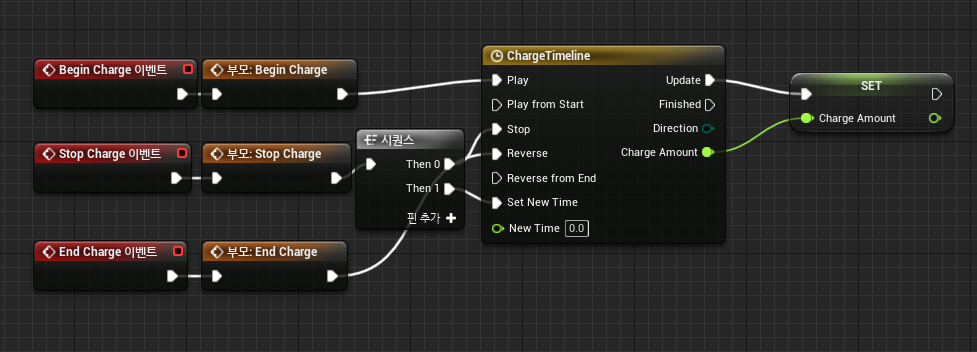
  - Bow Animation을 위해서 Blend 1D와 AnimInstance를 사용.
    - Bow의 Bone인 String_mid 소켓에 새로운 소켓을 생성하여 이 위치에 Arrow 생성.
    - Bone의 각 위치를 토대로 Anim을 만들고 다시 AnimInstance 생성.
  - BowWeapon클래스에서 활시위 애니메이션을 위해 TimeLine을 사용.
    - C++에서의 방법을 몰라 Implementation사용하여 Blueprint와의 동시 호출. (Begin/Stop/EndCharge(), Fire(), Reload()메서드) 
    - 위의 그림과 같이 활시위를 당기거나 그만 둘때 TimeLine을 사용하여 ChargeAmount의 값을 조절하고, 이 값을 BlendAnim1D에 대입하여 활시위 표시.
  - MainPlayer클래스에서는 마우스 오른쪽을 누르고 있으면 Begin/EndCharge()메서드를 생성하여 활시위를 당기는 모션을 할 수 있도록 제작.
    - Bow가 존재한다면 Reload()와 BeginCharge()메서드 실행.

    <details><summary>cpp 코드</summary> 

    ```c++
    //BowWeapon.cpp
    void ABowWeapon::BeginCharge_Implementation() {
      if(!Arow) return;
    }
    void ABowWeapon::StopCharge_Implementation() {
      
    }
    void ABowWeapon::EndCharge_Implementation() {
      if (!Arow) return;
    }
    void ABowWeapon::Fire() {
     
    }
    void ABowWeapon::Reload() {
     
    }
    ```
    ```c++
    //MainPlayer.cpp
    #include "BowWeapon.h"
    void AMainPlayer::SetupPlayerInputComponent(UInputComponent* PlayerInputComponent)
    {
      PlayerInputComponent->BindAction("Charge",EInputEvent::IE_Pressed,this, &AMainPlayer::BeginCharge);
      PlayerInputComponent->BindAction("Charge",EInputEvent::IE_Released,this, &AMainPlayer::EndCharge);
    }
    void AMainPlayer::LMBDown() {
      ...
      //Bow
      if (GetMesh()->DoesSocketExist("BowWeapon")) {
        ABowWeapon* Bow = Cast<ABowWeapon>(CurrentAttackWeapon);
        if (Bow) Bow->Fire();
        return;
      }
      ...
    }
    void AMainPlayer::BeginCharge() {
      if (GetMesh()->DoesSocketExist("BowWeapon")) {
        ABowWeapon* Bow = Cast<ABowWeapon>(CurrentAttackWeapon);
        if (Bow) {
          Bow->Reload();
          Bow->BeginCharge();
        }
      }
    }
    void AMainPlayer::EndCharge() {
      if (GetMesh()->DoesSocketExist("BowWeapon")) {
        ABowWeapon* Bow = Cast<ABowWeapon>(CurrentAttackWeapon);
        if (Bow) {
          Bow->EndCharge();
        }
      }
    }
    ```
    </details>

    <details><summary>h 코드</summary> 

    ```c++
    //BowWeapon.h
    public:
    	UPROPERTY(EditDefaultsOnly, BlueprintReadWrite, Category = "Arrow", meta = (AllowPrivateAccess = "true"))
      AArrow* Arow;

      UPROPERTY(EditDefaultsOnly, BlueprintReadWrite, Category = "Arrow", meta = (AllowPrivateAccess = "true"))
      TSubclassOf<class AArrow> ArrowClass;

      UPROPERTY(EditAnyWhere, BlueprintReadWrite, Category = "Arrow")
      float ChargeAmount;

      UFUNCTION(BlueprintNativeEvent, BlueprintCallable)
      void BeginCharge();
    
      UFUNCTION(BlueprintNativeEvent, BlueprintCallable)
      void StopCharge();

      UFUNCTION(BlueprintNativeEvent, BlueprintCallable)
      void EndCharge();

      UFUNCTION()
      void Fire();	
        
      UFUNCTION()
      void Reload();
    ```
    ```c++
    //MainPlayer.h
    public:
    	UFUNCTION()
      void BeginCharge();

      UFUNCTION()
      void EndCharge();
    ```
    </details>

> **<h3>Realization</h3>**
  - null

## **10.07**
> **<h3>Today Dev Story</h3>**
- ## <span style = "color:yellow;">Bow Fire</span>  
  - 
  - Actor클래스를 상속받은 Arrow클래스를 생성.
    - 화살의 상태를 나타내기 위해서 enum타입인 EArrowStatus를 제작하여 상태를 구분.
    - Fire()메서드를 생성하여 활의 ChargeAmount를 받아 FirePower값을 설정. 이 값을 Lerp()를 사용하여 화살을 AddImpulse한다.
    - 또한 DetachFromActor()를 사용하여 사용자로 부터 해제하고 KeepWorldTransform으로 전환하고, 상태 또한 InArrow로 변환.
    - 기존에는 projectile로 사용할 예정이였으나 사용시 초기에만 속도가 적용되어 못함.
  - BowWeapon클래스의 Fire()메서드가 Player에 의해 호출 되면 Arrow를 발사. 
    - Reload()호출시 Arrow를 "arrow_attach_socket"의 소켓에 어태치하여 활시위 당길 때 같이 이동.
    
    <details><summary>cpp 코드</summary> 

    ```c++
    //Arrow.cpp
    #include "Kismet/KismetMathLibrary.h"
    AArrow::AArrow()
    {
      PrimaryActorTick.bCanEverTick = true;

      ArrowMesh = CreateDefaultSubobject<USkeletalMeshComponent>(TEXT("ArrowMesh"));
      RootComponent = ArrowMesh;

      ArrowMesh->SetRelativeScale3D(FVector(1.f,5.f,5.f));
      SetArrowStatus(EArrowStatus::EAS_InBow);

      FirePower = 0;
    }
    void AArrow::Tick(float DeltaTime)
    {
      Super::Tick(DeltaTime);

      OnStateBegine();
    }
    void AArrow::OnStateBegine() {
      switch (ArrowStatus)
      {
      case EArrowStatus::EAS_Normal:
        break;
      case EArrowStatus::EAS_Unobtained:
        ArrowMesh->SetCollisionProfileName(FName("OverlapAllDynamic"));
        ArrowMesh->SetSimulatePhysics(true);
        break;
      case EArrowStatus::EAS_InBow:
        ArrowMesh->SetCollisionProfileName(FName("NoCollision"));
        ArrowMesh->SetSimulatePhysics(false);
        break;
      case EArrowStatus::EAS_InArrow:
        ArrowMesh->SetCollisionProfileName(FName("Arrow"));
        ArrowMesh->SetSimulatePhysics(true);
        if(!bisFire){
          ArrowMesh->AddImpulse(GetActorForwardVector() * UKismetMathLibrary::Lerp(7000, 50000, FirePower));	
        }
        bisFire = true;
        break;
      default:
        break;
      }
    }
    void AArrow::SetArrowStatus(EArrowStatus Status) {
      ArrowStatus = Status;
    }
    void AArrow::Fire(float Amount) {
      DetachFromActor(FDetachmentTransformRules::KeepWorldTransform);
      SetArrowStatus(EArrowStatus::EAS_InArrow);
      FirePower = Amount;
    }
    ```
    ```c++
    //BowWeapon.c
    void ABowWeapon::Fire() {
      if(!Arow) return;

      Arow->Fire(ChargeAmount);
      StopCharge();
    }
    void ABowWeapon::Reload() {
      FActorSpawnParameters SpawnParams;
      SpawnParams.Owner = this;
      SpawnParams.Instigator = GetInstigator();

      Arow = GetWorld()->SpawnActor<AArrow>(ArrowClass, FVector(0.f), FRotator(0.f), SpawnParams);
      Arow->AttachToComponent(SkeletalMesh,FAttachmentTransformRules::SnapToTargetNotIncludingScale,FName("arrow_attach_socket"));
    }
    ```
    </details>

    <details><summary>h 코드</summary> 

    ```c++
    //Arrow.h
    UENUM(BlueprintType)
    enum class EArrowStatus : uint8 {
      EAS_Normal		UMETA(DisplayName = "Normal"),
      EAS_Unobtained	UMETA(DisplayName = "Unobtained"),
      EAS_InBow		UMETA(DisplayName = "InBow"),
      EAS_InArrow		UMETA(DisplayName = "InArrow")
    };

    public:
      UPROPERTY(EditAnywhere, BlueprintReadWrite)
      USkeletalMeshComponent* ArrowMesh;

      UPROPERTY(VisibleAnywhere, BlueprintReadOnly, Category = "Arrow")
      EArrowStatus ArrowStatus;

      UPROPERTY(VisibleAnywhere, BlueprintReadOnly, Category = "Arrow")
      bool bisFire = false;

      UPROPERTY(VisibleAnywhere, BlueprintReadOnly, Category = "Arrow")
      float FirePower;

      UFUNCTION()
      void Fire(float Amount);

      UFUNCTION()
      void OnStateBegine();

      UFUNCTION()
      void SetArrowStatus(EArrowStatus Status);

      FORCEINLINE EArrowStatus GetArrowStatus() { return ArrowStatus; }
    ```
    </details>

> **<h3>Realization</h3>**
  - UKismetMathLibrary::Lerp(7000, 50000, FirePower)
  - Attach할때 FDetachmentTransformRules의 상태

## **10.09**
> **<h3>Today Dev Story</h3>**
- ## <span style = "color:yellow;">Aim Offset Normal</span>  
  - 
  - 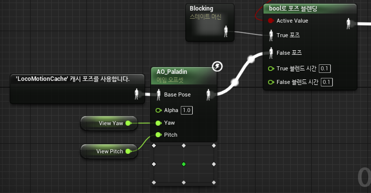
  - 사용자 시점의 변화에 따라서 캐릭터의 시점 또한 변화하기 위한 작업. (추후 활과 같은 곳에서 응용.)
    - MainPlayer의 스켈레톤에 맞는 Aim Offset을 만들고, Pitch와 Yaw에 맞게 애니메이션 배치.
    - Aim Offset을 AnimInstance_BP에 끌어다 사용. Blocking이전에 사용하여 결정. (Block시에는 회전 X)
  - MainPlayerAnim클래스에서 위의 Aim Offset에 할당할 float 값인 ViewYaw/Pitch를 선언하고 할당.
    - Player의 GetBaseAimRotation()과 GetActorRotation()메서드를 사용하여 각각 시점방향과 회전방향을 반환.
    - 이 두개의 값을 빼고 평준화하여 각 ViewYaw/Pitch 할당.

    <details><summary>cpp 코드</summary> 

    ```c++
    //MainPlayerAnim.cpp
    void UMainPlayerAnim::NativeUpdateAnimation(float DeltaSeconds){
      ...
      if (MainPlayer) {
        ...
        FRotator VeiwRotator = UKismetMathLibrary::NormalizedDeltaRotator(MainPlayer->GetBaseAimRotation(), MainPlayer->GetActorRotation());
        ViewYaw =  VeiwRotator.Yaw;
        ViewPitch = VeiwRotator.Pitch;
      }
    }
    ```
    </details>

    <details><summary>h 코드</summary> 

    ```c++
    //MainPlayerAnim.h
    public:
      UPROPERTY(EditAnywhere, BlueprintReadWrite, Category = "Movement", Meta = (AllowPrivateAccess = true))
      float ViewYaw;

      UPROPERTY(EditAnywhere, BlueprintReadWrite, Category = "Movement", Meta = (AllowPrivateAccess = true))
      float ViewPitch;
    ```
    </details>

> **<h3>Realization</h3>**
  - 시점에서 이동 방향을 빼면 위치에 따른 시점.
    - GetBaseAimRotation : 액터의 시점 각도
    - GetActorRotation : 액터의 진행 방향
    - NormalizedDeltaRotator : 두 값을 빼고 평준화. 

## **10.10**
> **<h3>Today Dev Story</h3>**
- ## <span style = "color:yellow;">Aim Animation</span>  
  - 
  - 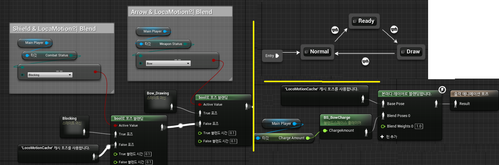
  - 활 시위를 당기는 애니메이션을 위해서 Blend Space 1D애니메이션을 생성.
    - AnimInstance에서 스테이트 머신을 제작하여 활요하며, WeaponStatus가 Bow일때만 활성화.
    - MainPlayer클래스의 bool 타입인 bCharging에 따라 Animation 전환.
    - Bow의 ChargeAmount를 MainPlayer의 ChargeAmount에 매 Tick마다 할당하여 Blend Space 1D 사용. (0 ~ 1)
  - 현재의 무기 상태를 나타내기 위해서 기존 WeaponStatus의 Enum을 수정하여 Weapon이 아닌 Bow/Melee/Shield로 수정. 
  - 화살을 발사 시 자동으로 원상태로 복구되며 활시위를 당기고 쏘지 않는다면 줄어드는 Animation 활성화. 

    <details><summary>cpp 코드</summary> 

    ```c++
    //MainPlayer.cpp
    void AMainPlayer::Tick(float DeltaTime){
    	BowAnimCharge();
    }
    void AMainPlayer::LMBDown() {
      bLMBDown = true;
      
      //Bow
      if (GetAttackCurrentWeapon() != nullptr && GetAttackCurrentWeapon()->GetWeaponPos() == EWeaponPos::EWP_Bow) {
        Bow = Cast<ABowWeapon>(CurrentAttackWeapon);
        if (Bow) {
          Bow->Fire();
          EndCharge();

          bBowCharging = false;
          ChargeAmount = 0;
        }
      }
      else if (!bAttacking) Attack();
      else bIsAttackCheck = true;
    }
    void AMainPlayer::BeginCharge() {
      if (GetAttackCurrentWeapon() != nullptr && GetAttackCurrentWeapon()->GetWeaponPos() == EWeaponPos::EWP_Bow) {
        Bow = Cast<ABowWeapon>(CurrentAttackWeapon);
        if (Bow) {
          Bow->Reload();
          Bow->BeginCharge();
          bBowCharging = true;
        }
      }
    }

    void AMainPlayer::EndCharge() {
      if (GetAttackCurrentWeapon() != nullptr && GetAttackCurrentWeapon()->GetWeaponPos() == EWeaponPos::EWP_Bow) {
        Bow = Cast<ABowWeapon>(CurrentAttackWeapon);
        if (Bow) {
          Bow->EndCharge();
        }
      }
    }
    void AMainPlayer::BowAnimCharge() {
      if (Bow && bBowCharging) ChargeAmount = Bow->ChargeAmount;
    }
    ```
    </details>

    <details><summary>h 코드</summary> 

    ```c++
    //MainPlayer.h
    public:
    	UPROPERTY(EditAnywhere, BlueprintReadOnly, Category = "Bow")
      class ABowWeapon* Bow;

      UPROPERTY(EditAnywhere, BlueprintReadOnly, Category = "Bow")
      float ChargeAmount = 0;

      UPROPERTY(EditAnywhere, BlueprintReadWrite, Category = "Bow")
      bool bBowCharging = false;
          
      UFUNCTION()
      void BowAnimCharge();
    ```
    </details>

- ## <span style = "color:yellow;">Turn In Place</span>  
  - 
  - 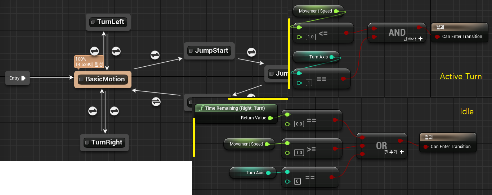
  - 캐릭터의 움직임이 없이 카메라의 회전만 있을때 캐릭터를 제자리에서 회전.
    - CharacterMovement의 bUseControllerDesiredRotation를 활성화 하여 회전속도에 맞게 캐릭터를 회전.
    - MainPlayer클래스의 LookUp()메서드내에서 실행하며, 이동속도가 없고 회전 값의 크기에 따라 좌우를 구분.
    - int형인 TurnAxis의 값을 Left(-1)/Idel(0)/Right(1)로 지정.
  - 위의 TurnAxis 값을 MainPlayerAnim클래스의 UpdateAnimation()메서드에서 매시간 호출하여 저장.
    - 이 값에 따라 위 그림과 같은 로직으로 이동. __회전을 위해서는 이동속도가 0이여야 함.__

    <details><summary>cpp 코드</summary> 

    ```c++
    //MainPlayer.cpp
    AMainPlayer::AMainPlayer()
    { 
    	GetCharacterMovement()->bUseControllerDesiredRotation = true;	
  	  GetCharacterMovement()->bOrientRotationToMovement = false;	//이동방향 회전
	    GetCharacterMovement()->RotationRate = FRotator(0.f,100.f,0.f);
    }
    void AMainPlayer::Lookup(float value) {
      AddControllerYawInput(value * CameraSpeed * GetWorld()->GetDeltaSeconds());

      //Length
      if (GetVelocity().Size() == 0) {
        if (value > 0.3f) TurnAxis = 1;
        else if (value < -0.3f) TurnAxis = -1;
        else TurnAxis = 0;
      }
      else TurnAxis = 0;
    }
    ```
    ```c++
    //MainPlayerAnim.cpp
    void UMainPlayerAnim::NativeUpdateAnimation(float DeltaSeconds){
      Super::NativeUpdateAnimation(DeltaSeconds);
      ...

      if (MainPlayer) {
        ...
        /** Turn In Place*/
        TurnAxis = MainPlayer->TurnAxis;
      }
    }
    ```
    </details>

    <details><summary>h 코드</summary> 

    ```c++
    //MainPlayer.h
    public:
      int TurnAxis = 0;	// Left(-1)/Idle(0)/Right(1)
    ```
    ```c++
    //MainPlayerAnim.h
    public:
    	UPROPERTY(EditAnywhere, BlueprintReadWrite, Category = "Movement", Meta = (AllowPrivateAccess = true))
      int TurnAxis = 0;	
    ```
    </details>

> **<h3>Realization</h3>**
  - null

## **10.11**
> **<h3>Today Dev Story</h3>**
- ## <span style = "color:yellow;">Destructible Mesh</span>  
  - 
  - 특정 충돌을 통해 부서지는 메시인 Destructible Mesh를 제작 및 배치.
    - 메시를 미리 청크단위로 나뉜후 무너져 내리게 하는 방식.
    - APEX Destruction Plugin을 추가하고 스태틱 메시를 디스트럭티블 메시로 전환.
    - 이때 Damage/Enable Impact Damage를 활성화 시켜야만 충돌시 무저져 내린다.
  - Arrow클래스에 RadiaForceComponent를 추가하여 physic/Destructible Objects에 영향을 주는 Impulse를 방출.
    - ImpulseStrength/ForceStrength/DestructibleDamage를 각각 설정하여 물체의 밀리는 정도를 상세화.
  
    <details><summary>cpp 코드</summary> 

    ```c++
    //Arrow.cpp
    #include "PhysicsEngine/RadialForceComponent.h"
    AArrow::AArrow()
    {
      ...

      /** Destructible Mesh */
      RadiaForce = CreateDefaultSubobject<URadialForceComponent>(TEXT("RadiaForce"));
      RadiaForce->SetupAttachment(GetRootComponent());

      RadiaForce->ImpulseStrength = 5000.f;	//?
      RadiaForce->ForceStrength = 1000.f;
      RadiaForce->DestructibleDamage = 1000.f;
    }
    ```
    </details>

    <details><summary>h 코드</summary> 

    ```c++
    //Arrow.h
    public:
      UPROPERTY(VisibleAnywhere, BlueprintReadWrite, Category = "Physic")
      class URadialForceComponent* RadiaForce;
    ```
    </details>

> **<h3>Realization</h3>**
  - Destructibon Mesh

## **10.30**
> **<h3>Today Dev Story</h3>**
- ## <span style = "color:yellow;">TurnInPlace 수정</span>  
  - 
  - 플레어의 시점과 카메라의 시점의 각도 차이가 45도 이상이라면 회전을 하도록 설정.
  - 기존 회전 애니메이션이 1회만 실행되어 자연스러움이 없었는데 이를 위해 Loop를 씌우고 종료 조건을 변경.
    - 종료조건에 애니메이션 TimeRatio 조건 삭제.
  - MainPlayer클래스에 새로운 함수 TurnInPlace()를 선언하고 이는 각도 사이를 계산하고 회전.
    - GetCharacterMovement()->bUseControllerDesiredRotation를 각도에 따라 On/Off 하는 방식으로 회전 여부를 결정.
    - 각도가 0.5f 이하면 움직임을 멈추고, 45.f 이상이라면 회전.

    <details><summary>cpp 코드</summary> 

    ```c++
    //MainPlayer.cpp
    void AMainPlayer::Lookup(float value) {
      AddControllerYawInput(value * CameraSpeed * GetWorld()->GetDeltaSeconds());

      /* TurnInPlace */
      TurnInPlace(value);
    }
    void AMainPlayer::TurnInPlace(float value) {
      FVector ViewPoint;
      FRotator ViewRotation;
      float calculationY;
      
      PlayerController->GetPlayerViewPoint(ViewPoint, ViewRotation);
      calculationY = UKismetMathLibrary::Abs(ViewRotation.Yaw - GetActorRotation().Yaw);

      if (calculationY <= 0.5f) {
        GetCharacterMovement()->bUseControllerDesiredRotation = false;
        TurnAxis = 0;
      }
      else if (calculationY >= 45.f) {
        GetCharacterMovement()->bUseControllerDesiredRotation = true;
        if (GetVelocity().Size() == 0) {
          if (value > 0.1f) TurnAxis = 1;
          else if (value < -0.1f) TurnAxis = -1;
        }
      }
    }
    ```
    </details>

    <details><summary>h 코드</summary> 

    ```c++
    //MainPlayer.h
    public: 
    	UFUNCTION()
	    void TurnInPlace(float value);
    ```
    </details>

- ## <span style = "color:yellow;">잡다한 것</span>  
  - 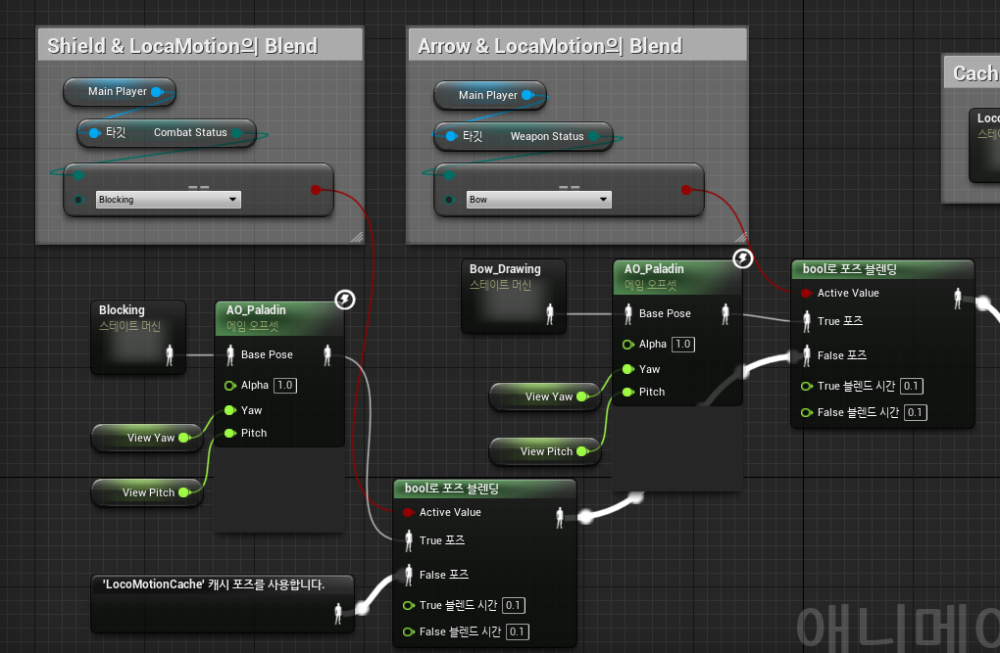
  - 기존 상태 조건없이 상하체를 구분하여 회전에 영향을 받도록 설정하였지만, 활로 줌을 한 상태나 막기 상태가 아니라면 구분이 없도록 처리.

> **<h3>Realization</h3>**
  - null

## **10.31**
> **<h3>Today Dev Story</h3>**
- ## <span style = "color:yellow;">활시위 당김</span>  
  - 
  - 활시위를 당기고 있다면 정확도를 위해 플레이어의 속도를 감소.
  - 기존 Sprinting과 Walk를 구분하는 방식과 동일하게 SetMovementStatus()메서드에서 속도 정의
    - EMovementStatus에서 상태 Drawing을 추가.
    - 단순히 Begin/EndCharge() 메서드에서는 EMovementStatus의 상태를 Drawing으로 변경.

    <details><summary>cpp 코드</summary> 

    ```c++
    //MainPlayer.cpp
    void AMainPlayer::BeginCharge() {
      if (GetAttackCurrentWeapon() != nullptr && GetAttackCurrentWeapon()->GetWeaponPos() == EWeaponPos::EWP_Bow) {
        Bow = Cast<ABowWeapon>(CurrentAttackWeapon);
        if (Bow) {
          ...
          SetMovementStatus(EMovementStatus::EMS_Drawing);
        }
      }
    }

    void AMainPlayer::EndCharge() {
      if (GetAttackCurrentWeapon() != nullptr && GetAttackCurrentWeapon()->GetWeaponPos() == EWeaponPos::EWP_Bow) {
        Bow = Cast<ABowWeapon>(CurrentAttackWeapon);
        if (Bow) {
          ...
          SetMovementStatus(EMovementStatus::EMS_Normal);
        }
      }
    }
    ```
    </details>

    <details><summary>h 코드</summary> 

    ```c++
    //MainPlayer.h
    UENUM(BlueprintType)
    enum class EMovementStatus : uint8 {
      ...
      EMS_Drawing		UMETA(DisplayName = "Drawing"),
      ...
    }; 
    ```
    </details>

- ## <span style = "color:yellow;">활시위 AimOffset</span>  
  - 
  - 기존 AO_Player Offset과 동일한 방식으로 새로운 AO_Player_Bow Offset을 생성.

> **<h3>Realization</h3>**
  - null