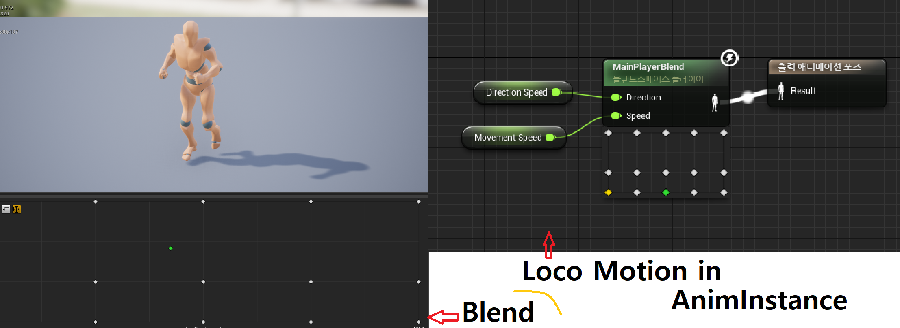

# Battle_Arena
- 포트폴리오 용도의 언리얼 프로젝트 

> **<h3>Input Keys</h3>**

|Mapping|key|info|
|:--:|:--:|:--:|
|Action|Space Bar|Jump|
|Action|Shift|Sprinting| 
|Action|LMB|Attack & Interaction| 
|Action|Left Ctrl|Dodge| 
|Axis|Mouse_X|Camera LookUp| 
|Axis|Mouse_Y|Camera Turn|  
|Axis|S & W|Forward Move| 
|Axis|A & D|Right Move| 

> **추후 할일**
  1. Infinity Blade : fire Lands 를 사용하여 꾸미기
  2. 로마 관련 에셋
## **07.27**
> **<h3>Today Dev Story</h3>**
- ## <span style = "color:yellow;">기초적인 설정</span>
  - ### __GameMode & Character & PlayerController 제작__
    1. ### Character에 Camera,SpringArm 부착 및 설정 
    - 
    - GameMode에 PlayerController를 기본값을 지정 
      ```c++
        PlayerControllerClass = AMainController::StaticClass();
      ```
    - Character에 UCameraComponent, USpringArmComponent를 지정
      1. Camera는 SpringArm의 소켓에 Attach
      2. SpringArm은 bUsePawnControllRotaion 기능을 키고 플레이어가 조정이 가능하도록 지정. (Camera는 false)
      3. 카메라의 회전을 키기 위해서 SpringArm->bInheritPitch... = true;
      4. 카메라의 회전이 플레이어에게 영향을 받지 않도록 bUseControllerRotationPitch... = false;
      5. AddControllerYawInput를 사용하여 카메라의 회전
      <details><summary>C++ 코드</summary> 

        ```c++
        //MainPlayer.cpp
        AMainPlayer::AMainPlayer()
        {
          ...
          SpringArm = CreateDefaultSubobject<USpringArmComponent>(TEXT("SringArm"));
          SpringArm->SetupAttachment(GetRootComponent());
          SpringArm->bUsePawnControlRotation = true;	//플레이어가 컨트롤 할 수 있게 만들어줌
          
          //카메라 회전 On
          SpringArm->bInheritPitch = true;
          SpringArm->bInheritRoll = true;
          SpringArm->bInheritYaw = true;

          SpringArm->TargetArmLength = 450.f;

          Camera = CreateDefaultSubobject<UCameraComponent>(TEXT("Camera"));
          Camera->SetupAttachment(SpringArm, USpringArmComponent::SocketName);
          Camera->bUsePawnControlRotation = false;

          //회전해도 플레이어에게 영향 X
          bUseControllerRotationYaw = false; 
          bUseControllerRotationRoll = false; 
          bUseControllerRotationPitch = false; 
        }
        ...
        ...

        void AMainPlayer::SetupPlayerInputComponent(UInputComponent* PlayerInputComponent)
        {
          Super::SetupPlayerInputComponent(PlayerInputComponent);

          PlayerInputComponent->BindAxis(FName("Lookup"), this, &AMainPlayer::Lookup);
          PlayerInputComponent->BindAxis(FName("Turn"), this, &AMainPlayer::Turn);
        }
        ...
        ...
        void AMainPlayer::Lookup(float value) {
	        AddControllerYawInput(value * CameraSpeed* GetWorld()->GetDeltaSeconds());  //CameraSpeed 지정
        }

        void AMainPlayer::Turn(float value) {
          AddControllerPitchInput(value * CameraSpeed*GetWorld()->GetDeltaSeconds());
        }
        ```
      </details>
      <details><summary>h 코드</summary> 

        ```h
        //MainPlayer.h
        #pragma region CAMERA

          UPROPERTY(VisibleAnywhere, BlueprintReadWrite, Category = "Camera")
          class USpringArmComponent* SpringArm;

          UPROPERTY(VisibleAnywhere, BlueprintReadWrite, Category = "Camera")
          class UCameraComponent* Camera;

        private:

          UPROPERTY(EditDefaultsOnly, Category = "Camera", Meta = (AllowPrivateAccess = true))
          float CameraSpeed = 12.f;

        public:
          void Lookup(float value);

          void Turn(float value);

        #pragma endregion
        ```
      </details>

    2. ### 캐릭터의 이동을 위한 구현
      - 
      - AddMovementInput함수를 사용해 구현하며 __Camera의 시점을__ 기준으로 움직이도록 구현 (이동, 점프)
      - GetCharacterMovement함수를 사용해 각종 컨트롤 수정 (이동방향으로 캐릭터를 자동 회전, 회전 속도, 공중 컨트롤 퍼센트)  
        <details><summary>c++ 코드</summary> 

          ```c++
          AMainPlayer::AMainPlayer()
          {
            ...
            GetCharacterMovement()->bOrientRotationToMovement = true;	//이동방향 자동회전
            GetCharacterMovement()->RotationRate = FRotator(0.f,540.f,0.f);
            GetCharacterMovement()->JumpZVelocity = 600.f;	//점프 크기   
            GetCharacterMovement()->AirControl = 0.5f;      //공중 컨트롤
          }
          void AMainPlayer::MoveForward(float Value) {
            AddMovementInput(Camera->GetForwardVector(), Value);  //액터의 방향이 아닌 카메라의 방향으로
          }
          void AMainPlayer::MoveRight(float Value) {
            AddMovementInput(Camera->GetRightVector(), Value);
          }
          void AMainPlayer::Jump() {
            Super::Jump();
          }
          ```
        </details>

        <details><summary>h 코드</summary> 
        
        ```h
        #pragma region MOVEMENT
        public:
          void MoveForward(float Value);

          void MoveRight(float Value);

        private:
          UPROPERTY(EditDefaultsOnly, Category = "Movement", Meta = (AllowPrivateAccess = true))
          float MoveSpeed;

        #pragma endregion
        
        ```
        </details>

- ## <span style = "color:yellow;">달리기 (Sprinting)</span>
  - 
  - MainPlayer에 enum 클래스로 상태를 제작하여 뛰는 것과 걷는 것 구별 (속도에 차이를 두기 위함)
  - Shift키에 바인딩했으며 Switch_Sprinting 이라는 함수 하나만을 만들어 상태와 속도 전환
  - 실직적으로는 SetMovementStatus() 함수에서 들어오는 값에 따라 MaxWalkSpeed에 속도를 지정 (추후 추가예정)
    <details><summary>c++ 코드</summary> 

      ```c++
      void AMainPlayer::BeginPlay()
      {
        Super::BeginPlay();
        SetMovementStatus(EMovementStatus::EMS_Normal);
      }

      void AMainPlayer::SetupPlayerInputComponent(UInputComponent* PlayerInputComponent)
      {
        PlayerInputComponent->BindAction("Shift", EInputEvent::IE_Pressed, this, &AMainPlayer::Switch_Sprinting);
        PlayerInputComponent->BindAction("Shift", EInputEvent::IE_Released, this, &AMainPlayer::Switch_Sprinting);
      }
      ...
     void  AMainPlayer::SetMovementStatus(EMovementStatus Status) {
        MovementStatus = Status;
        if (MovementStatus == EMovementStatus::EMS_Sprinting) GetCharacterMovement()->MaxWalkSpeed = SprintingSpeed;
        else GetCharacterMovement()->MaxWalkSpeed = MoveSpeed;
      }
      void AMainPlayer::Switch_Sprinting() {
        if(MovementStatus != EMovementStatus::EMS_Sprinting) SetMovementStatus(EMovementStatus::EMS_Sprinting);
       else SetMovementStatus(EMovementStatus::EMS_Normal);
      }
      ```
    </details>

    <details><summary>h 코드</summary> 

    ```h
    UENUM(BlueprintType)
      enum class EMovementStatus : uint8 {
      EMS_Normal		UMETA(DisplayName = "Normal"),
      EMS_Sprinting	UMETA(DisplayName = "Sprinting"),
        
      EMS_Default		UMETA(DisplayName = "Default")
    };

    ...
      void Switch_Sprinting();
    private:
      UPROPERTY(EditDefaultsOnly, Category = "Movement", Meta = (AllowPrivateAccess = true))
      float SprintingSpeed;

      //현재 캐릭터의 상태를 표현 (스턴,러닝,정지,공격 등등)
      UPROPERTY(VisibleAnywhere, BlueprintReadWrite, Category = "Movement", Meta = (AllowPrivateAccess = true))
      EMovementStatus MovementStatus;	

      void SetMovementStatus(EMovementStatus Status);
    ```
    </details>

- ## <span style = "color:yellow;">Character Animation 제작 (Sprinting)</span>
  - 
  - 
  - AnimInstance 클래스(MainPlayerAnim.cpp) 제작후 BP만들고 위 그림과 같은 Blend 제작
  - bUseControllerRotationYaw 만을 true로 전환하여 카메라 회전시 플레이어도 회전하도록 지정 (위와 같은 애니메이션 제작을 원하기에)
      - MainPalyer의 정보를 얻어와야 하기 때문에 헤더에 선언
      - Anim에서 'Update Animation 이벤트'에 내가 만든 UpdateAnimationProperties()함수를 연결하여 애니메이션에 필요한 데이터를 갱신한다. 
      - 필요한 데이터는 점프여부, 속도, 방향.
    
      <details><summary>c++ 코드</summary> 

      ```c++
      #include "MainPlayer.h"

      void UMainPlayerAnim::NativeInitializeAnimation() {
        if (!MainPlayer) MainPlayer = Cast<AMainPlayer>(TryGetPawnOwner());
      } 

      void UMainPlayerAnim::UpdateAnimationProperties() {
        if (!MainPlayer) MainPlayer = Cast<AMainPlayer>(TryGetPawnOwner());

        if (MainPlayer) {
          FVector Speed = MainPlayer->GetVelocity();
          FRotator Rotator = MainPlayer->GetActorRotation();
          FVector LateralSpeed = FVector(Speed.X, Speed.Y, 0.f);
          MovementSpeed = LateralSpeed.Size();
          DirectionSpeed = CalculateDirection(Speed, Rotator);

          bIsInAir = MainPlayer->GetMovementComponent()->IsFalling();
        }

      }
      ```
      </details>

      <details><summary>h 코드</summary> 

      ```h
      public:
        virtual void NativeInitializeAnimation() override;	//생성시 동작

        UFUNCTION(BlueprintCallable, Category = AnimationProperties)
        void UpdateAnimationProperties();					//틱마다 동작

        UPROPERTY(EditAnywhere, BlueprintReadOnly, Category="Movement")
        class AMainPlayer* MainPlayer;

        UPROPERTY(EditAnywhere, BlueprintReadOnly, Category = "Movement")
        bool bIsInAir;

        UPROPERTY(EditAnywhere, BlueprintReadOnly, Category = "Movement")
        float MovementSpeed;

        UPROPERTY(EditAnywhere, BlueprintReadOnly, Category = "Movement")
        float DirectionSpeed;
      ```
      </details>

> **<h3>Realization</h3>**
- GameMode->Character->Controller->AnimInstance->Blend

## **07.28**
> **<h3>Today Dev Story</h3>**
- ## <span style = "color:yellow;">Character 변경과 시점의 변화</span>
  - 
  - 블랜드는 이전과 동일하고 타켓팅을 활용해서 기존 제공하는 마네퀸 애니메이션을 가져옴
  - __움직임이 없는 Idle 상태일때는 카메라로 캐릭터의 얼굴을 볼 수 있도록 전환__
    - 기존 MovementStatus에 Walk상태를 추가, Tick에서 CheckIdle을 호출
    - CheckIdle에서는 캐릭터의 속도를 기준으로 Idle 또는 Walk로 상태 전환 
      <details><summary>c++ 코드</summary> 

      ```c++
      void AMainPlayer::Tick(float DeltaTime)
      {
        Super::Tick(DeltaTime);

        CheckIdle();
      }
      ...
      void AMainPlayer::CheckIdle() {
        float CurrentVelocity = GetVelocity().Size();

        if (CurrentVelocity == 0) {
          SetMovementStatus(EMovementStatus::EMS_Normal);
          bUseControllerRotationYaw = false;
        }
        else if (MovementStatus != EMovementStatus::EMS_Sprinting) {
          SetMovementStatus(EMovementStatus::EMS_Walk);
          bUseControllerRotationYaw = true;
        }
      }
      ```
      </details>

      <details><summary>h 코드</summary> 

      ```h
      UENUM(BlueprintType)
      enum class EMovementStatus : uint8 {
        EMS_Normal		UMETA(DisplayName = "Normal"),
        EMS_Walk		UMETA(DisplayName = "Walk"),
        ...
      };
      void CheckIdle();
      ```
      </details>

- ## <span style = "color:yellow;">Jump Animation 변경</span>
  - 
  - 
  - 위의 그림과 같이 점프 모션이 구성되어 있으며 JumpStart->Jumping 이나 JumpEnd->BasicMotion에서는 애니메이션 진행 시간의 비율과 남은 시간을 비율을 사용해서 처리


> **<h3>Realization</h3>**

## **07.29**
> **<h3>Today Dev Story</h3>**
- ## <span style = "color:yellow;">무기 장착</span>
  - 
  - 무기를 장착하기 위해서 캐릭터 스켈레톤에 소켓을 추가 (LeftWeapon, RightWeapon)
  - Item클래스 제작후 기본요소인 SphereComponent, Mesh, ParticleSystemComponent 추가 (장착시 임펙트 발생)
    - __OnComponentBegin(End)Overlap.AddDynamic을__ 사용하여 SphereComponent 오버랩시 OnoverlapBegin(end) 함수 적용. (virtual로 제작하여 상속받는 곳에서 Override)
    - Item클래스를 상속받는 Weapon 클래스 추가 하고 무기를 장착하는 Equip함수 생성
    - Weapon 클래스에 Engine/SkeletalMeshSocket.h 추가 및 __GetSocketByName()과 AttachActor를__ 사용하여 지정한 소켓에 어태치
      <details><summary>c++ 코드</summary> 

      ```c++
      //Item.cpp
      #include "Particles/ParticleSystemComponent.h"
      
      AItem::AItem()
      {
        PrimaryActorTick.bCanEverTick = true;

        CollisionVolume = CreateDefaultSubobject<USphereComponent>(TEXT("CollisionVolume"));
        RootComponent = CollisionVolume;

        CollisionVolume->OnComponentBeginOverlap.AddDynamic(this, &AItem::OnOverlapBegin);
        CollisionVolume->OnComponentEndOverlap.AddDynamic(this, &AItem::OnOverlapEnd);

        Mesh = CreateDefaultSubobject<UStaticMeshComponent>(TEXT("Mesh"));
        Mesh->SetupAttachment(GetRootComponent());

        IdleParticleComponent = CreateDefaultSubobject<UParticleSystemComponent>(TEXT("IdleParticleComponent"));
        IdleParticleComponent->SetupAttachment(GetRootComponent());
      }

      //Weapon
      #include "Engine/SkeletalMeshSocket.h"

      AWeapon::AWeapon() {
        SkeletalMesh = CreateDefaultSubobject<USkeletalMeshComponent>(TEXT("SkeletalMesh"));
        SkeletalMesh->SetupAttachment(GetRootComponent());

      }

      void AWeapon::OnOverlapBegin(UPrimitiveComponent* OverlappedComponent, AActor* OtherActor, UPrimitiveComponent* OtherComp, int32 OtherBodyIndex, bool bFromSweep, const FHitResult& SweepResult) {
        Super::OnOverlapBegin(OverlappedComponent, OtherActor, OtherComp, OtherBodyIndex, bFromSweep, SweepResult);
        if (OtherActor) {
          AMainPlayer* Player = Cast<AMainPlayer>(OtherActor);
          if (Player) Equip(Player);
        }
      }

      void AWeapon::OnOverlapEnd(UPrimitiveComponent* OverlappedComponent, AActor* OtherActor, UPrimitiveComponent* OtherComp, int32 OtherBodyIndex) {
        Super::OnOverlapEnd(OverlappedComponent, OtherActor, OtherComp, OtherBodyIndex);

      }

      void AWeapon::Equip(class AMainPlayer* Player) {
        if (Player) {
          const USkeletalMeshSocket* RightHandSocket = Player->GetMesh()->GetSocketByName("RightWeapon");
          if (RightHandSocket) RightHandSocket->AttachActor(this, Player->GetMesh());
        }
      }
      ```
      </details>
      <details><summary>h 코드</summary> 

      ```c++
      //Item.h
      public:	
        virtual void Tick(float DeltaTime) override;

        UPROPERTY(VisibleAnywhere, BlueprintReadWrite, Category = "Item | Collision")
        class USphereComponent* CollisionVolume;

        UPROPERTY(EditAnywhere, BlueprintReadWrite, Category = "Item | Mesh")
        class UStaticMeshComponent* Mesh;

        UPROPERTY(EditAnywhere, BlueprintReadWrite, Category = "Item | Particle")
        class UParticleSystemComponent* IdleParticleComponent;

        UFUNCTION()
        virtual void OnOverlapBegin(UPrimitiveComponent* OverlappedComponent, AActor* OtherActor, UPrimitiveComponent* OtherComp, int32 OtherBodyIndex, bool bFromSweep, const FHitResult& SweepResult);

        UFUNCTION()
        virtual void OnOverlapEnd(UPrimitiveComponent* OverlappedComponent, AActor* OtherActor, UPrimitiveComponent* OtherComp, int32 OtherBodyIndex);

      //Waepon.h
      public:
        AWeapon();

        UPROPERTY(VisibleAnywhere, BlueprintReadOnly, Category = "SkeltalMesh")
        class USkeletalMeshComponent* SkeletalMesh;

        void Equip(class AMainPlayer* Player);

        virtual void OnOverlapBegin(UPrimitiveComponent* OverlappedComponent, AActor* OtherActor, UPrimitiveComponent* OtherComp, int32 OtherBodyIndex, bool bFromSweep, const FHitResult& SweepResult) override;
        
        virtual void OnOverlapEnd(UPrimitiveComponent* OverlappedComponent, AActor* OtherActor, UPrimitiveComponent* OtherComp, int32 OtherBodyIndex) override;
      ```
      </details>

- ## <span style = "color:yellow;">공격 구현</span>
  - 
  - 
  - 공격 몽타주 제작
    - 캐시를 사용하기 때문에 AnimInstance에서 캐시 또한 연결 필수 (Montage에서 Attack 슬롯 제작)
    - 콤보 구현은 아직이며 왼쪽 마우스를 클릭하면 LBMDown함수가 실행되며 Motage_Play,JumpToSection()을 통해 몽타주가 실행된다.
      <details><summary>c++ 코드</summary> 

      ```c++
      void AMainPlayer::SetupPlayerInputComponent(UInputComponent* PlayerInputComponent)
      {
        ....
        //attack
        PlayerInputComponent->BindAction("LMB", EInputEvent::IE_Pressed, this, &AMainPlayer::LMBDown);
        PlayerInputComponent->BindAction("LMB", EInputEvent::IE_Released, this, &AMainPlayer::LMBUp);
      }

      void AMainPlayer::LMBDown() {
        UAnimInstance* AnimInstance = GetMesh()->GetAnimInstance();
        if (AnimInstance) {
          AnimInstance->Montage_Play(AttackMontage, 1.0f);
          AnimInstance->Montage_JumpToSection(FName("Attack1"), AttackMontage);
        }
      }
      void AMainPlayer::LMBUp() {

      }
      ```
      </details>
      <details><summary>h 코드</summary> 

      ```c++
      public:
        UPROPERTY(EditDefaultsOnly, BlueprintReadOnly, Category = "Anims")
        class UAnimMontage* AttackMontage;

        void LMBDown();
        void LMBUp();
      ```
      </details>
> **<h3>Realization</h3>**   

## **07.30**
> **<h3>Today Dev Story</h3>**
- ## <span style = "color:yellow;">콤보 구현</span> (추후 델리게이트 추가 및 무기별 다른 콤보값을 부여)
  -  
  - 몽타주에 공격의 종료(AttackEnd), 연속 공격의 체크(AttackCheck)하는 노티파이를 설정한다.
    - 해당 노티파이를 AnimInstance의 이벤트 그래프에서 미리 만들어둔 c++ 함수와 연결한다.
    - 마우스 왼쪽 버튼을 누르면 Attack함수와 연결 되는데 이때 공격중인 상태에서 클릭을 하게 되면 AttackInputCheck함수로 가서 몽타주 순서를 증가하고 다음 몽타주를 실행한다.
    - Attack에서는 몽타주가 플레이되고 있느냐에 따라 다음 몽타주 실행 여부가 갈린다.
    - GetAttackMontageSection(int32 Section)에서는 입력번호에 따라 FName이 반환된다.
    - 초기 설정시 콤보의 개수를 정하는 __ComboMaxCount를 설정해줘야 하고, 반드시 공격 노티파이의 이름은 Attack으로 시작하며 시작번호는 0이다.__
      <details><summary>c++ 코드</summary> 

      ```c++
      void AMainPlayer::LMBDown() {
        bLMBDown = true;

        if (!bAttacking) Attack();
        else bIsAttackCheck = true;
      }

      void AMainPlayer::Attack() {
        UAnimInstance* AnimInstance = GetMesh()->GetAnimInstance();
        bAttacking = true;

        if (AnimInstance && AttackMontage) {
          if (!AnimInstance->Montage_IsPlaying(AttackMontage)) {	//공격중이 아닐때 (처음 공격)
            ComboCnt = 0;
            AnimInstance->Montage_Play(AttackMontage);
          }
          else {													//공격중일때
            AnimInstance->Montage_Play(AttackMontage);
            AnimInstance->Montage_JumpToSection(GetAttackMontageSection(ComboCnt),AttackMontage);
          }
        }
      }

      void AMainPlayer::EndAttack() {
        bAttacking = false;
      }

      void AMainPlayer::AttackInputCheck() {
        if (bIsAttackCheck) {
          ComboCnt++;
          if (ComboCnt >= ComboMaxCnt) ComboCnt = 0;
          bIsAttackCheck = false;
          Attack();
        }
      }

      FName AMainPlayer::GetAttackMontageSection(int32 Section) {
        return FName(*FString::Printf(TEXT("Attack%d"), Section));
      }
      ```
      </details>
      <details><summary>h 코드</summary> 

      ```c++
      public:
        UPROPERTY(EditDefaultsOnly, BlueprintReadOnly, Category = "Anims")
        class UAnimMontage* AttackMontage;

        bool bLMBDown;			//공격 키가 눌렸는지 여부
        bool bAttacking;		//공격중인지 여부
        bool bIsAttackCheck;	//또 공격할 건지에 대한 여부
        int ComboCnt;			//현재 공격 횟수
        
        UPROPERTY(EditDefaultsOnly, BlueprintReadOnly, Category = "Anims")
        int ComboMaxCnt;		//최대 공격 횟수

        void Attack();

        UFUNCTION(BlueprintCallable)
        void EndAttack();

        UFUNCTION(BlueprintCallable)
        void AttackInputCheck();

        void LMBDown();
        FORCEINLINE void LMBUp() { bLMBDown = false; }

        FName GetAttackMontageSection(int32 Section);
      ```
      </details>

- ## <span style = "color:yellow;">구르기(대쉬) 구현</span> 
  -  
  - 기존 AttackMontage에서 제작했던 섹션이름을 불러오는 GetAttackMontageSection()함수를 Dodge에서 혼합하여 사용하였다.
    - 함수의 피연산자로는 FString과 int32을 받았고 FString에는 "Attack", "Dodge"와 같이 사용할 타입을 적어주면 된다.
  - 새로운 몽타주 Main_Dodge_Montage를 제작하고 4가지 방향으로 구분하여 제작. (AnimInstance의 빈도가 높아져 h에서 구현하고 BeginPlay에서 Attach하였다.)
  - 왼쪽 Ctrl키에 Dodge키를 바인딩 하고 이 상태일때는 데미지를 받지 않도록 한다. (추후)
    - MoveForward()와 MoveRight()의 value값을 DirX/Y에 저장해 두고 구르기 애니메이션을 실행할때 사용
    - 이 값을 AnimDodge()에서 값에 따라 몽타주에 있는 섹션으로 점프하여 애니메이션을 실행한다.
  - Dodge()에서는 이동방향이 존재하고 bCanDodge가 참일때 가능하며, BrakingFrictionFactor의 값을 0.f로 바꾸어 마찰계수를 0으로 둔다.
    - LaunchCharacter()와 GetLastMovementInputVector()를 사용하여 마지막으로 입력된 방향으로 한 Tick동안 시작속도를 DodgeSpeed로 전환한다. (구르기처럼 보인다.)
    - GetWorldTimerManager().SetTimer를 사용하여 DodgeStopTime만큼 기다렸다가 StopMovementImmediately()를 통해 이동을 멈추고 다시 시작속도를 기본값(2.f)로 전환한다.
    - 다시 SetTimer()를 사용하여 DodgeCoolDownTime이 지나면 다시 Dodge가 가능하도록 bCanDodge를 true로 바꿔준다.
      <details><summary>c++ 코드</summary> 

      ```c++
      //Dodge
      void AMainPlayer::SetupPlayerInputComponent(UInputComponent* PlayerInputComponent)
      {   
        ...
        PlayerInputComponent->BindAction("Dodge", EInputEvent::IE_Pressed, this, &AMainPlayer::Dodge);
      }
      ...
      void AMainPlayer::MoveForward(float Value) {
        AddMovementInput(Camera->GetForwardVector(), Value);
        DirX = Value;
      }
      void AMainPlayer::MoveRight(float Value) {
        AddMovementInput(Camera->GetRightVector(), Value);
        DirY = Value;
      }
      ...
      void AMainPlayer::Dodge() {
        if (bCanDodge && DirX !=0 || DirY != 0) {
          GetCharacterMovement()->BrakingFrictionFactor = 0.f;	//뭐에 닿아도 안느려짐
          AnimDodge();
          LaunchCharacter(FVector(GetLastMovementInputVector().X , GetLastMovementInputVector().Y, 0.f) * DodgeSpeed, true, true);	//입력 방향대로
          GetWorldTimerManager().SetTimer(DodgeHandle, this, &AMainPlayer::DodgeEnd, DodgeStopTime,false);
          bCanDodge = false;
        }
      }
      void AMainPlayer::DodgeEnd() {
        GetCharacterMovement()->StopMovementImmediately();
        GetWorldTimerManager().SetTimer(DodgeHandle, this, &AMainPlayer::ResetDodge, DodgeCoolDownTime, false);
        GetCharacterMovement()->BrakingFrictionFactor = 2.f;
      }
      void AMainPlayer::ResetDodge() {
        bCanDodge = true;
      }
      void AMainPlayer::AnimDodge() {
        int Value = 0;

        if (DirX > 0) Value = 1;
        else if (DirX < 0)  Value = 4;
        else if (DirY < 0)  Value = 2;
        else if (DirY > 0)  Value = 3;

        if(!AnimInstance) AnimInstance = GetMesh()->GetAnimInstance();
        if (AnimInstance && DodgeMontage) {
          AnimInstance->Montage_Play(DodgeMontage);
          AnimInstance->Montage_JumpToSection(GetAttackMontageSection("Dodge", Value), DodgeMontage);
        }
      }
      ....
      FName AMainPlayer::GetAttackMontageSection(FString Type, int32 Section) {
        if (Type == "Attack") return FName(*FString::Printf(TEXT("Attack%d"), Section));
        else if (Type == "Dodge") return FName(*FString::Printf(TEXT("Dodge%d"), Section));
        else return "Error";
      }
      ```
      </details>

      <details><summary>h 코드</summary> 

      ```c++
     	/** Dodge */
      public:
        UPROPERTY(EditDefaultsOnly, BlueprintReadOnly, Category = "Movement | Dodge")
        float DodgeSpeed;

        UPROPERTY(EditDefaultsOnly, BlueprintReadOnly, Category = "Movement | Dodge")
        float DodgeCoolDownTime;

        UPROPERTY(EditDefaultsOnly, BlueprintReadOnly, Category = "Movement | Dodge")
        float DodgeStopTime;

        UPROPERTY(EditDefaultsOnly, BlueprintReadOnly, Category = "Movement | Dodge")
        bool bCanDodge;

        //방향
        UPROPERTY(VisibleAnywhere, Category = "Movement | Dodge")
        float DirX;

        UPROPERTY(VisibleAnywhere ,Category = "Movement | Dodge")
        float DirY;

        UPROPERTY(EditDefaultsOnly, BlueprintReadOnly, Category = "Anims")
        UAnimMontage* DodgeMontage;

        UPROPERTY(EditDefaultsOnly, BlueprintReadOnly, Category = "Movement | Dodge")
        FTimerHandle DodgeHandle;

        UFUNCTION()
        void Dodge();

        UFUNCTION()
        void DodgeEnd();

        UFUNCTION()
        void ResetDodge();

        UFUNCTION()
        void AnimDodge();
      ```
      </details>

> **<h3>Realization</h3>** 
- 추후 콤보는 무기마다 다르게 할것이기 때문에 무기마다 다양한 경우의 수를 준비해야한다.
- 구르기할때 방향 지정에 있어 어려움을 겪었다. 
  - 카메라의 방향으로 하자니 앞으로만 구르기가 가능했고, 캐릭터의 ForwardVector()를 이용하기에는 코드가 복잡해졌다.
  - 결국 GetLastMovementInputVector를 사용하여 마지막으로 입력된 방향으로 구르기를 할 수 있게 제작하였다.
  - 과연 몽타주에 넣어서 관리하는 것이 옳은건지 의아하다.
  

## **08.01**
> **<h3>Today Dev Story</h3>**
- ## <span style = "color:yellow;">공격 중 이동을 금지</span>
  - 공격중일때는 움직이는 모든 상태를 정지하기 위해서 MoveForward(),MoveRight(),Jump(),Switch_Sprinting(),Dodge()에 아래 라인을 선언.
    ```c++
    if (bAttacking) return; //추가
    ```

- ## <span style = "color:yellow;">AI의 BehaviorTree</span>
  -  
  - 적의 AI를 먼저 구현하기 위해서 Character클래스를 상속받는 Enemy, AIController클래스를 상속받는 EnemyController, BTTaskMode를 상속받는 BTTask_FindPatrolPos를 제작 (반드시 BTTask가 있어야 찾을 수 있다.)
    - BlackBoard에는 HomePosKey(현재 위치), PatrolPosKey(이동할 위치)가 Vector 타입으로 지정.
  - 지면에 Nav Mesh Bounds Volume을 생성하여 Enemy가 갈 수 있는 범위를 지정 (P를 사용하여 세부적으로 관찰 O)
    - Enemy 클래스에 EnemyController를 어태치해주고, EnemyController에 적의 두뇌가 될 BehaviorTree와 트리에 제공할 정보를 관리하는 BlackBoard를 제작.
    - FName으로 HomePosKey와 PatrolPosKey를 저장하여, 추후 SetValueAs~()함수 사용시 이름으로 변수를 찾아 데이터를 저장. BlackBoard와 BehaviorTree도 Controller에 저장
    - BeginPlay에서 UseBlackboard를 사용하여 ~ 하고, Blackboard->SetValueAsVector(HomePosKey,로케이션)함수를 사용하여 위에서 선언해둔 키를 사용하여 저장.
  - BTTaskMode는 BehaviorTree에서 실행하게 될 노드이며, __중요한 점은 "Build.cs"에 NavigationSystem, AIModule, GamePlayTasks를 추가해야만 함.__ 
    - NavigationSystem.h, BehaviorTree/BlackboardComponent.h 추가하여 사용.
    - EBTNodeResult::Type ExecuteTask(UBehaviorTreeComponent& OwnerComp, uint8* NodeMemory) 오버라이드하여 사용한다.
    - 반환값은 항상 성공의 여부이며, "EBTNodeResult::Succeeded, EBTNodeResult::Failed" 등이 있다.
    - 생성자 함수에서 NodeName을 통해 트리에서 사용자에게 보여줄 이름을 지정한다.
    - ExecuteTask()에서는 Enemy의 Pawn을 불러와 NavigationSystemV1을 생성하고, 이 네비게이션시스템의 GetRandomPointNavigableRadius()함수를 사용하여 지정한 범위 내의 Loaction을 사용하여 키값에 저장한다.

      <details><summary>c++ 코드</summary> 
        
      ```c++
      //BTTask_FindPatrolPos.cpp
      #include "BTTask_FindPatrolPos.h"
      #include "EnemyController.h"
      #include "NavigationSystem.h"
      #include "BehaviorTree/BlackboardComponent.h"

      UBTTask_FindPatrolPos::UBTTask_FindPatrolPos()
      {
        NodeName = TEXT("FindPatrolPos");   //트리에서 사용할 이름
      }

      EBTNodeResult::Type UBTTask_FindPatrolPos::ExecuteTask(UBehaviorTreeComponent& OwnerComp, uint8* NodeMemory)
      {
        EBTNodeResult::Type Result = Super::ExecuteTask(OwnerComp, NodeMemory);

        auto ControllingPawn = OwnerComp.GetAIOwner()->GetPawn();   //NavigationSystem을 사용하기 위해서 Enemy의 Pawn을 불러온다.
        if (nullptr == ControllingPawn)
          return EBTNodeResult::Failed; //항상 성공 여부를 반환해야 한다.

        UNavigationSystemV1* NavSystem = UNavigationSystemV1::GetNavigationSystem(ControllingPawn->GetWorld()); //NavigationSystem을 불러옴
        if (nullptr == NavSystem)
          return EBTNodeResult::Failed;

        //EnemyController의 BeginPlay에서 저장한 HomePosKey의 값을 가져와 추후 계산식에서 사용
        FVector Origin = OwnerComp.GetBlackboardComponent()->GetValueAsVector(AEnemyController::HomePosKey);    
      
        FNavLocation NextPatrol;

        //500 범위 내에서 갈 수 있는 곳의 좌표를 NetPatrol에 저장하고 SetValueAsVector로 키값에 데이터를 저장한다.
        if (NavSystem->GetRandomPointInNavigableRadius(FVector::ZeroVector, 500.0f, NextPatrol))
        {
            OwnerComp.GetBlackboardComponent()->SetValueAsVector(AEnemyController::PatrolPosKey, NextPatrol.Location);
            return EBTNodeResult::Succeeded;
        }
        return EBTNodeResult::Failed;
      }
      ```

      ```c++
      //EnemyController.cpp
      
      const FName AEnemyController::HomePosKey(TEXT("HomePosKey"));
      const FName AEnemyController::PatrolPosKey(TEXT("PatrolPosKey"));
      ...
      void AEnemyController::BeginPlay() {
        Super::BeginPlay();

        if (UseBlackboard(BData, Blackboard))
        {
          Blackboard->SetValueAsVector(HomePosKey, GetPawn()->GetActorLocation());	//Location을 HomePosKey에..
          UE_LOG(LogTemp, Warning, TEXT("%s"), *GetPawn()->GetActorLocation().ToString());
          if (!RunBehaviorTree(BTree)) return;    //수정
        }
      }
      ```

      </details>

      <details><summary>h 코드</summary> 

      ```c++
      //BTTask_FindPatrolPos
      UBTTask_FindPatrolPos(); 

      virtual  EBTNodeResult::Type ExecuteTask(UBehaviorTreeComponent& OwnerComp, uint8* NodeMemory) override;
      ```

      ```c++
      //EnemyController
      public:
        //BlackBoard의 키값을 이름으로 저장 -> 다른 코드에서 참조하기 편리하다.
        static const FName HomePosKey;
        static const FName PatrolPosKey;	

        UPROPERTY(EditAnyWhere, BlueprintReadOnly, Category = "AI")
        class UBehaviorTree* BTree;

        UPROPERTY(EditAnyWhere, BlueprintReadOnly, Category = "AI")
        class UBlackboardData* BData;	
      ```

      </details>
  

> **<h3>Realization</h3>** 
- ## <span style = "color:yellow;">Behavior Tree</span>
  - Task -> BlackBoard -> BehaviroTree -> Controller -> Pawn의 순서
  1. Behaviro Tree
    - 계층형 구조이며 노드로 구성되며 왼쪽 노드가 오른쪽 노드보다 우선순위가 높다.
    - 종료시 EBTNodeResult를 사용하여 성공여부를 반환해야한다.

  2. Black Board
    - 필수는 아니지만 하나의 AI에도 데이터를 적용할 수 있고, 다양한 AI에게도 적용이 가능하다. 
    - 키를 추가하여 변수를 설정하며, C++에서는 키의 이름으로 호출하여 데이터를 저장한다.
      ```c++
      Blackboard->SetValueAsVector(키의 이름, 값);	
      ```

## **08.02**
> **<h3>Today Dev Story</h3>**
- ## <span style = "color:yellow;">AI의 BehaviorTree_2 (센서)</span>
  -    
  - AI의 시야에 있다면 MoveTo를 사용하기 위해서 AI Percoption System을 사용. ex) 소리, 히트, 시야 등... 
  - Object타입으로 TargetActor 키를 생성후 해당 키는 Player를 어태치
  - 왼쪽 시퀀스에 Blackboard를 추가하여 활성화 조건은 TargetActor값의 유무로 판단. (관찰자 중단을 Both로 지정하여 값이 생성되면 바로 전환)
    - 미리 만들어진 기능들을 활성화 하여 사용하며 __Controller.cpp에 UAIPerceptionComponent 컴포넌트와 #include "Perception/AIPerceptionComponent.h"추가__
    - AIPerception의 senses Config에 센서를 활성화 가능 (여러개가 가능하며 필자는 Sight만 사용)
    - 각도등 조정 가능하며 Detection by affiliation을 모두 활성화 하며 모두 감지하도록 전환
		- __Character에 UAIPerceptionStimuliSourceComponent와 #include "Perception/AIPerceptionStimuliSourceComponent.h" 추가__ (Auto Register as Source 활성화 후 Register as Source for Sense에 사용할 센스 추가)
    - ### AIPerception Delegate 수정완료
    - EnemyController는 아직 델리게이트의 개념에 대해서 확실히 배우지 못했기에 Blueprint개념에서 마무리 
  - DefaultGame.ini 아래 문장 추가하여 필요한 Pawn만이 탐지되도록 한정 (찾으려는 액터를 수동으로 찾기 위함. 해당 액터에 AiPerceptionStimulisource 추가해야함.)
		
    ```txt
    [/Script/AIModule.AISence_Sight]
		bAutoRegisterAllPawnsAsSources=false
    ```
  - Controller에 만들어 둔 Perception에 AddEvent/Add OnTagetPerceptionUpdated 델리게이트를 추가하여 이전과 같이 SetValueAsObject를 사용하여 키값에 값 대입.
  - 게임플레이 디버거에서 자세한 내용 확인가능하며 추후 인바이러먼트 쿼리 시스템을 사용하여 AI를 더욱 스마트하게 관리할 것.
      
    <details><summary>c++ 코드</summary> 

    ```c++
    //MainPlayer.cpp
    #include "Perception/AIPerceptionStimuliSourceComponent.h"
    AMainPlayer::AMainPlayer()
    {
      AIPerceptionSource = CreateDefaultSubobject<UAIPerceptionStimuliSourceComponent>(TEXT("AIPerceptionSource"));
      ...
    }
    ```
    </details>     
    
    <details><summary>h 코드</summary> 
    
    ```c++
    public:
      UPROPERTY(EditAnywhere,BlueprintReadOnly, Category = "AIPERCEPTION")
	    class UAIPerceptionStimuliSourceComponent* AIPerceptionSource; 
    ```
    </details>
    
- ## <span style = "color:yellow;">AI의 애니메이션</span>
  - AnimInstance클래스를 상속받는 EnemyAnimInstance를 생성하여 애니메이션에 반환할 Speed 선언하여 NativeUpdateAnimation()함수에서 업데이트
  - 이동을 구현할 BlendSpace인 Enemy_Movement_Blend를 생성하고 MainPlayer와 동일하게 Direction과 Speed 2차원으로 구성 (지금은 Speed만 사용)
      
    <details><summary>c++ 코드</summary> 

    ```c++
    #include "EnemyAnim.h"
    #include "Enemy.h"

    void UEnemyAnim::NativeInitializeAnimation() {
      if(!Enemy) Enemy = Cast<AEnemy>(TryGetPawnOwner());
    }

    void UEnemyAnim::NativeUpdateAnimation(float DeltaSeconds) {
      if (!Enemy) Enemy = Cast<AEnemy>(TryGetPawnOwner());

      if (Enemy) {
        FVector CurrentSpeed = Enemy->GetVelocity();
        Speed = FVector(CurrentSpeed.X, CurrentSpeed.Y, 0).Size();	//현재 속도
      }
    }
    ```
    </details>      
    <details><summary>h 코드</summary> 

    ```c++
    public:
      virtual void NativeInitializeAnimation() override;
      virtual void NativeUpdateAnimation(float DeltaSeconds) override;

      UPROPERTY(EditAnywhere, BlueprintReadOnly, Category = "Movement")
      class AEnemy* Enemy;

      UPROPERTY(EditAnywhere, BlueprintReadOnly, Category = "Movement")
      float Speed;
    ```
    </details>   
  
- ## <span style = "color:yellow;">AI의 공격_1</span>
  -  
  - BTDecorator를 상속받는 BTDecorator_IsInAttackRange생성. CalculateRawConditionValue 함수를 상속받아 조건 달성여부 파악 
    - BTDecorator는 BTTask와는 다르게 조건식을 나타내며, 반환값은 기존 bool을 사용하여서 반환한다.
    - 이전에 플레이어를 찾기 위해 사용했던 TargetActor에 따라 반환되는 값이 결정되며 이에 따라 공격을 진행할 것인지 이동을 진행할 것인지 나뉘게 된다.
    - TagetActor의 오브젝트를 가져와 GetDistanceTo() 함수를 사용하여 거리가 200.f이하로 떨어진다면 True를 반환해 공격으로 전환한다. (_2에서 구현)
    - 이는 각 Sequence에 조건에 어태치 해준다.

      <details><summary>c++ 코드</summary> 

      ```c++
      #include "BTDecorator_IsInAttackRange.h"
      #include "EnemyController.h"
      #include "MainPlayer.h"
      #include "BehaviorTree/BlackboardComponent.h"

      UBTDecorator_IsInAttackRange::UBTDecorator_IsInAttackRange()
      {
        NodeName = TEXT("CanAttack");	
      }

      bool UBTDecorator_IsInAttackRange::CalculateRawConditionValue(UBehaviorTreeComponent& OwnerComp, uint8* NodeMemory) const
      {
        bool bResult = Super::CalculateRawConditionValue(OwnerComp, NodeMemory);

        auto ControllingPawn = OwnerComp.GetAIOwner()->GetPawn();
        if (nullptr == ControllingPawn)	return false;

        auto Target = Cast<AMainPlayer>(OwnerComp.GetBlackboardComponent()->GetValueAsObject(AEnemyController::TargetActor));
        if (nullptr == Target) return false;

        bResult = (Target->GetDistanceTo(ControllingPawn) <= 200.0f);
        return bResult;
      }
      ```
      </details>      
      <details><summary>h 코드</summary> 

      ```c++
      protected:
        virtual bool CalculateRawConditionValue(UBehaviorTreeComponent& OwnerComp, uint8* NodeMemory) const override ;
      ```
      </details>     

- ## <span style = "color:yellow;">잡다한 것</span>
- MainPlayerAnim의 기존 업데이트를 함수를 만들고 Blueprint에서 Update함수와 연결했는데, 그냥 Blueprint를 사용하지 않고 virtual void NativeUpdateAnimation(float DetlaSecons); 로 교체
- 자동 회전을 위해 Enemy의 c++에 borientRorattioatnsd 설정하고 늦은 이동을 위해 300.f로 속도 지정
  <details><summary>c++ 코드</summary> 

  ```c++
  AEnemy::AEnemy()
  {
    PrimaryActorTick.bCanEverTick = true;
    GetCharacterMovement()->MaxWalkSpeed = 300.f;
    GetCharacterMovement()->bOrientRotationToMovement = true;
    GetCharacterMovement()->RotationRate = FRotator(0.f, 540.f, 0.f);
  }
  ```
  </details>    

> **<h3>Realization</h3>** 
- BTDecorator를 상속받는 BTDecorator_IsInAttackRange생성. CalculateRawConditionValue 함수를 상속받아 조건 달성여부 파악 
  - BTDecorator는 BTTask와는 다르게 조건식을 나타내며, 반환값은 기존 bool을 사용하여서 반환한다.

## **08.03**
> **<h3>Today Dev Story</h3>**
- ## <span style = "color:yellow;">OnTargetPerceptionUpdated 델리게이트 처리</span>
  - [이전구성](#AIPerception-Delegate-수정완료)
  - 이전에 EnemyController에서 구현했던 OnTargetPerceptionUpdated의 델리게이트를 c++에서 구현. (AIPerception 또한)
 
    <details><summary>c++ 코드</summary> 

    ```c++
    void AEnemyController::BeginPlay() {
    	Super::BeginPlay();

      //기존 존재하는 OnTargetPerceptionUpdated 델리게이트를 Controller가 아닌 C++에서 구현
      AIPerception->OnTargetPerceptionUpdated.AddDynamic(this, &AEnemyController::Sense);
      ...
    }
    ...
    void AEnemyController::Sense(AActor* Actor, FAIStimulus Stimulus) {
      if (Stimulus.WasSuccessfullySensed()) Blackboard->SetValueAsObject(TargetActor, Actor);
      else Blackboard->ClearValue(TargetActor);
    }
    ```
    </details>      
    <details><summary>h 코드</summary> 

    ```c++
    #include "Perception/AIPerceptionTypes.h"
    UPROPERTY(EditAnyWhere, BlueprintReadWrite, Category= "AI")
	  class UAIPerceptionComponent* AIPerception;

	  UFUNCTION()
	  void Sense(AActor* Actor, FAIStimulus Stimulus);
    ```
    </details>

- ## <span style = "color:yellow;">AI의 공격_2</span>
  -  
  - Task를 하나 만들어서 사용하며 이름은 BTTask_Attack으로 제작. 공격을 판단하기 위해 IsAttacking 변수와 TickTask를 활성화 하기 위해 bNotifyTick = true로 전환.
    - 공격 모션을 취하기 위해서 Attack_Montage생성 및 Enemy에 추가 및 AnimInstance에 캐싱작업 진행
    - BTTask_Attack의 ExceuteTask되면 Enemy의 Attack()함수를 호출. 이때 반환값은 Failed, InProgress로만 한정하여 Succeeded는 TickTask에서 진행. (몽타주가 끝나야 되서)
      - Enemy에서 DECLARE_MULTICAST_DELEGATE(FOnAttackEndDelegate) 델리게이트를 OnAttackEnd로 선언	
      - OnAttackMontageEnded(), Attack()함수 선언. OnAttackMontageEnded()가 종료되면 Task_Attack의 OnAttackEnd와 연결.
      - 몽타주의 종료를 뜻하는 델리게이트(기본제공) OnMontageEnded를 OnAttackMontageEnded와 연결.

      <details><summary>c++ 코드</summary> 

      ```c++
      //BTTask_Attack.cpp
      UBTTask_Attack::UBTTask_Attack() {
        NodeName = "Attack";

        bNotifyTick = true;	//tick 사용
        IsAttacking = false;
      }

      EBTNodeResult::Type UBTTask_Attack::ExecuteTask(UBehaviorTreeComponent& OwnerComp, uint8* NodeMemory) {

        Super::ExecuteTask(OwnerComp, NodeMemory);

        auto Enemy = Cast<AEnemy>(OwnerComp.GetAIOwner()->GetPawn());
        if (!Enemy)	return EBTNodeResult::Failed;

        Enemy->Attack();
        IsAttacking = true;
        Enemy->OnAttackEnd.AddLambda([this]()-> void
        {
          IsAttacking = false;
        });

        return EBTNodeResult::InProgress;
      }

      void UBTTask_Attack::TickTask(UBehaviorTreeComponent& OwnerComp, uint8* NodeMemory, float DeltaSeconds){
        Super::TickTask(OwnerComp, NodeMemory, DeltaSeconds);

        //여기서 테스크 종료
        if (!IsAttacking) {
          FinishLatentTask(OwnerComp, EBTNodeResult::Succeeded);
        }
      }
      ```

      ```c++
      //Enemy.cpp
      void AEnemy::PostInitializeComponents()
      {
        Super::PostInitializeComponents();
        if(!Anim) Anim = Cast<UEnemyAnim>(GetMesh()->GetAnimInstance());

        //행동이 끝나면 다른 함수에게 알려준다. ->OnMontageEnded는 델리게이트 
        Anim->OnMontageEnded.AddDynamic(this, &AEnemy::OnAttackMontageEnded);
      }
      ...
      void AEnemy::Attack() {
        if(!Anim) Anim = Cast<UEnemyAnim>(GetMesh()->GetAnimInstance());

        if (AttackMontage && Anim) {
          Anim->Montage_Play(AttackMontage);
          Anim->Montage_JumpToSection("Attack1", AttackMontage);
        }
      }

      void AEnemy::OnAttackMontageEnded(UAnimMontage* Montage, bool bInterrupted)
      {
        if (IsAttacking) return;
        IsAttacking = false;
        OnAttackEnd.Broadcast();
      }
      ```
      </details>  
          
      <details><summary>h 코드</summary> 

      ```c++
      //BTTask_Attack.h
      public:
        UBTTask_Attack();

        virtual EBTNodeResult::Type ExecuteTask(UBehaviorTreeComponent& OwnerComp, uint8* NodeMemory) override;

      protected:
        virtual void TickTask(UBehaviorTreeComponent& OwnerComp, uint8* NodeMemory,float DeltaSeconds) override;

        bool IsAttacking = false;
      ```

      ```c++
      //Enemy.h
        UPROPERTY()
        class UEnemyAnim* Anim;

      #pragma region ATTACK
        bool IsAttacking = false;

        FOnAttackEndDelegate OnAttackEnd;

        UPROPERTY(EditDefaultsOnly, BlueprintReadOnly, Category = "Anims")
        class UAnimMontage* AttackMontage;

        UFUNCTION()
        void OnAttackMontageEnded(UAnimMontage* Montage, bool bInterrupted);

        UFUNCTION()
        void Attack();
      ```
      </details>

- ## <span style = "color:yellow;">무기에 따른 애니메이션</span>
  -   
  - 무기장착여부에 따른 애니메이션(공격, 이동)을 구현하기 위해서 상태 UENUM(EWeaponStatus)을 추가. 
  - 공격 몽타주와 이동 블랜드 스페이스 추가하고, AnimInstance에서 상태에 따른 블랜드 스페이스 실행.
    - 기본은 Normal, 장착시 Weapon으로 구성되며 추후 다양해 질때 수정.
    - MainPlayer에 기존 몽타주인 AttackMontage외에 WeaponMontage 추가
    - Attack에서 무기 여부의 상태에 따라서 몽타주 전환 (추후 콤보횟수 관련 컨트롤. 현재 3개로 제한)
  - 무기 장착시 Weapon에서 SetWeaponStatus함수 호출하여 상태를 전환.
    
    <details><summary>c++ 코드</summary> 
    
    ```c++
    //MainPlaye.cpp
    void AMainPlayer::Attack() {
      UAnimMontage* PlayMontage = nullptr;

      if (GetWeaponStatus() == EWeaponStatus::EWS_Normal) PlayMontage = AttackMontage;
      else if (GetWeaponStatus() == EWeaponStatus::EWS_Weapon) PlayMontage = WeaponAttackMontage;

      bAttacking = true;
      if (!AnimInstance) AnimInstance = GetMesh()->GetAnimInstance();
      if (AnimInstance && PlayMontage) {
        if (!AnimInstance->Montage_IsPlaying(PlayMontage)) {	//공격중이 아닐때 (처음 공격)
          ComboCnt = 0;
          AnimInstance->Montage_Play(PlayMontage);
        }
        else {													//공격중일때
          AnimInstance->Montage_Play(PlayMontage);
          AnimInstance->Montage_JumpToSection(GetAttackMontageSection("Attack", ComboCnt), PlayMontage);
        }
      }
    }
    ```

    ```c++
    //Weapon.cpp
    void AWeapon::Equip(class AMainPlayer* Player) {
      if (Player) {
        const USkeletalMeshSocket* RightHandSocket = Player->GetMesh()->GetSocketByName("RightWeapon");
        if (RightHandSocket) {
          RightHandSocket->AttachActor(this, Player->GetMesh());
          Player->SetWeaponStatus(EWeaponStatus::EWS_Weapon);
        }
      }
    }
    ```
    </details>  
        
    <details><summary>h 코드</summary> 

    ```c++
    //MainPlayer.h
    UENUM(BlueprintType)
    enum class EWeaponStatus : uint8 {
      EWS_Normal		UMETA(DisplayName = "Normal"),
      EWS_Weapon		UMETA(DisplayName = "Weapon"),

      EWS_Default		UMETA(DisplayName = "Default")
    };
    ...
    UPROPERTY(EditDefaultsOnly, BlueprintReadOnly, Category = "Anims")
    class UAnimMontage* WeaponAttackMontage;
    ...
    UPROPERTY(VisibleAnywhere, BlueprintReadWrite, Category = "CurrenWeaponStatus")
    EWeaponStatus WeaponStatus;

    FORCEINLINE void SetWeaponStatus(EWeaponStatus Status) { WeaponStatus = Status; }

    UFUNCTION()
    FORCEINLINE EWeaponStatus GetWeaponStatus() { return WeaponStatus; }
    ```
    </details>

> **<h3>Realization</h3>** 
- 델리게이트 사용 방법 및 개념
  - 기존 포인터는 런타임에 지정이 가능하고 가리키는 메모미 주소를 바꿀 수 있어 유용하지만 표준타입 외의 함수를 지정할 때 안전하지 않다.
  - 그렇기에 델리데이트를 사용하면 안전하다. 어떤 함수가 할당되어 있는지 알지 못하고 호출시 알기 때문에 유연.
  ```c++
  DECLARE_DELEGATE (FStandDelegate)   //선언
  FStandDelegate MyDelegate;          //멤버 추가

  //함수 할당
  MyDelegate.BindUObject(this, 함수); 
  MyDelegate.AddDynamic(this, 함수);

  //실행
  MyDelegate.ExecuteIfBound();  
  MyDelegate.Broadcast();

  //해제
  MyDelegate.Unbind();
  ```